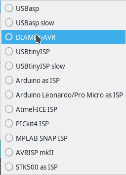
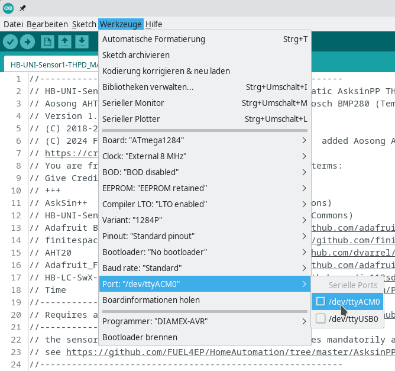

# Diamex Prog-S2 @ Arduino IDE  

# installation

- add [add_this_to_programmers.txt](./programmers.txt/add_this_to_programmers.txt) to your Arduino IDE installation's programmers.txt files
- e.g. located at ~/.arduino15/packages/MightyCore/hardware/avr/3.0.1/programmers.txt
- select in Arduino IDE as programmer: Tools => Programmer => DIAMEX-AVR :

- before programming, select the port; see below

- program the Arduino in Arduino IDE: Sketch => Hochladen mit Programmer

# identify the COM port

- Linux already has the required drivers installed
- the virtual COM ports names are /dev/ttyUSB0, /dev/ttyACM0 or similar
- identify your system's port name with the command after having connected the USB cable of the progranmer  to your system:
> sudo dmesg -T

- example dmesg output is [here](./dmesg.log); virtual COM port is ttyACM0

- use this virtual port name in your avrdude scripts as port, e.g. :
> avrdude -v -pm1284p -P /dev/ttyACM0 -c stk500v2  -F -b 9600 -Ulfuse:w:0xFD:m -Uhfuse:w:0x91:m -Uefuse:w:0xFF:m  #8 MHz crystal OSC
> 

# select the COM port

- for programming select in the Arduino IDE: Werkzeuge => Ports the above identified port

- for debugging with the FTDI debugger, it may be necessary to switch the port, e.g. to '/dev/ttyUSB0' , before invoking 'Werkzeuge => Serieller Monitor'

# IMPORTANT

- before programming, select the correct supply voltage for Arduino (board):
 