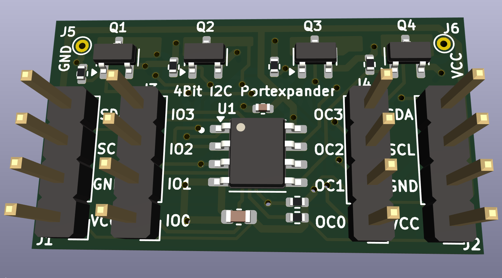
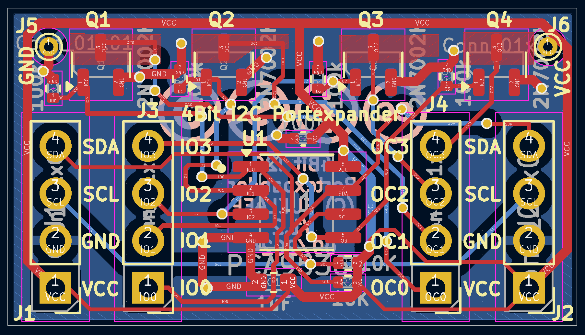
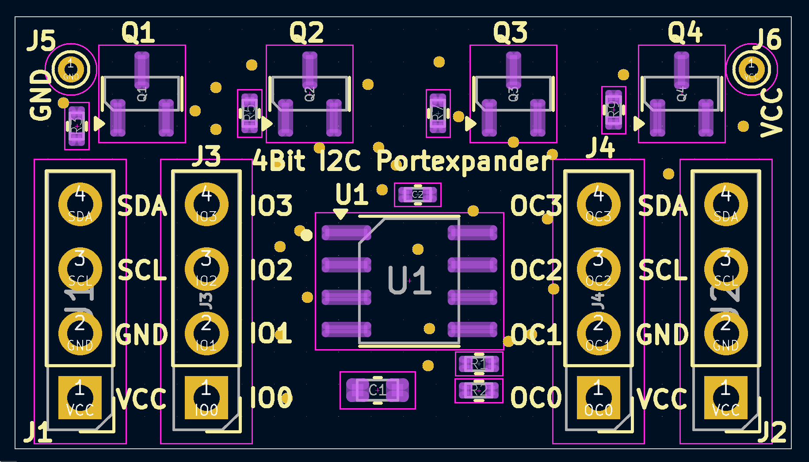

# 4Bit_I2C_Port_Expander_Module_FUEL4EP  

## I2C 4 Port Expander Aufsteckplatine für DIY AsksinPP-Projekte

- basierend auf [PCA9536](https://www.mouser.de/datasheet/2/302/PCA9536-3139488.pdf)

- passend zu
	* [HB-UNI-SEN-BATT_ATMega1284P_E07-868MS10_FUEL4EP](https://github.com/FUEL4EP/HomeAutomation/tree/master/AsksinPP_developments/PCBs/HB-UNI-SEN-BATT_ATMega1284P_E07-868MS10_FUEL4EP)
	* [HB-UNI-SEN-BATT_ATMega1284P_E07-868MS10_FRAM_FUEL4EP](https://github.com/FUEL4EP/HomeAutomation/tree/master/AsksinPP_developments/PCBs/HB-UNI-SEN-BATT_ATMega1284P_E07-868MS10_FRAM_FUEL4EP)
	* [HB-UNI-SEN-BATT_FUEL4EP](https://github.com/FUEL4EP/HomeAutomation/tree/master/AsksinPP_developments/PCBs/HB-UNI-SEN-BATT_FUEL4EP)
	* [HB-UNI-SEN-BATT_ATMega1284P_E07-868MS10_FUEL4EP](https://github.com/FUEL4EP/HomeAutomation/tree/master/AsksinPP_developments/PCBs/HB-UNI-SEN-BATT_ATMega1284P_E07-868MS10_FUEL4EP)
	* Befestigung mit 2 Stiftleisten J1 und J2
	
- 4 zusätzliche PCA9536-IO-Ports, die I2C-steuerbar sind
- 4 zusätzliche 2N7000-Open-Collector-Ausgänge mit Pull-Up Widerständen

- Infos zu AsksinPP sind [hier](https://asksinpp.de) und [hier](https://asksinpp.de/Grundlagen/01_hardware.html#verdrahtung) zu finden

## Platinenmaße

- Breite: 30,48 mm
- Weite: 17 mm
- Platinendicke 1,2 mm (bei der Bestellung bei JLCPCB auswählen)

## Stromlaufplan

- ist [hier](./Schematics/4Bit_I2C_Port_Expander_Module_FUEL4EP.pdf)

## Status

- diese Platine wurde noch nicht bei JLCPCB gefertigt und ist daher auch nicht validiert. Nutzung auf eigenes Risiko!

## Rückmeldungen

- und Verbesserungsvorschläge sind willkommen.

## Daten für die Bestellung bei JLCPCB

- die Daten für die Bestellung liegen im Verzeichnis [./jlcpcb/production_files/](./jlcpcb/production_files/)
- Gerber-Daten als Zip-Datei
- BOM- und CPL-Daten als CSV-Datei

## lokale Installation des Github Releases auf Deinem Computer

- gehe bitte in Dein Zielinstallationsverzeichnis, wo Du mit der 4Bit_I2C_Port_Expander_Module_FUEL4EP Platine mit KiCAD arbeiten möchtest

  - gebe dort 'git clone https://github.com/FUEL4EP/HomeAutomation.git' ein
	  + damit lädst Du mein [Sammelrepository](https://github.com/FUEL4EP/HomeAutomation) für alle meine auf Github freigegebenen HomeBrew Entwicklungen herunter.
  - dann findest Du ein neues Verzeichnis 'HomeAutomation' auf Deinem Rechner, das alle meine auf Github freigebenen Entwicklungen enthält, siehe [README.md](https://github.com/FUEL4EP/HomeAutomation/blob/master/README.md)
  	+ mache bitte regelmäßig ein Update mit 'git pull'
 -	die Platine 4Bit_I2C_Port_Expander_Module_FUEL4EP findest Du unter './HomeAutomation/tree/master/AsksinPP_developments/PCBs/4Bit_I2C_Port_Expander_Module_FUEL4EP'
 
- alternativ kann vom Github [Sammelrepository](https://github.com/FUEL4EP/HomeAutomation) die ZIP-Datei HomeAutomation-master.zip heruntergeladen und auf dem lokalen Rechner ausgepackt werden. Bitte dann regelmäßig auf Github nach Updates schauen.

## Versionsverlauf

-   V1.0 03. Sep 2023: Initiale Veröffentlichung auf Github
-	V1.1 16. Dez 2023: Wechsel von 2N7000 auf 2N2007K wegen SMD Gehäuse
- KiCad Schaltplan-Editor Version: 6.0.11-2627ca5db0 unter Kubuntu22.04.1
- KiCad Leiterplatteneditor Version: 6.0.11-2627ca5db0 unter Kubuntu22.04.1
- PCB Version 1.1
- Schematics  1.1

## Disclaimer

-   die Nutzung der hier veröffentlichten Inhalte erfolgt vollständig auf eigenes Risiko und ohne jede Gewähr.

## Lizenz 

**Creative Commons BY-NC-SA** 
Give Credit, NonCommercial, ShareAlike

 This work is licensed under a <a rel="license" href="http://creativecommons.org/licenses/by-nc-sa/4.0/">Creative Commons Attribution-NonCommercial-ShareAlike 4.0 International License</a>.

-EOF
	

