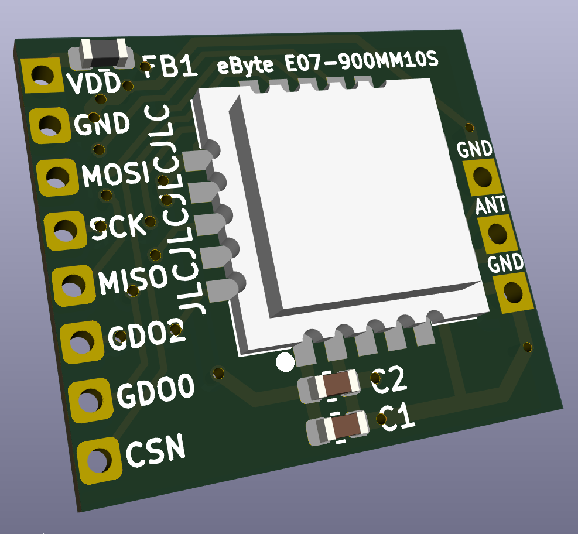
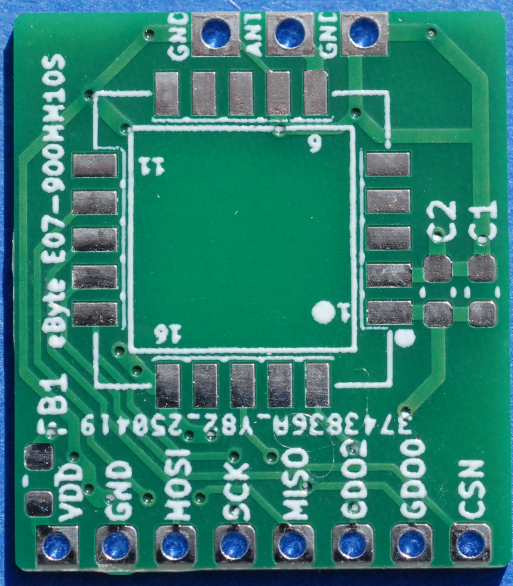
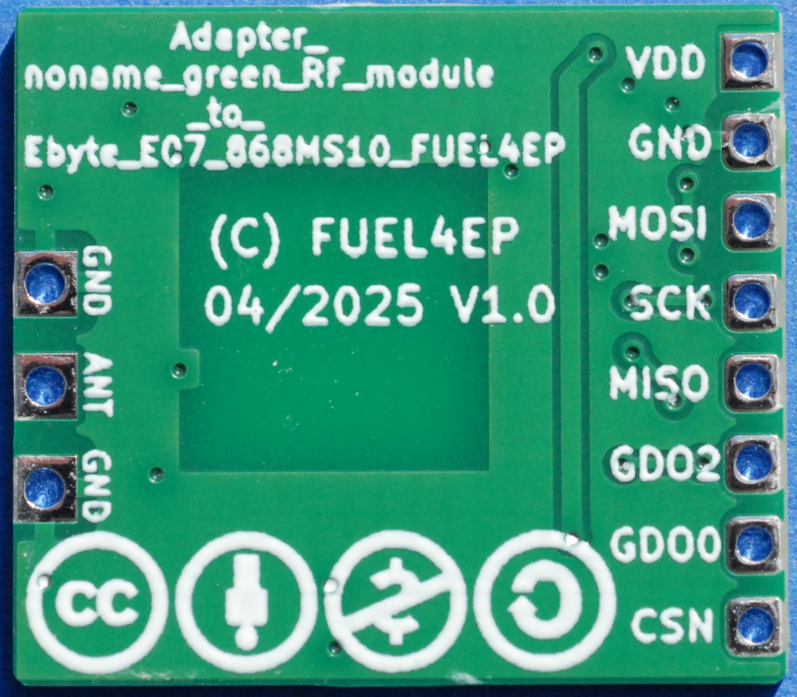
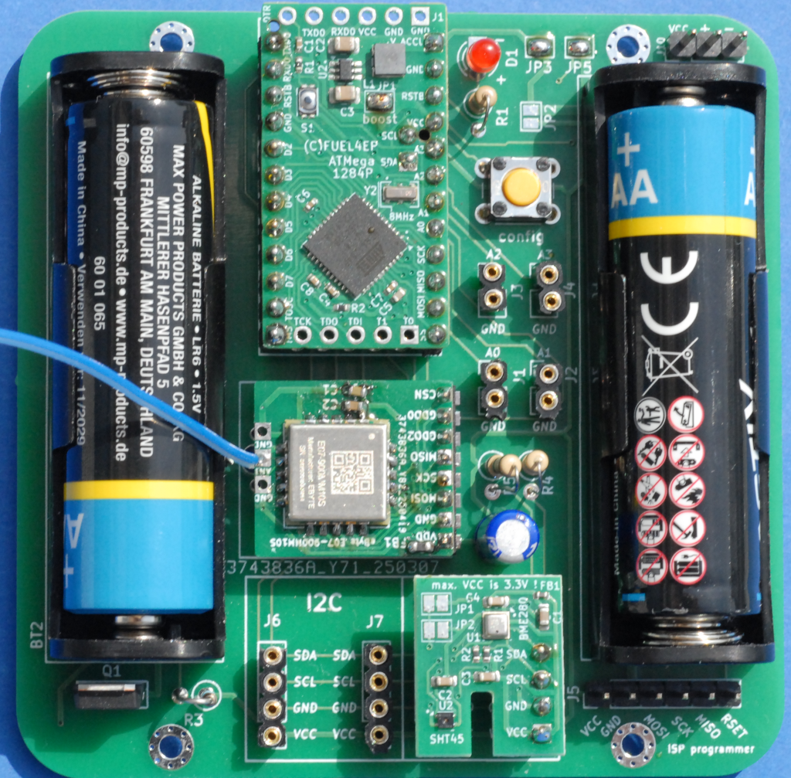

# Adapter_EByte_E07_900MM10S_to_noname_green_RF_module_FUEL4EP  

## Ersatz für das NoName grüne 868,3 MHz Funkmodul

- Da das NoName grüne 868,3 MHz Modul häufig eine schlechte Qualität hat, wurde dieser Adapter als Ersatz entworfen. Es wird ein verfügbares, qualitativ hochwertiges EByte E07 900MM10S Funkmodul mit Abschirmkappe verbaut.

## Adapter für 868,3 MHz Funkmodul Ebyte E07 900MM10S auf das NoName grüne 868,3 MHz Funkmodul

- Infos zu AsksinPP sind [hier](https://asksinpp.de) und [hier](https://asksinpp.de/Grundlagen/01_hardware.html#verdrahtung) zu finden

## Platinenmaße

- Breite: 19,2 mm
- Weite: 17 mm

## Stromlaufplan

- ist [hier](./Schematics/Adapter_EByte_E07_900MM10S_to_noname_green_RF_module_FUEL4EP.pdf)

## Status

- die Platine V1.0 wurde bei JLCPCB gefertigt und ist von Hand bestückt und verlötet orden
- die Platine V1.0 wurde am 07.  Mai 2025 erfolgreich mit dem Sketch [HB-UNI-Sensor1-THPD-SHT45_BME280](https://github.com/FUEL4EP/HomeAutomation/tree/master/AsksinPP_developments/sketches/HB-UNI-Sensor1-THPD-SHT45_BME280) validiert:
 
- Bilder der gefertigten Prototypen V1.0 (noch mit altem PCB-Namen):
- 

## Rückmeldungen

- sind willkommen.

## Daten für die Bestellung bei JLCPCB

- die Daten für die Bestellung liegen im Verzeichnis [./jlcpcb/production_files/](./jlcpcb/production_files/)
- Gerber-Daten als Zip-Datei
- BOM- und CPL-Daten als CSV-Datei

## Hinweis für Bestückung bei JLCPCB

- bei der Bestellung bitte angeben '[specify a location](https://jlcpcb.com/help/article/50-How-to-remove-order-number-from-your-PCB)'

- der  Dummy-Text 'JLCJLCJLCJLC' ist auf der Rückseite der Platine

- Bestückung des Funkmoduls Ebyte E07 900MM10S geht bei JLCPCB nur als teures Standard-PCBA. Daher löte ich das Funkmodul immer von Hand auf.

## lokale Installation des Github Releases auf Deinem Computer

- gehe bitte in Dein Zielinstallationsverzeichnis, wo Du mit der Adapter_EByte_E07_900MM10S_to_noname_green_RF_module_FUEL4EP Platine mit KiCAD arbeiten möchtest

  - gebe dort 'git clone https://github.com/FUEL4EP/HomeAutomation.git' ein
	  + damit lädst Du mein [Sammelrepository](https://github.com/FUEL4EP/HomeAutomation) für alle meine auf Github freigegebenen HomeBrew Entwicklungen herunter.
  - dann findest Du ein neues Verzeichnis 'HomeAutomation' auf Deinem Rechner, das alle meine auf Github freigebenen Entwicklungen enthält, siehe [README.md](https://github.com/FUEL4EP/HomeAutomation/blob/master/README.md)
  	+ mache bitte regelmäßig ein Update mit 'git pull'
 -	die Platine Adapter_EByte_E07_900MM10S_to_noname_green_RF_module_FUEL4EP findest Du unter './HomeAutomation/tree/master/AsksinPP_developments/PCBs/Adapter_EByte_E07_900MM10S_to_noname_green_RF_module_FUEL4EP'
 
- alternativ kann vom Github [Sammelrepository](https://github.com/FUEL4EP/HomeAutomation) die ZIP-Datei HomeAutomation-master.zip heruntergeladen und auf dem lokalen Rechner ausgepackt werden. Bitte dann regelmäßig auf Github nach Updates schauen.

## Versionsverlauf

-   V1.0 18. Apr 2025: Initiale Version
-   V1.1 07. Mai 2025: Änderung des PCB Namens auf 'Adapter_EByte_E07_900MM10S_to_noname_green_RF_module_FUEL4EP' 
- KiCad Schaltplan-Editor Version: 8.0.5-8.0.5-0~ubuntu22.04.1 unter Kubuntu22.04.1
- KiCad Leiterplatteneditor Version: 8.0.5-8.0.5-0~ubuntu22.04.1 unter Kubuntu22.04.1
- PCB Version 1.1
- Schematics  1.1

## Disclaimer

-   die Nutzung der hier veröffentlichten Inhalte erfolgt vollständig auf eigenes Risiko und ohne jede Gewähr.
-  der Nutzer dieser Platine ist selbst dafür verantwortlich, dass die relevanten Richtlinien für Funkanlagen, z.B. in der EU die Funkanlagenrichtlinie (2014/53/EU, auch bekannt als RED), eingehalten wird.

## Lizenz 

**Creative Commons BY-NC-SA** 
Give Credit, NonCommercial, ShareAlike

 This work is licensed under a <a rel="license" href="http://creativecommons.org/licenses/by-nc-sa/4.0/">Creative Commons Attribution-NonCommercial-ShareAlike 4.0 International License</a>.

-EOF
	

