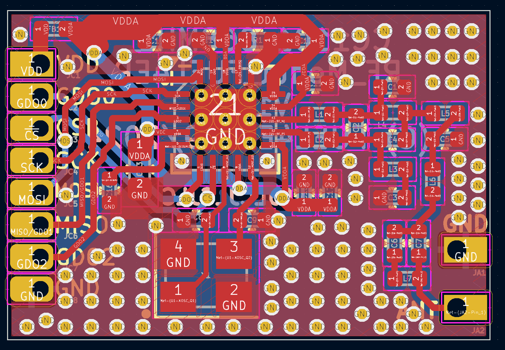
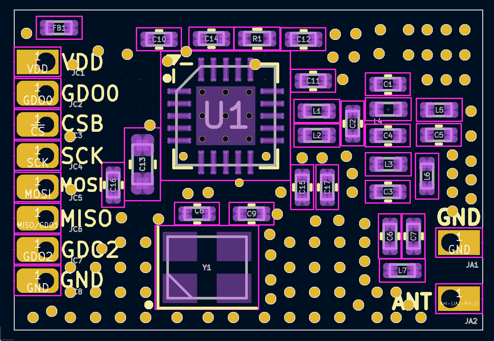

# CC1101_868MHz_RF_Modul_FUEL4EP  

## 868.3 MHz Funkmodul für AsksinPP DIY Projekte

- Infos zu AsksinPP sind [hier](https://asksinpp.de) und [hier](https://asksinpp.de/Grundlagen/01_hardware.html#verdrahtung) zu finden

## Platinenmaße

- Breite: 19 mm
- Weite: 13 mm
- Platinendicke 1,2 mm (bei der Bestellung bei JLCPCB auswählen)

## Status

- diese Platine wurde noch nicht bei JLCPCB gefertigt und ist daher auch nicht validiert. Nutzung auf eigenes Risiko!

## Ersatz für das eByte E07 868MS10 Modul

- da das eByte E07 868MS10 Modul nicht mehr oder nur sehr schwer käuflich ist, wurde dieses Modul als pinkompatibler Ersatz entworfen

## Rückmeldungen

- und Verbesserungsvorschläge sind [hier](https://homematic-forum.de/forum/viewtopic.php?f=76&t=79770&sid=9a4abe34301506f133d423b0580074a5) willkommen.

## Daten für die Bestellung bei JLCPCB

- die Daten für die Bestellung liegen im Verzeichnis [./jlcpcb/production_files/](./jlcpcb/production_files/)
- Gerber-Daten als Zip-Datei
- BOM- und CPL-Daten als CSV-Datei

## Disclaimer

-   die Nutzung der hier veröffentlichten Inhalte erfolgt vollständig auf eigenes Risiko und ohne jede Gewähr.

## Lizenz 

**Creative Commons BY-NC-SA** 
Give Credit, NonCommercial, ShareAlike

 This work is licensed under a <a rel="license" href="http://creativecommons.org/licenses/by-nc-sa/4.0/">Creative Commons Attribution-NonCommercial-ShareAlike 4.0 International License</a>.

-EOF
	

