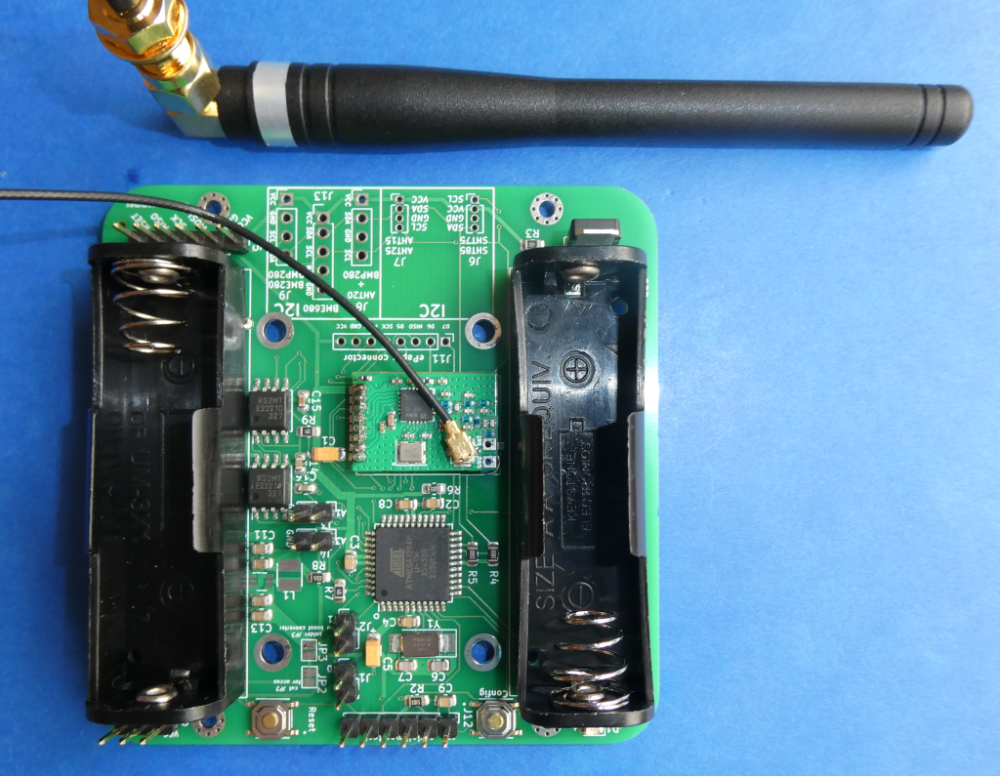

# Validierung des CC1101_868MHz_UFL_RF_Modul_FUEL4EP RF-Moduls

## Fertigung von Prototypen bei JLCPCB

- 2 Platinen CC1101_868MHz_UFL_RF_Modul_FUEL4EP wurden bei JLCPCB gefertigt und bestückt

# Messung der Quarzfrequenz

- Messung der Frequenz des GD0 Ausgangssignals nach Power-On-Reset:
- dazu steht im Datenblatt des TI CC1101 Bausteins:

> The default value for GDO0 is a 135-141 kHz clock output (XOSC frequency divided by 192). Because the
XOSC is turned on at power-on-reset, this can be used to clock the MCU in systems with only one crystal.

- Sollfrequenz bei idealem 26 MHz Quarz am Ausgang GD0 beträgt

>  26 MHz / 192 = 135416,666 Hz = **135,416666 kHz**

- Messaufbau:
	+ Frequenzzähler Rigol DG1022Z mit **externen 10 MHz Referenztakt**
	+ 10 MHz Referenztakt mit GPS Genauigkeit erzeugt mit einem [Mini Precision GPS Reference Clock Modul](https://www.leobodnar.com/shop/index.php?main_page=product_info&products_id=301) von Leo Bodnar im eingerasteten Zustand (rote LED leuchtet dauerhaft)
	+ Zählfenster des DG1022Z Frequenzzählers: **10 Sekunden**
	+ die Pins CS, SCK und MOSI werden mit einem PullUp-Widerstand 4,7kOhm gegen VDD beschaltet
	+ Spannungsversorgung 2 x AA Batterien 3,11 Volt
	+ Messung bei Raumtemperatur bei ca. 20 Grad Celsius
	+ 10 uF Pufferkondensator für die Betriebsspannung
	+ Anschluss zur Zeit über eine Stiftleiste, geplant sind Pogo-Pins
- die Messergebnisse sind [hier](./validation_results.pdf) zu finden
	+ die Standardabweichungen der Frequenzmessungen werden von der Temperaturdrift und unterschiedlich langen Betriebszeiten beeinflusst
- die Messergebnisse des DG1022Z Frequenzzählers wurden fotografiert und sind [hier](./measurement_results) für die beiden vermessenen Module zu finden
- die mittlere Frequenzabweichung liegt bei
	+ Modul mit Index 3:	+6,2 ppm		Bewertung: OK
	+ Modul mit Index 4:	+8,3 ppm		Bewertung: OK
- beide vermessenen Module liegen damit innerhalb der 10 ppm Frequenztoleranz der verwendeten Quarze
- zum Vergleich wurde als Modul 5 ein gekauftes eByte E07-868MS10 Modul vermessen
	+ das gekaufte Modul mit dem Index 5 hat eine mittlere Frequenzabweichung von -12,9 ppm
	+ das gekaufte Modul eByte E07-868MS10 weist eine mittlere Frequenzabweichung von >10 ppm auf!
	
# AsksinPP Frequenztest

- das Ergebnis des AsksinPP Frequenztests für das Modul 3 ist [hier](./measurement_results/CC1101_868MHz_UFL_RF_Modul_FUEL4EP_3/FreqTest_serial_monitor_3.log)
	+ das Ergebnis ist OK
- das Modul 3 wurde mit der Platine [HB-UNI-SEN-BATT_ATMega1284P_E07-868MS10_FRAM_FUEL4EP](https://github.com/FUEL4EP/HomeAutomation/tree/master/AsksinPP_developments/PCBs/HB-UNI-SEN-BATT_ATMega1284P_E07-868MS10_FRAM_FUEL4EP) validiert:

# Empfangsemfindlichkeit

- die Empfangsempfindlichkeit wurde für alle ausgemessenen Module am selben Ort auf dem Wohnzimmertisch im Erdgeschoss durchgeführt. Die Zentrale befand sich zwei Etagen höher im Dachgeschoss. Dazwischen sind zwei Betondecken.
- die RSSI Werte wurden aus dem AsksinPP Frequenztest mit 'active ping' bei 868,3Mhz für die ID der Zentrale abgelesen. Der Frequenztest-Skript war für alle ausgemessenen Module identisch.

- die RSSI-Messergebnisse sind [hier](./validation_results.pdf) unter Punkt 2.
 
 
