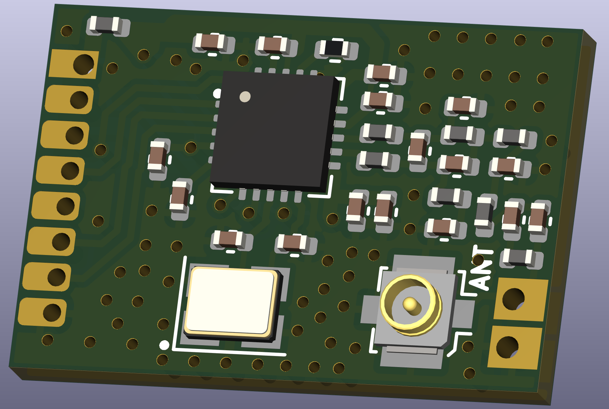
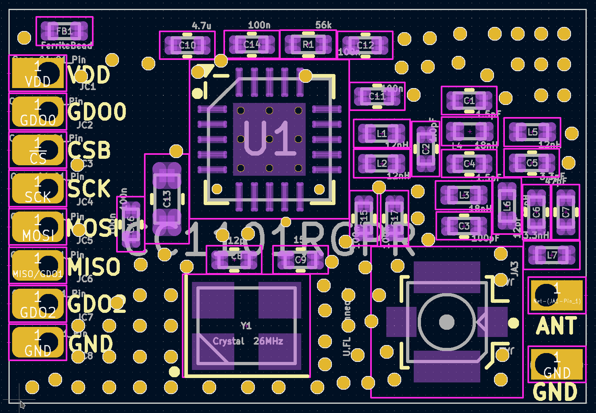

# CC1101_868MHz_UFL_RF_Modul_FUEL4EP  

## 868.3 MHz Funkmodul für AsksinPP DIY Projekte mit U.FL Antennenbuuchse

- Infos zu AsksinPP sind [hier](https://asksinpp.de) und [hier](https://asksinpp.de/Grundlagen/01_hardware.html#verdrahtung) zu finden

## Platinenmaße

- Breite: 19 mm
- Weite: 13 mm
- Platinendicke 1,2 mm (bei der Bestellung bei JLCPCB auswählen)

## Stromlaufplan

- ist [hier](./Schematics/CC1101_868MHz_UFL_RF_Modul_FUEL4EP.pdf)

## Danksagung

- diese Platine ist abgeleitet von [CC1101_Module](https://github.com/jp112sdl/CC1101_Module)
- mein besonderer Dank geht an [Jérôme](https://github.com/jp112sdl) und [papa](https://github.com/pa-pa) für ihre Vorarbeit und alle, die im [Forum](https://homematic-forum.de/forum/viewtopic.php?f=76&t=79770&sid=9a4abe34301506f133d423b0580074a5) zu dieser Platine beigetragen haben.

## Status

- diese Platine wurde noch nicht bei JLCPCB gefertigt und ist daher auch nicht validiert. Nutzung auf eigenes Risiko!

## Ersatz für das eByte E07 868MS10 Modul mit zusätzlicher U.FL Antennenbuchse

- da das eByte E07 868MS10 Modul nicht mehr oder nur sehr schwer käuflich ist, wurde dieses Modul als Ersatz entworfen. Es ist antennenseitig nicht pinkompatibel und hat zusätzlich eine U.FL Antennenbuchse.

## Rückmeldungen

- und Verbesserungsvorschläge sind [hier](https://homematic-forum.de/forum/viewtopic.php?f=76&t=79770&sid=9a4abe34301506f133d423b0580074a5) willkommen.

## Daten für die Bestellung bei JLCPCB

- die Daten für die Bestellung liegen im Verzeichnis [./jlcpcb/production_files/](./jlcpcb/production_files/)
- Gerber-Daten als Zip-Datei
- BOM- und CPL-Daten als CSV-Datei

## Hinweis für Bestückung bei JLCPCB

- die U.FL Buchse wird im Online Viewer [falsch](./Pictures_of_JLCPCB_prototypes/CC1101_868MHz_UFL_RF_Modul_FUEL4EP_JLCPCB_assembly_wrong_placement_UFL_connector.png) positioniert. Das ist ein Dummy-Fehler.

## lokale Installation des Github Releases auf Deinem Computer

- gehe bitte in Dein Zielinstallationsverzeichnis, wo Du mit der CC1101_868MHz_UFL_RF_Modul_FUEL4EP Platine mit KiCAD arbeiten möchtest

  - gebe dort 'git clone https://github.com/FUEL4EP/HomeAutomation.git' ein
	  + damit lädst Du mein [Sammelrepository](https://github.com/FUEL4EP/HomeAutomation) für alle meine auf Github freigegebenen HomeBrew Entwicklungen herunter.
  - dann findest Du ein neues Verzeichnis 'HomeAutomation' auf Deinem Rechner, das alle meine auf Github freigebenen Entwicklungen enthält, siehe [README.md](https://github.com/FUEL4EP/HomeAutomation/blob/master/README.md)
  	+ mache bitte regelmäßig ein Update mit 'git pull'
 -	die Platine CC1101_868MHz_UFL_RF_Modul_FUEL4EP findest Du unter './HomeAutomation/tree/master/AsksinPP_developments/PCBs/CC1101_868MHz_UFL_RF_Modul_FUEL4EP'
 
- alternativ kann vom Github [Sammelrepository](https://github.com/FUEL4EP/HomeAutomation) die ZIP-Datei HomeAutomation-master.zip heruntergeladen und auf dem lokalen Rechner ausgepackt werden. Bitte dann regelmäßig auf Github nach Updates schauen.

## Versionsverlauf

-   V1.3 01. Sep 2023: Anpassung der Silkscreen-Texte and JLCPCB-Regeln
- KiCad Schaltplan-Editor Version: 6.0.11-2627ca5db0 unter Kubuntu22.04.1
- KiCad Leiterplatteneditor Version: 6.0.11-2627ca5db0 unter Kubuntu22.04.1
- PCB Version 1.3
- Schematics  1.1

## Disclaimer

-   die Nutzung der hier veröffentlichten Inhalte erfolgt vollständig auf eigenes Risiko und ohne jede Gewähr.

## Lizenz 

**Creative Commons BY-NC-SA** 
Give Credit, NonCommercial, ShareAlike

 This work is licensed under a <a rel="license" href="http://creativecommons.org/licenses/by-nc-sa/4.0/">Creative Commons Attribution-NonCommercial-ShareAlike 4.0 International License</a>.

-EOF
	

