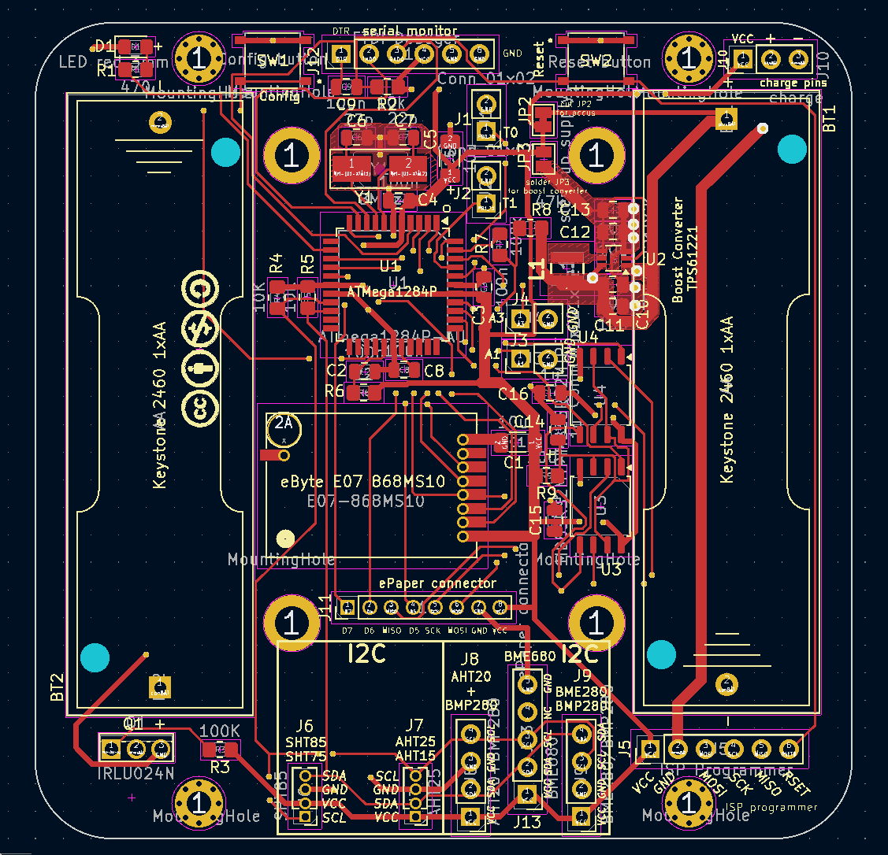

# HB-UNI-SEN-BATT_ATMega1284P_E07-868MS10_FRAM_FUEL4EP [](https://hits.seeyoufarm.com)

**Platine für DIY AsksinPP für**
- eingebauter SMD TQFP-44 [ATMega1284P](https://ww1.microchip.com/downloads/en/DeviceDoc/doc8059.pdf) mit 128kByte Programmspeicher, 16kByte SRAM, 4kByte EEPROM
- [eByte E07-868MS10 Sendemodul](https://www.rcscomponents.kiev.ua/datasheets/e07-868ms10_usermanual_en_v1_20.pdf)
- Bestückungsoption für [Waveshare ePaper Modul (1.54inch (B)](https://www.waveshare.com/product/1.54inch-e-paper-module.htm)
- Bestückungsoption für [TPS61221 Aufwärtswandler](https://www.ti.com/lit/ds/symlink/tps61221.pdf?ts=1634546965861&ref_url=https%253A%252F%252Fwww.ti.com%252Fproduct%252FTPS61221) bei NiMH Akkumulatorbetrieb
- Bestückungsoption für 2x 2Mbit (256k x 8Bit) SPI FRAM MB85RS2MTPF-G-JNERE2 für die Speicherung von Temperaturdaten für die online-Berechnung von gleitenden Mittelwerten bis zu einem Jahr (365 Tage)
- alle SMD Bausteine sind mit dem JLCPCB SMT Bestückungsservice kostengünstig und qualitativ hochwertig bestückbar, das ist also auch für Grobmotoriker wie mich gegeignet :-)




## Credits

- diese Platine ist ursprünglich von Alexander Reinerts Platine [HB-UNI-SEN-BATT](https://github.com/alexreinert/PCB/tree/master/HB-UNI-SEN-BATT) abgeleitet, aber in vielerlei Hinsicht verbessert
- vielen Dank an Alexander Reinert für die Vorarbeit.

## Platine wurde nach Fertigung bei JLCPCB erfolgreich validiert

- entwickelt mit KiCAD 5.1.12
- noch in Entwicklung, noch zu validieren!
- die Platine wurde noch nicht bei JLCPCB gefertigt und mit den SMD Bauteilen bestückt!

- die nicht SMD Bauteile müssen von Hand verlötet werden
- mangels Verfügbarkeit des [TPS61221 Aufwärtswandlers](https://www.ti.com/lit/ds/symlink/tps61221.pdf?ts=1634546965861&ref_url=https%253A%252F%252Fwww.ti.com%252Fproduct%252FTPS61221) trifft dies später auch auf die Bestückungsoption Aufwärtswandler zu
- die gefertigte Platine wird mit dem Sketch [tbd](https://github.com/FUEL4EP/HomeAutomation/tree/master/AsksinPP_developments/sketches/tbd) validiert werden:


## Eigenschaften

- abgeleitet aus [HB-UNI-SEN-BATT](https://github.com/alexreinert/PCB/tree/master/HB-UNI-SEN-BATT)
- kompletter Datensatz für KiCAD 5.1.12 auf Github verfügbar:
    + 'git clone https://github.com/FUEL4EP/HomeAutomation.git' oder als [ZIP-Datei](https://github.com/FUEL4EP/HomeAutomation/archive/refs/heads/master.zip)
    + die Platinendaten sind dann unter 'HomeAutomation/AsksinPP_developments/PCBs/HB-UNI-SEN-BATT_ATMega1284P_E07-868MS10_FRAM_FUEL4EP' direkt mit KiCAD aufrufbar
- neue Eigenschaften:
    + SMD Bestückung, wo möglich
    + SMD TQFP-44 [ATMega1284P](https://ww1.microchip.com/downloads/en/DeviceDoc/doc8059.pdf) mit 128kByte Programmspeicher, 16kByte SRAM, 4kByte EEPROM
    + Bestückungsoption für [Waveshare ePaper Modul (1.54inch (B)](https://www.waveshare.com/product/1.54inch-e-paper-module.htm)
    + Bestückungsoption für [TPS61221 Aufwärtswandler](https://www.ti.com/lit/ds/symlink/tps61221.pdf?ts=1634546965861&ref_url=https%253A%252F%252Fwww.ti.com%252Fproduct%252FTPS61221) bei NiMH Akkumulatorbetrieb
    + Bestückungsoption für 2x 2Mbit (256k x 8Bit) SPI FRAM MB85RS2MTPF-G-JNERE2 für die Speicherung von Temperaturdaten für die online-Berechnung von gleitenden Mittelwerten bis zu einem Jahr (365 Tage)
    + alle SMD Bausteine sind mit dem JLCPCB SMT Bestückungsservice kostengünstig und qualitativ hochwertig bestückbar, das ist also auch für Grobmotoriker wie mich gegeignet :-)
    + Stiftleiste J10 mit Versorgungspannungen zum Gehäuseoberteil oder Akkulademodul
    + dedizierte passende Stiftleisten für verschiedene Sensoren / Sensorbreakouts
        * J6: SHT75, SHT85
        * J7: AHT15, AHT25
        * J8: AHT20+BMP280 Breakout (z.B. [eBay](https://www.ebay.de/itm/174883359464)
        * J9: BME280/BMP280 Breakout
        * J13: BME680 Breakout (Pimoroni)
    + Korrektur der Abstandfehlers bei einem Batteriehalter. Beim [HB-UNI-SEN-BATT](https://github.com/alexreinert/PCB/tree/master/HB-UNI-SEN-BATT) hat das schon mal gerne zu thermischen Ausfällen durch mechanische Spannungen geführt.
    + als Funkmodul wird das [eByte E07-868MS10 Sendemodul](https://www.rcscomponents.kiev.ua/datasheets/e07-868ms10_usermanual_en_v1_20.pdf) verwendet. Dieses ist qualitativ viel besser als die üblichen grünen noname 868 MHz Funkmodule.
    + das schafft Platz für eine 8-polige Stiftleiste J11 zum optionalen Anschluss eines [Waveshare ePaper Moduls (1.54inch (B)](https://www.waveshare.com/product/1.54inch-e-paper-module.htm). Der ATMega1284P hat auch genügend RAM für die Programmierung eines 200 Pixel x 200 Pixel e-Papermoduls.
    + JLCPCB BOM and CPL Dateien für SMT Service werden [bereitgestellt](./JLCPCB_SMT_Service/)
- Hinweis: der TPS61221 ist zur Zeit von nirgendwo lieferbar

### Benötigte Bauteile:

- bedingt durch die SMT Service von JLCPCB sind nur noch wenige Durchsteckbauteile von Hand zu verlöten:
* eByte E07-868MS10 Sendemodul 868MHz
* e-Paper [Waveshare ePaper Moduls (1.54inch (B)](https://www.waveshare.com/product/1.54inch-e-paper-module.htm) (optional, Anschluss an J11)
* 2x Keystone 2460 Batteriehalter 1xAA
* Stiftleiste RM 1.27mm 1x8 Pin (für eByte E07-868MS10 Sendemodul 868MHz)
* Stiftleiste RM 2mm 1x8 Pin (für ePaper)
* Stiftleisten RM 2,54mm (nach Bedarf)
* IRLU024N (optional für Verpolungsschutz)
* Versorgung durch NiMH Akkumulatoren und Aufwärtswandler ist vorbereitet (JP2)
* Bestückungsoption Aufwärtswandler siehe [Schaltplan](Schematics/HB-UNI-SEN-BATT_ATMega1284P_E07-868MS10_FUEL4EP.pdf), unter KiCAD sind alle Referenzen eingetragen


### Aufbauhinweise

- es wird dringend angeraten, vor dem Einbau der I2C Sensoren durchzuführen
    + einen Frequenztest. Hier der Frequenztest für einen ATmega 1284p : [FreqTest_1284P.ino](../Supplements/FreqTest_1284P/FreqTest_1284P.ino)
    + einen Leckagetest. Hier der Leckagetest für einen ATmega 1284p : [SleepTest_1284P.ino](../Supplements/SleepTest_1284P/SleepTest_1284P.ino)
        + der Leckagestrom im Sleepmode sollte < 10 uA betragen

### Passende AsksinPP Projekte von FUEL4EP
   + [HB-UNI-Sensor1-AQ-BME680](https://github.com/FUEL4EP/HomeAutomation/tree/master/AsksinPP_developments/sketches/HB-UNI-Sensor1-AQ-BME680)
   + [HB-UNI-Sensor1-AQ-BME680_KF](https://github.com/FUEL4EP/HomeAutomation/tree/master/AsksinPP_developments/sketches/HB-UNI-Sensor1-AQ-BME680_KF)
   + [HB-UNI-Sensor1-AQ-BME680_KF_DEBUG](https://github.com/FUEL4EP/HomeAutomation/tree/master/AsksinPP_developments/sketches/HB-UNI-Sensor1-AQ-BME680_KF_DEBUG)
   + [HB-UNI-Sensor1-RAD-AL53](https://github.com/FUEL4EP/HomeAutomation/tree/master/AsksinPP_developments/sketches/HB-UNI-Sensor1-RAD-AL53)
   + [HB-UNI-Sensor1-THPD-SHT85](https://github.com/FUEL4EP/HomeAutomation/tree/master/AsksinPP_developments/sketches/HB-UNI-Sensor1-THPD-SHT85)
   + ein neuer Sensor mit gleitender Mittelwertbildung wird bald freigegeben werden
   
### Notwendige Änderung der Betriebsspannungsmessung in Sketchen
- da die Platine einen fest verdrahteten Spannungsteiler R7 und R8 für die Betriebsspannung / Akkuspannungsmessung verwendet, muss in Sketchen folgende Anpassung gegebenenfalls durchgeführt werden:

- von bisher
```
// 1) Standard: tmBattery, UBatt = Betriebsspannung AVR
#define BAT_SENSOR tmBattery
```
- nach
```
// 2) für StepUp/StepDown: tmBatteryResDiv, sense pin A0 (=pin 24), activation pin A1 (=pin 25) , Faktor = Rges/Rlow*1000, z.B. 141k/47k, Faktor (3*47k)/(1*47k)*1000 = 3000 (ATMega1284P)
// start with Faktor = 3000
// check in serial monitor the reported V2='accumulator voltage(MCU ADC) (x1000.0)' and compare with the reported V1='accumulator batteries voltage (x1000.0)'
// calculate voltage correction factor V1/V2
// calculate total factor = 3000 * V2/V1 = 3000 * 3141 / 3157 = 2985
#define BAT_SENSOR tmBatteryResDiv<A0, A2, 2985> 
```
### Anschluss eines FTDI Debuggers

- zum Anschluss eines FTDI Debuggers an die 6-polige Stiftleiste J12 bitte ein [6 Pin Dupontkabel 2.54mm Buchse-Buchse 20 cm](https://www.roboter-bausatz.de/p/6-pin-dupontkabel-2.54mm-buchse-buchse-20-cm) verwenden

### Passendes Gehäuse
* Camdenboss CBRS01SWH und CBRS01VWH
* oder [Gehäuse HB-UNI-SEN-BATT snap in V2 von wpatrick](https://www.thingiverse.com/thing:3540481) für 3D-Druck
* bei Einbau eines e-Paper Moduls muss das Gehäuseoberteil angepasst werden (noch zu tun)

### Hinweise
* Achtung: Kein Überspannungschutz vorhanden
* der Verpolungsschutz ist optional. Dafür Bauteil Q1 (IRLU024N) und R3 (100KOhm Widerstand) bestücken. Alternativ JP1 auf der Platinenrückseite brücken um ohne Verpolungsschutz zu arbeiten.

## Disclaimer

-   die Nutzung der hier veröffentlichten Inhalte erfolgt vollständig auf eigenes Risiko und ohne jede Gewähr.

## Lizenz 

**Creative Commons BY-NC-SA**<br>
Give Credit, NonCommercial, ShareAlike

<a rel="license" href="http://creativecommons.org/licenses/by-nc-sa/4.0/"></a><br />This work is licensed under a <a rel="license" href="http://creativecommons.org/licenses/by-nc-sa/4.0/">Creative Commons Attribution-NonCommercial-ShareAlike 4.0 International License</a>.


-EOF
	

