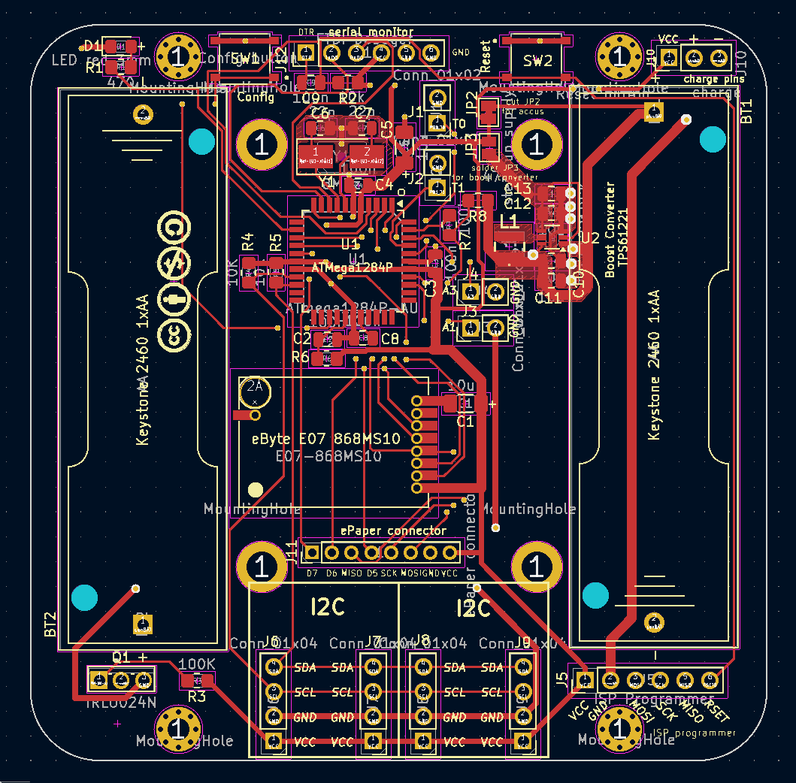
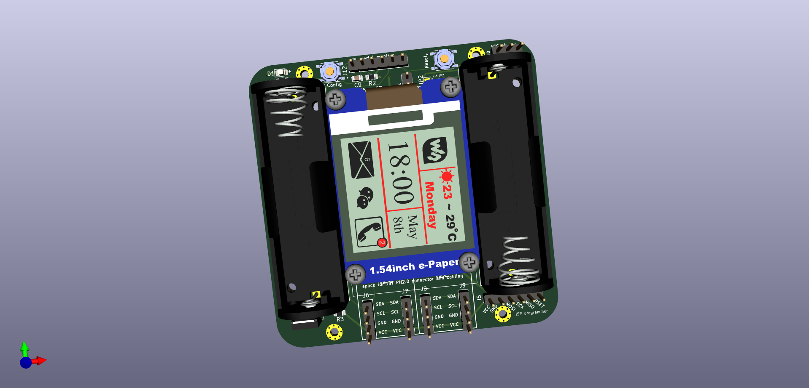

# HB-UNI-SEN-BATT_ATMega1284P_E07-868MS10_FUEL4EP []

**Platine für DIY AsksinPP für**
- [eingebauter SMD ATMega1284P mit 128kByte Programmspeicher, 16kByte SRAM, 4kByte EEPROM]()
- [eByte E07-868MS10 Sendemodul](https://www.rcscomponents.kiev.ua/datasheets/e07-868ms10_usermanual_en_v1_20.pdf)
- [Bestückungsoption für Waveshare ePaper Modul (1.54inch (B)](https://www.waveshare.com/product/1.54inch-e-paper-module.htm)

## Credits

- diese Platine ist von Alexander Reinerts Platine [HB-UNI-SEN-BATT](https://github.com/alexreinert/PCB/tree/master/HB-UNI-SEN-BATT) abgeleitet.
- vielen Dank an Alexander Reinert für die Vorarbeit.

## Noch in Entwicklung

- diese Platine ist noch in Entwicklung, **Nutzung auf eigene Gefahr**
- entwickelt mit KiCAD 5.1.10
- hier zuerst nur als Diskussionsbasis veröffentlicht
- es ist geplant, diese Platine bei JLCPCB fertigen zu lassen und dann zu validieren
- der Arduino Pro Mini ist durch einen ATMega1284P im SMD Gehäuse ersetzt
- als Funkmodul wird das [eByte E07-868MS10 Sendemodul](https://www.rcscomponents.kiev.ua/datasheets/e07-868ms10_usermanual_en_v1_20.pdf) verwendet

## Inhaltsverzeichnis

- noch zu erstellen

### Benötigte Bauteile:
* noch zu erstellen

### Passendes Gehäuse
* Camdenboss CBRS01SWH und CBRS01VWH
* oder [Gehäuse HB-UNI-SEN-BATT snap in V2 von wpatrick](https://www.thingiverse.com/thing:3540481) für 3D-Druck
* bei Einbau eines e-Paper Moduls muss das Gehäuseoberteil angepasst werden (noch zu tun)

### Hinweise
* Achtung: Kein Überspannungschutz vorhanden
* der Verpolungsschutz ist optional. Dafür Bauteil Q1 (IRLU024N) und R3 (100KOhm Widerstand) bestücken. Alternativ JP1 auf der Platinenrückseite brücken um ohne Verpolungsschutz zu arbeiten.

## Disclaimer

-   die Nutzung der hier veröffentlichten Inhalte erfolgt vollständig auf eigenes Risiko und ohne jede Gewähr.

## Lizenz 

**Creative Commons BY-NC-SA** 
Give Credit, NonCommercial, ShareAlike

 This work is licensed under a <a rel="license" href="http://creativecommons.org/licenses/by-nc-sa/4.0/">Creative Commons Attribution-NonCommercial-ShareAlike 4.0 International License</a>.

-EOF
	

