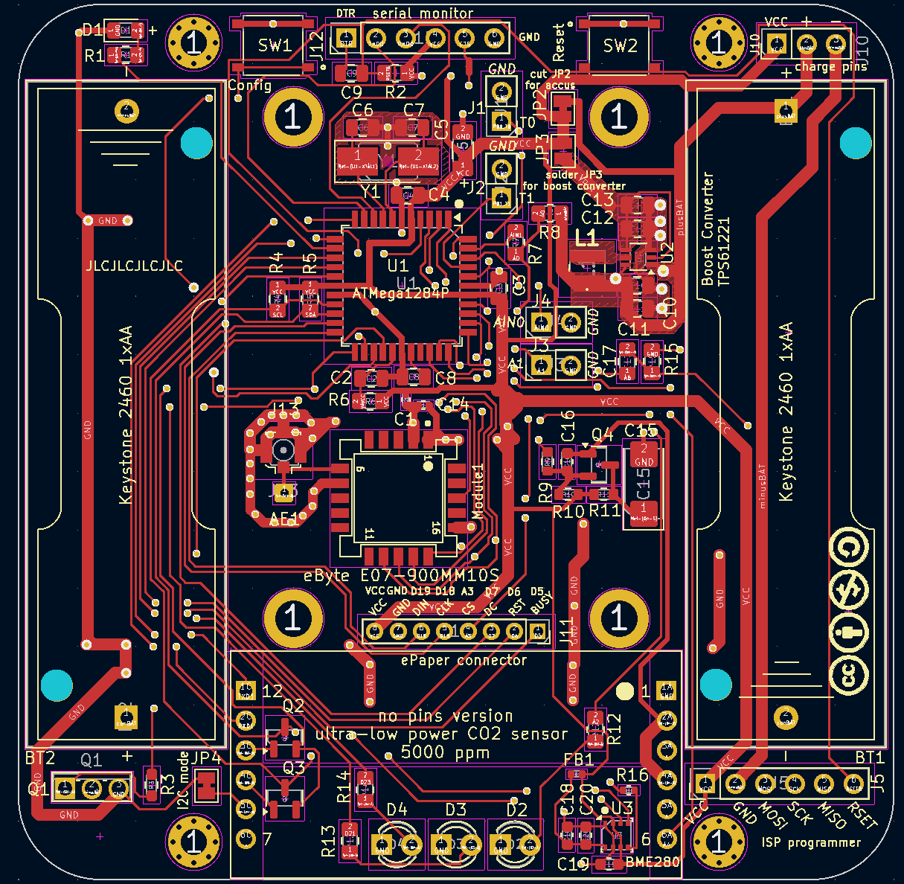
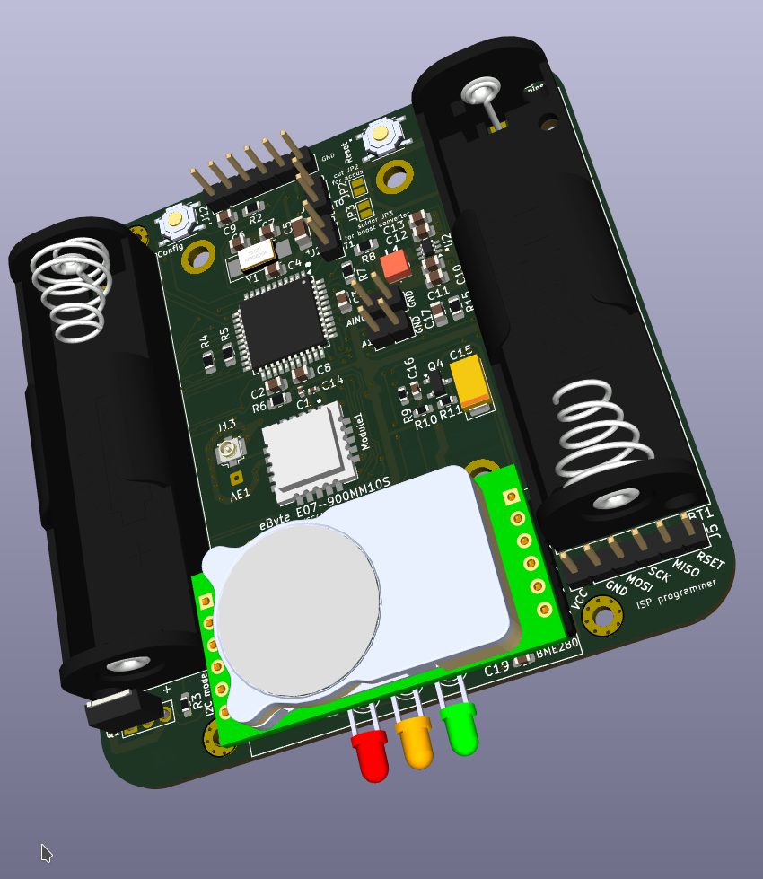
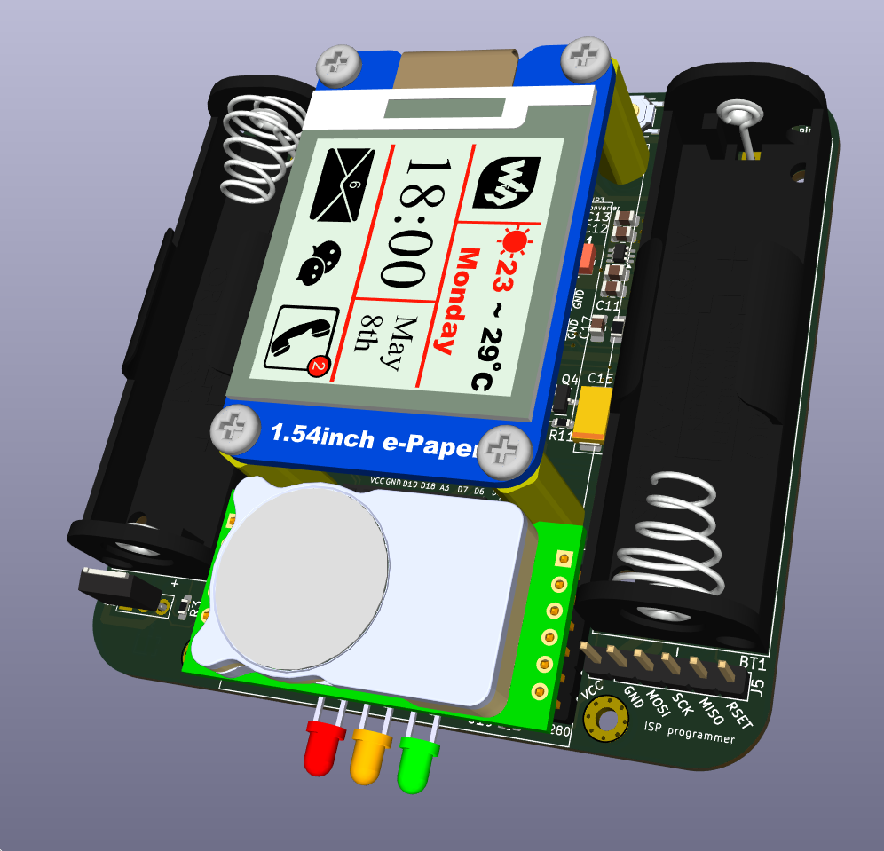

# HB-UNI-SEN-BATT_ATMega1284P_E07-900MM10S_CO2_FUEL4EP  

**Platine für DIY AsksinPP NDIR-CO2-Sensor COZIR-BLINK-5000 mit extrem niedrigem Stromverbrauch :**
- speziell angepasst für [COZIR-LP3-5000 CozIR®-LP3 Low Power CO2 Sensor](https://www.co2meter.com/de-de/collections/1-percent-co2-sensor/products/cozir-lp3-co2-sensor?variant=32074932781174)
	- der CO2 Sensor ist käuflich erwerbbar z.B. bei Reichelt [COZIR-BLINK-NON-PIN-5000](https://www.reichelt.de/de/de/shop/produkt/ultra-low_power_co2_sensor_mit_power-cycling-308788?PROVID=2788&gad_source=1&gad_campaignid=1622074784)
	- ein Datenblatt des CO2 Sensors ist [hier](https://cdn.shopify.com/s/files/1/0019/5952/files/CozIR-LP3_Data_Sheet_Rev_4.6.pdf?v=1695834654)
	- Messbereich bis 5000 ppm CO2
- eingebauter SMD TQFP-44 [ATMega1284P](https://ww1.microchip.com/downloads/en/DeviceDoc/doc8059.pdf) mit 128kByte Programmspeicher, 16kByte SRAM, 4kByte EEPROM
-  als Funkmodul wird das [eByte E07-900MM10S Sendemodul](https://ebyteiot.com/products/ebyte-e07-900MM10Sti-cc1101-wireless-rf-module-868mhz-915mhz-ipex-stamp?_pos=2&_sid=bbf1d47dc&_ss=r) verwendet.
- U.FL Antennenbuchse als Bestückungsoption für eine externe Antenne
- kleines 10mmx10mm [eByte E07-900MM10S Sendemodul](https://ebyteiot.com/products/ebyte-e07-900MM10Sti-cc1101-wireless-rf-module-868mhz-915mhz-ipex-stamp?_pos=2&_sid=bbf1d47dc&_ss=r)
- Steckerleiste für [Waveshare ePaper Modul (1.54inch (B)](https://www.waveshare.com/product/1.54inch-e-paper-module.htm)
- Bestückungsoption für [Waveshare ePaper Modul (1.54inch (B)](https://www.waveshare.com/product/1.54inch-e-paper-module.htm)
- Bestückungsoption für [TPS61221 Aufwärtswandler](https://www.ti.com/lit/ds/symlink/tps61221.pdf?ts=1634546965861&ref_url=https%253A%252F%252Fwww.ti.com%252Fproduct%252FTPS61221) bei NiMH Akkumulatorbetrieb
- die Bestückungsoptionen ePaper wurden noch nicht validiert!
- 3 LEDS für die Anzeige der CO2-Konzentration mit kurz aufblinkenden LEDs (rot, gelb, grün)
- Bestückungsoption für Piezosignalgeber [POPESQ® Signalgeber Piezo Buzzer 13x13x2.5mm](https://www.amazon.de/dp/B0C57D9RQ8) zur akustischen Warnung bei zu hoher CO2-Konzentration
- eingebauter [BOSCH BME280 I2C Sensor](https://www.bosch-sensortec.com/products/environmental-sensors/humidity-sensors-bme280/) zur Luftdruckkompensation des CO2-Sensors
- alle SMD Bausteine sind mit dem JLCPCB SMT Bestückungsservice kostengünstig und qualitativ hochwertig bestückbar

## Status

- die Platine wurde noch nicht bei JLCPCB gefertigt und ist auch noch nicht validiert. Nutzung auf eigenes Risiko!

## Credits

- diese Platine ist von Alexander Reinerts Platine [HB-UNI-SEN-BATT](https://github.com/alexreinert/PCB/tree/master/HB-UNI-SEN-BATT) abgeleitet.
- vielen Dank an Alexander Reinert für die Vorarbeit
- der Abstand der Batteriehalter wurde vergrößert, damit der COZIR-LP3-5000 CozIR®-LP3 Low Power CO2 Sensor dazwischen passt.

## Eigenschaften

- abgeleitet aus [HB-UNI-SEN-BATT](https://github.com/alexreinert/PCB/tree/master/HB-UNI-SEN-BATT)
- kompletter Datensatz für KiCAD 8 auf Github verfügbar:
    + 'git clone https://github.com/FUEL4EP/HomeAutomation.git' oder als [ZIP-Datei](https://github.com/FUEL4EP/HomeAutomation/archive/refs/heads/master.zip)
    + die Platinendaten sind dann unter 'HomeAutomation/AsksinPP_developments/PCBs/HB-UNI-SEN-BATT_ATMega1284P_E07-900MM10S_CO2_FUEL4EP' direkt mit KiCAD aufrufbar
- neue Eigenschaften:
    + SMD Bestückung, wo möglich
    + SMD TQFP-44 [ATMega1284P](https://ww1.microchip.com/downloads/en/DeviceDoc/doc8059.pdf) mit 128kByte Programmspeicher, 16kByte SRAM, 4kByte EEPROM
    + Bestückungsoption für [Waveshare ePaper Modul (1.54inch (B)](https://www.waveshare.com/product/1.54inch-e-paper-module.htm)
    + Bestückungsoption für [TPS61221 Aufwärtswandler](https://www.ti.com/lit/ds/symlink/tps61221.pdf?ts=1634546965861&ref_url=https%253A%252F%252Fwww.ti.com%252Fproduct%252FTPS61221) bei NiMH Akkumulatorbetrieb
    + alle SMD Bausteine sind mit dem JLCPCB SMT Bestückungsservice kostengünstig und qualitativ hochwertig bestückbar, das ist also auch für Grobmotoriker wie mich geeignet :-)
    + Stiftleiste J10 mit Versorgungsspannungen zum Gehäuseoberteil oder Akkulademodul
    + als Funkmodul wird das [eByte E07-900MM10S Sendemodul](https://ebyteiot.com/products/ebyte-e07-900MM10Sti-cc1101-wireless-rf-module-868mhz-915mhz-ipex-stamp?_pos=2&_sid=bbf1d47dc&_ss=r) verwendet. Dieses ist qualitativ viel besser als die üblichen grünen noname 868 MHz Funkmodule.
    + das schafft Platz für eine 8-polige Stiftleiste J11 zum optionalen Anschluss eines [Waveshare ePaper Moduls (1.54inch (B)](https://www.waveshare.com/product/1.54inch-e-paper-module.htm). Der ATMega1284P hat auch genügend RAM für die Programmierung eines 200 Pixel x 200 Pixel e-Papermoduls.
    + JLCPCB BOM and CPL Dateien für SMT Service werden [bereitgestellt](./jlcpcb/production_files)

### Benötigte Bauteile:

- bedingt durch die SMT Service von JLCPCB sind nur noch wenige Durchsteckbauteile von Hand zu verlöten:
* e-Paper [Waveshare ePaper Moduls (1.54inch (B)](https://www.waveshare.com/product/1.54inch-e-paper-module.htm) (optional, Anschluss an J11)
* CO2 Sensor [COZIR-LP3-5000 CozIR®-LP3 Low Power CO2 Sensor](https://www.co2meter.com/de-de/collections/1-percent-co2-sensor/products/cozir-lp3-co2-sensor?variant=32074932781174)
* Piezosignalgeber [Amazon POPESQ® Signalgeber Piezo Buzzer 13x13x2.5mm](https://www.amazon.de/dp/B0C57D9RQ8) oder [Alibaba 13*13 MM SMD-Summer-Wandler Extern angetriebener Piezo 5 V 5 mA 4,1 kHz 75 dB Oberflächen montierte Lötpads FUET-1325 Piezo-Summer](https://www.alibaba.com/product-detail/13-13-MM-SMD-Buzzer-Transducer_62560653672.html)
* 2x Keystone 2460 Batteriehalter 1xAA, z.B. [SOS Electronic](https://www.soselectronic.com/de-de/products/keystone-electronics/keys2460-2460-135729)
* Stiftleiste RM 2mm 1x8 Pin (für ePaper)
* Stiftleisten RM 2,54mm (nach Bedarf)
* IRLU024N (optional für Verpolungsschutz)
* Versorgung durch NiMH Akkumulatoren und Aufwärtswandler ist vorbereitet (JP2)
* Bestückungsoption Aufwärtswandler siehe [Schaltplan](Schematics/HB-UNI-SEN-BATT_ATMega1284P_E07-900MM10S_CO2_FUEL4EP.pdf), unter KiCAD sind alle Referenzen eingetragen

### Aufbauhinweise

- es wird dringend angeraten, vor dem Einbau der I2C Sensoren durchzuführen
    + einen Frequenztest. Hier der Frequenztest für einen ATmega 1284p : [FreqTest_1284P.ino](../Supplements/FreqTest_1284P/FreqTest_1284P.ino)
    + einen Leckagetest. Hier der Leckagetest für einen ATmega 1284p : [SleepTest_1284P.ino](../Supplements/SleepTest_1284P/SleepTest_1284P.ino)
        + der Leckagestrom im Sleepmode sollte < 10 uA betragen

### Passende AsksinPP Projekte von FUEL4EP
   + [tbd](https://github.com/FUEL4EP/HomeAutomation/tree/master/AsksinPP_developments/sketches/tbd)
   + muss noch entwickelt werden

### Anschluss eines FTDI Debuggers

- zum Anschluss eines FTDI Debuggers an die 6-polige Stiftleiste J12 bitte ein [6 Pin Dupontkabel 2.54mm Buchse-Buchse 20 cm](https://www.roboter-bausatz.de/p/6-pin-dupontkabel-2.54mm-buchse-buchse-20-cm) verwenden

### Passendes Gehäuse
* tbd, muss noch entwickelt werden

### Hinweise
* Achtung: Kein Überspannungsschutz vorhanden
* der Verpolungsschutz ist optional. Dafür Bauteil Q1 (IRLU024N) und R3 (100KOhm Widerstand) bestücken. Alternativ JP1 auf der Platinenrückseite brücken um ohne Verpolungsschutz zu arbeiten.
* bei der Nutzung des JLCPCB SMT Bestückungsservice ist darauf zu achten, dass **alle** benötigten SMD Bauteile als im Lager **verfügbar** angezeigt werden. Sonst bitte **NICHT** bestellen!

### KiCAD Plugin
- für die Erzeugung der JLCPCB Produktionsdaten wurde das Plugin [KiCAD JLCPCB tools](https://github.com/bouni/kicad-jlcpcb-tools) verwendet.

## Bestellen von Platinen

- die Platine kann direkt bei JLCPCB bestellt werden
- die notwendigen Produktionsdaten stehen [hier](./jlcpcb/production_files/)
- **die Platine V1.0 wurde noch nicht gefertigt und ist auch nicht validiert**
- für die Assemblierung bei JLCPCB ist ein [Standard PCBA-Service von JLCPCB](https://jlcpcb.com/capabilities/pcb-assembly-capabilities) notwendig, da der BME280 Sensor und das Funkmodul [eByte E07-900MM10S Sendemodul](https://ebyteiot.com/products/ebyte-e07-900MM10Sti-cc1101-wireless-rf-module-868mhz-915mhz-ipex-stamp?_pos=2&_sid=bbf1d47dc&_ss=r) nur als Standard PCBA verarbeitet werden können.
- siehe auch [JLCPCB PCB-Assembly-FAQs](https://jlcpcb.com/help/catalog/212-PCB-Assembly-FAQs)

## Sammelbestellung

- wer Interesse an einer gemeinsamen Bestellung von Platinen und/oder Gehäusen bei JLCPCB hat, fragt bitte per per PN bei bei [FUEL4EP](https://homematic-forum.de/forum/ucp.php?i=pm&mode=compose&u=20685) an.
- wenn genügend Interesse (>= 20 bestückte Platinen und/oder 3D gedruckten Gehäusen) zustande kommt, biete ich an, Platinen  und Gehäuse gegen Vorkasse per PayPal zum Selbstkostenpreis + Versandkosten + 3 Euro Aufwandspauschale pro Versand bei JLCPCB zu bestellen und dann weiterzuverkaufen. Vor einer Bestellung wird ein Angebot bei JLCPCB eingeholt und an die Interessenten zur Zustimmung verteilt

## Disclaimer

-   die Nutzung der hier veröffentlichten Inhalte erfolgt vollständig auf eigenes Risiko und ohne jede Gewähr.

## Versionsverlauf

-    V1.0 	26. Jun 2025: Initiale Freigabe

- 	KiCad Schaltplan-Editor   Version: 8.0.5-8.0.5-0~ubuntu22.04.1, release build unter Kubuntu22.04.1
- 	KiCad Leiterplatteneditor Version: 8.0.5-8.0.5-0~ubuntu22.04.1, release build unter Kubuntu22.04.1
- 	PCB Version 1.0
- 	Schematics  1.0

## Lizenz 

**Creative Commons BY-NC-SA** 
Give Credit, NonCommercial, ShareAlike

 This work is licensed under a <a rel="license" href="http://creativecommons.org/licenses/by-nc-sa/4.0/">Creative Commons Attribution-NonCommercial-ShareAlike 4.0 International License</a>.

-EOF
	

