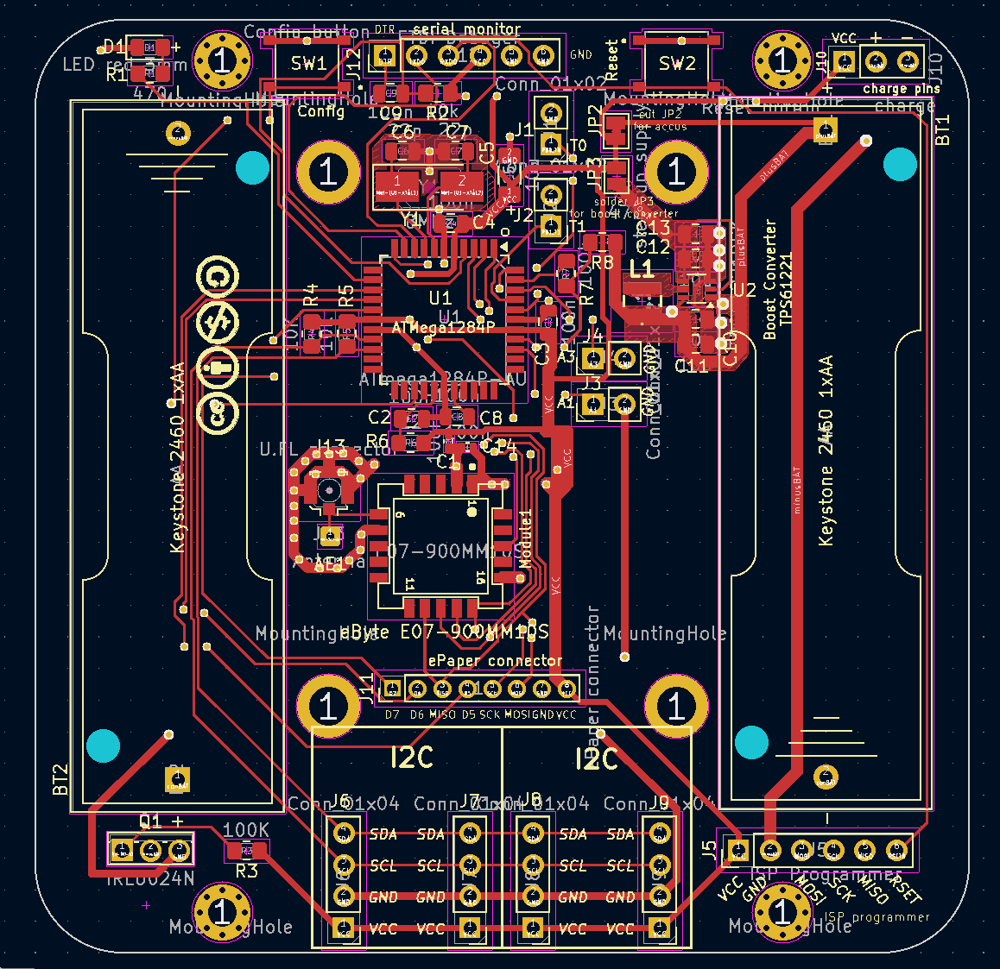

# HB-UNI-SEN-BATT_ATMega1284P_E07-900MM10S_FUEL4EP [](https://creativecommons.org/licenses/by-nc-sa/4.0/)[](https://hits.seeyoufarm.com) <a href='https://ko-fi.com/FUEL4EP' target='_blank'></a>

**Platine für DIY AsksinPP für**
- eingebauter SMD TQFP-44 [ATMega1284P](https://ww1.microchip.com/downloads/en/DeviceDoc/doc8059.pdf) mit 128kByte Programmspeicher, 16kByte SRAM, 4kByte EEPROM **oder Arduino Pro Mini**
- U.FL Antennenbuchse als Bestückungsoption für eine externe Antenne
- kleines 10mmx10mm [eByte E07-900MM10S Sendemodul](https://ebyteiot.com/products/ebyte-e07-900MM10Sti-cc1101-wireless-rf-module-868mhz-915mhz-ipex-stamp?_pos=2&_sid=bbf1d47dc&_ss=r)
- Steckerleiste für [Waveshare ePaper Modul (1.54inch (B)](https://www.waveshare.com/product/1.54inch-e-paper-module.htm)
- Bestückungsoption für [Waveshare ePaper Modul (1.54inch (B)](https://www.waveshare.com/product/1.54inch-e-paper-module.htm)
- Bestückungsoption für [TPS61221 Aufwärtswandler](https://www.ti.com/lit/ds/symlink/tps61221.pdf?ts=1634546965861&ref_url=https%253A%252F%252Fwww.ti.com%252Fproduct%252FTPS61221) bei NiMH Akkumulatorbetrieb
- alle SMD Bausteine sind mit dem JLCPCB SMT Bestückungsservice kostengünstig und qualitativ hochwertig bestückbar, das ist also auch für Grobmotoriker wie mich geeignet :-)
- die Bestückungsoptionen ePaper wurden noch nicht validiert!




## Credits

- diese Platine ist von Alexander Reinerts Platine [HB-UNI-SEN-BATT](https://github.com/alexreinert/PCB/tree/master/HB-UNI-SEN-BATT) abgeleitet.
- vielen Dank an Alexander Reinert für die Vorarbeit


## Eigenschaften

- abgeleitet aus [HB-UNI-SEN-BATT](https://github.com/alexreinert/PCB/tree/master/HB-UNI-SEN-BATT)
- kompletter Datensatz für KiCAD 6 auf Github verfügbar:
    + 'git clone https://github.com/FUEL4EP/HomeAutomation.git' oder als [ZIP-Datei](https://github.com/FUEL4EP/HomeAutomation/archive/refs/heads/master.zip)
    + die Platinendaten sind dann unter 'HomeAutomation/AsksinPP_developments/PCBs/HB-UNI-SEN-BATT_ATMega1284P_E07-900MM10S_FUEL4EP' direkt mit KiCAD aufrufbar
- neue Eigenschaften:
    + SMD Bestückung, wo möglich
    + SMD TQFP-44 [ATMega1284P](https://ww1.microchip.com/downloads/en/DeviceDoc/doc8059.pdf) mit 128kByte Programmspeicher, 16kByte SRAM, 4kByte EEPROM
    + Bestückungsoption für [Waveshare ePaper Modul (1.54inch (B)](https://www.waveshare.com/product/1.54inch-e-paper-module.htm)
    + Bestückungsoption für [TPS61221 Aufwärtswandler](https://www.ti.com/lit/ds/symlink/tps61221.pdf?ts=1634546965861&ref_url=https%253A%252F%252Fwww.ti.com%252Fproduct%252FTPS61221) bei NiMH Akkumulatorbetrieb
    + alle SMD Bausteine sind mit dem JLCPCB SMT Bestückungsservice kostengünstig und qualitativ hochwertig bestückbar, das ist also auch für Grobmotoriker wie mich geeignet :-)
    + Stiftleiste J10 mit Versorgungsspannungen zum Gehäuseoberteil oder Akkulademodul
    + Korrektur der Abstandfehlers bei einem Batteriehalter. Beim [HB-UNI-SEN-BATT](https://github.com/alexreinert/PCB/tree/master/HB-UNI-SEN-BATT) hat das schon mal gerne zu thermischen Ausfällen durch mechanische Spannungen geführt.
    + als Funkmodul wird das [eByte E07-900MM10S Sendemodul](https://ebyteiot.com/products/ebyte-e07-900MM10Sti-cc1101-wireless-rf-module-868mhz-915mhz-ipex-stamp?_pos=2&_sid=bbf1d47dc&_ss=r) verwendet. Dieses ist qualitativ viel besser als die üblichen grünen noname 868 MHz Funkmodule.
    + das schafft Platz für eine 8-polige Stiftleiste J11 zum optionalen Anschluss eines [Waveshare ePaper Moduls (1.54inch (B)](https://www.waveshare.com/product/1.54inch-e-paper-module.htm). Der ATMega1284P hat auch genügend RAM für die Programmierung eines 200 Pixel x 200 Pixel e-Papermoduls.
    + JLCPCB BOM and CPL Dateien für SMT Service werden [bereitgestellt](./jlcpcb/production_files)

### Benötigte Bauteile:

- bedingt durch die SMT Service von JLCPCB sind nur noch wenige Durchsteckbauteile von Hand zu verlöten:
* e-Paper [Waveshare ePaper Moduls (1.54inch (B)](https://www.waveshare.com/product/1.54inch-e-paper-module.htm) (optional, Anschluss an J11)
* 2x Keystone 2460 Batteriehalter 1xAA
* Stiftleiste RM 2mm 1x8 Pin (für ePaper)
* Stiftleisten RM 2,54mm (nach Bedarf)
* IRLU024N (optional für Verpolungsschutz)
* Versorgung durch NiMH Akkumulatoren und Aufwärtswandler ist vorbereitet (JP2)
* Bestückungsoption Aufwärtswandler siehe [Schaltplan](Schematics/HB-UNI-SEN-BATT_ATMega1284P_E07-900MM10S_FUEL4EP.pdf), unter KiCAD sind alle Referenzen eingetragen


### Aufbauhinweise

- es wird dringend angeraten, vor dem Einbau der I2C Sensoren durchzuführen
    + einen Frequenztest. Hier der Frequenztest für einen ATmega 1284p : [FreqTest_1284P.ino](../Supplements/FreqTest_1284P/FreqTest_1284P.ino)
    + einen Leckagetest. Hier der Leckagetest für einen ATmega 1284p : [SleepTest_1284P.ino](../Supplements/SleepTest_1284P/SleepTest_1284P.ino)
        + der Leckagestrom im Sleepmode sollte < 10 uA betragen

### Passende AsksinPP Projekte von FUEL4EP
   + [HB-UNI-Sensor1-AQ-BME680](https://github.com/FUEL4EP/HomeAutomation/tree/master/AsksinPP_developments/sketches/HB-UNI-Sensor1-AQ-BME680)
   + [HB-UNI-Sensor1-AQ-BME680_KF](https://github.com/FUEL4EP/HomeAutomation/tree/master/AsksinPP_developments/sketches/HB-UNI-Sensor1-AQ-BME680_KF)
   + [HB-UNI-Sensor1-AQ-BME680_KF_DEBUG](https://github.com/FUEL4EP/HomeAutomation/tree/master/AsksinPP_developments/sketches/HB-UNI-Sensor1-AQ-BME680_KF_DEBUG)
   + [HB-UNI-Sensor1-RAD-AL53](https://github.com/FUEL4EP/HomeAutomation/tree/master/AsksinPP_developments/sketches/HB-UNI-Sensor1-RAD-AL53)
   + [HB-UNI-Sensor1-THPD-SHT85](https://github.com/FUEL4EP/HomeAutomation/tree/master/AsksinPP_developments/sketches/HB-UNI-Sensor1-THPD-SHT85)
   + [HB-UNI-Sensor1-THPD-SHT45_BME280](https://github.com/FUEL4EP/HomeAutomation/tree/master/AsksinPP_developments/sketches/HB-UNI-Sensor1-THPD-SHT45_BME280)
   
### Notwendige Änderung der Betriebsspannungsmessung in Sketchen
- da die Platine einen fest verdrahteten Spannungsteiler R7 und R8 für die Betriebsspannung / Akkuspannungsmessung verwendet, muss in Sketchen folgende Anpassung gegebenenfalls durchgeführt werden:

- nur notwendig, wenn die Akkuspannung / Betriebsspannung größer als 3,5 Volt ist ( 2x AA Alkaline Batterie)

- von bisher
```
// 1) Standard: tmBattery, UBatt = Betriebsspannung AVR
#define BAT_SENSOR tmBattery
```
- nach
```
// 2) für StepUp/StepDown: tmBatteryResDiv, sense pin PA0 (=pin 37), activation pin PB3 (=pin 43) , Faktor = Rges/Rlow*1000, z.B. (100kOhm+47kOhm/100kOhm), Faktor (147k)/(100k)*1000 = 1470 (ATMega1284P)
// start with Faktor = 1470
// check in serial monitor the reported V2='accumulator voltage(MCU ADC) (x1000.0)' and compare with the reported V1='accumulator batteries voltage (x1000.0)'
// calculate voltage correction factor V1/V2
// calculate total Faktor = 1470 * V2/V1 = 1470 * 3141 / 3157 = 1463
#define BAT_SENSOR tmBatteryResDiv<PA0, PB3, 1463>
```
- zur Berechnung von Faktor in tmBatteryResDiv wird ein Libreoffice Calc Sheet [tmBattery_tmBatteryResDiv_calculator.ods](../../tools/tmBattery_tmBatteryResDiv_calculator.ods) zur Verfügung gestellt
- in der Version 1.0 war R8 = 200kOhm, daher Faktor = 3000 (ohne Kalibrierung)
- in der Version 1.1 ist R8 = 47kOhm, daher Faktor = 1470 (ohne Kalibrierung)

### Anschluss eines FTDI Debuggers

- zum Anschluss eines FTDI Debuggers an die 6-polige Stiftleiste J12 bitte ein [6 Pin Dupontkabel 2.54mm Buchse-Buchse 20 cm](https://www.roboter-bausatz.de/p/6-pin-dupontkabel-2.54mm-buchse-buchse-20-cm) verwenden

### Passendes Gehäuse
* Camdenboss CBRS01SWH und CBRS01VWH
* oder [Gehäuse HB-UNI-SEN-BATT snap in V2 von wpatrick](https://www.thingiverse.com/thing:3540481) für 3D-Druck
* bei Einbau eines e-Paper Moduls muss das Gehäuseoberteil angepasst werden (noch zu tun)

### Hinweise
* Achtung: Kein Überspannungsschutz vorhanden
* der Verpolungsschutz ist optional. Dafür Bauteil Q1 (IRLU024N) und R3 (100KOhm Widerstand) bestücken. Alternativ JP1 auf der Platinenrückseite brücken um ohne Verpolungsschutz zu arbeiten.
* bei der Nutzung des JLCPCB SMT Bestückungsservice ist darauf zu achten, dass **alle** benötigten SMD Bauteile als im Lager **verfügbar** angezeigt werden. Sonst bitte **NICHT** bestellen!

### KiCAD Plugin
- für die Erzeugung der JLCPCB Produktionsdaten wurde das Plugin [KiCAD JLCPCB tools](https://github.com/bouni/kicad-jlcpcb-tools) verwendet.


## Bestellen von Platinen

- die Platine kann entweder direkt bei JLCPCB bestellt werden
- die notwendigen Produktionsdaten stehen [hier](./jlcpcb/production_files/)
- **die Platine V1.0 wurde mit dem Sketch HB-UNI-Sensor1-THPD-SHT45_BME280 erfolgreich validiert**
- die JLCPCB Assemblierung des Funkmoduls eByte E07-900MM10S geht nur als das sehr teure Standard PCBA, daher wird eine Verlötung von Hand empfohlen

## Sammelbestellung

- wer Interesse an einer gemeinsamen Bestellung von Platinen und/oder Gehäusen bei JLCPCB hat, fragt bitte per per PN bei bei [FUEL4EP](https://homematic-forum.de/forum/ucp.php?i=pm&mode=compose&u=20685) an.
- wenn genügend Interesse (>= 20 bestückte Platinen und/oder 3D gedruckten Gehäusen) zustande kommt, biete ich an, Platinen  und Gehäuse gegen Vorkasse per PayPal zum Selbstkostenpreis + Versandkosten + 3 Euro Aufwandspauschale pro Versand bei JLCPCB zu bestellen und dann weiterzuverkaufen. Vor einer Bestellung wird ein Angebot bei JLCPCB eingeholt und an die Interessenten zur Zustimmung verteilt.

	
## passende DIY I2C-Sensormodule für die Fertigung bei JLCPCB
- als DIY-Ersatz für kommerzielle Sensormodule stehen folgende passende Adapterplatinen zur Verfügung:
	- [I2C_Module_BME280_FUEL4EP](https://github.com/FUEL4EP/HomeAutomation/tree/master/AsksinPP_developments/PCBs/I2C_Module_BME280_FUEL4EP)
	- [I2C_Module_BME680_FUEL4EP](https://github.com/FUEL4EP/HomeAutomation/tree/master/AsksinPP_developments/PCBs/I2C_Module_BME680_FUEL4EP)
	- [I2C_Module_SHT85_BME280_FUEL4EP](https://github.com/FUEL4EP/HomeAutomation/tree/master/AsksinPP_developments/PCBs/I2C_Module_SHT85_BME280_FUEL4EP)
	- [I2C_Module_SHT45_BME280_FUEL4EP](https://github.com/FUEL4EP/HomeAutomation/tree/master/AsksinPP_developments/PCBs/I2C_Module_SHT45_BME280_FUEL4EP)
	- [4Bit_I2C_Port_Expander_Module_FUEL4EP](https://github.com/FUEL4EP/HomeAutomation/tree/master/AsksinPP_developments/PCBs/4Bit_I2C_Port_Expander_Module_FUEL4EP)


## Disclaimer

-   die Nutzung der hier veröffentlichten Inhalte erfolgt vollständig auf eigenes Risiko und ohne jede Gewähr.

## Versionsverlauf

-    V1.0 	13. Sep 2023: Initiale Freigabe
-    S V1.1 	08. Jan 2024: Korrektur der falschen LCSC-Teilenummer von C1
-	 L V1.1 17. Feb 2024: Verschieben der beiden Kondensatoren C1 und C14, um die Handverlötung des Funkmoduls zu erleichtern
-	 S V1.2 17. Feb 2024: Korrektur eines unbeabsichtigt verschobenen Netznamens
-	 S V1.3 17. Feb 2024: Korrektur LCSC Nummer für R7
-	 S V1.4 26. Sep 2024: Migration zu KiCAD 8; Fix of LCSC-Nummern (R2, R4, R5)
-	 L V1.2 26. Sep 2024: Migration zu KiCAD 8; Fix of LCSC-Nummern (R2, R4, R5)

- 	KiCad Schaltplan-Editor   Version: 8.0.5-8.0.5-0~ubuntu22.04.1, release build unter Kubuntu22.04.1
- 	KiCad Leiterplatteneditor Version: 8.0.5-8.0.5-0~ubuntu22.04.1, release build unter Kubuntu22.04.1
- 	PCB Version 1.2
- 	Schematics  1.4

## Lizenz 

**Creative Commons BY-NC-SA**<br>
Give Credit, NonCommercial, ShareAlike

<a rel="license" href="http://creativecommons.org/licenses/by-nc-sa/4.0/"></a><br />This work is licensed under a <a rel="license" href="http://creativecommons.org/licenses/by-nc-sa/4.0/">Creative Commons Attribution-NonCommercial-ShareAlike 4.0 International License</a>.


-EOF
	

