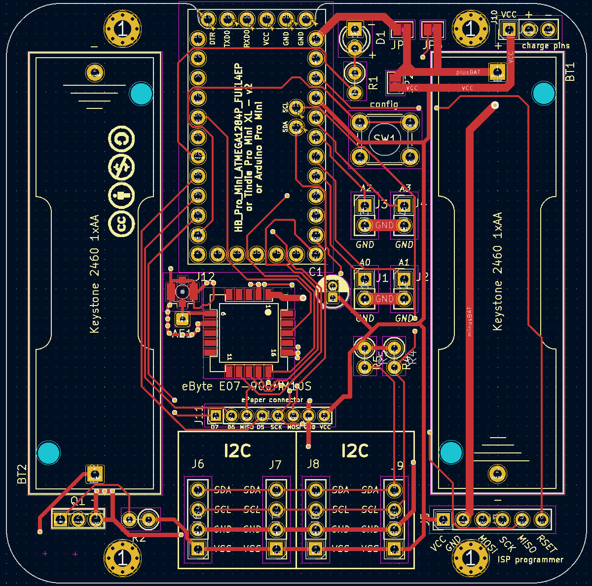
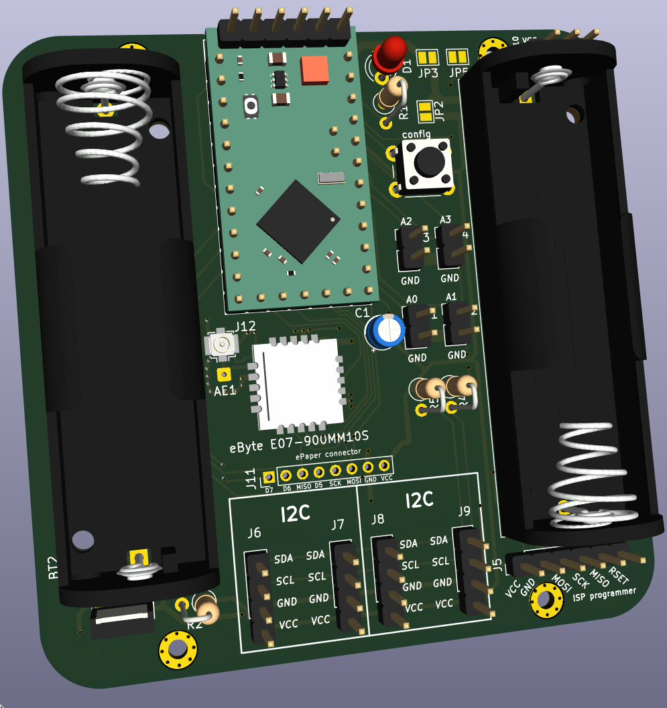

# HB-UNI-SEN-BATT_E07-900MM10S_FUEL4EP  

**Platine für DIY AsksinPP für**
- [Tindie Pro Mini XL - v2 - ATmega 1284p](https://www.tindie.com/products/prominimicros/pro-mini-xl-v2-atmega-1284p/) **oder Arduino Pro Mini**
- [eByte E07-900MM10S Sendemodul](https://ebyteiot.com/products/ebyte-e07-900MM10Sti-cc1101-wireless-rf-module-868mhz-915mhz-ipex-stamp?_pos=2&_sid=bbf1d47dc&_ss=r)
- Steckerleiste für [Waveshare ePaper Modul (1.54inch (B)](https://www.waveshare.com/product/1.54inch-e-paper-module.htm)
- U.FL Antennenbuchse (optional bestückbar)

## Credits

- diese Platine ist von Alexander Reinerts Platine [HB-UNI-SEN-BATT](https://github.com/alexreinert/PCB/tree/master/HB-UNI-SEN-BATT) abgeleitet.
- vielen Dank an Alexander Reinert für die Vorarbeit.

## Platine ist noch nicht validiert

- neu entwickelt mit KiCAD 6
- Migration zum [SMD RF-Modul e-Byte E07-900MM10S](https://www.cdebyte.com/pdf-down.aspx?id=1932), da eByte die Fertigung des Moduls E07-868MS10 eingestellt hat
- die Platine wurde **noch nicht** bei JLCPCB gefertigt
- **die Evaluation steht noch aus!**

## Eigenschaften

- abgeleitet aus [HB-UNI-SEN-BATT](https://github.com/alexreinert/PCB/tree/master/HB-UNI-SEN-BATT)
- kompletter Datensatz für KiCAD 6 auf Github verfügbar:
    + 'git clone https://github.com/FUEL4EP/HomeAutomation.git' oder als [ZIP-Datei](https://github.com/FUEL4EP/HomeAutomation/archive/refs/heads/master.zip)
    + die Platinendaten sind dann unter 'HomeAutomation/AsksinPP_developments/PCBs/HB-UNI-SEN-BATT_E07-900MM10S_FUEL4EP' direkt mit KiCAD aufrufbar
- der Arduino Pro Mini ist durch einen [Tindie Pro Mini XL - v2 - ATmega 1284p](https://www.tindie.com/products/prominimicros/pro-mini-xl-v2-atmega-1284p/) ersetzt
- alternativ kann stattdessen ein Arduino Pro Mini verbaut werden
- neue Eigenschaften:
    + nur eine LED
    + dafür optionale Unterstützung von Akkumulatorbetrieb mit einem 'Huckepack' Aufwärtswandlermodul (siehe z.B. [HB-UNI-SENSOR1-CO2-SCD30](https://github.com/FUEL4EP/HomeAutomation/tree/master/AsksinPP_developments/sketches/HB-UNI-Sensor1-CO2_SCD30): Bitte für Akkubetrieb den Lötjumper JP2 auftrennen
    + Stiftleiste J10 mit Versorgungspannungen zum Gehäuseoberteil oder Akkulademodul
    + Korrektur der Abstandfehlers bei einem Batteriehalter. Beim [HB-UNI-SEN-BATT](https://github.com/alexreinert/PCB/tree/master/HB-UNI-SEN-BATT) hat das schon mal gerne zu thermischen Ausfällen durch mechanische Spannungen geführt.
- als Funkmodul wird das [eByte E07-900MM10S Sendemodul](https://www.rcscomponents.kiev.ua/datasheets/e07-900MM10S_usermanual_en_v1_20.pdf) verwendet
    - das schafft Platz für eine 8-polige Stiftleiste J11 zum optionalen Anschluss eines [Waveshare ePaper Moduls (1.54inch (B)](https://www.waveshare.com/product/1.54inch-e-paper-module.htm). Der ATMega1284P hat auch genügend RAM für die Programmierung eines 200 Pixel x 200 Pixel e-Papermoduls.

### Benötigte Bauteile:
* [Tindie Pro Mini XL - v2 - ATmega 1284p](https://www.tindie.com/products/prominimicros/pro-mini-xl-v2-atmega-1284p/)
    - mit deutlich mehr Programm-, RAM- und EEPROM-Speicher als Arduino Pro Mini: 128kByte Programmspeicher, 16kByte SRAM, 4kByte EEPROM
* oder alternativ ein Arduino Pro Mini
* [eByte E07-900MM10S Sendemodul 868MHz](https://www.cdebyte.com/pdf-down.aspx?id=1932) Modul
* e-Paper [Waveshare ePaper Moduls (1.54inch (B)](https://www.waveshare.com/product/1.54inch-e-paper-module.htm) (optional, Anschluss an J11)
* 2x Keystone 2460 Batteriehalter 1xAA (oder Goobay 1xAA Batteriehalter)
* 1x LEDs 3mm Low Current (Pin 4)
* 1x 470Ohm Widerstände (Vorwiderstand für LED)
* Elko 10uF 1,5mm
* Mikroschalter 6*6mm
* Stiftleiste RM 2.0mm 1x8 Pin (für e-Paper [Waveshare ePaper Moduls (1.54inch (B)](https://www.waveshare.com/product/1.54inch-e-paper-module.htm))
* Stiftleisten RM 2,54mm (nach Bedarf)
* IRLU024N (optional für Verpolungsschutz)
* 100KOhm Widerstand (optional für Verpolungsschutz)
* 2x 10KOhm Widerstand (Pullup für I2C)
* Versorgung durch NiMH Akkumulatoren und Aufwärtswandler ist vorbereitet (JP2)

### Aufbauhinweise

- es wird dringend angeraten, vor dem Einbau der I2C Sensoren durchzuführen
    + einen Frequenztest. Hier der Frequenztest für einen [Tindie Pro Mini XL - v2 - ATmega 1284p](https://www.tindie.com/products/prominimicros/pro-mini-xl-v2-atmega-1284p/) : [FreqTest_1284P.ino](../Supplements/FreqTest_1284P/FreqTest_1284P.ino)
    + einen Leckagetest. Hier der Leckagetest für einen [Tindie Pro Mini XL - v2 - ATmega 1284p](https://www.tindie.com/products/prominimicros/pro-mini-xl-v2-atmega-1284p/) : [SleepTest_1284P.ino](../Supplements/SleepTest_1284P/SleepTest_1284P.ino)
        + der Leckagestrom im Sleepmode sollte < 10 uA betragen
    + für einen Arduino Pro Mini die entsprechenden Standardsketche für den Frequenztest und den SleepTest verwenden.
    + am besten diese beiden Tests in einem Testaufbau mit Stecksockeln vor dem Einlöten durchführen
    
### Passende AsksinPP Projekte von FUEL4EP
- Arduino Pro Mini ATMega328P oder Tindie Pro Mini XL - v2 - ATmega 1284p basierend:
    + [HB-UNI-Sensor1-THPD-BME280](https://github.com/FUEL4EP/HomeAutomation/tree/master/AsksinPP_developments/sketches/HB-UNI-Sensor1-THPD-BME280)
    + [HB-UNI-Sensor1-TH-SHT75](https://github.com/FUEL4EP/HomeAutomation/tree/master/AsksinPP_developments/sketches/HB-UNI-Sensor1-TH-SHT75)
     + [HB-UNI-Sensor1-CO2_SCD30](https://github.com/FUEL4EP/HomeAutomation/tree/master/AsksinPP_developments/sketches/HB-UNI-Sensor1-CO2_SCD30)
- [Tindie Pro Mini XL - v2 - ATmega 1284p](https://www.tindie.com/products/prominimicros/pro-mini-xl-v2-atmega-1284p/) basierend:
     + [HB-UNI-Sensor1-AQ-BME680](https://github.com/FUEL4EP/HomeAutomation/tree/master/AsksinPP_developments/sketches/HB-UNI-Sensor1-AQ-BME680)
    + [HB-UNI-Sensor1-AQ-BME680_KF](https://github.com/FUEL4EP/HomeAutomation/tree/master/AsksinPP_developments/sketches/HB-UNI-Sensor1-AQ-BME680_KF)
    + [HB-UNI-Sensor1-AQ-BME680_KF_DEBUG](https://github.com/FUEL4EP/HomeAutomation/tree/master/AsksinPP_developments/sketches/HB-UNI-Sensor1-AQ-BME680_KF_DEBUG)
    + [HB-UNI-Sensor1-RAD-AL53](https://github.com/FUEL4EP/HomeAutomation/tree/master/AsksinPP_developments/sketches/HB-UNI-Sensor1-RAD-AL53)
    + [HB-UNI-Sensor1-THPD-SHT85](https://github.com/FUEL4EP/HomeAutomation/tree/master/AsksinPP_developments/sketches/HB-UNI-Sensor1-THPD-SHT85)

### Passendes Gehäuse
* Camdenboss CBRS01SWH und CBRS01VWH
* oder [Gehäuse HB-UNI-SEN-BATT snap in V2 von wpatrick](https://www.thingiverse.com/thing:3540481) für 3D-Druck
* bei Einbau eines e-Paper Moduls muss das Gehäuseoberteil angepasst werden (noch zu tun)

### Hinweise
* Achtung: Kein Überspannungschutz vorhanden
* der Verpolungsschutz ist optional. Dafür Bauteil Q1 (IRLU024N) und R3 (100KOhm Widerstand) bestücken. Alternativ JP1 auf der Platinenrückseite brücken um ohne Verpolungsschutz zu arbeiten.

## Versionen
- KiCad Schaltplan-Editor Version: 6.0.11-2627ca5db0 unter Kubuntu22.04.1
- KiCad Leiterplatteneditor Version: 6.0.11-2627ca5db0 unter Kubuntu22.04.1 1.
- PCB Version 1.0
- Schematics  1.0

## Bestellen von Platinen

- die Platine kann entweder direkt bei JLCPCB bestellt werden
- **die Platine ist noch nicht durch einen Prototypen evaluiert!**

	
## passende DIY I2C-Sensormodule für die Fertigung bei JLCPCB
- als DIY-Ersatz für kommerzielle Sensormodule stehen folgende passende Adapterplatinen zur Verfügung:
	- [I2C_Module_BME280_FUEL4EP](https://github.com/FUEL4EP/HomeAutomation/tree/master/AsksinPP_developments/PCBs/I2C_Module_BME280_FUEL4EP)
	- [I2C_Module_BME680_FUEL4EP](https://github.com/FUEL4EP/HomeAutomation/tree/master/AsksinPP_developments/PCBs/I2C_Module_BME680_FUEL4EP)
	- [I2C_Module_SHT85_BME280_FUEL4EP](https://github.com/FUEL4EP/HomeAutomation/tree/master/AsksinPP_developments/PCBs/I2C_Module_SHT85_BME280_FUEL4EP)
	- [I2C_Module_SHT45_BME280_FUEL4EP](https://github.com/FUEL4EP/HomeAutomation/tree/master/AsksinPP_developments/PCBs/I2C_Module_SHT45_BME280_FUEL4EP)
	- [4Bit_I2C_Port_Expander_Module_FUEL4EP](https://github.com/FUEL4EP/HomeAutomation/tree/master/AsksinPP_developments/PCBs/4Bit_I2C_Port_Expander_Module_FUEL4EP)

- 
## Disclaimer

-   die Nutzung der hier veröffentlichten Inhalte erfolgt vollständig auf eigenes Risiko und ohne jede Gewähr.

## Lizenz 

**Creative Commons BY-NC-SA** 
Give Credit, NonCommercial, ShareAlike

 This work is licensed under a <a rel="license" href="http://creativecommons.org/licenses/by-nc-sa/4.0/">Creative Commons Attribution-NonCommercial-ShareAlike 4.0 International License</a>.

-EOF
	

