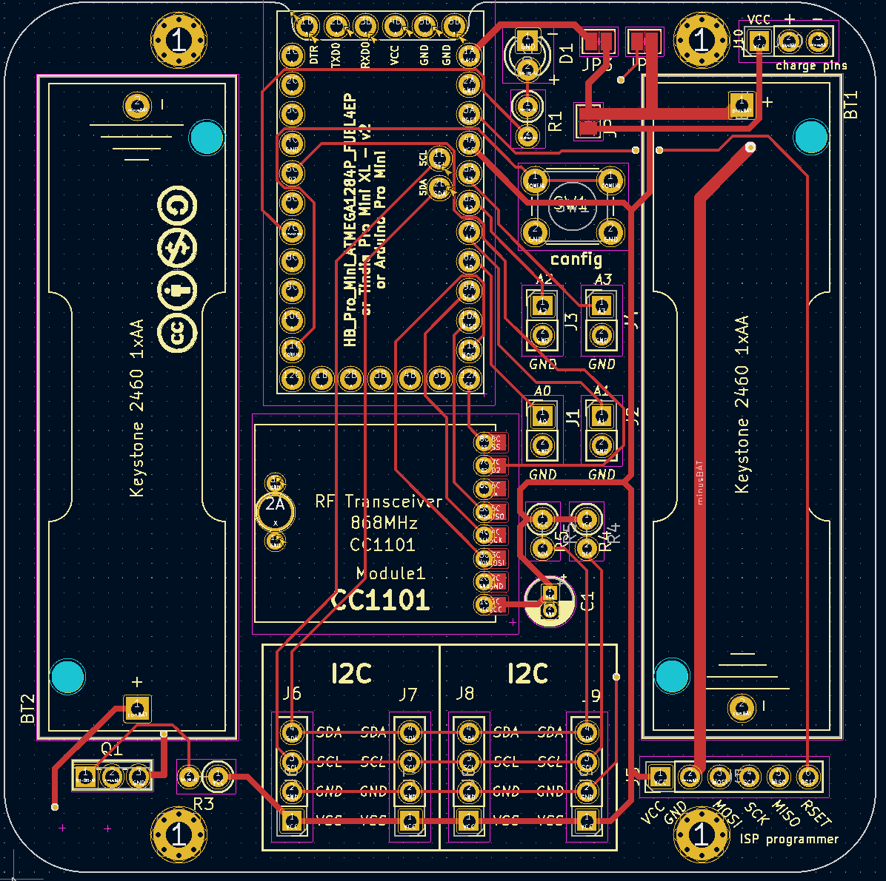

# HB-UNI-SEN-BATT_FUEL4EP [] 

**Platine für DIY AsksinPP basierend auf [Tindie Pro Mini XL - v2 - ATmega 1284p](https://www.tindie.com/products/prominimicros/pro-mini-xl-v2-atmega-1284p/) **oder Arduino Pro Mini**

## Credits

- diese Platine ist von Alexander Reinerts Platine [HB-UNI-SEN-BATT](https://github.com/alexreinert/PCB/tree/master/HB-UNI-SEN-BATT) abgeleitet.
- vielen Dank an Alexander Reinert für die Vorarbeit.

## Platine wurde nach Fertigung bei JLCPCB erfolgreich validiert

- entwickelt mit KiCAD 5.1.10, mein persönliches Erstlingswerk mit KiCAD PCBNEW
- die Platine wurde bei JLCPCB gefertigt

- die gefertigte Platine wurde erfolgreich mit dem Sketch [HB-UNI-SENSOR1-THPD-BME280](https://github.com/FUEL4EP/HomeAutomation/tree/master/AsksinPP_developments/sketches/HB-UNI-Sensor1-THPD-BME280) validiert:

## Eigenschaften

- weitgehend identisch mit [HB-UNI-SEN-BATT](https://github.com/alexreinert/PCB/tree/master/HB-UNI-SEN-BATT)
- kompletter Datensatz für KiCAD 5.1.10 auf Github verfügbar:
    + 'git clone https://github.com/FUEL4EP/HomeAutomation.git' oder als [ZIP-Datei](https://github.com/FUEL4EP/HomeAutomation/archive/refs/heads/master.zip)
    + die Platinendaten sind dann unter 'HomeAutomation/AsksinPP_developments/PCBs/HB-UNI-SEN-BATT_FUEL4EP' direkt mit KiCAD aufrufbar
- der Arduino Pro Mini ist durch einen [Tindie Pro Mini XL - v2 - ATmega 1284p](https://www.tindie.com/products/prominimicros/pro-mini-xl-v2-atmega-1284p/) ersetzt
- alternativ kann stattdessen ein Arduino Pro Mini verbaut werden
- neue Eigenschaften:
    + nur eine LED
    + dafür optionale Unterstützung von Akkumulatorbetrieb mit einem 'Huckepack' Aufwärtswandlermodul (siehe z.B. [HB-UNI-SENSOR1-CO2-SCD30](https://github.com/FUEL4EP/HomeAutomation/tree/master/AsksinPP_developments/sketches/HB-UNI-Sensor1-CO2_SCD30): Bitte für Akkubetrieb den Lötjumper JP2 auftrennen
    + Stiftleiste J10 mit Versorgungspannungen zum Gehäuseoberteil oder Akkulademodul
    + Korrektur der Abstandfehlers bei einem Batteriehalter. Beim [HB-UNI-SEN-BATT](https://github.com/alexreinert/PCB/tree/master/HB-UNI-SEN-BATT) hat das schon mal gerne zu thermischen Ausfällen durch mechanische Spannungen geführt.

### Benötigte Bauteile:
* [Tindie Pro Mini XL - v2 - ATmega 1284p](https://www.tindie.com/products/prominimicros/pro-mini-xl-v2-atmega-1284p/)
    - mit deutlich mehr Programm-, RAM- und EEPROM-Speicher als Arduino Pro Mini: 128kByte Programmspeicher, 16kByte SRAM, 4kByte EEPROM
* CC1101 Modulplatine 868MHz
* 1x LEDs 3mm Low Current (Pin 4)
* 1x 470Ohm Widerstände (Vorwiderstand für LED)
* Elko 10uF 1,5mm
* 2x Keystone 2460 Batteriehalter 1xAA (oder Goobay 1xAA Batteriehalter)
* Mikroschalter 6*6mm
* Stiftleiste RM 2mm 1x8 Pin (für CC1101)
* Stiftleisten RM 2,54mm (nach Bedarf)
* IRLU024N (optional für Verpolungsschutz)
* 100KOhm Widerstand (optional für Verpolungsschutz)
* 2x 10KOhm Widerstand (Pullup für I2C)
* Versorgung durch NiMH Akkumulatoren und Aufwärtswandler ist vorbereitet (JP2)

### Aufbauhinweise

- es wird dringend angeraten, vor dem Einbau der I2C Sensoren durchzuführen
    + einen Frequenztest. Hier der Frequenztest für einen [Tindie Pro Mini XL - v2 - ATmega 1284p](https://www.tindie.com/products/prominimicros/pro-mini-xl-v2-atmega-1284p/) : [FreqTest_1284P.ino](../Supplements/FreqTest_1284P/FreqTest_1284P.ino)
    + einen Leckagetest. Hier der Leckagetest für einen [Tindie Pro Mini XL - v2 - ATmega 1284p](https://www.tindie.com/products/prominimicros/pro-mini-xl-v2-atmega-1284p/) : [SleepTest_1284P.ino](../Supplements/SleepTest_1284P/SleepTest_1284P.ino)
        + der Leckagestrom im Sleepmode sollte < 10 uA betragen
    + für einen Arduino Pro Mini die entsprechenden Standardsketche für den Frequenztest und den SleepTest verwenden.
    + am besten diese beiden Tests in einem Testaufbau mit Stecksockeln vor dem Einlöten durchführen

### Passende AsksinPP Projekte von FUEL4EP
- Arduino Pro Mini ATMega328P basierend:
    + [HB-UNI-Sensor1-THPD-BME280](https://github.com/FUEL4EP/HomeAutomation/tree/master/AsksinPP_developments/sketches/HB-UNI-Sensor1-THPD-BME280)
    + [HB-UNI-Sensor1-TH-SHT75](https://github.com/FUEL4EP/HomeAutomation/tree/master/AsksinPP_developments/sketches/HB-UNI-Sensor1-TH-SHT75)
     + [HB-UNI-Sensor1-CO2_SCD30](https://github.com/FUEL4EP/HomeAutomation/tree/master/AsksinPP_developments/sketches/HB-UNI-Sensor1-CO2_SCD30)
- [Tindie Pro Mini XL - v2 - ATmega 1284p](https://www.tindie.com/products/prominimicros/pro-mini-xl-v2-atmega-1284p/) basierend:
     + [HB-UNI-Sensor1-AQ-BME680](https://github.com/FUEL4EP/HomeAutomation/tree/master/AsksinPP_developments/sketches/HB-UNI-Sensor1-AQ-BME680)
    + [HB-UNI-Sensor1-AQ-BME680_KF](https://github.com/FUEL4EP/HomeAutomation/tree/master/AsksinPP_developments/sketches/HB-UNI-Sensor1-AQ-BME680_KF)
    + [HB-UNI-Sensor1-AQ-BME680_KF_DEBUG](https://github.com/FUEL4EP/HomeAutomation/tree/master/AsksinPP_developments/sketches/HB-UNI-Sensor1-AQ-BME680_KF_DEBUG)
    + [HB-UNI-Sensor1-RAD-AL53](https://github.com/FUEL4EP/HomeAutomation/tree/master/AsksinPP_developments/sketches/HB-UNI-Sensor1-RAD-AL53)
    + [HB-UNI-Sensor1-THPD-SHT85](https://github.com/FUEL4EP/HomeAutomation/tree/master/AsksinPP_developments/sketches/HB-UNI-Sensor1-THPD-SHT85)

### Passendes Gehäuse
* Camdenboss CBRS01SWH und CBRS01VWH
* oder [Gehäuse HB-UNI-SEN-BATT snap in V2 von wpatrick](https://www.thingiverse.com/thing:3540481) für 3D-Druck

### Hinweise
* Achtung: Kein Überspannungschutz vorhanden
* der Verpolungsschutz ist optional. Dafür Bauteil Q1 (IRLU024N) und R3 (100KOhm Widerstand) bestücken. Alternativ JP1 auf der Platinenrückseite brücken um ohne Verpolungsschutz zu arbeiten.

## Bestellen von Platinen

- die Platine kann entweder direkt bei JLCPCB bestellt werden
- oder per PN bei [FUEL4EP](https://homematic-forum.de/forum/ucp.php?i=pm&mode=compose&u=20685) im Homematic Forum nachfragen. Aus der Bestellung der Prototypen sind noch wenige Platinen kostengünstig abzugeben.

## Disclaimer

-   die Nutzung der hier veröffentlichten Inhalte erfolgt vollständig auf eigenes Risiko und ohne jede Gewähr.

## Lizenz 

**Creative Commons BY-NC-SA** 
Give Credit, NonCommercial, ShareAlike

 This work is licensed under a <a rel="license" href="http://creativecommons.org/licenses/by-nc-sa/4.0/">Creative Commons Attribution-NonCommercial-ShareAlike 4.0 International License</a>.

-EOF
	

