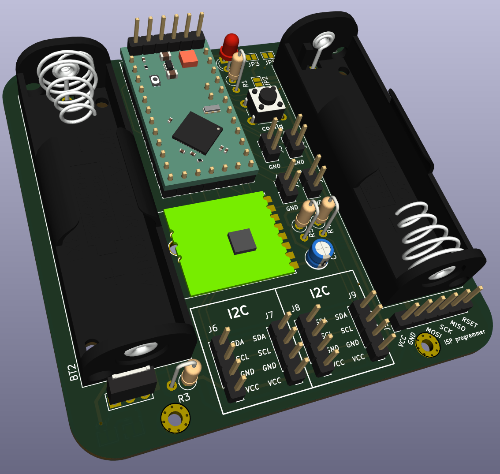
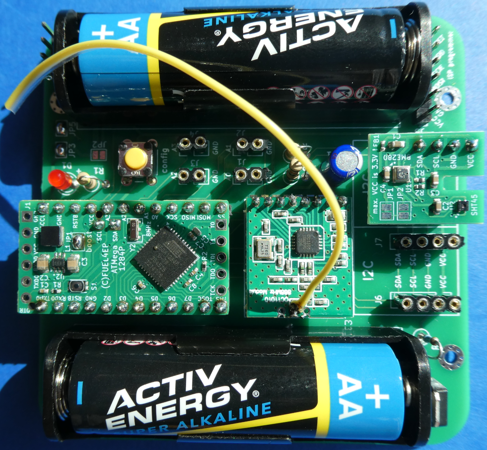

# HB-UNI-SEN-BATT_FUEL4EP  

**Platine für DIY AsksinPP Projekte basierend auf den folgenden möglichen Arduino-Modulen:**
- [Arduino Pro Mini 328 - 3.3V/8MHz](https://www.sparkfun.com/arduino-pro-mini-328-3-3v-8mhz.html): 32kByte Programmspeicher, 4kByte SRAM, 1kByte EEPROM
- NEU: [HB_Pro_Mini_ATMEGA1284P_FUEL4EP](https://github.com/FUEL4EP/HomeAutomation/tree/master/AsksinPP_developments/PCBs/HB_Pro_Mini_ATMEGA1284P_FUEL4EP)
	+ mit deutlich mehr Programm-, RAM- und EEPROM-Speicher als Arduino Pro Mini: 128kByte Programmspeicher, 16kByte SRAM, 4kByte EEPROM)
- [Tindie Pro Mini XL - v2 - ATmega 1284p](https://www.tindie.com/products/prominimicros/pro-mini-xl-v2-atmega-1284p/)
	+ mit deutlich mehr Programm-, RAM- und EEPROM-Speicher als Arduino Pro Mini: 128kByte Programmspeicher, 16kByte SRAM, 4kByte EEPROM)

## Credits

- diese Platine ist von Alexander Reinerts Platine [HB-UNI-SEN-BATT](https://github.com/alexreinert/PCB/tree/master/HB-UNI-SEN-BATT) abgeleitet.
- vielen Dank an Alexander Reinert für die Vorarbeit.

## Status der Validierung der Platine

- Platine wurde bis zur Version V1.4 bei JLCPCB erfolgreich gefertigt und validiert
- auch der Prototyp der neuen Platinenversion V1.5 wurde bei JLCPCB gefertigt und danach erfolgreich validiert:

- für die Systemvalidierung wude als Hardware verwandt:
	+ [HB-UNI-SEN-BATT_FUEL4EP V1.5](https://github.com/FUEL4EP/HomeAutomation/tree/master/AsksinPP_developments/PCBs/HB-UNI-SEN-BATT_FUEL4EP)
	+ [HB_Pro_Mini_ATMEGA1284P_FUEL4EP V1.0](https://github.com/FUEL4EP/HomeAutomation/tree/master/AsksinPP_developments/PCBs/HB_Pro_Mini_ATMEGA1284P_FUEL4EP)
	+ [I2C_Module_SHT45_BME280_small_FUEL4EP V1.5](https://github.com/FUEL4EP/HomeAutomation/tree/master/AsksinPP_developments/PCBs/I2C_Module_SHT45_BME280_small_FUEL4EP)
	+ getestet wurden folgende Spannungeversorgungen:
		* 1x AA Alkaline Batterie
		* 2x AA Alkaline Batterie
		* 1x NiMH AA Akkumulator
		* 2x NiMH AA Akkumulator
- für die Systemvalidierung wurde als Software verwendet:
	+ [HB-UNI-Sensor1-THPD-SHT45_BME280](https://github.com/FUEL4EP/HomeAutomation/tree/master/AsksinPP_developments/sketches/HB-UNI-Sensor1-THPD-SHT45_BME280)
	+ die Stromaufnahme im Schlafmodus mit 1x AA Alkaline Battterie beträgt ca. 22uA.

## Eigenschaften

- Weiterentwicklung von [HB-UNI-SEN-BATT](https://github.com/alexreinert/PCB/tree/master/HB-UNI-SEN-BATT) mit denselben Außenmaßen
- neue Eigenschaften:
	+ alternativ werden verschiedene Arduino Module unterstützt:
		- [Arduino Pro Mini 328 - 3.3V/8MHz](https://www.sparkfun.com/arduino-pro-mini-328-3-3v-8mhz.html): 32kByte Programmspeicher, 4kByte SRAM, 1kByte EEPROM
		- [HB_Pro_Mini_ATMEGA1284P_FUEL4EP](https://github.com/FUEL4EP/HomeAutomation/tree/master/AsksinPP_developments/PCBs/HB_Pro_Mini_ATMEGA1284P_FUEL4EP)
			+ mit deutlich mehr Programm-, RAM- und EEPROM-Speicher als Arduino Pro Mini: 128kByte Programmspeicher, 16kByte SRAM, 4kByte EEPROM)
			+ mit optionalem Boost-Konverter für Betrieb mit NiMH-Akkumulatoren oder nur einer AA Alkaline Battterie
		- [Tindie Pro Mini XL - v2 - ATmega 1284p](https://www.tindie.com/products/prominimicros/pro-mini-xl-v2-atmega-1284p/)
			+ mit deutlich mehr Programm-, RAM- und EEPROM-Speicher als Arduino Pro Mini: 128kByte Programmspeicher, 16kByte SRAM, 4kByte EEPROM

    + nur eine LED
    + dafür optionale Unterstützung von Akkumulatorbetrieb mit einem externen 'Huckepack' Aufwärtswandlermodul (siehe z.B. [HB-UNI-SENSOR1-CO2-SCD30](https://github.com/FUEL4EP/HomeAutomation/tree/master/AsksinPP_developments/sketches/HB-UNI-Sensor1-CO2_SCD30)
    + Stiftleiste J10 mit Versorgungsspannungen zum Gehäuseoberteil oder Akkulademodul
    + Korrektur der Abstandfehlers bei einem Batteriehalter. Beim [HB-UNI-SEN-BATT](https://github.com/alexreinert/PCB/tree/master/HB-UNI-SEN-BATT) hat das schon mal gerne zu thermischen Ausfällen durch mechanische Spannungen geführt.

### Benötigte Bauteile:
* eines der folgenden Arduino Module
	- [Arduino Pro Mini 328 - 3.3V/8MHz](https://www.sparkfun.com/arduino-pro-mini-328-3-3v-8mhz.html)
	- [HB_Pro_Mini_ATMEGA1284P_FUEL4EP](https://github.com/FUEL4EP/HomeAutomation/tree/master/AsksinPP_developments/PCBs/HB_Pro_Mini_ATMEGA1284P_FUEL4EP)
	- [Tindie Pro Mini XL - v2 - ATmega 1284p](https://www.tindie.com/products/prominimicros/pro-mini-xl-v2-atmega-1284p/)
* CC1101 Modulplatine 868MHz
* 1x LEDs 3mm Low Current (Pin 4)
* 1x 470Ohm Widerstände (Vorwiderstand für LED)
* Elko 10uF 1,5mm
* 2x Keystone 2460 Batteriehalter 1xAA (oder Goobay 1xAA Batteriehalter)
* Mikroschalter 6*6mm
* Stiftleiste RM 2mm 1x8 Pin (für CC1101)
* Stiftleisten RM 2,54mm (nach Bedarf)
* IRLU024N (optional für Verpolungsschutz)
* 100KOhm Widerstand (optional für Verpolungsschutz)
* 2x 10KOhm Widerstand (Pullup für I2C)
* Versorgung durch NiMH Akkumulatoren und Aufwärtswandler ist vorbereitet (JP2)

### Aufbauhinweise

- es wird dringend angeraten, vor dem Einbau der I2C Sensoren durchzuführen
    + einen Frequenztest. Hier der Frequenztest für einen [Tindie Pro Mini XL - v2 - ATmega 1284p](https://www.tindie.com/products/prominimicros/pro-mini-xl-v2-atmega-1284p/) : [FreqTest_1284P.ino](../Supplements/FreqTest_1284P/FreqTest_1284P.ino)
    + einen Leckstromtest. Hier der Leckstromtest für einen [Tindie Pro Mini XL - v2 - ATmega 1284p](https://www.tindie.com/products/prominimicros/pro-mini-xl-v2-atmega-1284p/) : [SleepTest_1284P.ino](../Supplements/SleepTest_1284P/SleepTest_1284P.ino)
        + der Leckstrom im Sleepmode sollte < 10 uA betragen
    + für einen Arduino Pro Mini die entsprechenden Standardsketche für den Frequenztest und den SleepTest verwenden.
    + am besten diese beiden Tests in einem Testaufbau mit Stecksockeln vor dem Einlöten durchführen
    

## Konfiguration der Überbrückungen

- bitte die Platinenüberbrückungen vor Inbetriebnahme je nach gewählter Hardwarekonfiguration wählen:

- die Tabellen dazu sind [hier](./Jumper_settings) zu finden
    
## lokale Installation des Github Releases auf Deinem Computer

- gehe bitte in Dein Zielinstallationsverzeichnis, wo Du mit der HB-UNI-SEN-BATT_FUEL4EP Platine mit KiCAD arbeiten möchtest

  - gebe dort 'git clone https://github.com/FUEL4EP/HomeAutomation.git' ein
	  + damit lädst Du mein [Sammelrepository](https://github.com/FUEL4EP/HomeAutomation) für alle meine auf Github freigegebenen HomeBrew Entwicklungen herunter.
  - dann findest Du ein neues Verzeichnis 'HomeAutomation' auf Deinem Rechner, das alle meine auf Github freigebenen Entwicklungen enthält, siehe [README.md](https://github.com/FUEL4EP/HomeAutomation/blob/master/README.md)
  	+ mache bitte regelmäßig ein Update mit 'git pull'
 -	die Platine HB-UNI-SEN-BATT_FUEL4EP findest Du unter './HomeAutomation/tree/master/AsksinPP_developments/PCBs/HB-UNI-SEN-BATT_FUEL4EP'
 
- alternativ kann vom Github [Sammelrepository](https://github.com/FUEL4EP/HomeAutomation) die ZIP-Datei HomeAutomation-master.zip heruntergeladen und auf dem lokalen Rechner ausgepackt werden. Bitte dann regelmäßig auf Github nach Updates schauen.

### Passende AsksinPP Projekte von FUEL4EP
- Arduino Pro Mini ATMega328P oder Tindie Pro Mini XL - v2 - ATmega 1284p basierend:
    + [HB-UNI-Sensor1-THPD-BME280](https://github.com/FUEL4EP/HomeAutomation/tree/master/AsksinPP_developments/sketches/HB-UNI-Sensor1-THPD-BME280)
    + [HB-UNI-Sensor1-TH-SHT75](https://github.com/FUEL4EP/HomeAutomation/tree/master/AsksinPP_developments/sketches/HB-UNI-Sensor1-TH-SHT75)
     + [HB-UNI-Sensor1-CO2_SCD30](https://github.com/FUEL4EP/HomeAutomation/tree/master/AsksinPP_developments/sketches/HB-UNI-Sensor1-CO2_SCD30)
- [HB_Pro_Mini_ATMEGA1284P_FUEL4EP](https://github.com/FUEL4EP/HomeAutomation/tree/master/AsksinPP_developments/PCBs/HB_Pro_Mini_ATMEGA1284P_FUEL4EP) oder [Tindie Pro Mini XL - v2 - ATmega 1284p](https://www.tindie.com/products/prominimicros/pro-mini-xl-v2-atmega-1284p/) basierend:
     + [HB-UNI-Sensor1-AQ-BME680](https://github.com/FUEL4EP/HomeAutomation/tree/master/AsksinPP_developments/sketches/HB-UNI-Sensor1-AQ-BME680)
    + [HB-UNI-Sensor1-AQ-BME680_KF](https://github.com/FUEL4EP/HomeAutomation/tree/master/AsksinPP_developments/sketches/HB-UNI-Sensor1-AQ-BME680_KF)
    + [HB-UNI-Sensor1-AQ-BME680_KF_DEBUG](https://github.com/FUEL4EP/HomeAutomation/tree/master/AsksinPP_developments/sketches/HB-UNI-Sensor1-AQ-BME680_KF_DEBUG)
    + [HB-UNI-Sensor1-RAD-AL53](https://github.com/FUEL4EP/HomeAutomation/tree/master/AsksinPP_developments/sketches/HB-UNI-Sensor1-RAD-AL53)
    + [HB-UNI-Sensor1-THPD-SHT85](https://github.com/FUEL4EP/HomeAutomation/tree/master/AsksinPP_developments/sketches/HB-UNI-Sensor1-THPD-SHT85)

### Passendes Gehäuse
* Camdenboss CBRS01SWH und CBRS01VWH
* oder [Gehäuse HB-UNI-SEN-BATT snap in V2 von wpatrick](https://www.thingiverse.com/thing:3540481) für 3D-Druck

### Hinweise
* Achtung: Kein Überspannungschutz vorhanden
* der Verpolungsschutz ist optional. Dafür Bauteil Q1 (IRLU024N) und R3 (100KOhm Widerstand) bestücken. Alternativ JP1 auf der Platinenrückseite überbrücken, um ohne Verpolungsschutz zu arbeiten.

### KiCAD Plugin
- für die Erzeugung der JLCPCB Produktionsdaten wurde das Plugin [KiCAD JLCPCB tools](https://github.com/bouni/kicad-jlcpcb-tools) verwendet.

## Bestellen von Platinen

- die Platine kann entweder direkt bei JLCPCB bestellt werden
- die notwendigen Produktionsdaten stehen [hier](./jlcpcb/production_files/)
- oder per PN bei [FUEL4EP](https://homematic-forum.de/forum/ucp.php?i=pm&mode=compose&u=20685) im Homematic Forum nachfragen. Aus der Bestellung der Prototypen sind noch Platinen kostengünstig abzugeben (Stand 13. Juli 2023).
	
## passende DIY I2C-Sensormodule für die Fertigung bei JLCPCB
- als DIY-Ersatz für kommerzielle Sensormodule stehen folgende passende Adapterplatinen zur Verfügung:
	- [I2C_Module_BME280_FUEL4EP](https://github.com/FUEL4EP/HomeAutomation/tree/master/AsksinPP_developments/PCBs/I2C_Module_BME280_FUEL4EP)
	- [I2C_Module_BME680_FUEL4EP](https://github.com/FUEL4EP/HomeAutomation/tree/master/AsksinPP_developments/PCBs/I2C_Module_BME680_FUEL4EP)
	- [I2C_Module_SHT85_BME280_FUEL4EP](https://github.com/FUEL4EP/HomeAutomation/tree/master/AsksinPP_developments/PCBs/I2C_Module_SHT85_BME280_FUEL4EP)
	- [I2C_Module_SHT45_BME280_FUEL4EP](https://github.com/FUEL4EP/HomeAutomation/tree/master/AsksinPP_developments/PCBs/I2C_Module_SHT45_BME280_FUEL4EP)
	- [4Bit_I2C_Port_Expander_Module_FUEL4EP](https://github.com/FUEL4EP/HomeAutomation/tree/master/AsksinPP_developments/PCBs/4Bit_I2C_Port_Expander_Module_FUEL4EP)

## Versionen
- KiCad Schaltplan-Editor Version: 8.0.9-8.0.9-0~ubuntu22.04.1, release build unter Kubuntu22.04.1
- KiCad Leiterplatteneditor Version: 8.0.9-8.0.9-0~ubuntu22.04.1, release build unter Kubuntu22.04.1 1.
- aktuelle PCB Version 1.5 
- aktuelle Schematics Version 1.3 

## Disclaimer

-  die Nutzung der hier veröffentlichten Inhalte erfolgt vollständig auf eigenes Risiko und ohne jede Gewähr.

## Lizenz 

**Creative Commons BY-NC-SA** 
Give Credit, NonCommercial, ShareAlike

 This work is licensed under a <a rel="license" href="http://creativecommons.org/licenses/by-nc-sa/4.0/">Creative Commons Attribution-NonCommercial-ShareAlike 4.0 International License</a>.

-EOF
	

