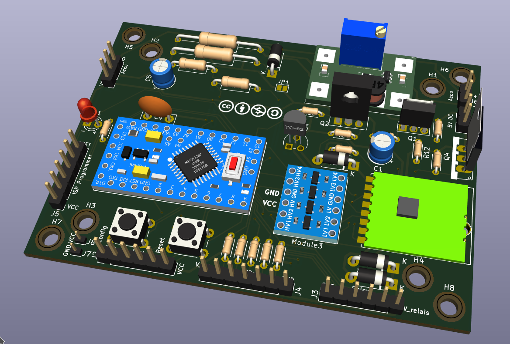

# HB-UNI-SenAct-4-4-SC_DS_FUEL4EP   

**Platine für DIY AsksinPP für**
- 3x Schaltaktor für Betrieb an einem Netzfreischalter
- Akkubetrieb im Standby, automatische Ladeschaltung
- bei Aktivierung eines Aktors wird die Netzspannung zugeschaltet und am Ende wieder abgeschaltet

- geringer Standby-Verbrauch von ca. 1 mA @ 5V Vaccu, an einer weiteren Reduktion wird gearbeitet
- ein handelsübliches [4 Kanal Relais Modul](https://www.ebay.de/itm/155095219126) wird mit Distanzhaltern "huckepack" auf die Basisplatine montiert
	+ bitte darauf achten, dass das Relais-Modul den Aufdruck [P2H1588A0](./PNGs/4-Relais Modul_top_view.png) hat, da Module mit unterschiedlichen Maßen im Handel verfügbar sind.
	+ die Außenmaße des Relais-Moduls sollten 72,2 mm x 52 mm betragen
- ein STL-Modell eines 3D-druckbaren Gehäuses wird mitgeliefert, die Außenmaße des gedruckten Gehäuses sind 20,8 cm (Breite) x 13,3 cm (Tiefe) x 6,8 cm /(Höhe).
- 3x Einbausteckdosen 45 mm x 45 mm, z.B. DELOCK 81321 Easy 45 Schutzkontakt-Steckdose, werden an der Rückseite des Gehäuses angebracht
- **diese Schaltung und Platine darf ausschließlich von ausgebildeten elektrischen Fachkräften verwendet werden, siehe Disclaimer unten!**
- als passende Sketche stehen zur Verfügung:
	+ [HB-UNI-SenAct-4-4-SC_DS.ino](../../sketches/HB-UNI-SenAct-4-4-SC_DS/)
		* Abfrage der Gerätetasten durch 'Polling'
	+ [HB-UNI-SenAct-4-4-RC_DS.ino](../../sketches/HB-UNI-SenAct-4-4-RC_DS/)
		* Gerätetasten lösen einen Interrupt aus
	- Fragen und Rückmeldungen per PN bei [FUEL4EP](https://homematic-forum.de/forum/ucp.php?i=pm&mode=compose&u=20685) im Homematic Forum nachfragen.
- die Platine V1.5 behebt Fehler, die bei der Validierung eines Prototypen festgestellt und korrigiert wurden. Bitte **keine** Platinen der Versionen V1.0 bis V1.4 verwenden.
- ein passendes 3D-druckbares Gehäuse ist im STL Format und openSCAD Format [hier](./3D_Printer/case/) zu finden

	+ ein 3D Druck wurde damit erfolgreich durchgeführt, ein Prototyp ist erfolgreich aufgebaut und weitgehend validiert worden, siehe entsprechende Bilder im Verzeichnis [PNGs](./PNGs)
- **wichtige Aufbauhinweise:**
- die Materiallisten sind unter [BOM](./BOM) zu finden
    + zuerst die Niederspannungsplatine HB-UNI-SenAct-4-4-SC_DS_FUEL4EP_PCB Schritt für Schritt aufbauen, in Betrieb nehmen und testen:
	    * der Schaltplan der Platine ist [hier](./schematics/HB-UNI-SenAct-4-4-SC_DS_FUEL4EP_PCB.pdf) oder in der bereitgestellten KiCAD-Datenbasis
        + für den Arduino Pro Mini und den CC1101 Tranceiver **vor Einbau** in einem externen Testbed den Ruhestrom prüfen (<10uA) und einen Frequenztest durchführen!
        + das 'Huckepack'-4-Kanal-Relaismodul noch nicht anbringen
    - die Ausgangsspannung des Aufwärtsreglers HW-668 **vor dem Einbau** auf 7,3 Volt einstellen. Dabei eine Eingangsspannung von 5 Volt verwenden.
    - das Schaltnetzteil TIW 06-105 mit dem [3D gedruckten Stift im Gehäuseunterteil fixieren](./PNGs/internal_3.png). Vorher die Netzanschlussleitung des Schaltnetzteils auf die benötigte Länge kürzen und abisolieren.
    - das [4-fach AA Batteriefach](https://www.amazon.de/Batteriehalter-Mignon-Akkuhalter-Batteriefach-Schalter-4x-AA/dp/B0761TSC32?th=1) **unbedingt** mit dem Schalter nach [unten](./PNGs/internal_1.png) in das vorgesehene Fach platzieren, sonst werden die Anschlussdrähte beschädigt und es droht ein Kurzschluss der Akkus!
    + die 230V Schaltungsteile erst dann anschließen, wenn der Rest vollständig geprüft wurde und die Software alle notwendigen Funktionen zeigt.
        * als Erstes dann das 'Huckepack'-4-Kanal-Relaismodul anbringen und nur die Steuersignale verbinden, noch keine 230V Spannungen an den Relaisausgängen anschließen
        * dann die Funktion testen
        * falls manche LEDs (z.B. orange, blau oder pinke LEDs) zu hell im Vergleich zu den anderen LEDs leuchten sollten, bitte einen größeren Vorwiderstand wählen, z.B. 4.7 kOhm. Der vergrößerte Vorwiderstand kann auch in die 'fliegende' Vorverdrahtung der Gehäusevorderwand eingelötet werden.
        * pinke LED benötigen einen ca. 10kOhm Vorwiderstand
        * blaue LEDs benötigen einen ca. 4,7kOhm Vorwiderstand
        * erst als Letztes die 230V Verdrahtung mit der gebotenen Vorsicht anbringen
        * den Nullleiter innerhalb des Gehäuses mit einer 5-fach Wago-Klemme WAGO 221-415 (Reichelt) aus fünf Segmenten herstellen, die zwischen Platine und den Einbausteckdosen platziert wird.
        * bitte nicht vergessen, eine Sicherung einzuschrauben
        * alle Netzleitungen mit 1,5 mm2 Leitungen durchführen
        * alle Netzverbindungen spannungsfrei mit einem Ohmmeter auf Korrektheit und Niederohmigkeit prüfen
        * alle Schrauben, vor allem die an den Einbausteckdosen und an den Relaiskontakten, fest anziehen. Nach erfolgtem Aufbau nochmals auf Festigkeit prüfen.
        * die Anschlüsse an die Kaltgerätebuchse löten
        * Einbausteckdosen und Kaltgerätebuchse in die Gehäuserückwand einkleben
        * bitte darauf achten, dass Nullleiter und Phase entsprechend des [Schaltplans](./schematics/HB-UNI-SenAct-4-4-SC_DS_FUEL4EP_case.pdf) angeschlossen werden. Die Phase muss jeweils mit den Relais geschaltet werden. Bitte den Stecker des Kaltgerätekabels so in die Steckdose stecken, dass diese Zuordnung erhalten bleibt. 
        * sollte die blaue LED D1 bei Dunkelheit periodisch leicht glimmen, dann bitte einen 0,5W 220kOhm Widerstand, wie im [Schaltplan](./schematics/HB-UNI-SenAct-4-4-SC_DS_FUEL4EP_case.pdf) des Gehäuses angegeben, einlöten.
        * sollte die blaue LED D1 bei Dunkelheit dauerhaft glimmen, dann bitte einen 0,22uF 250V K X2 Kondensator die blaue LED D1 bei Dunkelheit. Es darf nur ein für 250V geeigneter Entstörkondensator verwendet werden!
        * gegebenenfalls Zugentlastungen für das Netzkabel anbringen!

	
## Versionen
- KiCad Schaltplan-Editor Version: 6.0.11-2627ca5db0 unter Kubuntu22.04.1
- KiCad Leiterplatteneditor Version: 6.0.11-2627ca5db0 unter Kubuntu22.04.1
- PCB Version 1.6:  KiCAD 6 bedingte Verbesserungen der Datenbasis
- Schematics  1.5

## Wichtige Sicherheitshinweise

- bitte die maximale Strombelastbarkeit der Relais beachten, siehe Aufdruck:

- auch bei rein ohmschen Lasten sollte die maximale Strombelastbarkeit der Relais nicht ausgereizt werden.
- bei induktiven Lastanteilen sollte weniger als die Hälfte des spezifizierten Maximalstroms zugrunde gelegt werden.  Bitte lesen Sie dazu das Datenblatt des Relais oder fragen Sie Ihre Elektrofachkraft.
- während einer längeren Abwesenheit sollte der Netzstecker der Geräts gezogen werden
- die Schaltsignale für die Relais sind **nicht** verschlüsselt. Daher bitte eine Lasten anschließen, die eventuell einen Brand auslösen könnten.
- sollte die Homematic/RaspberryMatic-Zentrale  vom Internet aus erreichbar sein, darf dieser Schalter nicht eingesetzt werden! Für die Sicherheit ist der Nutzer alleine verantwortlich!
- die automatische Ladeschaltung ist zur Zeit noch nicht in Software implementiert! Der Nutzer ist für den korrekten Ladezustand der Akkus verantwortlich.
- ein automatische Ladeschaltung wird in Zukunft als Update zur Verfügung gestellt werden. Das kann aber noch eine Weile dauern ..

## Fernsteuerung der Aktorkanäle mit Apple iPAD

- das Ein- und Ausschalten von Lasten kann z.B. mit Kurzbefehlen (ShortCuts) auf einem Apple iPAD gesteuert werden, siehe [hier](./control_by_iPAD_shortcuts)

## Disclaimer

- aufgrund der im Gerät frei geführten Netzspannung und des Netzspannungsanschlusses darf die Installation nur von Fachkräften durchgeführt werden, die aufgrund ihrer Ausbildung dazu befugt sind.
- die einschlägigen Sicherheits- und VDE-Bestimmungen sind unbedingt zu beachten. Durch eine unsachgemäße Installation können Sach- und Personenschäden verursacht werden, für die der Errichter haftet.
- Installationsarbeiten sowohl am primärseitigen Netzanschluss als auch am Sekundäranschluss dürfen nur **im stromlosen Zustand erfolgen. Dabei sind alle einschlägigen Vorschriften des Installationshandwerks zu beachten!** 
- alle 230 V Spannung führenden Leitungen und Lötanschlüsse sind im spannungslosen Zustand fachgerecht mit Isolationsband vor Berührungen zu schützen
- die Nutzung der hier veröffentlichten Inhalte erfolgt vollständig auf eigenes Risiko und ohne jede Gewähr

## Lizenz 

**Creative Commons BY-NC-SA** 
Give Credit, NonCommercial, ShareAlike

 This work is licensed under a <a rel="license" href="http://creativecommons.org/licenses/by-nc-sa/4.0/">Creative Commons Attribution-NonCommercial-ShareAlike 4.0 International License</a>.

-EOF
	

