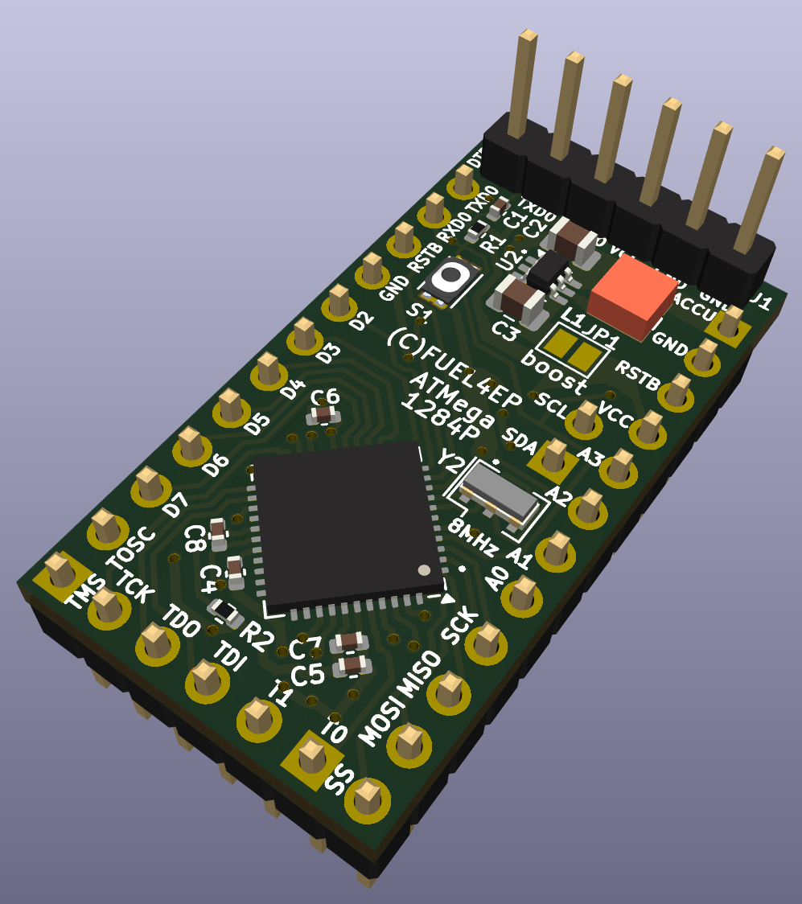
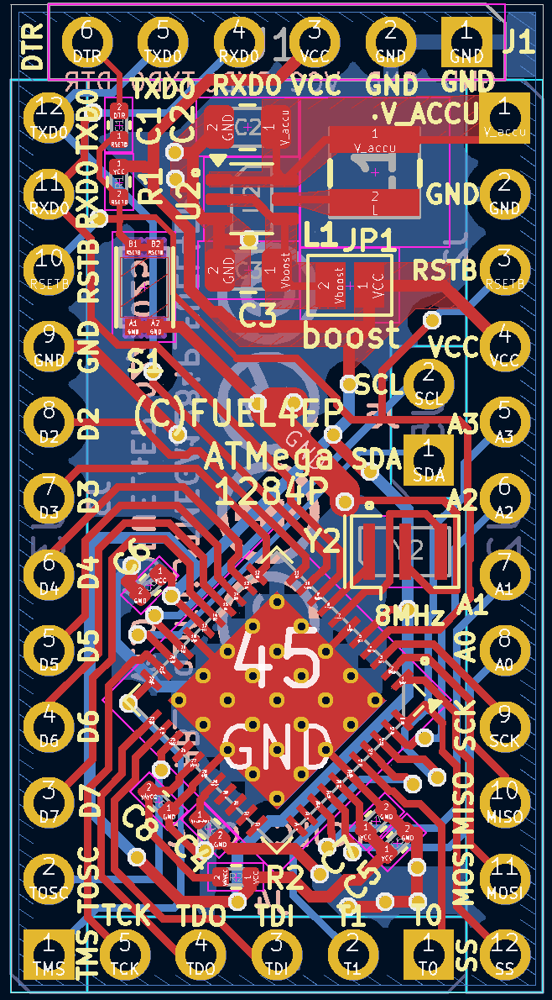
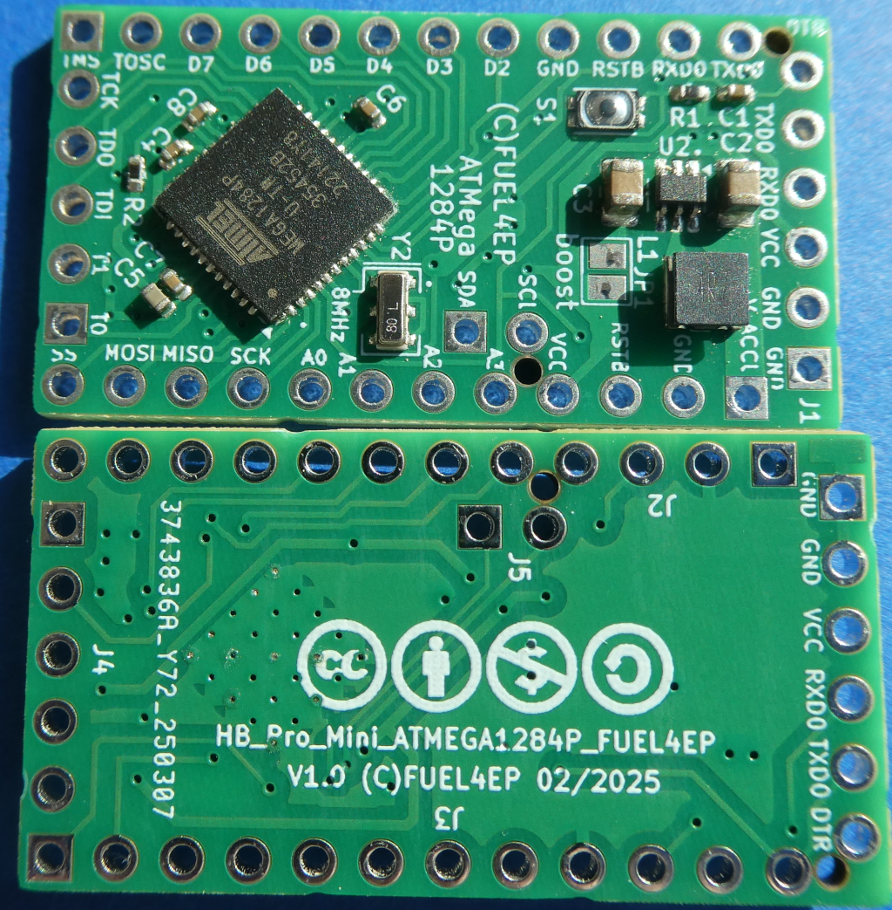
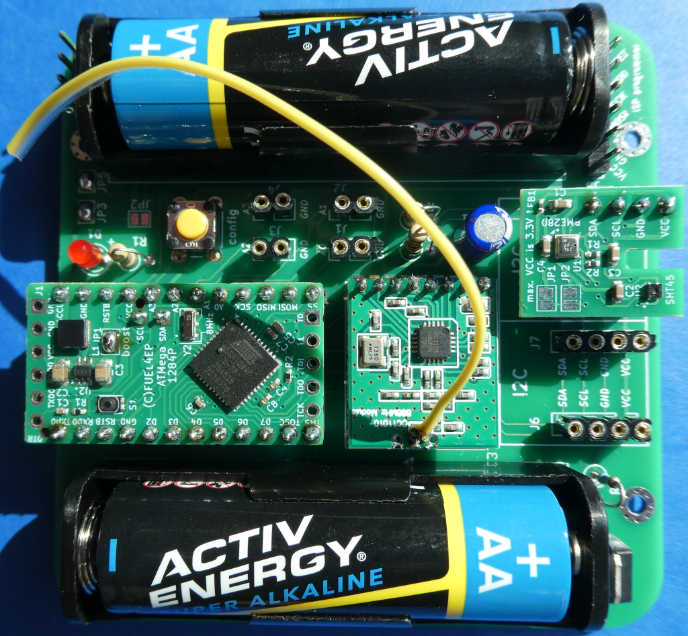

# HB_Pro_Mini_ATMEGA1284P_FUEL4EP  

## Arduino Pro Mini Klon mit der 4-fachen Größe von Flash, SRAM und EEPROM Speicher eines ATmega1284p Prozessorbausteins verglichen mit dem Standard ATmega328p Prozessorbaustein

)

- [ATmega1284p](https://ww1.microchip.com/downloads/en/DeviceDoc/Atmel-42719-ATmega1284P_Datasheet.pdf) statt ATmega328p
- ATmega1284p im 7mmx7mm 44 Pin VQFN Gehäuse
- löst die meisten Speicherprobleme, wenn ein Sketch nicht mehr in einen ATMega328P passt:
	+ 128kByte Flash Speicher (4x vom ATmega 328p)
	+ 16KByte SRAM (4x vom ATmega 328p)
	+ 4 kByte EEPROM (4x vom ATmega 328p)
- weitere Verbesserungen gegenüber dem Standard ATMega328P basierenden Pro Mini:
	+ ein zusätzlicher UART
	+ ein zusätzlicher externer Interrupt
	+ ein zusätzlicher 16-bit Timer	
	* JTAG Schnittstelle
- optimiert für AsksinPP DIY Projekte
	+ sehr geringer Ruhestrom ohne Auslöten des Spannungsreglers und der LEDs
- abgeleitet vom Sparkfun Electronic's Arduino-Pro-Mini (Rev 14)
	+ weitgehend pinkompatibel
	+ kein Spannungsregler
	+ keine LEDs
	+ 8 MHz Resonator
- optional zusätzlicher Boost-Konverter
	+ 1,5V..5.5V Eingangsspannung auf 3,3V Versorgungsspannung
	+ [TPS61221](https://www.ti.com/lit/ds/symlink/tps61221.pdf?ts=1739637159741&ref_url=https%253A%252F%252Fwww.ti.com%252Fproduct%252Fde-de%252FTPS61221) basierend
- weitgehend pin- und softwarekompatibel zum  [Pro Mini XL 1284P V2](https://prominimicros.com/)
	+ keine LED
	+ 8 MHz Resonator statt 20 MHz Quarz
	+ 3.3V Betriebsspannung mit optionalem Boost-Konverter
	+ max. 5,5V Betriebsspannung ohne optionalem Boost-Konverter
	+ die [Anleitungen für den Pro Mini XL 1284P V2](https://prominimicros.com/) passen weitgehend auch für HB_Pro_Mini_ATMEGA1284P_FUEL4EP
- passende Arduino Bibliothek:[ATmega1284P Arduino MightyCore Bibliothek](https://github.com/MCUdude/MightyCore)

- MightyCore ATMega1284P VQFN44 Standardpinbelegung (=TQFP44)

- [hier die Pinbelegung](./PinOut/) als Tabelle

- passend zu folgenden AsksinPP Basisplatinen (wird später durch weitere Platinen ergänzt)
	* [HB-UNI-SEN-BATT_FUEL4EP](https://github.com/FUEL4EP/HomeAutomation/tree/master/AsksinPP_developments/PCBs/HB-UNI-SEN-BATT_FUEL4EP)

## Platinenmaße

- Platinengröße: 17.78 mm x 33.02 mm (0.7" x 1.3")
- Platinendicke: 1,6 mm (bei der Bestellung bei JLCPCB auswählen)

## Stromlaufplan

- ist [hier](./Schematics/HB_Pro_Mini_ATMEGA1284P_FUEL4EP.pdf)

## Status

- diese Platine wurde in der Version 1.0 bei JLCPCB erfolgreich gefertigt und assembliert:

- für die Systemvalidierung wude als Hardware verwandt:
	+ [HB-UNI-SEN-BATT_FUEL4EP V1.5](https://github.com/FUEL4EP/HomeAutomation/tree/master/AsksinPP_developments/PCBs/HB-UNI-SEN-BATT_FUEL4EP)
	+ [HB_Pro_Mini_ATMEGA1284P_FUEL4EP V1.0](https://github.com/FUEL4EP/HomeAutomation/tree/master/AsksinPP_developments/PCBs/HB_Pro_Mini_ATMEGA1284P_FUEL4EP)
	+ [I2C_Module_SHT45_BME280_small_FUEL4EP V1.5](https://github.com/FUEL4EP/HomeAutomation/tree/master/AsksinPP_developments/PCBs/I2C_Module_SHT45_BME280_small_FUEL4EP)
	+ getestet wurden folgende Spannungeversorgungen:
		* 1x AA Alkaline Batterie
		* 2x AA Alkaline Batterie
		* 1x NiMH AA Akkumulator
		* 2x NiMH AA Akkumulator
- für die Systemvalidierung wurde als Software verwendet:
	+ [HB-UNI-Sensor1-THPD-SHT45_BME280](https://github.com/FUEL4EP/HomeAutomation/tree/master/AsksinPP_developments/sketches/HB-UNI-Sensor1-THPD-SHT45_BME280)
	+ die Stromaufnahme im Schlafmodus mit 1x AA Alkaline Battterie beträgt ca. 22uA.

## Rückmeldungen

- und Verbesserungsvorschläge sind willkommen.
- PN an [FUEL4EP](https://homematic-forum.de/forum/ucp.php?i=pm&mode=compose&u=20685) im Homematic Forum oder als Github Issue

### KiCAD Plugin
- für die Erzeugung der JLCPCB Produktionsdaten wurde das Plugin [KiCAD JLCPCB tools](https://github.com/bouni/kicad-jlcpcb-tools) verwendet.

## Daten für die Bestellung bei JLCPCB

- die Daten für die Bestellung liegen im Verzeichnis [./jlcpcb/production_files/](./jlcpcb/production_files/)
- Gerber-Daten als Zip-Datei
- BOM- und CPL-Daten als CSV-Datei

## lokale Installation des Github Releases auf Deinem Computer

- gehe bitte in Dein Zielinstallationsverzeichnis, wo Du mit der HB_Pro_Mini_ATMEGA1284P_FUEL4EP Platine mit KiCAD arbeiten möchtest

  - gebe dort 'git clone https://github.com/FUEL4EP/HomeAutomation.git' ein
	  + damit lädst Du mein [Sammelrepository](https://github.com/FUEL4EP/HomeAutomation) für alle meine auf Github freigegebenen HomeBrew Entwicklungen herunter.
  - dann findest Du ein neues Verzeichnis 'HomeAutomation' auf Deinem Rechner, das alle meine auf Github freigebenen Entwicklungen enthält, siehe [README.md](https://github.com/FUEL4EP/HomeAutomation/blob/master/README.md)
  	+ mache bitte regelmäßig ein Update mit 'git pull'
 -	die Platine HB_Pro_Mini_ATMEGA1284P_FUEL4EP findest Du unter './HomeAutomation/tree/master/AsksinPP_developments/PCBs/HB_Pro_Mini_ATMEGA1284P_FUEL4EP'
 
- alternativ kann vom Github [Sammelrepository](https://github.com/FUEL4EP/HomeAutomation) die ZIP-Datei HomeAutomation-master.zip heruntergeladen und auf dem lokalen Rechner ausgepackt werden. Bitte dann regelmäßig auf Github nach Updates schauen.

### Hinweise
* Achtung: Kein Überspannungsschutz oder Verpolungsschutz vorhanden
* bei der Nutzung des JLCPCB SMT Bestückungsservice ist darauf zu achten, dass **alle** benötigten SMD Bauteile als im Lager **verfügbar** angezeigt werden. Sonst bitte **NICHT** bestellen!

### KiCAD Plugin
- für die Erzeugung der JLCPCB Produktionsdaten wurde das Plugin [KiCAD JLCPCB tools](https://github.com/bouni/kicad-jlcpcb-tools) verwendet.

## Bestellen von Platinen

- die Platine kann direkt bei JLCPCB bestellt und dort auch assembliert werden
- die notwendigen Produktionsdaten stehen [hier](./jlcpcb/production_files/)
- die folgenden Bauteile müssen [vorab bei JLCPCB bestellt werden](https://jlcpcb.com/help/article/53-what-is-jlcpcb-parts-pre-order-service):
	+ [TI TPS61221DCKT](https://jlcpcb.com/partdetail/TexasInstruments-TPS61221DCKT/C2865756) 
	+ [Murata LQH3NPN4R7MMEL 4.7 uH SMD Induktivität](https://jlcpcb.com/partdetail/MurataElectronics-LQH3NPN4R7MMEL/C576538)
	+ [Panasonic EVPBB0AAB000 Tactile Switch SPST-NO Top Actuated Surface Mount](https://jlcpcb.com/partdetail/Panasonic-EVPBB0AAB000/C558803)
	+ [Murata CSTNE8M00GH5L000R0 8MHz 33pF 40Ω SMD3213-3P Ceramic Resonators ROHS](https://jlcpcb.com/partdetail/946709-CSTNE8M00GH5L000R0/C882602)
- bei der Nutzung des JLCPCB SMT Bestückungsservice ist darauf zu achten, dass **alle** benötigten SMD Bauteile als im Lager **verfügbar** angezeigt werden. Sonst bitte **NICHT** bestellen!

## Sammelbestellung

- wer Interesse an einer gemeinsamen Bestellung von Platinen und/oder Gehäusen bei JLCPCB hat, fragt bitte per per PN bei bei [FUEL4EP](https://homematic-forum.de/forum/ucp.php?i=pm&mode=compose&u=20685) an.
- wenn genügend Interesse (>= 20 bestückte Platinen und/oder 3D gedruckten Gehäusen) zustande kommt, biete ich an, Platinen  und Gehäuse bei JLCPCB zu bestellen und gegen Vorkasse per PayPal zum Selbstkostenpreis + Versandkosten innerhalb Deutschland + 3 Euro Aufwandspauschale pro Versand weiterzuverkaufen. Vor einer Bestellung wird ein Angebot bei JLCPCB eingeholt und an die Interessenten zur Zustimmung verteilt.
- je mehr sich an einer Sammelbestellung beteiligen, desto geringer werden die einmaligen Kosten wie Rüstkosten, Versand, etc.

## Versionsverlauf

-   V1.0 15. Feb 2025: Initiale Veröffentlichung auf Github
- KiCad Schaltplan-Editor Version: 8.0.8-8.0.8-0~ubuntu22.04.1, release build unter Kubuntu22.04.4
- KiCad Leiterplatteneditor Version: 8.0.8-8.0.8-0~ubuntu22.04.1, release build unter Kubuntu22.04.4
- PCB Version 1.0
- Schematics  1.0

## Disclaimer

-   die Nutzung der hier veröffentlichten Inhalte erfolgt vollständig auf eigenes Risiko und ohne jede Gewähr.

## Lizenz 

**Creative Commons BY-NC-SA** 
Give Credit, NonCommercial, ShareAlike

 This work is licensed under a <a rel="license" href="http://creativecommons.org/licenses/by-nc-sa/4.0/">Creative Commons Attribution-NonCommercial-ShareAlike 4.0 International License</a>.

-EOF
	

