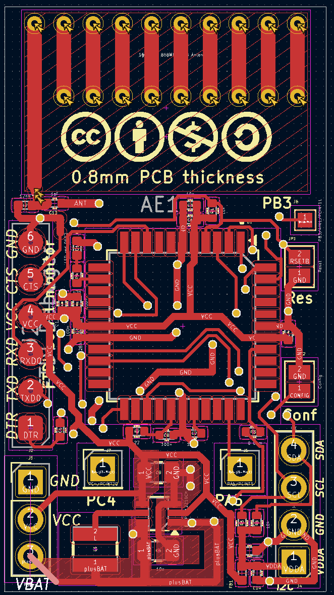
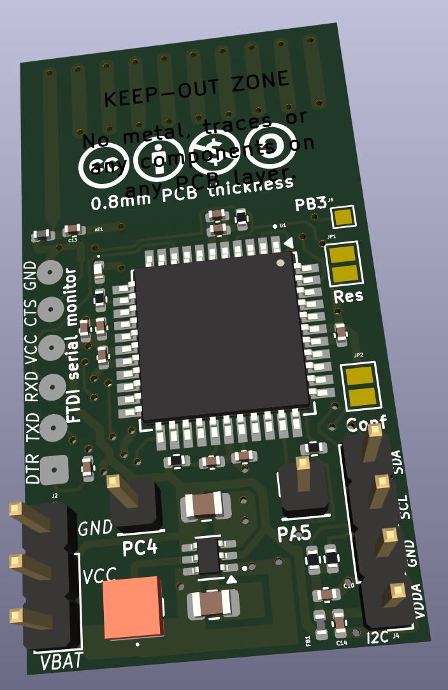
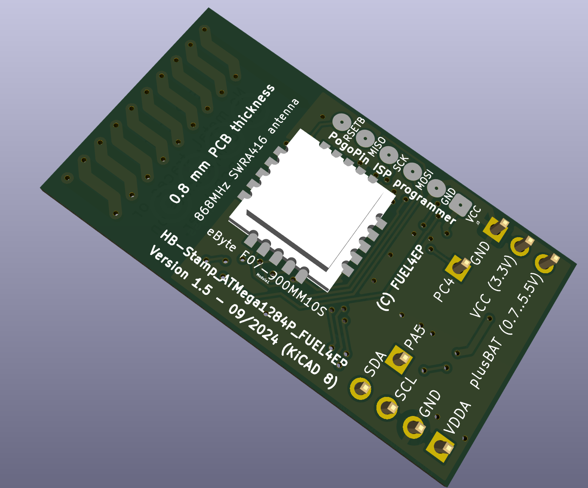

# HB_Stamp_ATMega1284P_FUEL4EP  

**kleine Platine für DIY AsksinPP Geräte mit I2C und 3x IO-Pins**
- Platinenmaße 22 mm x 40 mm
- Platinendicke: 0.8 mm (bitte nicht ändern)
- I2C-Steckerleistenanschluss für I2C-Module
- 3 weitere IO-Pins anschließbar: PC4, PA5, PB3
- optionaler Hochsetzwandler 1,2V .. 1,5V auf 3,3V mit TI TPS61221 für Betrieb mit 1x Batterie
- Versorgung mit 1x AA-Batterie oder 1x NiMH-Akkumulator möglich
- alternativ Versorgung mit 2x AA Batterien ohne Hochsetzwandler
- [integrierte 868 MHz PCB Antenne](https://www.ti.com/lit/an/swra416/swra416.pdf)
- 10 mm x 10 mm kleines Sendemodul [eByte E07 900MM10S](https://datasheet.lcsc.com/lcsc/2305061757_Chengdu-Ebyte-Elec-Tech-E07-900MM10S_C5844212.pdf) auf Platinenrückseite von Hand verlötet
- SMD TQFP-44 [ATMega1284P](https://ww1.microchip.com/downloads/en/DeviceDoc/doc8059.pdf) mit 128kByte Programmspeicher, 16kByte SRAM, 4kByte EEPROM
	+ ohne Quarz, Betrieb mit 8 MHz interner RC-Oszillator
	+ erlaubt Speicherung der Temperaturwerte über 7 Tage im RAM für die Bildung von gleitenden Mittelwerten 
- Programmierung und Serial Monitor mit 2,54 mm Pogo-Pin-Adapter
- alle SMD Bausteine sind mit dem JLCPCB SMT Bestückungsservice kostengünstig und qualitativ hochwertig bestückbar
- die JLCPCB Assemblierung des Funkmoduls eByte E07-900MM10S geht nur als sehr teures Standard PCBA, daher wird eine Verlötung von Hand empfohlen

## Credits

- mein besonderer Dank geht an papa für [AsksinPP](https://github.com/pa-pa/AskSinPP) und [Jérôme jp112sdl](https://github.com/jp112sdl) für die stete Unterstützung.

## Platine wurde noch nicht bei JLCPCB gefertigt und auch noch nicht validiert

- entwickelt mit KiCAD 6.0.11
- zur Zeit eine Vorabfreigabe
- die Platine wurde noch nicht bei JLCPCB gefertigt und ist daher noch nicht validiert

## Eigenschaften

- kompletter Datensatz für KiCAD 6 auf Github verfügbar:
    + 'git clone https://github.com/FUEL4EP/HomeAutomation.git' oder als [ZIP-Datei](https://github.com/FUEL4EP/HomeAutomation/archive/refs/heads/master.zip)
    + die Platinendaten sind dann unter 'HomeAutomation/AsksinPP_developments/PCBs/HB_Stamp_ATMega1284P_FUEL4EP' direkt mit KiCAD aufrufbar
- neue Eigenschaften:
    + SMD Bestückung, wo möglich
    + alle SMD Bausteine sind mit dem JLCPCB SMT Bestückungsservice kostengünstig und qualitativ hochwertig bestückbar
    + JLCPCB BOM and CPL Dateien für SMT Service werden [bereitgestellt](./jlcpcb/production_files)
    + die AsksinPP Reset- und Config-Taster sind aus Platzgründen als Platinenjumper ausgeführt. Bitte geeignet kurz überbrücken, z.B. mit einem Schraubendreher

### Benötigte Bauteile:

- bei Anspruchsnahme des SMT Bestückungsservice von JLCPCB ist nur noch das Funkmodul eByte E07-900MM10S von Hand auf die Platinenrückseite zu löten
- die JLCPCB Assemblierung des Funkmoduls eByte E07-900MM10S geht nur als sehr teures Standard PCBA, daher wird eine Verlötung von Hand empfohlen

### Aufbauhinweise

- es wird dringend angeraten, als ersten Schritt der Inbetriebnahme einen Frequenztest durchzuführen.
    
### Passende AsksinPP Projekte von FUEL4EP
   + [HB-UNI-Sensor1-THPD-SHT45](https://github.com/FUEL4EP/HomeAutomation/tree/master/AsksinPP_developments/sketches/HB-UNI-Sensor1-THPD-SHT45) (wird bald veröffentlicht werden)
    

### Anschluss eines FTDI Debuggers und/oder ISP-Programmiergeräts

- Anschluss über 6-Pin 2,54 mm Pogo-Pin-Adapter auf der Platinenoberseite (FTDI Debugger) bzw. der Platinenunterseite (ISP Programmierer)
- bitte vor Anschluss prüfen, dass die korrekte Platinenseite verwendet wird

### Passendes Gehäuse
- in Arbeit, wird später hier bereitgestellt

### Hinweise
* Achtung: Kein Überspannungsschutz oder Verpolungsschutz vorhanden
* bei der Nutzung des JLCPCB SMT Bestückungsservice ist darauf zu achten, dass **alle** benötigten SMD Bauteile als im Lager **verfügbar** angezeigt werden. Sonst bitte **NICHT** bestellen!

### KiCAD Plugin
- für die Erzeugung der JLCPCB Produktionsdaten wurde das Plugin [KiCAD JLCPCB tools](https://github.com/bouni/kicad-jlcpcb-tools) verwendet.

## Bestellen von Platinen

- die Platine kann direkt bei JLCPCB bestellt und dort auch assembliert werden
- die notwendigen Produktionsdaten stehen [hier](./jlcpcb/production_files/)
- die folgenden Bauteile müssen [vorab bei JLCPCB bestellt werden](https://jlcpcb.com/help/article/53-what-is-jlcpcb-parts-pre-order-service):
	+ [TI TPS61221DCKT](https://jlcpcb.com/parts/componentSearch?searchTxt=TPS61221) (zur Zeit teuer, ist aber meist billiger als angegeben)
	+ Murata LQH3NPN4R7MM0L 4.7 uH SMD Induktivität
- die JLCPCB Assemblierung des Funkmoduls eByte E07-900MM10S geht nur als das sehr teure Standard PCBA, daher wird eine Verlötung von Hand empfohlen
- **die Platine ist noch nicht durch einen Prototypen evaluiert!**

## Disclaimer

-   die Nutzung der hier veröffentlichten Inhalte erfolgt vollständig auf eigenes Risiko und ohne jede Gewähr.

## Versionsverlauf

-   V1.0 15. Dez 2023: Initiale Vorabfreigabe
-	S V1.1 15. Dez 2023: SHT45-AD1B-R2 statt SHT45-AD1F, da JLCPCB SHT45-AD1F
nicht mehr assembliert
-	S V1.2	 08. Jan 2024: Korrektur  von falschen LCSC-Teiloenummern für R1, D1 und R4
- 	KiCad Schaltplan-Editor   Version: 6.0.11-2627ca5db0 unter Kubuntu22.04.1
- 	KiCad Leiterplatteneditor Version: 6.0.11-2627ca5db0 unter Kubuntu22.04.1
- 	PCB Version 1.1
- 	Schematics  1.2

## Lizenz 

**Creative Commons BY-NC-SA** 
Give Credit, NonCommercial, ShareAlike

 This work is licensed under a <a rel="license" href="http://creativecommons.org/licenses/by-nc-sa/4.0/">Creative Commons Attribution-NonCommercial-ShareAlike 4.0 International License</a>.

-EOF
	

