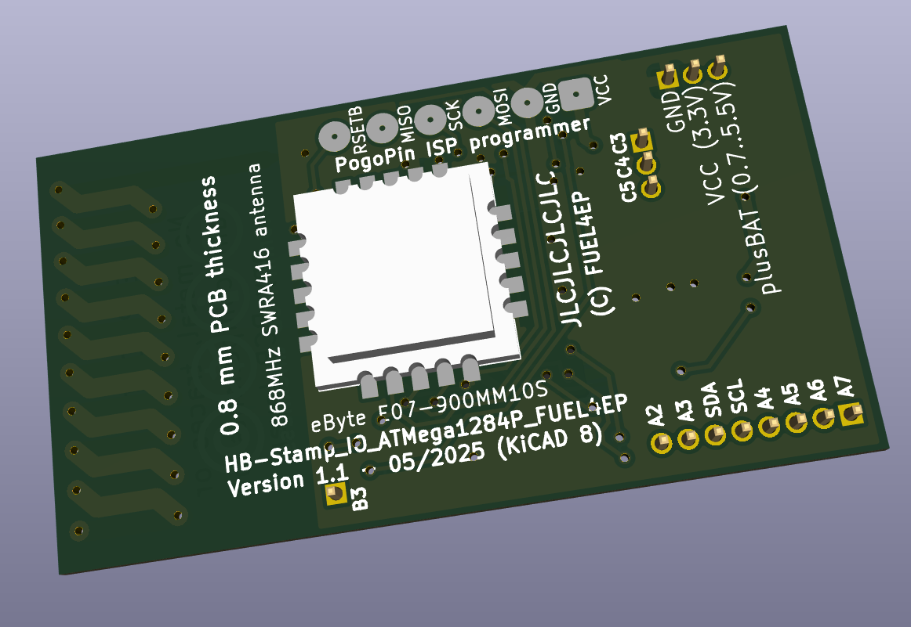

# HB_Stamp_IO_ATMega1284P_FUEL4EP  

**kleine Platine für DIY AsksinPP Geräte mit 8x, 3x,  und 1x IO-Pins**
- Platinenmaße 22 mm x 40 mm
- Platinendicke: 0.8 mm (bitte nicht ändern, da Antenne sonst nicht funktioniert)
- 3 IO-Steckerleistenanschlüsse RM 1,27mm für Erweiterungsplatinen
- optionaler Hochsetzwandler 1,2V .. 1,5V auf 3,3V mit TI TPS61221 für Betrieb mit 1x Batterie
- Versorgung mit 1x AA-Batterie (1,5V) oder 1x NiMH-Akkumulator (1,2V) möglich
- alternativ Versorgung mit 2x AA Batterien ohne Hochsetzwandler
- [integrierte 868 MHz PCB Antenne](https://www.ti.com/lit/an/swra416/swra416.pdf)
- 10 mm x 10 mm kleines Sendemodul [eByte E07 900MM10S](https://datasheet.lcsc.com/lcsc/2305061757_Chengdu-Ebyte-Elec-Tech-E07-900MM10S_C5844212.pdf) auf Platinenrückseite von Hand verlötet
- SMD TQFP-44 [ATMega1284P](https://ww1.microchip.com/downloads/en/DeviceDoc/doc8059.pdf) mit 128kByte Programmspeicher, 16kByte SRAM, 4kByte EEPROM
	+ ohne externen Quarz, Betrieb mit 8 MHz internem RC-Oszillator
		+ bitte dies unbedingt bei der Programmierung von Fuses berücksichtigen!
- Programmierung und Serial Monitor mittels 2,54 mm Pogo-Pin-Adapter, Anschlüsse sind an der gleichen Stelle auf gegenüberliegenden Platinenseiten
- alle SMD Bausteine sind mit dem JLCPCB SMT Bestückungsservice kostengünstig und qualitativ hochwertig bestückbar
- die JLCPCB Assemblierung des Funkmoduls eByte E07-900MM10S geht nur als sehr teures Standard PCBA, daher wird eine Verlötung von Hand empfohlen

- Bilder der bei JLCPCB gefertigten und assemblierten Prototypplatine V1.0

- das eByte E07 900MM10S Sendemodul muss aus Kostengründen von Hand aufgelötet werden

## Credits

- mein besonderer Dank geht an papa für [AsksinPP](https://github.com/pa-pa/AskSinPP) und [Jérôme jp112sdl](https://github.com/jp112sdl) für die stete Unterstützung.

## Status

- ein Prototyp der Platine V1.0 wurde bei JLCPCB gefertigt. Der zugehörige AsksinPP-Sketch ist in Entwicklung. Ein Frequenztest-Sketch lief erfolgreich durch, siehe unten.

## Eigenschaften

- kompletter Datensatz für KiCAD 8 auf Github verfügbar:
    + 'git clone https://github.com/FUEL4EP/HomeAutomation.git' oder als [ZIP-Datei](https://github.com/FUEL4EP/HomeAutomation/archive/refs/heads/master.zip)
    + die Platinendaten sind dann unter 'HomeAutomation/AsksinPP_developments/PCBs/HB_Stamp_IO_ATMega1284P_FUEL4EP' direkt mit KiCAD aufrufbar
- neue Eigenschaften:
    + SMD Bestückung, wo möglich
    + alle SMD Bausteine sind mit dem JLCPCB SMT Bestückungsservice kostengünstig und qualitativ hochwertig bestückbar
    + JLCPCB BOM and CPL Dateien für SMT Service werden [bereitgestellt](./jlcpcb/production_files)
    + die AsksinPP Reset- und Config-Taster sind aus Platzgründen als Platinenjumper ausgeführt. Bitte geeignet kurz überbrücken, z.B. mit einem Schraubendreher

### Benötigte Bauteile:

- bei Anspruchsnahme des SMT Bestückungsservice von JLCPCB ist nur noch das Funkmodul eByte E07-900MM10S von Hand auf die Platinenrückseite zu löten
- die JLCPCB Assemblierung des Funkmoduls eByte E07-900MM10S geht nur als sehr teures Standard PCBA, daher wird eine Verlötung von Hand empfohlen

### Passende Erweiterungsplatinen

- [HB_Stamp_IO_EXT_LEDs_Buttons_FUEL4EP](https://github.com/FUEL4EP/HomeAutomation/tree/master/AsksinPP_developments/PCBs/HB_Stamp_IO_EXT_LEDs_Buttons_FUEL4EP)

### Passende AsksinPP Projekte von FUEL4EP
   + z.B. werden bald hier veröffentlicht [tbd](https://github.com/FUEL4EP/HomeAutomation/tree/master/AsksinPP_developments/sketches/tbd)
   
### Aufbauhinweise

- es wird dringend angeraten, als ersten Schritt der Inbetriebnahme einen Frequenztest durchzuführen. Vorher bitte die Fuses mit avrdude setzen.
- für die Verbindungen mit der Erweiterungsplatine bitte RM1.27 Buchsen und Steckerleisten verwenden

## Setzen der Fuses des ATMega1284P Mikrokontrollers

- **nie die Fuses auf einen externen Quarzoszillator / Resonator umschalten!**
- ein passender avrdude Skript zum Lesen und korrekten Setzen der Fuses mit einem Diamex Prog-S2 ISP Programmer ist [hier](./avrdude/Diamex Prog-S2/avrdude_m1284p_int_RC_8MHz.bsh). 

## Prüfwerkzeuge

- ein Frequenztest ist [hier](./FreqTest_1284P/)

### Anschluss eines FTDI Debuggers und/oder ISP-Programmiergeräts

- Anschluss über 6-Pin 2,54 mm Pogo-Pin-Adapter auf der Platinenoberseite (FTDI Debugger) bzw. der Platinenunterseite (ISP Programmierer)
- bitte vor Anschluss prüfen, dass die korrekte Platinenseite verwendet wird.
- bitte die Beschriftung beachten und vor dem Anlegen eines Pogo-Pin-Adapters querprüfen!
- den ISP-Programmierer auf 3,3V Programmierspannung einstellen.
- zuerst die Fuses mit avrdude setzen
- Bild des Pogo-Pin_Adapters für den FTDI Debugger:

- Bild des Pogo-Pin_Adapters für den Diamex ISP Programmieradapter:

- gegebenenfalls muss die untere Acrylanpressplatte des Pogo-Pin_Adapters z.B. mit einem Dremel verkleinert werden, damit sie an HB_Stamp_IO_ATMega1284P_FUEL4EP angebracht werden kann:

- die Adapterplatine [HB_Stamp_IO_EXT_debug_adapter_FUEL4EP](https://github.com/FUEL4EP/HomeAutomation/tree/master/AsksinPP_developments/PCBs/HB_Stamp_IO_EXT_debug_adapter_FUEL4EP) für das Aufstecken von Erweiterungsplatinen verwenden

### Passendes Gehäuse
	
- ein 3D druckbares Gehäuse wird [hier](./case_HB_Stamp_IO_ATMega1284P_FUEL4EP) bereitgestellt
- die gedruckten Gehäusebauteile werden so ineinander gesteckt:

	
	

### Hinweise
* Achtung: Kein Überspannungsschutz oder Verpolungsschutz vorhanden
* bei der Nutzung des JLCPCB SMT Bestückungsservice ist darauf zu achten, dass **alle** benötigten SMD Bauteile als im Lager **verfügbar** angezeigt werden. Sonst bitte **NICHT** bestellen!

### KiCAD Plugin
- für die Erzeugung der JLCPCB Produktionsdaten wurde das Plugin [KiCAD JLCPCB tools](https://github.com/bouni/kicad-jlcpcb-tools) verwendet.

## Bestellen von Platinen

- die Platine kann direkt bei JLCPCB bestellt und dort auch assembliert werden
- die notwendigen Produktionsdaten stehen [hier](./jlcpcb/production_files/)
- die folgenden Bauteile müssen [vorab bei JLCPCB bestellt werden](https://jlcpcb.com/help/article/53-what-is-jlcpcb-parts-pre-order-service):
	+ [TI TPS61221DCKT](https://jlcpcb.com/parts/componentSearch?searchTxt=TPS61221) (zur Zeit teuer, ist aber meist billiger als zuerst angegeben)
	+ Murata LQH3NPN4R7MMEL 4.7 uH SMD Induktivität
- die JLCPCB Assemblierung des Funkmoduls eByte E07-900MM10S geht nur als das sehr teure Standard PCBA, daher wird eine Verlötung von Hand empfohlen

## Disclaimer

-   die Nutzung der hier veröffentlichten Inhalte erfolgt vollständig auf eigenes Risiko und ohne jede Gewähr.

## Versionsverlauf

-   V1.0   17. Feb 2025: Initiale Vorabfreigabe
- 	KiCad Schaltplan-Editor   8.0.8-8.0.8-0~ubuntu22.04.1, release build unter Kubuntu22.04.1
- 	KiCad Leiterplatteneditor Version: 8.0.8-8.0.8-0~ubuntu22.04.1, release build unter Kubuntu22.04.1
- 	PCB Version 1.0
- 	Schematics  1.0

## Lizenz 

**Creative Commons BY-NC-SA** 
Give Credit, NonCommercial, ShareAlike

 This work is licensed under a <a rel="license" href="http://creativecommons.org/licenses/by-nc-sa/4.0/">Creative Commons Attribution-NonCommercial-ShareAlike 4.0 International License</a>.

-EOF
	

