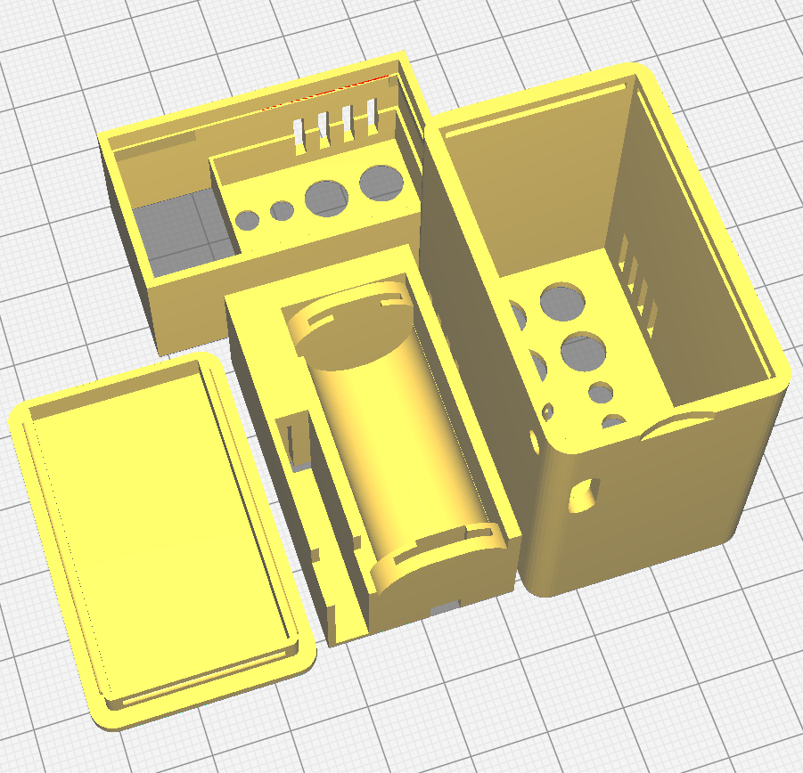

# kleines 3D druckbares Gehäuse für Asksin++ PCB HB_Stamp_IO_ATMega1284P  

- CAD-Dimensionen:
	* Breite: 29,1 mm
	* Höhe: 47,0 mm
	* Tiefe: 44,4 mm
- passend zum Sketch [tbd](https://github.com/FUEL4EP/HomeAutomation/tree/master/AsksinPP_developments/sketches/tbd)
- passend zur Mutterplatine [HB_Stamp_IO_ATMega1284P](https://github.com/FUEL4EP/HomeAutomation/tree/master/AsksinPP_developments/PCBs/HB_Stamp_IO_ATMega1284P)
- passend zur Erweiterungsplatine  [HB_Stamp_IO_EXT_LEDs_Buttons_FUEL4EP](https://github.com/FUEL4EP/HomeAutomation/tree/master/AsksinPP_developments/PCBs/HB_Stamp_IO_EXT_LEDs_Buttons_FUEL4EP)
- 3D druckbares Gehäuse
	+ für Mutterplatine [HB_Stamp_IO_ATMega1284P](https://github.com/FUEL4EP/HomeAutomation/tree/master/AsksinPP_developments/PCBs/HB_Stamp_IO_ATMega1284P) und Erweiterungsplatine  [HB_Stamp_IO_EXT_LEDs_Buttons_FUEL4EP](https://github.com/FUEL4EP/HomeAutomation/tree/master/AsksinPP_developments/PCBs/HB_Stamp_IO_EXT_LEDs_Buttons_FUEL4EP)
	+ für 2/3 AA Mignon NiMH Akku 1,2V 750mAh erhältlich z.B. bei [Amazon](https://www.amazon.de/Sparset-GP75AAH-Mignon-750mAh-wiederaufladbar-gr%C3%BCn/dp/B08HM5DL27)
	+ für Batteriekontakte z.B. von [Amazon](https://www.amazon.de/sourcing-map-Federplatte-Vernickelt-12mmx12mm/dp/B0B1HJHPZJ/ref=asc_df_B0B1HJHPZJ/)
	+ für USB-C NiMH-Lademodul "1S 2S 3S 4S NiMH battery charging board type-c micro usb 5v input charger module charging current 500mA" erhältlich z.B. bei [AliExpress](https://de.aliexpress.com/item/1005005777972846.html)
- bereitgestellt werden:
	+ STL-Druckdateien
	+ openSCAD-Dateien
	+ STEP-Dateien der Mutter- und Erweiterungsplatine
	
# notwendige Softwareinstallation:

- bitte installiere die openSCAD [BOSL](https://github.com/revarbat/BOSL) Bibliothek in das Verzeichnis [openSCAD](./openSCAD), z.B. mit dem Kommando

+	git clone https://github.com/revarbat/BOSL.git

# notwendige Handverdrahtung:
-	mit Flachbandkabel:
	* I2C-Verbindungen zwischen  Mutter- und Erweiterungsplatine
	* Versorgungsleitungen
		* zwischen Lademodul und NiMH-Batteriehalter im Kabelkanal
		* zwischen NiMH-Batteriehalter und Mutterplatine
- 3mm-LED des Lademoduls einlöten

## Credits

- der Batteriehalter wurde abgeleitet aus https://github.com/not-enough-time-for-all-these-projects/18650-holder
- mein Dank geht an 'Not Enough Time For All These Projects'
- das Gehäuse wurde abgeleitet aus https://www.thingiverse.com/thing:2411898 (C)Inhumierer June 30, 2017
- mein Dank geht an 'Inhumierer'

## Disclaimer

-   die Nutzung der hier veröffentlichten Inhalte erfolgt vollständig auf eigenes Risiko und ohne jede Gewähr.

## Versionsverlauf

- 2025 April 13: initiale Freigabe auf Github

## Lizenz 

**Creative Commons BY-NC-SA** 
Give Credit, NonCommercial, ShareAlike

 This work is licensed under a <a rel="license" href="http://creativecommons.org/licenses/by-nc-sa/4.0/">Creative Commons Attribution-NonCommercial-ShareAlike 4.0 International License</a>.

-EOF
