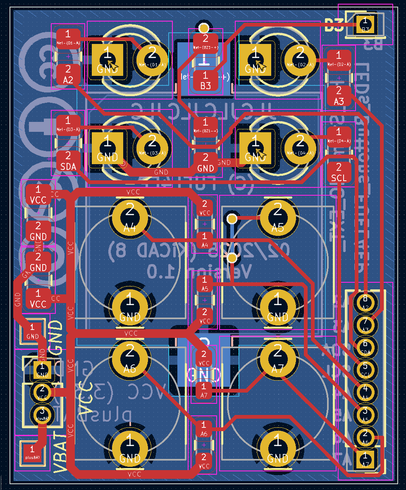
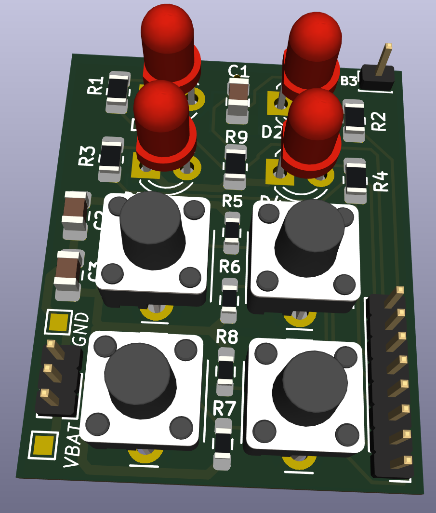
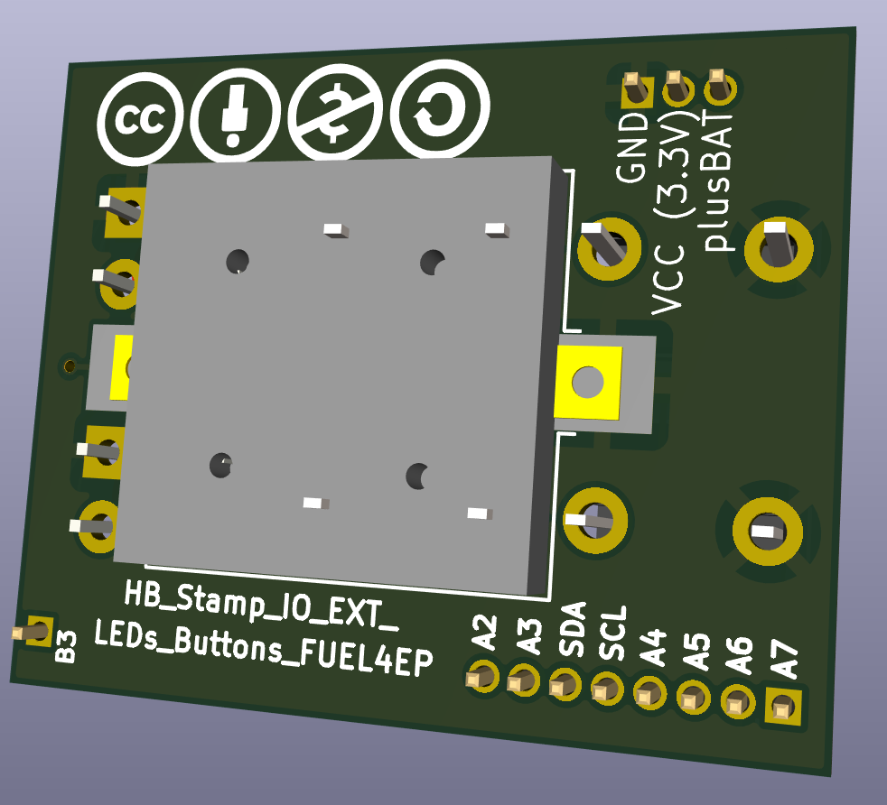
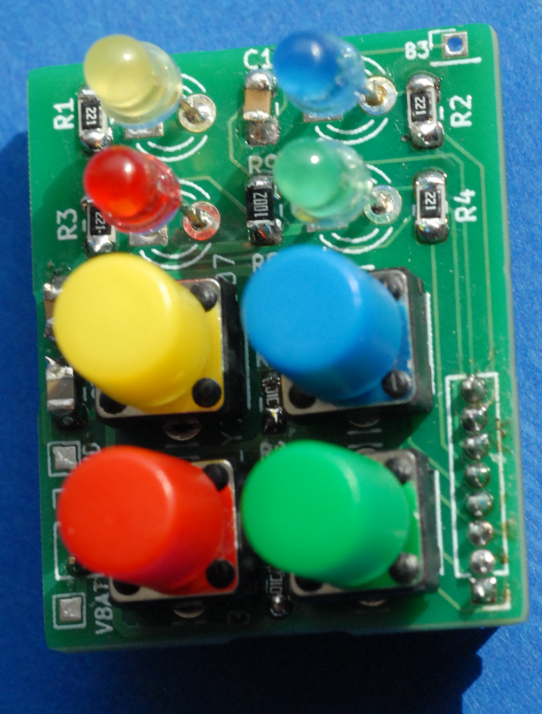
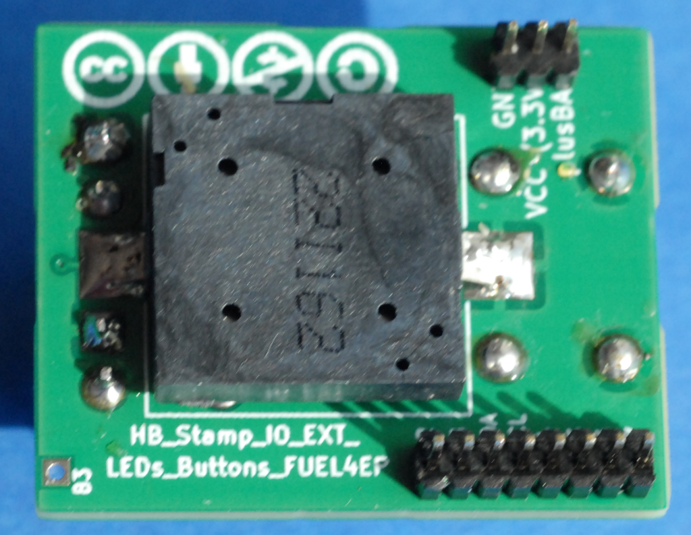

# HB_Stamp_IO_EXT_LEDs_Buttons_FUEL4EP  

**kleine DIY AsksinPP Signalisierungs- und Eingabeaufsteckplatine**
- passende Aufsteckplatine für [HB_Stamp_IO_ATMega1284P_FUEL4EP](https://github.com/FUEL4EP/HomeAutomation/tree/master/AsksinPP_developments/PCBs/HB_Stamp_IO_ATMega1284P_FUEL4EP)
- für die Eingabe- und Signalisierung von 4 Heimautomatisierungszuständen
- Platinenmaße 22 mm x 27 mm
- 4x 3mm Signalisierungs-LEDs
- 4x Eingabetaster
- 1x optionaler Piezosignalgeber auf der Platinenrückseite
-

## Credits

- mein besonderer Dank geht an papa für [AsksinPP](https://github.com/pa-pa/AskSinPP) und [Jérôme jp112sdl](https://github.com/jp112sdl) für die stete Unterstützung.

## Status

- ein Prototyp der Platine V1.0 wurde bei JLCPCB gefertigt. Der zugehörige AsksinPP-Sketch ist in Entwicklung

## Eigenschaften

- kompletter Datensatz für KiCAD 8 auf Github verfügbar:
    + 'git clone https://github.com/FUEL4EP/HomeAutomation.git' oder als [ZIP-Datei](https://github.com/FUEL4EP/HomeAutomation/archive/refs/heads/master.zip)
    + die Platinendaten sind dann unter 'HomeAutomation/AsksinPP_developments/PCBs/HB_Stamp_IO_EXT_LEDs_Buttons_FUEL4EP' direkt mit KiCAD aufrufbar
- neue Eigenschaften:
    + SMD Bestückung, wo möglich
    + alle SMD Bausteine sind mit dem JLCPCB SMT Bestückungsservice kostengünstig und qualitativ hochwertig bestückbar
    + JLCPCB BOM and CPL Dateien für SMT Service werden [bereitgestellt](./jlcpcb/production_files)
    + die AsksinPP Reset- und Config-Taster sind aus Platzgründen als Platinenjumper ausgeführt. Bitte geeignet kurz überbrücken, z.B. mit einem Schraubendreher

### Passende AsksinPP Projekte von FUEL4EP
   + in Entwicklung, werden abgeleitet aus [HM-LC-SWX-SM](https://github.com/pa-pa/AskSinPP/tree/master/examples/HM-LC-SWX-SM) und [HM-LC-SW1-BA-PCB](https://github.com/pa-pa/AskSinPP/tree/master/examples/HM-LC-SW1-BA-PCB)
   + Akkubetrieb ähnlich [HB-UNI-Sensor1-THPD-SHT45_BME280](https://github.com/FUEL4EP/HomeAutomation/tree/master/AsksinPP_developments/sketches/HB-UNI-Sensor1-THPD-SHT45_BME280)
   + eingeschaltete LEDs blinken alle 10 Sekunden nur sehr kurz
   + optionaler Piezosignalgeber zur akustischen Signalisierung
   
### Passendes Gehäuse
- in Arbeit, wird später hier bereitgestellt
- ähnlich [HB-UNI-Sensor1-THPD-SHT45_BME280](https://github.com/FUEL4EP/HomeAutomation/tree/master/AsksinPP_developments/PCBs/HB_Stamp_ATMega1284P_FUEL4EP/case_HB-UNI-Sensor1-THPD-SHT45_BME280)

### Hinweise
* bei der Nutzung des JLCPCB SMT Bestückungsservice ist darauf zu achten, dass **alle** benötigten SMD Bauteile als im Lager **verfügbar** angezeigt werden. Sonst bitte **NICHT** bestellen!

### KiCAD Plugin
- für die Erzeugung der JLCPCB Produktionsdaten wurde das Plugin [KiCAD JLCPCB tools](https://github.com/bouni/kicad-jlcpcb-tools) verwendet.

## benötigte Spezialbauteile zum Einlöten

- [Piezo Signalgeber](https://www.amazon.de/dp/B0C57D9RQ8)
- [6×6×8mm Taster mit aufsteckbaren farbigen Knopfkappen](https://www.amazon.de/Gebildet-Schalter-Momentane-Taktschalter-Drucktaster/dp/B082DBBPGC?th=1)

## Bestellen von Platinen

- die Platine kann direkt bei JLCPCB bestellt und dort auch assembliert werden
- die notwendigen Produktionsdaten stehen [hier](./jlcpcb/production_files/)
- ein Löten der SMD Bauteile per Hand ist möglich

## Disclaimer

-   die Nutzung der hier veröffentlichten Inhalte erfolgt vollständig auf eigenes Risiko und ohne jede Gewähr.

## Versionsverlauf

-   V1.0   18. Feb 2025: Initiale Vorabfreigabe
- 	KiCad Schaltplan-Editor   8.0.8-8.0.8-0~ubuntu22.04.1, release build unter Kubuntu22.04.1
- 	KiCad Leiterplatteneditor Version: 8.0.8-8.0.8-0~ubuntu22.04.1, release build unter Kubuntu22.04.1
- 	PCB Version 1.0
- 	Schematics  1.0

## Lizenz 

**Creative Commons BY-NC-SA** 
Give Credit, NonCommercial, ShareAlike

 This work is licensed under a <a rel="license" href="http://creativecommons.org/licenses/by-nc-sa/4.0/">Creative Commons Attribution-NonCommercial-ShareAlike 4.0 International License</a>.

-EOF
	

