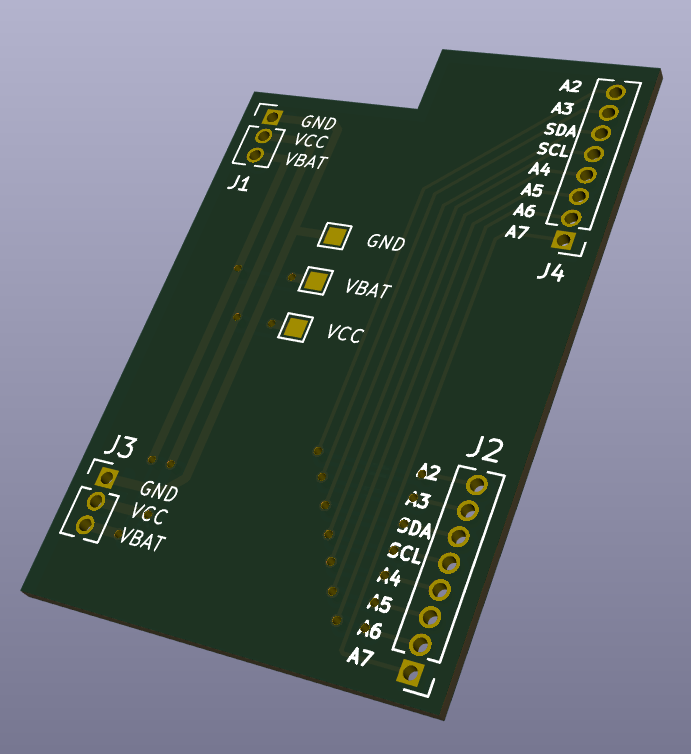

# HB_Stamp_IO_EXT_debug_adapter_FUEL4EP  

**Adapterplatine für das FTDI-Debuggen**
- passende Adapterplatine für das FTDI-Debuggen mittels eines [Pogo-Pins Testadapters](./PNGs/Pogo_pin_adapter_with_reduced_bottom_plate.png):
	+	[HB_Stamp_IO_ATMega1284P_FUEL4EP](https://github.com/FUEL4EP/HomeAutomation/tree/master/AsksinPP_developments/PCBs/HB_Stamp_IO_ATMega1284P_FUEL4EP)
	+   [HB_Stamp_IO_EXT_LEDs_Buttons_FUEL4EP](https://github.com/FUEL4EP/HomeAutomation/tree/master/AsksinPP_developments/PCBs/HB_Stamp_IO_EXT_LEDs_Buttons_FUEL4EP)
	+	für das FTDI-Debuggen wird diese Adapterplatine zwischen diese beiden Platinen gesteckt, so dass der Pogo-Pins Testadapter auf die Platine HB_Stamp_IO_ATMega1284P_FUEL4EP geklemmt werden kann.
-
	

	
	
	

## Status

- die Platine V1.0 wurde noch nicht bei JLCPCB gefertigt und ist daher noch nicht validiert

## Eigenschaften

- kompletter Datensatz für KiCAD 8 auf Github verfügbar:
    + 'git clone https://github.com/FUEL4EP/HomeAutomation.git' oder als [ZIP-Datei](https://github.com/FUEL4EP/HomeAutomation/archive/refs/heads/master.zip)
    + die Platinendaten sind dann unter 'HomeAutomation/AsksinPP_developments/PCBs/HB_Stamp_IO_EXT_debug_adapter_FUEL4EP' direkt mit KiCAD aufrufbar

### Passende AsksinPP Platinen von FUEL4EP
- [HB_Stamp_IO_ATMega1284P_FUEL4EP](https://github.com/FUEL4EP/HomeAutomation/tree/master/AsksinPP_developments/PCBs/HB_Stamp_IO_ATMega1284P_FUEL4EP)
- [HB_Stamp_IO_EXT_LEDs_Buttons_FUEL4EP](https://github.com/FUEL4EP/HomeAutomation/tree/master/AsksinPP_developments/PCBs/HB_Stamp_IO_EXT_LEDs_Buttons_FUEL4EP)
   

### KiCAD Plugin
- für die Erzeugung der JLCPCB Produktionsdaten wurde das Plugin [KiCAD JLCPCB tools](https://github.com/bouni/kicad-jlcpcb-tools) verwendet.

## Bestellen von Platinen

- die Platine kann direkt bei JLCPCB bestellt werden.
- die notwendigen Produktionsdaten stehen [hier](./jlcpcb/production_files/)

## Aufbau
- J1 und J4 sind mit Stiftleiten RM 1,27 mm auf der Platinenunterseite zu bestücken
- J2 und J3 sind mit Buchsenleisten RM 1,27 mm auf der Platinenoberseite zu bestücken

## Disclaimer

-   die Nutzung der hier veröffentlichten Inhalte erfolgt vollständig auf eigenes Risiko und ohne jede Gewähr.

## Versionsverlauf

-   V1.0   17. Apr 2025: Initiale Vorabfreigabe
- 	KiCad Schaltplan-Editor   8.0.8-8.0.8-0~ubuntu22.04.1, release build unter Kubuntu22.04.1
- 	KiCad Leiterplatteneditor Version: 8.0.8-8.0.8-0~ubuntu22.04.1, release build unter Kubuntu22.04.1
- 	PCB Version 1.0
- 	Schematics  1.0

## Lizenz 

**Creative Commons BY-NC-SA** 
Give Credit, NonCommercial, ShareAlike

 This work is licensed under a <a rel="license" href="http://creativecommons.org/licenses/by-nc-sa/4.0/">Creative Commons Attribution-NonCommercial-ShareAlike 4.0 International License</a>.

-EOF
	

