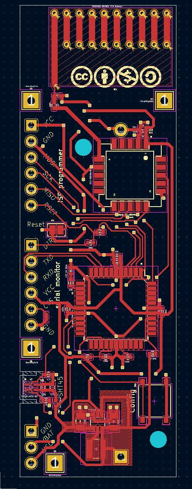
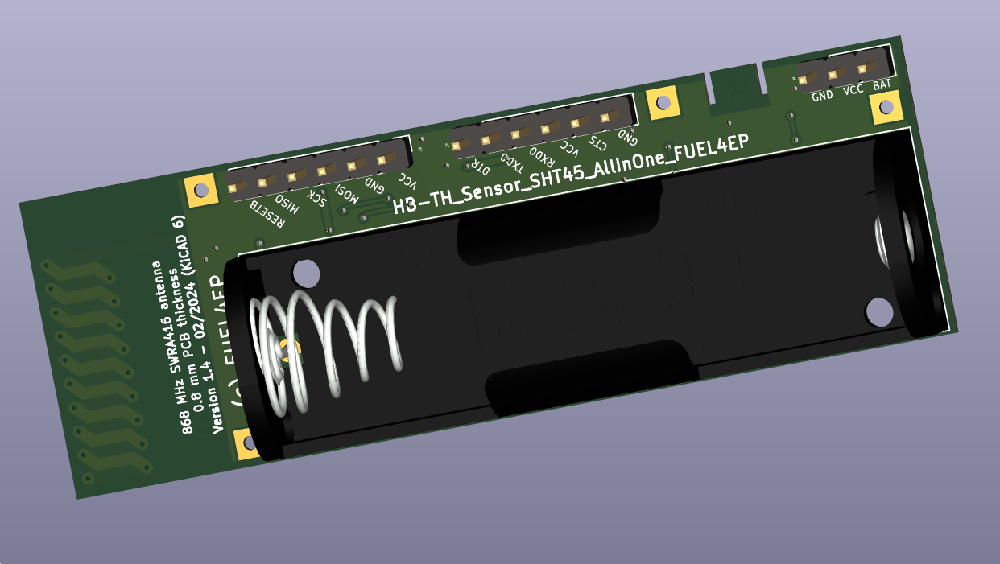
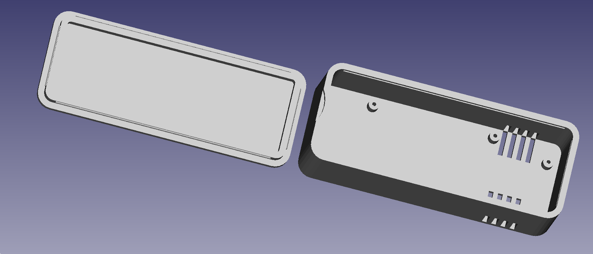

# HB_TH_Sensor_SHT45_AllInOne_FUEL4EP  

# Warnung: Diese Version der Platine ist noch nicht valdiert. Nutzung auf eigenes Risiko!

**Platine für hochgenauen und kleinen DIY AsksinPP TH Sensor**
- integrierter hochgenauer [Sensirion SHT45-AD1B-R2](https://sensirion.com/products/catalog/SHT45) SMD TH-Sensor (±1.0% RH / ±0.1°C digitaler Luftfeuchte- und Temperatursensor )
- kann bis auf den Batteriehalter vollständig bei JLCPCB assembliert werden
- kleine Platine 75 mm x 25 mm
- **Platinendicke: 0,8 mm (bitte nicht ändern)**
- Versorgung mit 1x AA-Batterie oder 1x NiMH-Akkumulator
- TPS61221 Hochsetzwandler 1,2V .. 1,5V auf 3,3V
- [integrierte 868 MHz PCB Antenne](https://www.ti.com/lit/an/swra416/swra416.pdf)
- 10 mm x 10 mm kleines Sendemodul [eByte E07 900MM10S](https://datasheet.lcsc.com/lcsc/2305061757_Chengdu-Ebyte-Elec-Tech-E07-900MM10S_C5844212.pdf)
- SMD TQFP-44 [ATMega1284P](https://ww1.microchip.com/downloads/en/DeviceDoc/doc8059.pdf) mit 128kByte Programmspeicher, 16kByte SRAM, 4kByte EEPROM
	+ ohne Quarz, Betrieb mit 8 MHz interner RC-Oszillator
	+ erlaubt Speicherung der Temperaturwerte über 7 Tage im RAM für die Bildung von gleitenden Mittelwerten 
- kleines 10mmx10mm [eByte E07-900MM10S Sendemodul](https://ebyteiot.com/products/ebyte-e07-900MM10Sti-cc1101-wireless-rf-module-868mhz-915mhz-ipex-stamp?_pos=2&_sid=bbf1d47dc&_ss=r)
- Programmierung und Serial Monitor mit 2,54 mm Pogo-Pin-Adapter oder Stiftleisten
- alle SMD Bausteine sind mit dem JLCPCB SMT Bestückungsservice kostengünstig und qualitativ hochwertig bestückbar
- die JLCPCB Assemblierung des Funkmoduls eByte E07-900MM10S geht nur als sehr teures Standard PCBA, daher wird eine Verlötung von Hand empfohlen

## Credits

- mein besonderer Dank geht an papa für [AsksinPP](https://github.com/pa-pa/AskSinPP) und [Jérôme jp112sdl](https://github.com/jp112sdl) für die stete Unterstützung.

## Platine wurde noch nicht bei JLCPCB gefertigt und auch noch nicht validiert

- entwickelt mit KiCAD 6.0.11
- zur Zeit eine Vorabfreigabe
- die Platine wurde noch nicht bei JLCPCB gefertigt und ist daher noch nicht validiert

## Eigenschaften

- kompletter Datensatz für KiCAD 6 auf Github verfügbar:
    + 'git clone https://github.com/FUEL4EP/HomeAutomation.git' oder als [ZIP-Datei](https://github.com/FUEL4EP/HomeAutomation/archive/refs/heads/master.zip)
    + die Platinendaten sind dann unter 'HomeAutomation/AsksinPP_developments/PCBs/HB_TH_Sensor_SHT45_AllInOne_FUEL4EP' direkt mit KiCAD aufrufbar
- neue Eigenschaften:
    + SMD Bestückung, wo möglich
    + alle SMD Bausteine sind mit dem JLCPCB SMT Bestückungsservice kostengünstig und qualitativ hochwertig bestückbar
    + JLCPCB BOM and CPL Dateien für SMT Service werden [bereitgestellt](./jlcpcb/production_files)

### Benötigte Bauteile:

- bei Anspruchnahme des SMT Bestückungsservice von JLCPCB ist nur noch ein Durchsteckbauteil von Hand zu verlöten:
	* 1x Keystone 2460 Batteriehalter 1xAA
- die JLCPCB Assemblierung des Funkmoduls eByte E07-900MM10S geht nur als sehr teures Standard PCBA, daher wird eine Verlötung von Hand empfohlen

### Aufbauhinweise

- es wird dringend angeraten, als ersten Schritt der Inbetriebnahme einen Frequenztest durchzuführen.

## Setzten der Fuses des ATMega1284P Mikrokontrollers

- **nie die Fuses auf einen externen Quarzoszillator / Resonator umschalten!**
- ein passender avrdude Skript zum Lesen und korrekten Setzen der Fuses ist [hier](./avrdude)

## Prüfwerkzeuge

- ein Frequenztest ist [hier](./FreqTest_1284P/)
- ein Test des SHT45 Sensors ist [hier](./SHT45_Sensor_test)
    
### Passende AsksinPP Projekte von FUEL4EP
   + [HB-UNI-Sensor1-THD-SHT45](https://github.com/FUEL4EP/HomeAutomation/tree/master/AsksinPP_developments/sketches/HB-UNI-Sensor1-THD-SHT45) (wird bald veröffentlicht werden)
    

### Anschluss eines FTDI Debuggers und/oder ISP-Programmiergeräts

- Anschluss über 6-Pin 2,54 mm Pogo-Pin-Adapter oder eingelötete 6-Pin Stiftleiste, bitte die Beschriftung beachten und vor dem Anlegen eines Pogo-Pin-Adapters querprüfen!

### Passendes Gehäuse

- die Konstruktionsdaten sind [hier](./3D_Printer/case/) im STL- und OpenSCAD-Format zu finden
	+ gegebenenfalls ist in der OpenSCAD-Datei [HB_TH_Sensor_SHT45_AllInOne_FUEL4EP.scad](./3D_Printer/case/HB_TH_Sensor_SHT45_AllInOne_FUEL4EP.scad) die Variable 'gap' an die Toleranzen des 3D-Druckers anzupassen

### Hinweise
* Achtung: Kein Überspannungsschutz oder Verpolungsschutz vorhanden
* bei der Nutzung des JLCPCB SMT Bestückungsservice ist darauf zu achten, dass **alle** benötigten SMD Bauteile als im Lager **verfügbar** angezeigt werden. Sonst bitte **NICHT** bestellen!

### KiCAD Plugin
- für die Erzeugung der JLCPCB Produktionsdaten wurde das Plugin [KiCAD JLCPCB tools](https://github.com/bouni/kicad-jlcpcb-tools) verwendet.

## Bestellen von Platinen

- die Platine kann direkt bei JLCPCB bestellt und dort auch assembliert werden
  + **als Platinendicke unbedingt bei der Bestellung angeben: 0,8 mm (bitte nicht ändern, sonst geht die PCB-Antenne nicht)**
- die notwendigen Produktionsdaten stehen [hier](./jlcpcb/production_files/)
- die folgenden Bauteile müssen [vorab bei JLCPCB bestellt werden](https://jlcpcb.com/help/article/53-what-is-jlcpcb-parts-pre-order-service):
	+ [TI TPS61221DCKT](https://jlcpcb.com/parts/componentSearch?searchTxt=TPS61221) (zur Zeit teuer, ist aber meist billiger als angegeben)
	+ Sensirion SHT45-AD1B-R2
	+ eByte E07-900MM10S
	+ Murata LQH3NPN4R7MMEL 4.7 uH SMD Induktivität
- die JLCPCB Assemblierung des Funkmoduls eByte E07-900MM10S geht nur als das sehr teure Standard PCBA, daher wird eine Verlötung von Hand empfohlen
- **die Platine ist noch nicht durch einen Prototypen evaluiert!**

## Disclaimer

-   die Nutzung der hier veröffentlichten Inhalte erfolgt vollständig auf eigenes Risiko und ohne jede Gewähr.

## Versionsverlauf

-   V1.0 15. Dez 2023: Initiale Vorabfreigabe
-	S V1.1 15. Dez 2023: SHT45-AD1B-R2 statt SHT45-AD1F, da JLCPCB SHT45-AD1F
nicht mehr assembliert
-	S V1.2	 08. Jan 2024: Korrektur von falschen LCSC-Teilenummern für R1, D1 und R4
-	L V1.2 12. Jan 2024: Verbesserung des PCB-Layouts für den Schaltregler
-	S V1.3 13. Jan 2024: Korrektur der falschen LCSC-Teilenummer für Schaltregler TPS61221
-	S V1.4 21. Jan 2024: Änderung der LCSC-Nummern für bessere Verfügbarkeit, Änderung der Steckerleistenbelegung
-	L V1.3 21. Jan 2024: Änderung der Ausrichtung von Steckerleisten, zusätzliche Bestückungsdrucke
-	S V1.5 08. Feb 2024: Fix der I2C Pull-Up Widerstände
-	L V1.4 08. Feb 2024: Fix der I2C Pull-Up Widerstände und Beschriftung
- 	KiCad Schaltplan-Editor   Version: 6.0.11-2627ca5db0 unter Kubuntu22.04.1
- 	KiCad Leiterplatteneditor Version: 6.0.11-2627ca5db0 unter Kubuntu22.04.1
- 	PCB Version 1.4
- 	Schematics  1.5

## Lizenz 

**Creative Commons BY-NC-SA** 
Give Credit, NonCommercial, ShareAlike

 This work is licensed under a <a rel="license" href="http://creativecommons.org/licenses/by-nc-sa/4.0/">Creative Commons Attribution-NonCommercial-ShareAlike 4.0 International License</a>.

-EOF
	

