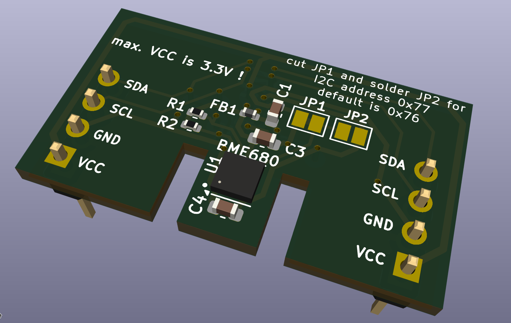
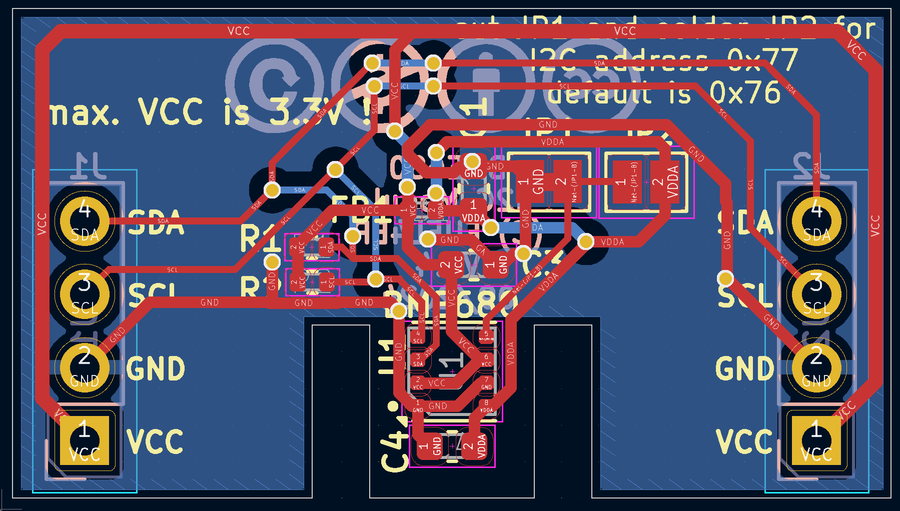
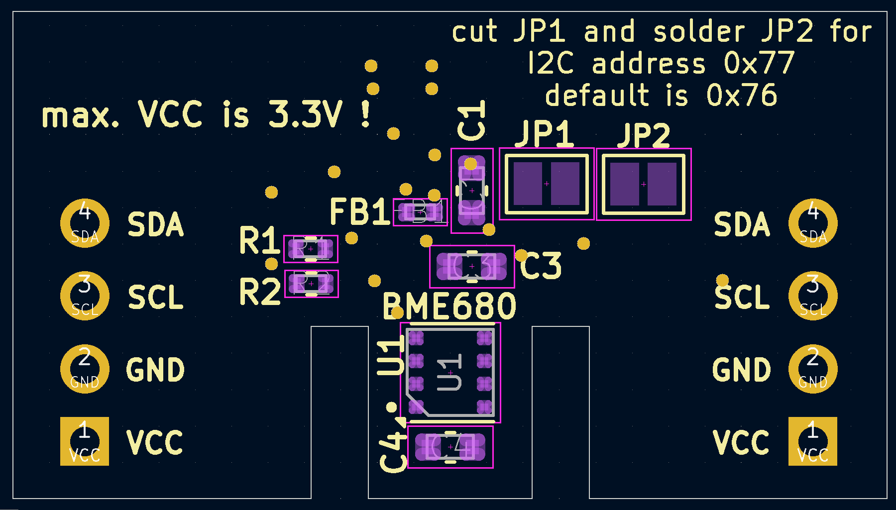

# I2C_Module_BME680_FUEL4EP  

# Warnung: Diese Version der Platine ist noch nicht valdiert. Nutzung auf eigenes Risiko!

## I2C BME680 VOC Sensor Aufsteckplatine für DIY AsksinPP-Projekte

- basierend auf [Bosch BME680](https://www.bosch-sensortec.com/media/boschsensortec/downloads/datasheets/bst-bme680-ds001.pdf)

- passend zu
	* [HB-UNI-SEN-BATT_ATMega1284P_E07-868MS10_FUEL4EP](https://github.com/FUEL4EP/HomeAutomation/tree/master/AsksinPP_developments/PCBs/HB-UNI-SEN-BATT_ATMega1284P_E07-868MS10_FUEL4EP)
	* [HB-UNI-SEN-BATT_ATMega1284P_E07-868MS10_FRAM_FUEL4EP](https://github.com/FUEL4EP/HomeAutomation/tree/master/AsksinPP_developments/PCBs/HB-UNI-SEN-BATT_ATMega1284P_E07-868MS10_FRAM_FUEL4EP)
	* [HB-UNI-SEN-BATT_FUEL4EP](https://github.com/FUEL4EP/HomeAutomation/tree/master/AsksinPP_developments/PCBs/HB-UNI-SEN-BATT_FUEL4EP)
	* [HB-UNI-SEN-BATT_ATMega1284P_E07-868MS10_FUEL4EP](https://github.com/FUEL4EP/HomeAutomation/tree/master/AsksinPP_developments/PCBs/HB-UNI-SEN-BATT_ATMega1284P_E07-868MS10_FUEL4EP)
	* Befestigung mit 2 Stiftleisten J1 und J2
	
- VCC max. ist 3,3 Volt !!
- die voreingestellte Standard-I2C-Adresse ist 0x76
- für die I2C-Adresse 0x77 ist der Jumper JP1 aufzutrennen und der Jumper JP2 mit Lötzinn zu überbrücken

- Infos zu AsksinPP sind [hier](https://asksinpp.de) und [hier](https://asksinpp.de/Grundlagen/01_hardware.html#verdrahtung) zu finden

## Platinenmaße

- Breite: 30,48 mm
- Weite: 17 mm
- Platinendicke 1,6 mm (bei der Bestellung bei JLCPCB auswählen)

## Stromlaufplan

- ist [hier](./Schematics/I2C_Module_BME680_FUEL4EP.pdf)

## Status

- diese Platine wurde noch nicht bei JLCPCB gefertigt und ist daher auch nicht validiert. Nutzung auf eigenes Risiko!

## Rückmeldungen

- und Verbesserungsvorschläge sind willkommen.

### KiCAD Plugin
- für die Erzeugung der JLCPCB Produktionsdaten wurde das Plugin [KiCAD JLCPCB tools](https://github.com/bouni/kicad-jlcpcb-tools) verwendet.

## Daten für die Bestellung bei JLCPCB

- die Daten für die Bestellung liegen im Verzeichnis [./jlcpcb/production_files/](./jlcpcb/production_files/)
- Gerber-Daten als Zip-Datei
- BOM- und CPL-Daten als CSV-Datei

- die Rotation von U1 (BME680) ist bei JLCPCB Assembly-Service-Online-View falsch und muss händisch korrigiert und geprüft werden. Bitte die entsprechende Option beim Bestellen wählen.

## lokale Installation des Github Releases auf Deinem Computer

- gehe bitte in Dein Zielinstallationsverzeichnis, wo Du mit der I2C_Module_BME680_FUEL4EP Platine mit KiCAD arbeiten möchtest

  - gebe dort 'git clone https://github.com/FUEL4EP/HomeAutomation.git' ein
	  + damit lädst Du mein [Sammelrepository](https://github.com/FUEL4EP/HomeAutomation) für alle meine auf Github freigegebenen HomeBrew Entwicklungen herunter.
  - dann findest Du ein neues Verzeichnis 'HomeAutomation' auf Deinem Rechner, das alle meine auf Github freigebenen Entwicklungen enthält, siehe [README.md](https://github.com/FUEL4EP/HomeAutomation/blob/master/README.md)
  	+ mache bitte regelmäßig ein Update mit 'git pull'
 -	die Platine I2C_Module_BME680_FUEL4EP findest Du unter './HomeAutomation/tree/master/AsksinPP_developments/PCBs/I2C_Module_BME680_FUEL4EP'
 
- alternativ kann vom Github [Sammelrepository](https://github.com/FUEL4EP/HomeAutomation) die ZIP-Datei HomeAutomation-master.zip heruntergeladen und auf dem lokalen Rechner ausgepackt werden. Bitte dann regelmäßig auf Github nach Updates schauen.

## Versionsverlauf

-   V1.0 07. Sep 2023: Initiale Veröffentlichung auf Github
-	V1.1	 15. Dez 2023: korrigierte Platzierung der Stiftleisten in 3D-Ansicht
-	V1.2 08. Feb 2024: Fix der I2C Pull-Up Widerstände
-	S V1.3 16. Apr 2024: Ersetzen von R3 durch JP2 wegen Ruhestrom; Migration auf KiCAD 7
-	L V1.3 16. Apr 2024: Ersetzen von R3 durch JP2 wegen Ruhestrom; Migration auf KiCAD 7
-	V1.4   30. Sep 2024: Migrationn auf KiCAD 8  
- KiCad Schaltplan-Editor Version: 8.0.5-8.0.5-0~ubuntu22.04.1, release build unter Kubuntu22.04.4
- KiCad Leiterplatteneditor Version: 8.0.5-8.0.5-0~ubuntu22.04.1, release build unter Kubuntu22.04.4
- PCB Version 1.4
- Schematics  1.4

## Disclaimer

-   die Nutzung der hier veröffentlichten Inhalte erfolgt vollständig auf eigenes Risiko und ohne jede Gewähr.

## Lizenz 

**Creative Commons BY-NC-SA** 
Give Credit, NonCommercial, ShareAlike

 This work is licensed under a <a rel="license" href="http://creativecommons.org/licenses/by-nc-sa/4.0/">Creative Commons Attribution-NonCommercial-ShareAlike 4.0 International License</a>.

-EOF
	

