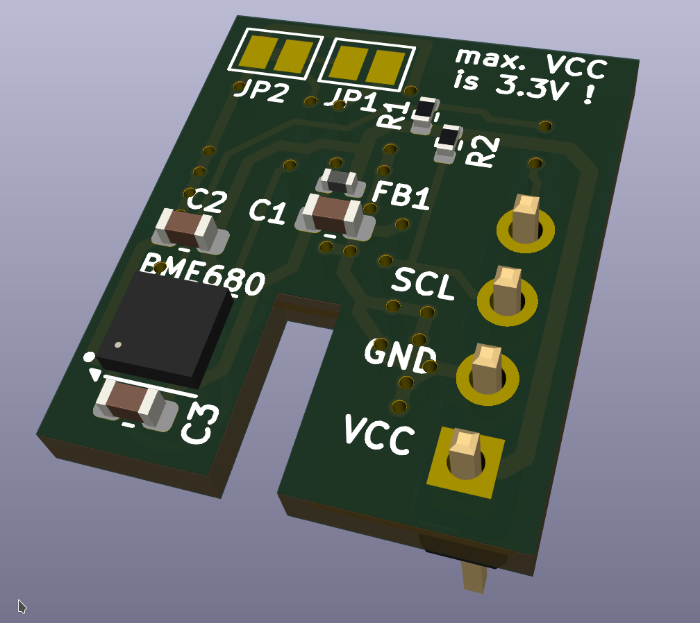
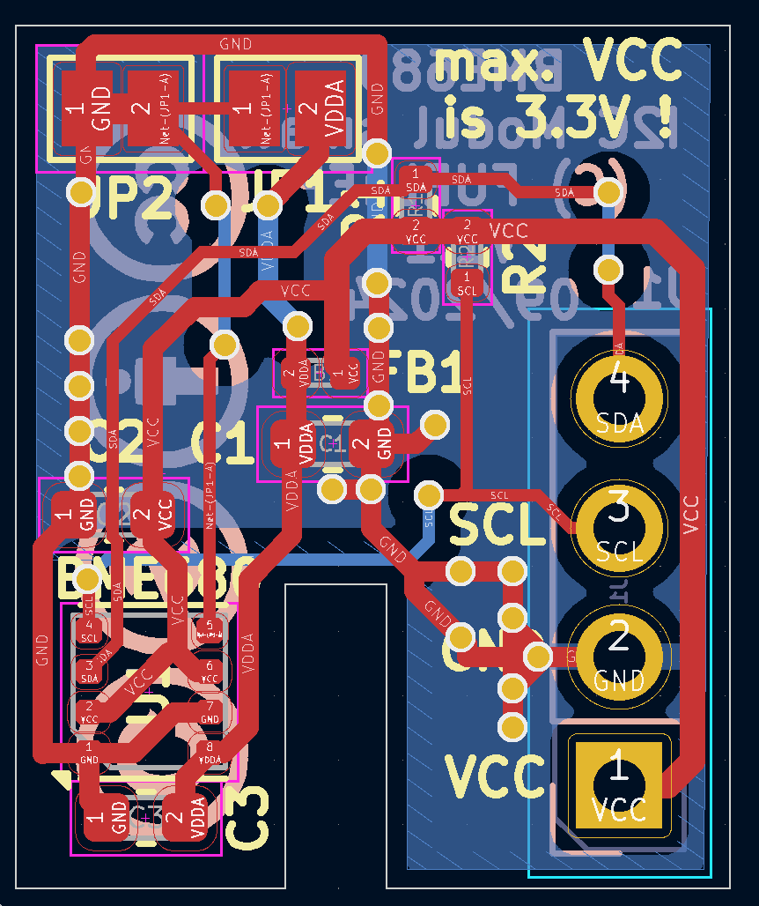

# I2C_Module_BME680_small_FUEL4EP  

## kleine I2C BME680 VOC Sensor Aufsteckplatine für DIY AsksinPP-Projekte

- basierend auf [Bosch BME680](https://www.bosch-sensortec.com/media/boschsensortec/downloads/datasheets/bst-bme680-ds001.pdf)
- passend zu den folgenden Mutterplatinen:
	* [HB_Stamp_ATMega1284P_FUEL4EP](https://github.com/FUEL4EP/HomeAutomation/tree/master/AsksinPP_developments/PCBs/HB_Stamp_ATMega1284P_FUEL4EP)	
- VCC max. ist 3,3 Volt !!
- die voreingestellte Standard-I2C-Adresse ist 0x76
- für die I2C-Adresse 0x77 ist der Jumper JP2 aufzutrennen und der Jumper JP1 mit Lötzinn zu überbrücken

- Infos zu AsksinPP sind [hier](https://asksinpp.de) und [hier](https://asksinpp.de/Grundlagen/01_hardware.html#verdrahtung) zu finden

## Platinenmaße

- Breite: 14,08 mm
- Weite: 17 mm
- Platinendicke 1,6 mm (bei der Bestellung bei JLCPCB auswählen)

## Stromlaufplan

- ist [hier](./Schematics/I2C_Module_BME680_small_FUEL4EP.pdf)

## Status

- die Platine V1.0 wurde bei JLCPCB gefertigt und mit dem Sketch [HB-UNI-SENSOR1-AQ-BME680_KF_rLF](https://github.com/FUEL4EP/HomeAutomation/tree/master/AsksinPP_developments/sketches/HB-UNI-Sensor1-AQ-BME680_KF_rLF) validiert:

## Rückmeldungen

- und Verbesserungsvorschläge sind willkommen.

### KiCAD Plugin
- für die Erzeugung der JLCPCB Produktionsdaten wurde das Plugin [KiCAD JLCPCB tools](https://github.com/bouni/kicad-jlcpcb-tools) verwendet.

## Daten für die Bestellung bei JLCPCB

- die Daten für die Bestellung liegen im Verzeichnis [./jlcpcb/production_files/](./jlcpcb/production_files/)
- Gerber-Daten als Zip-Datei
- BOM- und CPL-Daten als CSV-Datei

## lokale Installation des Github Releases auf Deinem Computer

- gehe bitte in Dein Zielinstallationsverzeichnis, wo Du mit der I2C_Module_BME680_small_FUEL4EP Platine mit KiCAD arbeiten möchtest

  - gebe dort 'git clone https://github.com/FUEL4EP/HomeAutomation.git' ein
	  + damit lädst Du mein [Sammelrepository](https://github.com/FUEL4EP/HomeAutomation) für alle meine auf Github freigegebenen HomeBrew Entwicklungen herunter.
  - dann findest Du ein neues Verzeichnis 'HomeAutomation' auf Deinem Rechner, das alle meine auf Github freigebenen Entwicklungen enthält, siehe [README.md](https://github.com/FUEL4EP/HomeAutomation/blob/master/README.md)
  	+ mache bitte regelmäßig ein Update mit 'git pull'
 -	die Platine I2C_Module_BME680_small_FUEL4EP findest Du unter './HomeAutomation/tree/master/AsksinPP_developments/PCBs/I2C_Module_BME680_small_FUEL4EP'
 
- alternativ kann vom Github [Sammelrepository](https://github.com/FUEL4EP/HomeAutomation) die ZIP-Datei HomeAutomation-master.zip heruntergeladen und auf dem lokalen Rechner ausgepackt werden. Bitte dann regelmäßig auf Github nach Updates schauen.

## Versionsverlauf

- V1.0   29. Sep 2024: Initiale Veröffentlichung auf Github
- L V1.1 30. Sep 2024: Verbesserte Platzierung von C3
- KiCad Schaltplan-Editor Version: 8.0.5-8.0.5-0~ubuntu22.04.1, release build
 unter Kubuntu22.04.4
- KiCad Leiterplatteneditor Version: 8.0.5-8.0.5-0~ubuntu22.04.1, release build
 unter Kubuntu22.04.4
- PCB Version 1.1
- Schematics  1.0

## Sammelbestellung

- wer Interesse an einer gemeinsamen Bestellung von Platinen und/oder Gehäusen bei JLCPCB hat, fragt bitte per per PN bei bei [FUEL4EP](https://homematic-forum.de/forum/ucp.php?i=pm&mode=compose&u=20685) an.
- wenn genügend Interesse (>= 20 bestückte Platinen und/oder 3D gedruckten Gehäusen) zustande kommt, biete ich an, Platinen  und Gehäuse gegen Vorkasse per PayPal zum Selbstkostenpreis + Versandkosten + 3 Euro Aufwandspauschale pro Versand zum Besteller bei JLCPCB zu bestellen und dann weiterzuverkaufen. Vor einer Bestellung wird ein Angebot bei JLCPCB eingeholt und an die Interessenten zur Zustimmung verteilt.

## Disclaimer

-   die Nutzung der hier veröffentlichten Inhalte erfolgt vollständig auf eigenes Risiko und ohne jede Gewähr.

## Lizenz 

**Creative Commons BY-NC-SA** 
Give Credit, NonCommercial, ShareAlike

 This work is licensed under a <a rel="license" href="http://creativecommons.org/licenses/by-nc-sa/4.0/">Creative Commons Attribution-NonCommercial-ShareAlike 4.0 International License</a>.

-EOF
	

