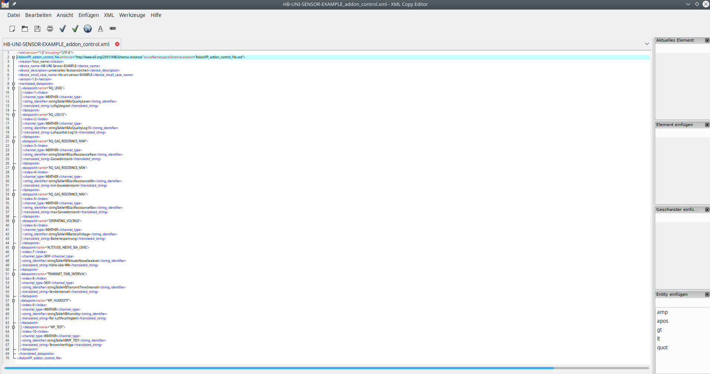

 
# Groovy based AsksinPP Addon generator script [make_all.bsh](./make_all.bsh) for automatically generate device specific install and uninstall scripts  

## IMPORTANT: UNDER CONSTRUCTION AND VALIDATION

 
## IMPORTANT: Since this generator software has beta status only, please check the generated install and uninstall scripts very carefully before using them in a production version of an addon. Usage is at your own risk! In particular, the webuiInsert section may be incomplete, e.g. if the device needs specific DEV_HIGHLIGHT entries like ''hb-ou-mp3-led'. Please handle those entries manually. Thanks. Your feedback and enhancement proposals are welcome!
 

 

- creates install and uninstall scripts required in [../src/addon/](../src/addon/)
- a singular install 'install_<addon_name>' is newly introduced instead of the previous style of one install script per device
- a singular uninstall 'uninstall_<addon_name>' is newly introduced instead of the previous style of one uninstall script per device

- the following software installations are prereqisites:

	+ install [groovy](https://groovy-lang.org/), a multi-faceted language for the Java platform, on your computer
	+ install [XML Copy Editor](https://xml-copy-editor.sourceforge.io/) on your computer
	+ both groovy and XML Copy Editor are free software and available for Windows, Mac, and Linux. Please choose an appropriate source for these software based on your system setup.
	+ a working internet connection is required for updating local data bases to the latest EQ3 repositories from github  
- please follow the following steps to create the addon install and uninstall scripts
        
	+ change your working directory to the [location](./) of this README.md file
	+ ensure that your internet connection is up and running. An update of some required data from EQ'3 occu repository will be done automatically.
	+ ensure that all your addon devices' rftypes XML files are store in [../src/addon/firmware/rftypes/](../src/addon/firmware/rftypes/)
	+ start in a LINUX console  window the script [./make_all.bsh](./make_all.bsh) with the command line option '-run1':
	
        > make_all.bash -run1

	+	this script invocation is
		*	running for several minutes, please be a bit patient ..
		*	storing all outputs during script execution in the log file [run1.log](./run1.log), please use in another console window 'tail -f run1.log' to track the progress
		*  	validating all XML files of [../src/addon/firmware/rftypes/](../src/addon/firmware/rftypes/) against the XML schema file [./libraries/occu.xsd](./libraries/occu.xsd./libraries/occu.xsd) 
			+	potential schema errors will be flagged and need to be fixed before proceeding
			+	the schema file [./libraries/occu.xsd](./libraries/occu.xsd./libraries/occu.xsd) has been extracted from all  rftypes XML files in EQ'3 occu repository <occu repository>/firmware/rftypes/*.xml by the LINUX command 'trang -I xml -O xsd <path_to_local_occu_repository>/*.xml ${LIBRARY_DIR}/occu.xsd'
			+	[./libraries/occu.xsd](./libraries/occu.xsd./libraries/occu.xsd) can also be used to manually validate rftypes XML files with 'xmllint --schema ./libraries/occu.xsd <rftypes XML file> --noout'
		*	downloading the relevant parts of [EQ3'3 occu repository](https://github.com/eq-3/occu) from Github
		*	extracting the used names from the EQ3 occu files reading webui.js, stringtable_de.txt, and translate.lang.stringtable.js
		*	extracting the used names from all rftypes XML files in EQ'3 occu repository <occu repository>/firmware/rftypes/*.xml
		* 	reading previously defined translations of [./libraries/AsksinPP_addon_generator_control_file_translation_source.xml](./libraries/AsksinPP_addon_generator_control_file_translation_source.xml)
		*	extracting the addon rftypes XML file of  [../src/addon/firmware/rftypes/](../src/addon/firmware/rftypes/)
		*	removing all duplicates of names that are already defined in
			+	webui.js, stringtable_de.txt, and translate.lang.stringtable.js
			+	rftypes XML files in EQ'3 occu repository <occu repository>/firmware/rftypes/*.xml
		*	merging the extracted names of the addon rftypes XML file of  [../src/addon/firmware/rftypes/](../src/addon/firmware/rftypes/) such that duplicates of names are eliminated
		+	creating data bases './libraries/Addon_extract_rftypes_XML_translation_archive.db' and './libraries/EQ3_occu_extract_rftypes_translation_archive.db'
		+	creating the XML control file for addon generator [./AsksinPP_addon_generator_control_file.xml](./AsksinPP_addon_generator_control_file.xml)
	+	open and edit the generated XML control file for addon generator [./AsksinPP_addon_generator_control_file.xml](./AsksinPP_addon_generator_control_file.xml) with 'xmlcopyeditor
	>xmlcopyeditor  ./AsksinPP_addon_generator_control_file.xml

	

    + then
    	+	check all entries of this control file for completeness and correctness
		+ update the 'addon_name' if needed
		+ update the 'addon_version' if needed
		+ replace all undefined device descriptions 'tbd' by the concerning description strings, the URL and HTML encoding for German 'Umlauts' is done automatically
		+ replace all undefined translations 'tbd' by the concerning translation strings, the URL and HTML encoding for German 'Umlauts' is done automatically
		+ save the edited XML control file
		
	+ start in a LINUX console  window the script [./make_all.bsh](./make_all.bsh) with the command line option '-run2':
	
        > make_all.bash -run2

		+	this script invokation is
			* invoking the groovy generator script [AsksinPP_addon_generator.groovy](./AsksinPP_addon_generator.groovy)
			* generating the [addon install script](./install_hb-ep-devices-addon)
			* generating the [addon uninstall script](./uninstall_hb-ep-devices-addon)
	+	please check the generated addon install and uninstall scripts. If they are correct, please copy them manually to the [addon directory ../src/addon/](../src/addon).
	+	copy the edited XML control file for addon generator [./AsksinPP_addon_generator_control_file.xml](./AsksinPP_addon_generator_control_file.xml) to [./libraries/AsksinPP_addon_generator_control_file_translation_source.xml](./libraries/AsksinPP_addon_generator_control_file_translation_source.xml]) in order to preserve your latest changes for later generator runs
	
	+	if you want solely to validate your newly created rftypes XML files in [../src/addon/firmware/rftypes/](../src/addon/firmware/rftypes/), then start in a LINUX console  window the script [./make_all.bsh](./make_all.bsh) with the command line option '-check':
	
        > make_all.bash -check

		+	this script invocation is validating the XML sytax of your rftypes XML files against the XML schema file  [./libraries/occu.xsd](./libraries/occu.xsd./libraries/occu.xsd) 
	+	potential schema errors will be flagged and need to be fixed before proceeding
	+	the schema file [./libraries/occu.xsd](./libraries/occu.xsd./libraries/occu.xsd) has been extracted from all  rftypes XML files in EQ'3 occu repository <occu repository>/firmware/rftypes/*.xml by the LINUX command 'trang -I xml -O xsd <path_to_local_occu_repository>/*.xml ${LIBRARY_DIR}/occu.xsd'
	+	[./libraries/occu.xsd](./libraries/occu.xsd./libraries/occu.xsd) can also be used to manually validate rftypes XML files with 'xmllint --schema ./libraries/occu.xsd <rftypes XML file> --noout'      
	
	
- the following groovy scripts are used by the 'make_all.bsh' script:
	+	[extract_rftypes_XML.groovy](./extract_rftypes_XML.groovy)                                                  
	+	[AsksinPP_addon_generator.groovy](./AsksinPP_addon_generator.groovy) 
	+	please invoke them with the command line option '-h' to see all options for manual execution 
- for pretty printing an XML file a script [make_pretty_print_XML.groovy](./make_pretty_print_XML.groovy) is provided

- enjoy! Feedback and improvement suggestions are welcome!

## Lizenz

**Creative Commons BY-NC-SA** 
Give Credit, NonCommercial, ShareAlike

 This work is licensed under a <a rel="license" href="http://creativecommons.org/licenses/by-nc-sa/4.0/">Creative Commons Attribution-NonCommercial-ShareAlike 4.0 International License</a>.
