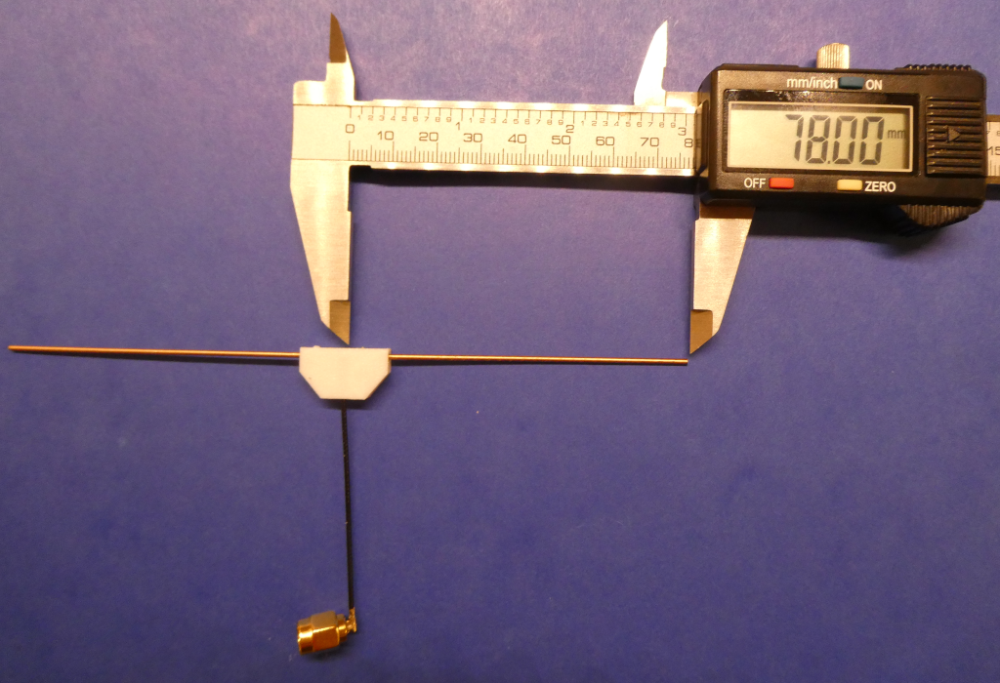
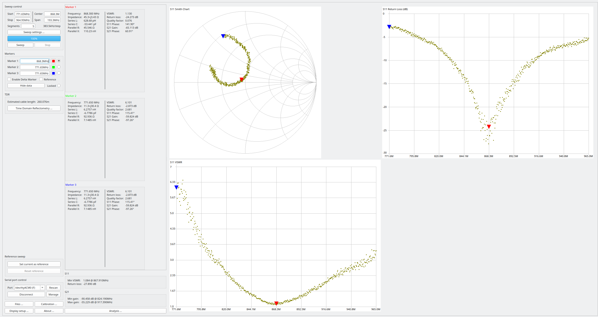

# DIY 868,3 MHz [Dipol Antenne](https://de.wikipedia.org/wiki/Dipolantenne)

- Anleitung siehe [Youtube VideoHow to build your own DIY Dipole 868 Mhz (LORA - Meshtastic)](https://www.youtube.com/watch?v=srV70ghBtHg)

- Dipollänge für SWR=1 @ 868,3 MHz: 78mm (ohne Isolation des Antennendrahts)
- Basis für Antennendraht: NYM Netzleitung 1,5mm°2 ohne Isolation

- Messung mit Sysjoint NanoVNA F V3 Vector Network Analyzer
	+ Firmware v0.5.3
	+ fmin=771,65 MHz
	+ fmax=964,95 MHz
	+ Kalibrierung Open, Short, Load @ 771,65Mhz..964,95MHz
	+ Messung an SMA auf IPX IFX Adapter
		* calibrated offset delay: -35ps
		
- Bild der selbstgebauten 868,3 MHz Dipolantenne mit IPX IFX Adapter:

)
	
- Messergebnis:

- Bewertung: Perfektes Stehwellenverhältnis VSWR von 1,13 @ 868,3MHz
	+ hervorragende Antenne für Homematic
	+ sehr schön ausgeprägtes Minimum des Stehwellenverhältnisses
	+ geringe Bandbreite
	
- Antennencharakteristik

	+ Die Dipolantenne hat eine Richtcharakteristik. Das Antennendiagramm eines Dipols ist z.B. [hier](https://ethz.ch/content/dam/ethz/special-interest/itet/institute-ief/inst-of-electromagnetic-fields-dam/documents/laboratory-courses/manual-ant-and-waveprop.pdf) auf Seite 11 in Bild1 und Bild2 dargestellt.

EOF
