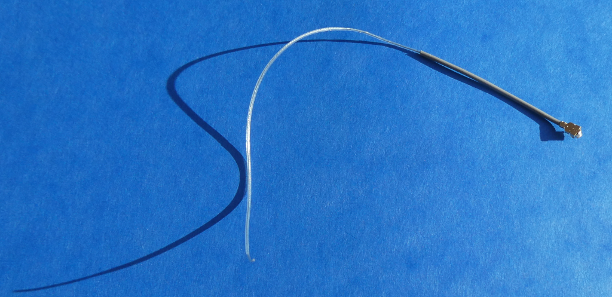
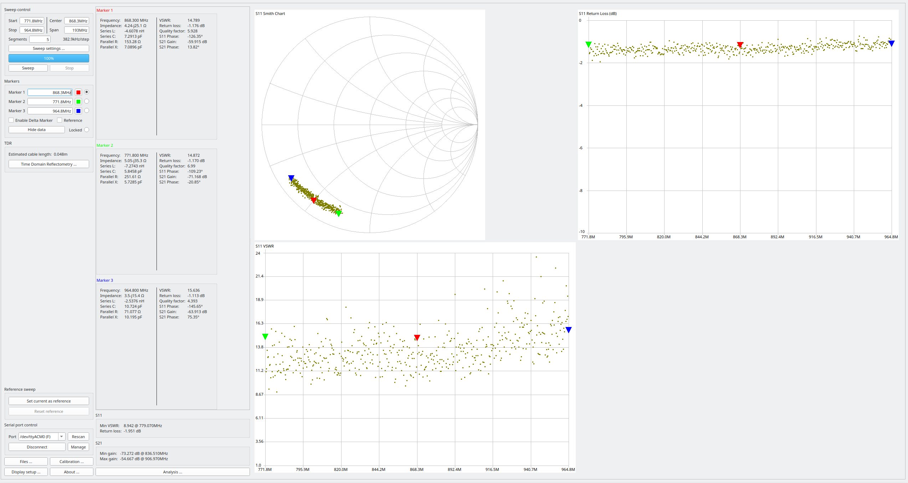

# DIY 868,3 MHz Drahtantenne aus einer Ader eines Flebachbandkabels

- DIY Antenne basierend auf [IPX auf RPSMA Verlängerungskabel](https://www.amazon.de/dp/B09QCL4Y1R)
	+ SMA Buche abgetrennt
	+ Außenisolation des IPX-Teils auf 112 mm enfernt
	+ Abschirmgeflecht des IPX-Teils auf 112 mm enfernt
	+ Isolation der inneren Ader des IPX-Teils bleibt erhalten 
- Abisolierlänge für SWR=14,789 @ 868,3 MHz: 112mm 

- Messung mit Sysjoint NanoVNA F V3 Vector Network Analyzer
	+ Firmware v0.5.3
	+ fmin=771,8 MHz
	+ fmax=964,8 MHz
	+ Kalibrierung Open, Short, Load @ 771,8Mhz..964,8MHz
	+ Messung an SMA auf IPX IFX Adapter
		* calibrated offset delay: -35ps
		
- Bild der selbstgebauten 868,3 MHz Drahtantenne mit angelötetem IPX IFX Adapter:

)
	
- Messergebnis mit 112 mm Drahtlänge:
	* die Länge ist > 1/4 der Wellenlänge, da keine Massefläche benutzt wird
	* Messungen mit Massefläche werden später nachgereicht
	 eine gute Stabantenne sollte als Gegenpol immer eine ausreichend große Massefläche haben, Durchmesser ca. Wellenlänge, siehe z.B. [hier](https://www.youtube.com/watch?v=R4EGF4ITQn0), siehe z.B. [hier](https://www.youtube.com/watch?v=R4EGF4ITQn0)

- Bewertung:  Schlechtes Stehwellenverhältnis VSWR von 14,789 @ 868,3MHz
	+ wenig geeignete Antenne für Homematic
	+ Minimum des Stehwellenverhältnisses nicht erkennbar
	+ größere Bandbreite
	
- Antennencharakteristik

	+ Die Drahtantenne ist (fast) ein Rundstrahler.

EOF
