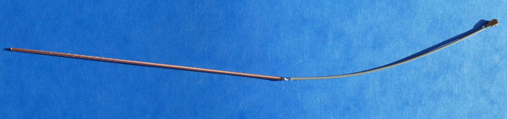
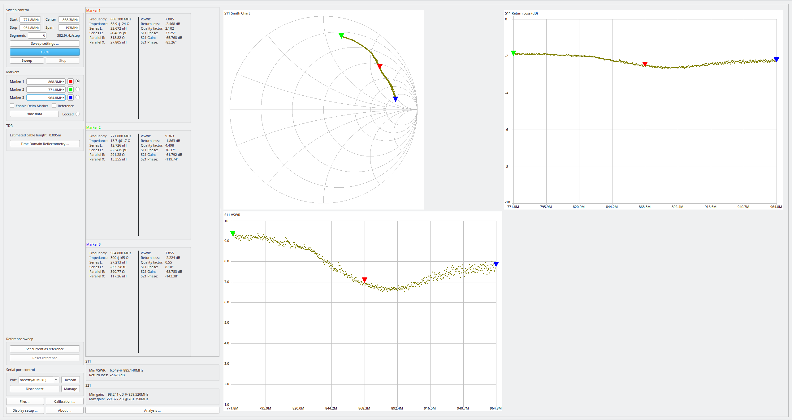
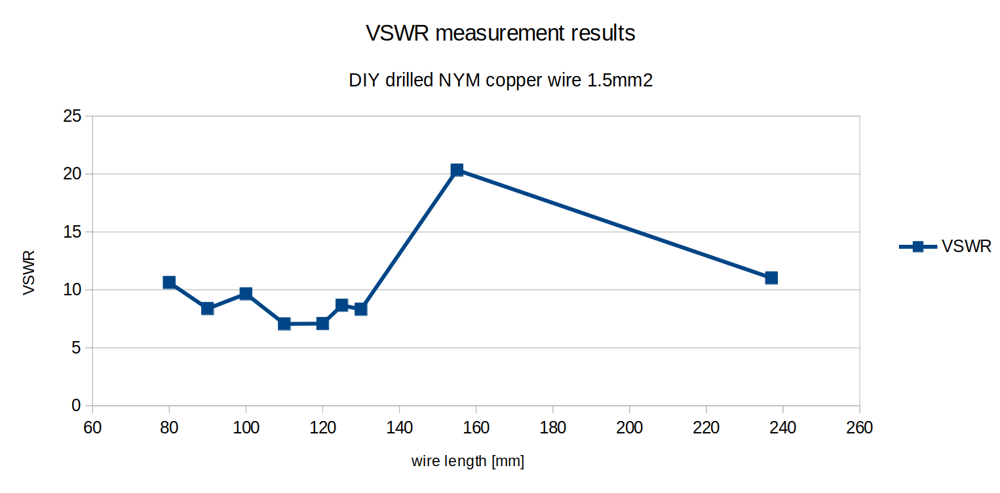

# DIY 868,3 MHz Stabantenne aus gedrilltem 1,5mm^2 NYM Kupferdraht

- Stablänge für SWR=7,058 @ 868,3 MHz: 110mm (ohne Isolation des Antennendrahts)
- Basis für Antennendraht: Netzleitung 1,5mm^2 gedrillt

- Messung mit Sysjoint NanoVNA F V3 Vector Network Analyzer
	+ Firmware v0.5.3
	+ fmin=771,8 MHz
	+ fmax=964,8 MHz
	+ Kalibrierung Open, Short, Load @ 771,8Mhz..964,8MHz
	+ Messung an SMA auf IPX IFX Adapter
		* calibrated offset delay: -35ps
		
- Bild der selbstgebauten 868,3 MHz Stabantenne mit angelötetem IPX IFX Adapter:

)
	
- bestes Messergebnis mit 110 mm Drahtlänge:
	* die Länge ist > 1/4 der Wellenlänge, da keine Massefläche benutzt wird
	* Messungen mit Massefläche werden später nachgereicht
	* * eine gute Stabantenne sollte als Gegenpol immer eine ausreichend große Massefläche haben, Durchmesser ca. Wellenlänge

- VSWR Messergebnisse für verschiedene Drahtlängen
	* das Minimum von VSWR ergibt sich für ca. 110 mm
	
	

	* die Ergebnisse sind [hier](./VSWR measurement results DIY_drilled_NYM_copper_wire_1.5mm2 antennas with different wire lengths.pdf) zu finden

- Bewertung:  Mittelmäßiges Stehwellenverhältnis VSWR von 7,058 @ 868,3MHz
	+ geeignete Antenne für Homematic
	+ mäßig ausgeprägtes Minimum des Stehwellenverhältnisses
	+ größere Bandbreite
	
- Antennencharakteristik

	+ Die Stabantenne ist ein Rundstrahler.

EOF
