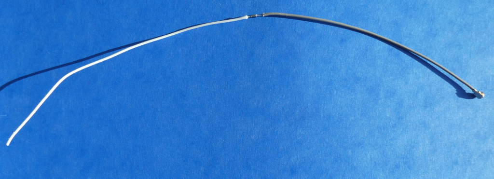
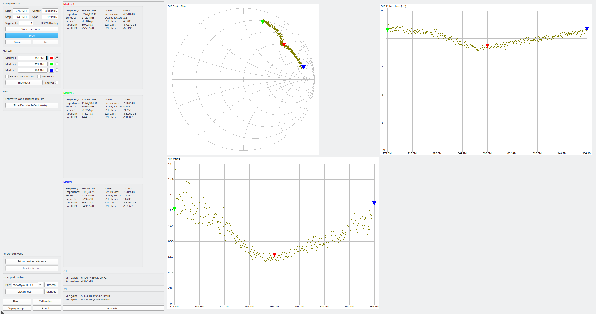

# DIY 868,3 MHz Drahtantenne aus einer Ader eines Flachbandkabels
- Stablänge für SWR=6,948 @ 868,3 MHz: 124mm (mit Isolation der Ader)
- Basis für Antennendraht: Flachbandkabel

- Messung mit Sysjoint NanoVNA F V3 Vector Network Analyzer
	+ Firmware v0.5.3
	+ fmin=771,8 MHz
	+ fmax=964,8 MHz
	+ Kalibrierung Open, Short, Load @ 771,8Mhz..964,8MHz
	+ Messung an SMA auf IPX IFX Adapter
		* calibrated offset delay: -35ps
		
- Bild der selbstgebauten 868,3 MHz Stabantenne mit angelötetem IPX IFX Adapter:

)
	
- bestes Messergebnis mit 124 mm Drahtlänge:
	* die Länge ist > 1/4 der Wellenlänge, da keine Massefläche benutzt wird
	* Messungen mit Massefläche werden später nachgereicht
	* eine gute Stabantenne sollte als Gegenpol immer eine ausreichend große Massefläche haben, Durchmesser ca. Wellenlänge

- Bewertung:  Mittelmäßiges Stehwellenverhältnis VSWR von 6,948 @ 868,3MHz
	+ geeignete Antenne für Homematic mit wenig Bauraum
	+ mäßig ausgeprägtes Minimum des Stehwellenverhältnisses
	+ größere Bandbreite
	
- Antennencharakteristik

	+ Die Drahtantenne ist (fast) ein Rundstrahler.

EOF
