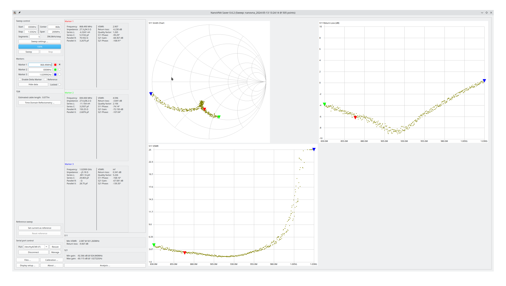

# DELOCK 12540 Antenne LoRa 863-928 MHz MHF, Stecker 1,68 dBi 1.13 Klebemontage

- erhältlich bei [Reichelt](https://www.reichelt.de/antenne-lora-863-928-mhz-mhf-stecker-1-68-dbi-1-13-klebemontage-delock-12540-p244267.html?CCOUNTRY=445&LANGUAGE=de&&r=1)

- Messung mit Sysjoint NanoVNA F V3 Vector Network Analyzer
	+ Firmware v0.5.3
	+ fmin=830 MHz
	+ fmax=930 MHz
	+ Kalibrierung Open, Short, Load @ 830Mhz..930MHz
	+ Messung an SMA auf IPX IFX Adapter
		* calibrated offset delay: -35ps
	
- Messergebnis:

- Bewertung: schlechtes Stehwellenverhältnis VSWR von 2,9 @ 868,3MHz
	+ ungeeignete Antenne für Homematic

EOF
