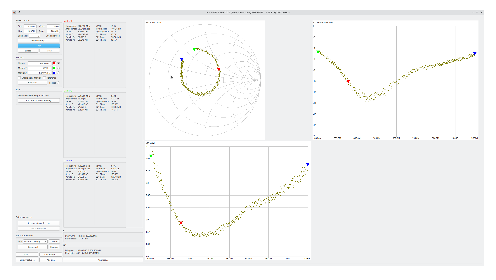

# Technikkram 868 MHz Antenne SMA RFID Antenne Vertical Omni Directional NFC Antenne für Homematic CCU3 CCU2 Charly CUL USB CC1101 Raspberry Pi GSM ELV Bausatz RasperryMatic piVCCU (868-870 MHz)

- (nicht mehr) erhältlich bei [Amazon](https://www.amazon.de/Technikkram-Directional-Homematic-Raspberry-RasperryMatic-Antenne-Vertical-Omni/dp/B078Y54T3D)

- Messung mit Sysjoint NanoVNA F V3 Vector Network Analyzer
	+ Firmware v0.5.3
	+ fmin=830 MHz
	+ fmax=930 MHz
	+ Kalibrierung Open, Short, Load @ 830Mhz..930MHz
	+ Messung an SMA auf IPX IFX Adapter
		* calibrated offset delay: -35ps
	
- Messergebnis:

- Bewertung: relativ schlechtes Stehwellenverhältnis VSWR von 1,9 @ 868,3MHz
	+ eher ungeeignete Antenne für Homematic

EOF
