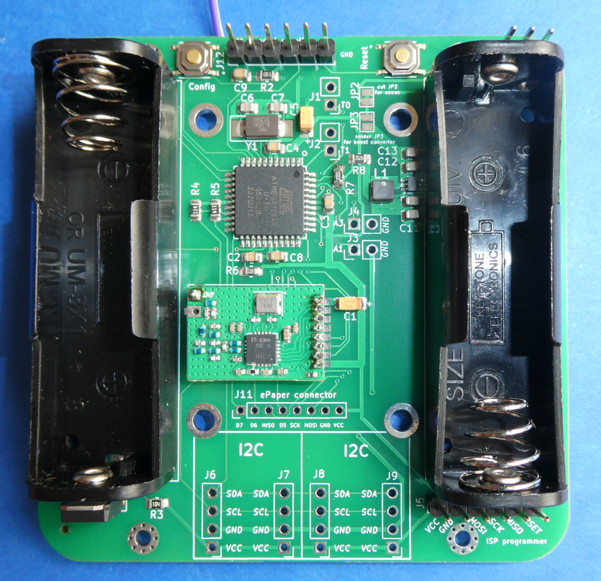

# FreqTest_range_test_with_distant_beacon   
 

# spezielle Version des AsksinPP Frequenztests zur Evaluierung der Reichweite einer Hochfrequenzübertragungsstrecke

- abgeleitet aus papas [FreqTest](https://github.com/pa-pa/AskSinPP/blob/master/examples/FreqTest/FreqTest.ino), mein Dank dafür geht an papa
-	bitte im Sketch die Architektur des verwendeten Prozessorbausteins des AsksinPP-Geräts einstellen:
	+	ATMega1284P: 	ARCH_AVR_1284P
	+	ATMega328P:		comment out '#define ARCH_AVR_1284P'
	+	STM32F1:			ARDUINO_ARCH_STM32F1
- Beispiel des Prototypentests des neuen 868,3 MHz Transceivers
 [CC1101_868MHz_RF_Modul_FUEL4EP](https://github.com/FUEL4EP/HomeAutomation/tree/master/AsksinPP_developments/PCBs/CC1101_868MHz_RF_Modul_FUEL4EP):

- für die Bildung einer Hochfrequenzfunkübertragungsstecke wird eine Funkbake mit dem Sketch [Range_test_beacon](https://github.com/FUEL4EP/HomeAutomation/tree/master/AsksinPP_developments/sketches/Range_test_beacon) benötigt

- der Sketch [FreqTest_range_test_with_distant_beacon](https://github.com/FUEL4EP/HomeAutomation/tree/master/AsksinPP_developments/sketches/FreqTest_range_test_with_distant_beacon) empfängt nur Telegramme von der Funkbake mit der Geräte-ID '0x77, 0x77, 0x77'. Telegramme von anderen Geräten werden nicht ausgewertet.
- der Sketch [FreqTest_range_test_with_distant_beacon](https://github.com/FUEL4EP/HomeAutomation/tree/master/AsksinPP_developments/sketches/FreqTest_range_test_with_distant_beacon) zeigt nur die RSSI-Werte für die Funkbake mit der Geräte-ID '0x77, 0x77, 0x77' an. RSSI-Werte von verworfenen Telegrammen anderer Geräte werden nicht ausgewertet.
-	durch Wahl eines geeigneten räumlichen Abstands und Ortes der Funkbake kann die Hochfrequenzfunkübertragungsstecke bei verschiedenen Dämpfungswerten ausgemessen werden. Die Empfangsreichweite eines RF-Tranceivers kann folgendermaßen ermittelt werden: Die Funkbake wird solange weiter entfernt von dem RF-Tranceivers unter Test entfernt aufgestellt, bis der Empfang von Funksignalen gerade noch möglich ist. 
	-	auf der Funkbake lauft der Sketch [Range_test_beacon](https://github.com/FUEL4EP/HomeAutomation/tree/master/AsksinPP_developments/sketches/Range_test_beacon)
	-	auf dem Gerät mit dem RF-Tranceiver unter Test läuft der Sketch [FreqTest_range_test_with_distant_beacon](https://github.com/FUEL4EP/HomeAutomation/tree/master/AsksinPP_developments/sketches/FreqTest_range_test_with_distant_beacon)
	-	eine typische Ausgabe auf dem seriellen Monitor ist [hier](./Log_files_as_reference/serial_monitor.log)
	-	die RSSI-Werte sollten symmetrisch zu 868,3 MHz sein und die gemessenen RSSI-Pegel sollten sehr ähnlich sein.
	-	ein guter RF-Transceiver erreicht mindestens RSSI-Werte von -100 dBm.

## Speicherbedarf auf einem ATMega1284P 

- Der Sketch verwendet 11482 Bytes (8%) des Programmspeicherplatzes. Das Maximum sind 130560 Bytes.
Globale Variablen verwenden 887 Bytes (5%) des dynamischen Speichers, 15497 Bytes für lokale Variablen verbleiben. Das Maximum sind 16384 Bytes.
/home/ewald/.arduino15/packages/MightyCore/tools/avrdude/7.2-arduino.1/bin/avrdude -C/home/ewald/.arduino15/packages/MightyCore/hardware/avr/3.0

## Haftungsausschluss

- die Nutzung der hier veröffentlichten Inhalte erfolgt vollständig auf eigenes Risiko und ohne jede Gewähr
- die nationalen Richtlinien für Funkbetrieb sind vom Anwender unbedingt zu beachten

## Lizenz 

**Creative Commons BY-NC-SA** 
Give Credit, NonCommercial, ShareAlike

 This work is licensed under a <a rel="license" href="http://creativecommons.org/licenses/by-nc-sa/4.0/">Creative Commons Attribution-NonCommercial-ShareAlike 4.0 International License</a>.

-EOF

