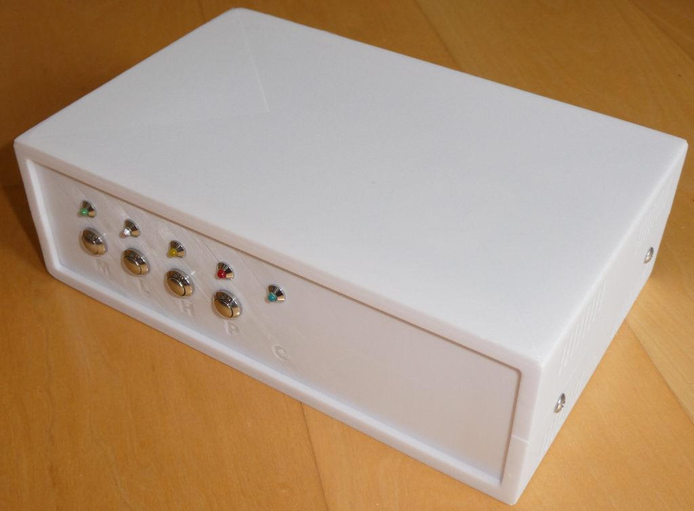
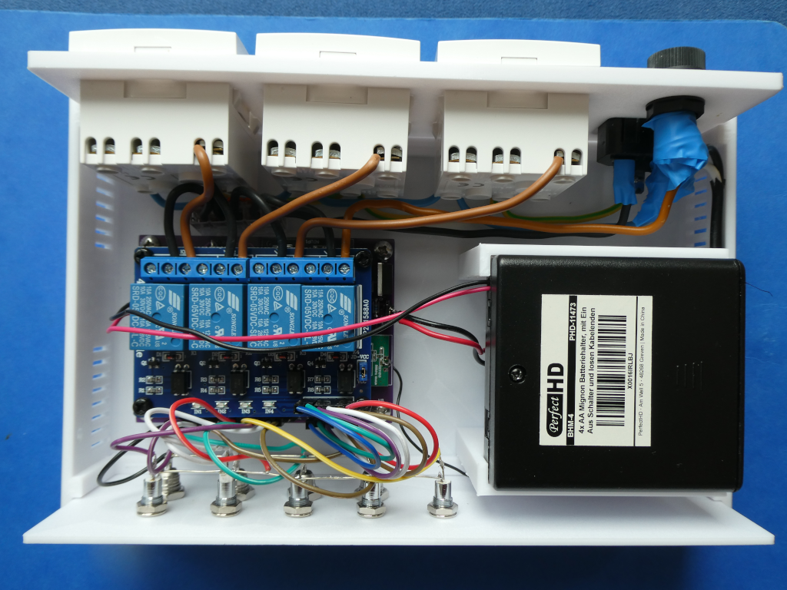

# HB-UNI-SenAct-4-4-SC_DS  
 

# 3x AsksinPP Schaltaktor für Betrieb an einem Netzfreischalter

- geeignet für den Betrieb an einem [Netzfreischalter](https://de.wikipedia.org/wiki/Netzfreischalter)
	+ [Netzfreischalter](https://www.haus.de/smart-home/netzfreischalter-30565) speisen im freigeschalteten Zustand, wenn alle Verbraucher ausgeschaltet sind,  eine niedrige Gleichspannung ein 
	+ normale Homematic-Aktoren sind daher **NICHT** für den Betrieb an einem Netzfreischalter geeignet
- NiMH-Akkubetrieb im Standby
	- geringer Standby-Verbrauch von ca. 1 mA @ 5V
- bei Aktivierung eines Aktors wird die Netzspannung zugeschaltet und am Ende wieder abgeschaltet
- automatische Ladeschaltung; die Ladesoftware ist bisher nur rudimentär implementiert; Update erfolgt später
- abgeleitet von [HB-UNI-SenAct-4-4](https://github.com/jp112sdl/HB-UNI-SenAct-4-4)
- ein herzliches Dankeschön für die Basisarbeit geht an [papa](https://github.com/pa-pa) und [Jérôme](https://github.com/jp112sdl)
- ein herzliches Dankeschön an alle, die im Homematic Forum geholfen haben, meine Probleme zu lösen

Ein Diskussionsstrang im [Homematic Forum](https://homematic-forum.de/forum/viewforum.php?f=76) existiert noch nicht. Bitte gegebenenfalls dort Fragen stellen.

## Wichtige Sicherheitshinweise, die unbedingt zu beachten sind

- dieses Gerät nutzt 230 Volt Netzspannung
- aufgrund der im Gerät frei geführten Netzspannung und des Netzspannungsanschlusses darf die Installation nur von Fachkräften durchgeführt werden, die aufgrund ihrer Ausbildung dazu befugt sind.
- die einschlägigen Sicherheits- und VDE-Bestimmungen sind unbedingt zu beachten. Durch eine unsachgemäße Installation können Sach- und Personenschäden verursacht werden, für die der Errichter haftet.
- Installationsarbeiten sowohl am primärseitigen Netzanschluss als auch am Sekundäranschluss dürfen nur **im stromlosen Zustand erfolgen. Dabei sind alle einschlägigen Vorschriften des Installationshandwerks zu beachten!** 
- alle 230 V Spannung führenden Leitungen und Lötanschlüsse sind im spannungslosen Zustand fachgerecht mit Isolationsband vor Berührungen zu schützen
- die Nutzung der hier veröffentlichten Inhalte erfolgt vollständig auf eigenes Risiko und ohne jede Gewähr

## Bitte Addon 'ep-hb-devices-addon' auf die Version >= 1.14 aktualisieren
- [hb-ep-devices-addon](https://github.com/FUEL4EP/HomeAutomation/releases/latest)

- bitte gegebenenfalls das Addon nach einem Update der CCU3/RaspberryMatic Firmware erneut installieren, falls Geräteparameter fehlen.
	
## Schaltung

- basierend auf der Platine [HB-UNI-SenAct-4-4-SC_DS_FUEL4EP](https://github.com/FUEL4EP/HomeAutomation/tree/master/AsksinPP_developments/PCBs/HB-UNI-SenAct-4-4-SC_DS_FUEL4EP)

	* bitte die Aufbauhinweise, Sicherheitshinweise  und Warnungen dort **UNBEDINGT** beachten
	* bitte darauf achten, dass der Arduino Pro Mini die 3,3V/8MHz Version ist!
	
## Frequenztest des CC1101 RF Moduls

- Bitte vor dem Aufspielen des eigentlichen Sketches HB-UNI-SenAct-4-4-SC_DS.ino **UNBEDINGT** einen [Frequenztest ATMega328P](https://github.com/pa-pa/AskSinPP/blob/master/examples/FreqTest/FreqTest.ino) durchführen. Viele CC1101 Module lassen sich ohne diesen Frequenztest nicht anlernen!
- Eine Beschreibung des Frequenztests ist [hier](https://asksinpp.de/Grundlagen/FAQ/Fehlerhafte_CC1101.html#ermittlung-der-cc1101-frequenz) zu finden.
		
## Verringerung des Ruhestroms: [siehe auch Referenz von TomMajor](https://github.com/TomMajor/SmartHome/tree/master/Info/Ruhestrom)

- Auf dem Arduino Pro Mini sollte der LDO Spannungsregler (die Stelle ist im Bild mit 1 markiert) sowie die Power-LED (2) entfernt werden, um den Ruhestrom wesentlich zu verringern.  
- Weiterhin kann die zweite LED am Arduino Pin 13 (SCK) entfernt werden (3). Deren Einfluss auf den Ruhestrom ist kleiner als bei LDO und Power-LED, trotzdem kann es sich auf lange Sicht lohnen da diese bei jeder CC1101 Kommunikation für kurze Zeit aktiv ist, besonders im BurstDetector Mode.

	

- Brown-Out_Detektor des ATmega328P  (BOD) ausschalten, siehe Einstellungen Arduino IDE unten unter Punkt **Benötigter Sketch**
- Bitte danach den [SleepTest](https://github.com/TomMajor/SmartHome/blob/master/Info/Ruhestrom/SleepTest/SleepTest.ino) durchführen. Der gemessene Ruhestrom im Sleep-Modus sollte < 10 uA betragen. Ist der gemessene Strom nach ein paar Sekunden höher, ist ein Bauteil defekt und muss ausgetauscht werden. Da das Auslöten immer schwierig ist, ist ein gesockelter Einbau zu empfehlen.
	       

## Das angemeldete Gerät in dem RaspberryMatic WebUI

## Vor dem Aufspielen von Software

- Bitte macht Euch zuerst mit den Grundlagen von AsksinPP [hier](https://asksinpp.de/Grundlagen/) vertraut.

## Bitte immer die aktuellste Version von AsksinPP nutzen

-  [AsksinPP Master](https://github.com/pa-pa/AskSinPP/tree/master)
- **WICHTIG**: Die Asksinpp Bibliothek muss gepatcht werden: siehe https://homematic-forum.de/forum/viewtopic.php?f=76&t=71788&hilit=SCKFloatOnIdle
- ein 'Radio.h'-Patch wird bereitgestellt

## Bitte genau diese Abfolge beim Einspielen von Software beachten:

- Details sind gegebenenfalls weiter unten zu finden

1. Bitte zuerst nochmals vergewissern, dass der verbaute Arduino Pro Mini ein 3,3V/8MHz Typ ist.
2. Das benötigte Addon [hb-ep-devices-addon](https://github.com/FUEL4EP/HomeAutomation/releases/latest) auf Eure CCU3/RaspberryMatic installieren.
3. Für das Programmierern und Setzen der Fuses des ATmega328P ist ein ISP Programmer empfohlen. Eine Anleitung ist [hier](https://asksinpp.de/Grundlagen/04-isp.html) zu finden. Dabei bitte unbedingt den ISP Programmer auf 3,3V einstellen!
4. Setzten der richtigen Fuses mit dem [avrdude script](avrdude/avrdude_328P.bsh) (LINUX version) oder mit [AVRDUDESS](https://blog.zakkemble.net/avrdudess-a-gui-for-avrdude/) (Windows Version): Fuse Setting: Low Byte:0xFF  High Byte:0xD2  Extended Byte:0xFF. Dafür bitte einen ISP Programmer verwenden, siehe [hier](https://asksinpp.de/Grundlagen/04-isp.html). Ich persönlich nutze diesen [ISP Programmer](https://www.amazon.de/Diamex-Programmer-XMEGA-ATMEGA-ATtiny/dp/B0064LLRB0).
5. Dann den [Frequenztest](https://asksinpp.de/Grundlagen/FAQ/Fehlerhafte_CC1101.html#ermittlung-der-cc1101-frequenz) durchführen. Dazu den [FreqTest.ino Sketch](https://github.com/pa-pa/AskSinPP/blob/master/examples/FreqTest/FreqTest.ino) ausführen und dabei auf ein erfolgreiches Beenden achten.
6. Den Config-Taster ganz lange drücken (ca. 6..8 Sekunden) bis die rote LED erlischt und im seriellen Monitor 'RESET' ausgegeben wird. Damit wird ein 'Werksreset' durchgeführt und das EEPROM gelöscht. Damit gehen auch alle im EEPROM gespeicherten Einstellungen verloren.  Die ermittelte Frequenzeinstellung des Frequenztests bleibt aber erhalten.

7. Gegebenenfalls im Sketch in der Struct DeviceInfo die GeräteID (0x01) und den Gerätenamen ("SENACTDS01", genau 10 Zeichen!) ändern,  falls mehrere Geräte dieses Typs verwendet werden.

8. Die aktuelle Version des [HB-UNI-SENACT-4-4-SC_DS](https://github.com/FUEL4EP/HomeAutomation/tree/master/AsksinPP_developments/sketches/HB-UNI-SENACT-4-4-SC_DS) Sketches herunterladen, siehe unten.
9. Die benötigten Libraries installieren, siehe unten unter 'Benötigte Libraries'.
10. Dann den Sketch [HB-UNI-SENACT-4-4-SC_DS.ino](https://github.com/FUEL4EP/HomeAutomation/tree/master/AsksinPP_developments/sketches/HB-UNI-SENACT-4-4-SC_DS/HB-UNI-SENACT-4-4-SC_DS.ino) kompilieren und mit dem ISP Programmer auf den Arduino Pro Mini hochladen.
11. Den neuen Aktor in der CCU/RaspBerryMatic anlernen.
12. Den neuen Aktor in der CCU3/RaspberryMatic einem Gewerk, z.B. 'Multimedia', zuordnen.
13. Sollte das initiale Peering der vier Tasten mit den 4 Aktoren nicht klappen, bitte diese Zeile für nur einen neuen Programmierlauf auskommentieren:
> //first=true;    // comment out for only one (!) programming if the peering is not working as expected, e.g. if after you have changed the pin assignment
 

## Benötiger Sketch

[HB-UNI-SENACT-4-4-SC_DS](https://github.com/FUEL4EP/HomeAutomation/tree/master/AsksinPP_developments/sketches/HB-UNI-SENACT-4-4-SC_DS)

- bitte das gesamte Verzeichnis mit allen Unterverzeichnissen kopieren:

### Zur lokalen Installation des Github Releases auf Deinem Computer

- gehe bitte in Dein Zielinstallationsverzeichnis, wo Du mit dem HB-UNI-SENACT-4-4-SC_DS Aktor arbeiten möchtest

  - gebe dort 'git clone https://github.com/FUEL4EP/HomeAutomation.git' ein
	  + damit lädst Du mein [Sammelrepository](https://github.com/FUEL4EP/HomeAutomation) für alle meine auf Github freigegebenen HomeBrew Sensoren und Aktoren herunter.
  - dann findest Du ein neues Verzeichnis 'HomeAutomation' auf Deinem Rechner, das alle meine auf Github freigebenen Sensoren und Aktoren enthält, siehe [README.md](https://github.com/FUEL4EP/HomeAutomation/blob/master/README.md)
  	+ mache bitte regelmäßig ein Update mit 'git pull'
 -	enthalten ist auch das notwendige Addon '[ep-hb-devices-addon](https://github.com/FUEL4EP/HomeAutomation/releases/latest)'
 -	den HB-UNI-SENACT-4-4-SC_DS Aktor findest Du unter './HomeAutomation/tree/master/AsksinPP_developments/sketches/HB-UNI-SENACT-4-4-SC_DS'
 
- alternativ kann vom Github [Sammelrepository](https://github.com/FUEL4EP/HomeAutomation) die ZIP-Datei HomeAutomation-master.zip heruntergeladen und auf dem lokalen Rechner ausgepackt werden. Bitte dann regelmäßig auf Github nach Updates schauen.

- nach erfolgreicher Inbetriebnahme können die Debugausgaben im serial Monitor ausgeschaltet werden. Dazu bitte im Sketch HB-UNI-SENACT-4-4-SC_DS.ino auskommentieren:

> // !! NDEBUG sollte aktiviert werden wenn die Aktorentwicklung und die Tests abgeschlossen sind und das Gerät in den 'Produktionsmodus' geht. 
> // Insbesondere die RAM-Einsparungen sind wichtig für die Stabilität / dynamische Speicherzuweisungen etc. 
> // Dies beseitigt dann auch die mögliche Arduino-Warnung 'Low memory available, stability problems may occur'. 
> // 
> //#define NDEBUG

- als Taktfrequenz des ATmega328P 8 MHz @ 3.3V externer Quarz einstellen
- der Sketch verwendet 28566 Bytes (92%) des Programmspeicherplatzes. Das Maximum sind 30720 Bytes.
Globale Variablen verwenden 1078 Bytes (52%) des dynamischen Speichers, 970 Bytes für lokale Variablen verbleiben. Das Maximum sind 2048 Bytes.

- [Fuses Calculator](http://eleccelerator.com/fusecalc/fusecalc.php); select ATmega328P

- [avrdude script](avrdude/avrdude_328P.bsh) (LINUX version)
	- wichtig ist dass dieser Skript **VOR** dem Flashen des Programmcodes ausgeführt wird.  Das EESAVE Konfigurationsbit des Atmega328P muss gesetzt sein (Preserve EEPROM memory through the Chip Erase cycle; [EESAVE=1])

- die Programmierung erfolgt mit einem ISP Programmer, z.B. Diamex ISP USB Programmer. Dazu dienen die Signale VCC, GND, MOSI, SCK, MISO,
RSET an der Steckerleiste links der Basisplatine. Dort eine Steckerleiste einlöten.
- ISP Programmer auf 3.3V einstellen!
- Einstellungen Arduino IDE: 8MHz, 3.3V
- Hochladen des kompilierten Sketchs im Arduino IDE mit: Sketch => Hochladen mit Programmer
- Debugging wird über den seriellen Monitor mit einem FTDI Adapter USB zu TTL Serial für
3,3V und 5V für Arduino gemacht. Als Baudrate des seriellen Monitors bitte **57600** Baud einstellen.
- **WICHTIG:** Wenn der Config-Taster des Aktors (unbeabsichtigt) länger als 6..8 Sekunden gedrückt wurde, muss der Aktor danach neu an der Zentrale angelernt werden. Beim Reset wird die Adresse der Zentrale (CCU3/RaspberryMatic) im EEPROM des 328P gelöscht. Damit funktioniert LazyConfig nicht mehr. Zum erneuten Anlernen, zuerst den Aktor in der CCU3/RaspberryMatic ablernen und dann normal wieder anlernen. 

## Benötigte Libraries

+ [AskSinPP Library](https://github.com/pa-pa/AskSinPP) 
+ [EnableInterrupt](https://github.com/GreyGnome/EnableInterrupt) 
+ [Low-Power](https://github.com/rocketscream/Low-Power)

- Die beiden Include Dateien sind im Verzeichnis des Sketches zu finden:

> #include "tmBattery.h"
  #include "PulseReset.h"

### Ladefunktion für die NiMH-Akkumulatorbatterien
- die Ladefunktionalität ist noch nicht implementiert!  Die Akkumulatorbatterien müssen gegebenenfalls extern geladen werden. Eine Warnung bei Unterspannung erfolgt.
- die Ladefunktion wird nachgereicht werden, sobald sie verfügbar sein wird.
- ein rudimentäres Laden bei jeder Aktivierung eines Relais ist zur Zeit als vorübergehende Lösung eingebaut (ca. 25mAh)

## Benötigtes Addon

- [hb-ep-devices-addon](https://github.com/FUEL4EP/HomeAutomation/releases/latest)
- minimale Versionn: 1.14

- bitte dieses Addon 'hb-ep-devices-addon.tgz 'vor dem Anlernen des HB-UNI-SENACT-4-4-SC_DS Aktors auf der RaspberryMatic / CCU3 installieren (kein unzip vonnöten!)

## Verringerung der Tx Sendeleistung

- nur Experten wird empfohlen: die Tx Sendeleistung wird zur Zeit im Sketch eingestellt:

> sdev.radio().initReg(CC1101_PATABLE, PA_Normal);                                    // normal RF transmission power of CC1101, PA_Normal = 0x50, can be set to PA_LowPower or PA_MaxPower; see Radio.h

## Wichtige Sicherheitshinweise, maximale Strombelastbarkeit

- bitte die maximale Strombelastbarkeit der Relais beachten, siehe Aufdruck:

- auch bei rein ohmschen Lasten sollte die maximale Strombelastbarkeit der Relais nicht ausgereizt werden.
- bei induktiven Lastanteilen sollte weniger als die Hälfte des spezifizierten Maximalstroms zugrunde gelegt werden.  Bitte lesen Sie dazu das Datenblatt des Relais oder fragen Sie Ihre Elektrofachkraft.

## Haftungsausschluss

- aufgrund der im Gerät frei geführten Netzspannung und des Netzspannungsanschlusses darf die Installation nur von Fachkräften durchgeführt werden, die aufgrund ihrer Ausbildung dazu befugt sind.
- die einschlägigen Sicherheits- und VDE-Bestimmungen sind unbedingt zu beachten. Durch eine unsachgemäße Installation können Sach- und Personenschäden verursacht werden, für die der Errichter haftet.
- Installationsarbeiten sowohl am primärseitigen Netzanschluss als auch am Sekundäranschluss dürfen nur **im stromlosen Zustand erfolgen. Dabei sind alle einschlägigen Vorschriften des Installationshandwerks zu beachten!** 
- alle 230 V Spannung führenden Leitungen und Lötanschlüsse sind im spannungslosen Zustand fachgerecht mit Isolationsband vor Berührungen zu schützen
- die Nutzung der hier veröffentlichten Inhalte erfolgt vollständig auf eigenes Risiko und ohne jede Gewähr
- da es sich um ein Gerät mit Netzspannung handelt, ist besondere Vorsicht beim Betrieb des Geräts vonnöten
- das Gerät vor Feuchtigkeit schützen!

## Lizenz 

**Creative Commons BY-NC-SA** 
Give Credit, NonCommercial, ShareAlike

 This work is licensed under a <a rel="license" href="http://creativecommons.org/licenses/by-nc-sa/4.0/">Creative Commons Attribution-NonCommercial-ShareAlike 4.0 International License</a>.

-EOF

