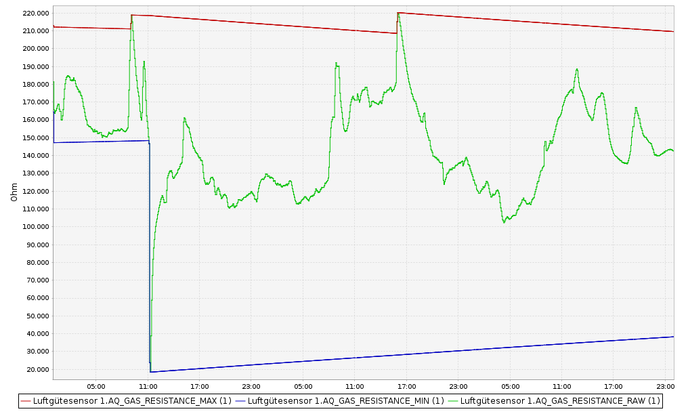

# Autocalibration

An autocalibration algorithm has been implemented in the code [sens_bme680.h](../sensors/sens_bme680.h).

- The following variables are of importance. The leading '_' of the C++ code representations are omitted due to limitations of the Markdown syntax.

> gas := measured gas resistance = AQ_GAS_RESISTANCE_RAW in CCU Historian 
> gas_upper_limit := upper gas resistance reference = AQ_GAS_RESISTANCE_MAX in CCU Historian 
> gas_lower_limit := measured gas resistance reference = AQ_GAS_RESISTANCE_MIN in CCU Historian 
> gas_upper_limit_min := minimum limit of gas_upper_limit
> gas_lower_limit_max := maximum limit of gas_lower_limit
> min_gas_resistance := minimum ever measured gas resistance since last reset
> max_gas_resistance := maximum ever measured gas resistance since last reset

### gas = AQ_GAS_RESISTANCE_RAW in CCU Historian

### gas_upper_limit = AQ_GAS_RESISTANCE_MAX in CCU Historian

- gas_upper_limit is basically the min peak (largest) value of the so far measured gas resistances
- As long as the currently measured gas resistance is lower than the gas_upper_limit,  gas_upper_limit is **decaying** every sampling cycle by a factor IIR_FILTER_COEFFICIENT

>  #define IIR_FILTER_COEFFICIENT 0.0001359 // 1.0 -0.9998641 ; Decay to 0.71 in about one week for a 4 min sampling period (in 2520 sampling periods)  
>  gas_upper_limit = gas_upper_limit - ( gas_upper_limit - gas_lower_limit) * IIR_FILTER_COEFFICIENT; 

- However, the maximum decay is limited to gas_upper_limit_min

- This approach allows to allow a certaing aging of the sensor, the upper gas resistance reference 'gas_upper_limit' will be dynamically adjusted.
- gas_upper_limit_min is also dynamically defined by the ever measured min and max gas resistances:

> gas_upper_limit_min = min_gas_resistance + (max_gas_resistance - min_gas_resistance) * **max_decay_factor_upper_limit** / 100;

- max_decay_factor_upper_limit is set as device parameter in the WebUI to typically 70 [%]. You can increase it to e.g. 80 [%] if the aging of your BME680 got smaller

### gas_lower_limit = AQ_GAS_RESISTANCE_MIN in CCU Historian

- gas_lower_limit is basically the min peak value (smallest) of the so far measured gas resistances
- As long as the currently measured gas resistance is larger than the gas_lower_limit,  gas_lower_limit is **increasing** every sampling cycle by a factor IIR_FILTER_COEFFICIENT

>  #define IIR_FILTER_COEFFICIENT 0.0001359 // 1.0 -0.9998641 ; Increase to 1/0.71 in about one week for a 4 min sampling period (in 2520 sampling periods)  
>  gas_lower_limit_max = _min_gas_resistance + (max_gas_resistance - min_gas_resistance) * **max_increase_factor_lower_limit** / 100; 

- However, the maximum increase is limited to gas_lower_limit_max

- This approach allows to allow a certaing aging of the sensor, the lower gas resistance reference 'gas_lower_limit' will be dynamically adjusted.
- gas_lower_limit_max is also dynamically defined by the ever measured min and max gas resistances:

> gas_lower_limit_max = _min_gas_resistance + (max_gas_resistance - min_gas_resistance) * max_decay_factor_upper_limit / 100;

- max_decay_factor_upper_limit is set as device parameter in the WebUI to typically 30 [%]. You can decrease it to e.g. 20 [%] if the aging of your BME680 got smaller

### gas_score = AQ_LEVEL in CCU Historian

- gas_score is the normlized BME680 gas resistance:

gas_score = ((gas - gas_lower_limit)/(gas_upper_limit - gas_lower_limit)) * 100.0;

### Graphical view of the autocalibration

- The below diagram shows the above described autocalibration algorithms as waveforms collected in the CCU Historian.

### Autocalibration of the residual of the multiple linear regression

Basically the same autocalibration approach is implemented for the residual of the multilinear regression. For details, please refer to the comments in the code [sens_bme680.h](../sensors/sens_bme680.h).

- However, only the variable aq_state_scaled = Datapoint Parameter AQ_LOG10 in CCU Historian is observble from outside.

### Prerequisites and recommendations for the autocalibration

#### Prerequisites

- Before stating the autocalibration process, please adjust the temperature and humity offsets in the WebUI device parameters. For that purpose, please put a 'golden' reference sensor next to the HB-UNI-Sensor1-AQ-BME680 sensor. Preferably do this over night when the temperature is quite stable without big disturbances:

- Here three HB-UNI-Sensor1-AQ-BME680 sensors' temperature measurements are shown together with the temperature measurement of a 'golden' sensor. 
- **After a device's power-on or reset**, a new autocalibration cycle is started. This will happen e.g. when you will change the batteries.
- To enable a meaningful autocalibration, the gas_upper_limit and gas_lower_limit need to be set by
	+ expose the sensor to fresh air for at least 30 minutes. This will set gas_upper_limit to a large value.
	+ expose the sensor to bad air for at least 30 minutes. The easiest way is to put a paper tissue soaked with clear liquors (schnaps) close to the BME680 sensor.
	+ for generating bad air, you can also experiment with cheese or other strong smelling chemicals.
	+ in both cases, fresh and bad air exposure, please observe the transient effects in the CCU historian (similar to above diagram).
	+ please note that the outside air is sometimes not fresh at all. Repeat the fresh air exposure at a different time in such a case. Do experiments to get a better understanding.
	
	
#### Recommendations

- Repeat the exposure of the sensor to fresh and bad air regularily every 1..3 months.
- If you want to change the batteries, please attach the sensor first to an ISP programmer. Such the sensor will not forget the autocalibration parameters during battery exchange.

 

