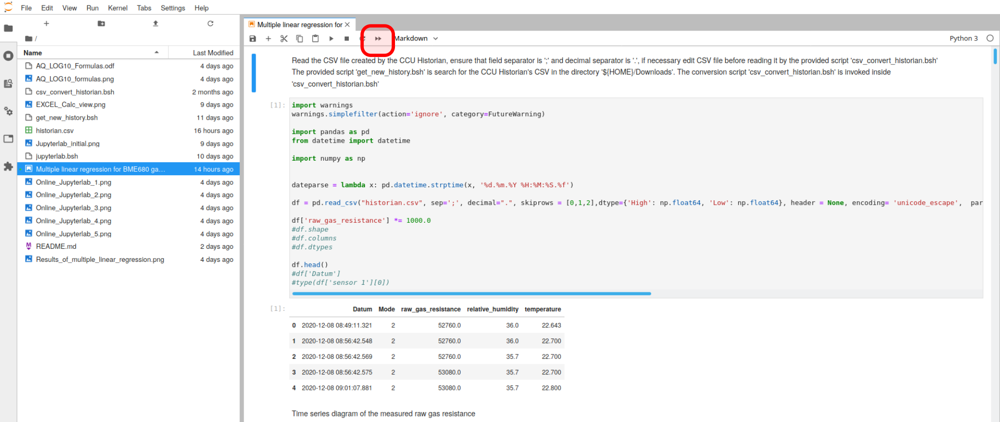
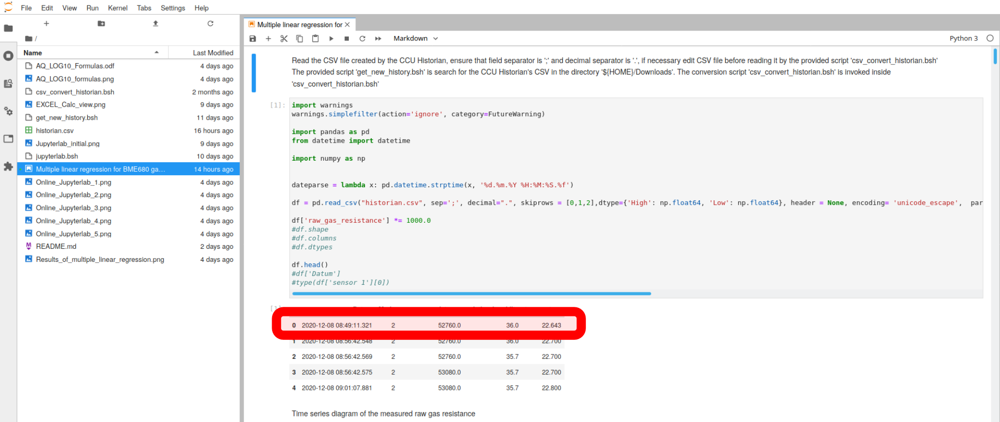
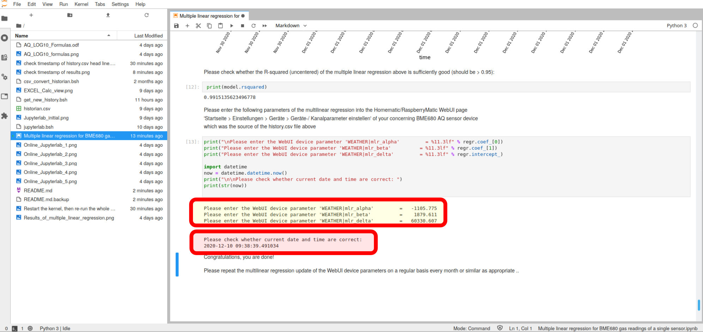
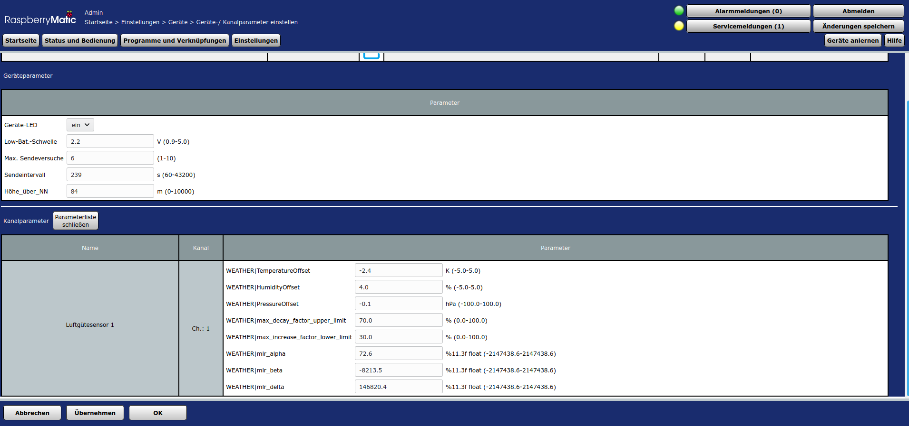
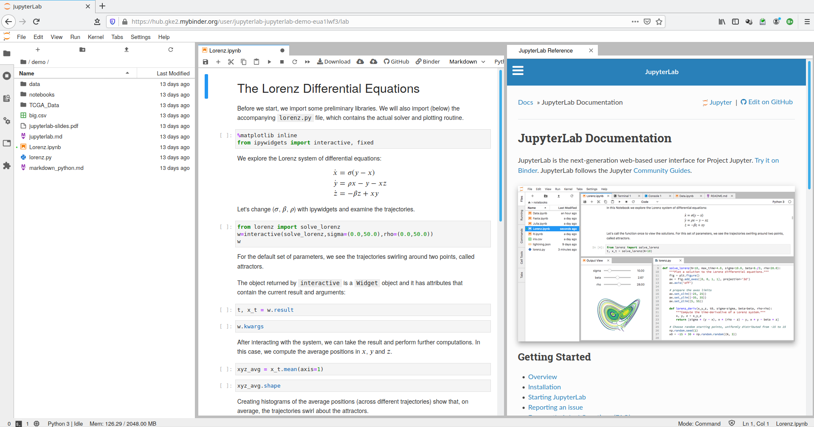
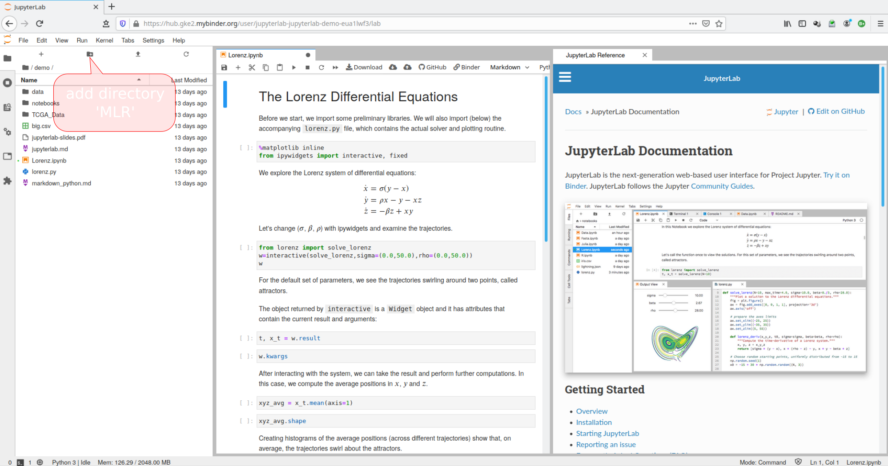
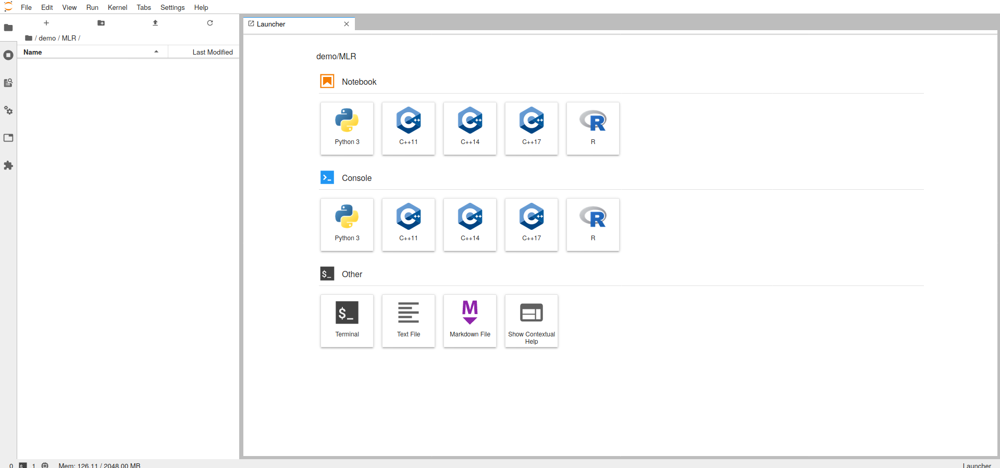
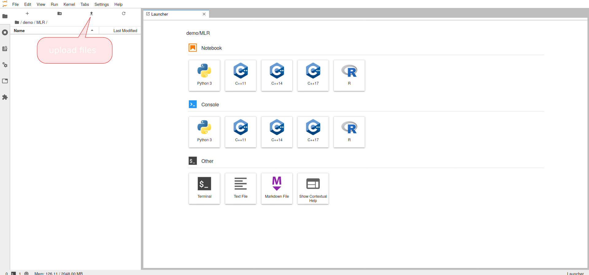

# Please run the following commands in order to execute a multiple linear regression:
Linux is assumed as operating system, please adapt to Windows as applicable by yourself, I don't use Windows at all and cannot support it!

## Preparational steps

- Before starting to collect data for a multiple linear regression, it is necessary to calibrate the temperature and humididy measurements of the BME680 sensor. For that purpose, please track the BME680 sensor's temperature and humidity e.g. in the CCU Historian and compare them with 'golden' reference sensor's values. Extract the offsets between the reference temperature/humidiy and the BM680 temperature/humidity measurements, ideally during night when there are little disturbances and thus flat curves, and use them for setting the temperature and humidity offsets in the WebUI.** Please run the offset calibration in two separated sequential steps**:
	+ calibrate the BME680 temperature offset in a first step (first night)
	+ calibrate then the BME680 humidity offset in a second step (second night)
	- ** do not calibrate temperature and humidity together in a singular step since they depend on each other from physics point of view**

- Collect history data with your HB-UNI-Sensor1-AQ-BME680 and record them with CCU Historian.
	Take care to have as many as possible different air quality, tempperature, and humidity conditions during the recording time:
	- put the sensor into your kitchen when you are cooking
	- put the sensor outside to fresh air
	- put the sensor to other locations with strong smells
	- put a paper tissue soaked with clear liquors (schnaps) close to the BME680 sensor
	- place strong smelling food e.g. like cheese close to the sensor 
- Collect history data for 1..4 weeks
- Output a history CSV file in the CCU Historian's Trend diagram (button 'CSV-Export' at the bottom) dumping the following data points (click exactly in that sequence in CCU Historian's 'Datenpunktliste' to create the Trend diagram):

	- HB-UNI-Sensor1-AQ-BME680's AQ_GAS_RESISTANCE_RAW
	- HB-UNI-Sensor1-AQ-BME680's TEMPERATURE
	- HB-UNI-Sensor1-AQ-BME680's MY_HUMIDITY  

- Ensure that your browser is downloading the CSV file to your ${HOME}/Downloads directory as 'historian.csv'. Check the correct time stamp of that file before continuing.  

- Execute the provided script 'get_new_history.bsh'. It fetches CCU Historian's CSV file from '${HOME}/Downloads' and translates the CSV decimal separator from ',' to '.' (english notation)  

- If you read in the created CSV file into Microsoft Office EXCEL or Libreoffice Calc, it should look like:

 

 >For the CSV import, please select a column separator the semicolon ';'
 Please check that the decimal separator is a **'.'**
 
### Jupyterlab

JupyterLab is a web-based interactive development environment for Jupyter notebooks, code, and data. JupyterLab is flexible: configure and arrange the user interface to support a wide range of workflows in data science, scientific computing, and machine learning. JupyterLab is extensible and modular: write plugins that add new components and integrate with existing ones.
For more details, please refer to https://jupyter.org/.
JupyterLab is used here to execute the multiple linear regression coded in Python language.

A tutorial of Jupyterlab can be found [here](https://www.tutorialspoint.com/jupyter/jupyterlab_installation_and_getting_started.htm).

#### Existing Jupyterlab installation on your computer

- Please ensure that yuou have installed the following Phyton modules on your computer (e.g. by pip install):
	+ pandas
	+ numpy
	+ matplotlib
	+ sklearn
	+ statsmodels
	+ datetime

- If you have a local (Linux) installation of Jupiterlab, please invoke a terminal window in the sketch's directory and enter the following commands:

>cd ${sketch_dir}/Multiple_Linear_Regression 
>jupyter lab --allow-root --ip=0.0.0.0 --no-browser 

- Then you should get in the terminal window an output of an URL:

> http://127.0.0.1:8888/?token=<token>

- Invoke this URL in a browser like Firefox or Chrome. You will get an interactive Jupyterlab session in your browser like:

- Select the Python notebook 'Multiple linear regression for BME680 gas readings of a single sensor.ipynb' in the directory and file browser at the left side by clicking on it

- Click on restart the kernel, then re-run the whole notebook button:

- In the Launcher on the right hand side, all cells with a number in square brackets have been executed and the results are shown.

- Wait a bit (can be minutes depending on history.csv size) until the execution of the notebook will be finished.

- Check the correct timestamp of your history.csv file (start time of tracking):

- Then scroll down to see the results at the very bottom. Check the correct timestamp at the bottom:

- Enter the yellow marked results as device parameters into the RaspberryMatic / CCU3 WebUI

#### Online Jupyterlab session in a browser

- An easier approach is an online Jupyterlab session in a browser. This does not require an installation of Jupyterlap on your computer and may the most convenient way for most users to execute the multiple linear regression.
- Start in a browser (Firefox, Chrome) an [interactive demo Jupyterlab session](https://mybinder.org/v2/gh/jupyterlab/jupyterlab-demo/master?urlpath=lab/tree/demo)
- Your browser session should look like this:

- Add a new directory 'MLR':

- Delete the sessions 'Lorenz.ipynb' and 'Jupyterlab Reference' on the right hand side

- Click to the button 'Upload Files' and upload the following local files:

> 	+ 'history.csv'
> 	+ 'Multiple linear regression for BME680 gas readings of a single sensor.ipynb'

- Click on 'Multiple linear regression for BME680 gas readings of a single sensor.ipyn'

- Click on restart the kernel, then re-run the whole notebook button:

- In the Launcher on the right hand side, all cells with a number in square brackets have been executed and the results are shown.

- Wait a bit (can be minutes depending on history.csv size) until the execution of the notebook will be finished.

- Check the correct timestamp of your history.csv file (start time of tracking):

- Then scroll down to see the results at the very bottom. Check the correct timestamp at the bottom:

- Enter the yellow marked results as device parameters into the RaspberryMatic / CCU3 WebUI

- You are done and have successfully executed a multiple linear regression! Congratulations!

