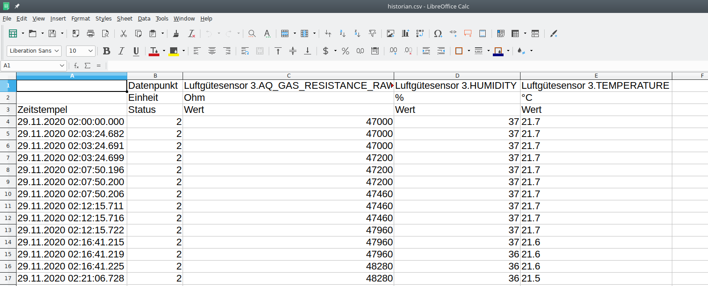
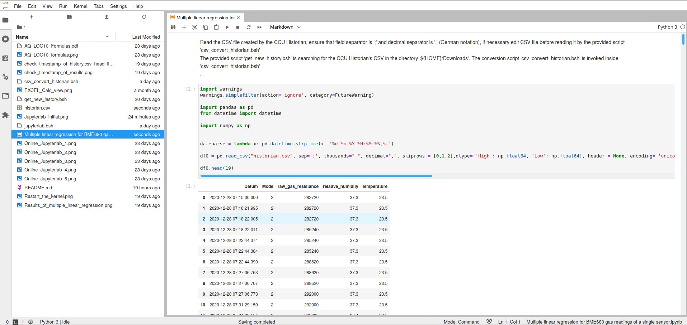

#Please run the following commands in order to execute a multiple linear regression:
Linux is assumed as operating system, please adapt to Windows as applicable by yourself, I don't use Windows at all and cannot support it!

##Preparational steps

- Output a history CSV file in the CCU Historian's Trend diagram (button 'CSV-Export' at the bottom) dumping the following data points (click exactly in that sequence in CCU Historian's 'Datenpunktliste' to create the Trend diagram):

	- HB-UNI-Sensor1-AQ-BME680's AQ_GAS_RESISTANCE_RAW
	- HB-UNI-Sensor1-AQ-BME680's TEMPERATURE
	- HB-UNI-Sensor1-AQ-BME680's HUMIDITY  

- Ensure that your browser is downloading the CSV file to your ${HOME}/Downloads directory as 'historian.csv'. Check the correct time stamp of that file before continuing.  

- Execute the provided script 'get_new_history.bsh'. It fetches CCU Historian's CSV file from '${HOME}/Downloads' and translates the CSV decimal separator from ',' to '.' (english notation)  

- If you read in the created CSV file into Microsoft Office EXCEL or Libreoffice Calc, it should look like:

 

 >For the CSV import, please select a column separator the semicolon ';'
 Please check that the decimal separator is a **'.'**
 
### Jupyterlab

JupyterLab is a web-based interactive development environment for Jupyter notebooks, code, and data. JupyterLab is flexible: configure and arrange the user interface to support a wide range of workflows in data science, scientific computing, and machine learning. JupyterLab is extensible and modular: write plugins that add new components and integrate with existing ones.
For more details, please refer to https://jupyter.org/.
JupyterLab is here used to execute the multiple linear regression coded in Python language.

#### Existing Jupyterlab installation on your computer

- If you have a local (Linux) installation of Jupiterlab, please invoke a terminal window in the sketch's directory and enter the following commands:

>cd ${sketch_dir}/Multiple_Linear_Regression 
>jupyter lab --allow-root --ip=0.0.0.0 --no-browser 

- Then you should get in the terminal window an output of an URL:

> http://127.0.0.1:8888/?token=<token>

- Invoke this URL in a browser like Firefox or Chrome. You will get an interactive Jupyterlab session in your browser like:

- Select the Python notebook 'Multiple linear regression for BME680 gas readings of a single sensor.ipynb' in the directory browser 

#### Online Jupyterlab session in a browser

- An easier approach is an online Jupyterlab session in a browser. This does not require an installation of Jupyterlap on your computer and may the most convenient way for most users to execute the multiple linear regression.
- Start in a browser (Firefox, Chrome) an [interactive demo Jupyterlab session](https://hub.gke2.mybinder.org/user/jupyterlab-jupyterlab-demo-6s0h46lu/lab/tree/demo)
