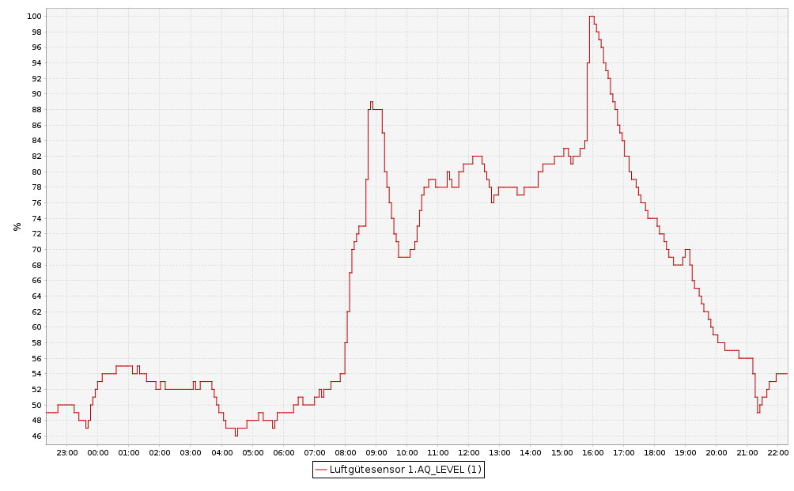

# Universeller Luftgütesensor auf der Basis von dem Bosch BME680 Sensor (HB-UNI-Sensor1-AQ-BME680)

- abgeleitet von Jérômes ([jp112sdl](https://github.com/jp112sdl)) [HB-UNI-Sen-IAQ](https://github.com/jp112sdl/HB-UNI-Sen-IAQ)
- ein herzliches Dankeschön für die Basisarbeit geht an Jérôme (jp112sdl)
- ein herzliches Dankeschön an alle, die im Homematic Forum geholfen haben, meine Probleme zu lösen
- der Homematic Forum [Diskussionsstrang](https://homematic-forum.de/forum/viewtopic.php?t=49422)
- hilfreich ist auch die Diskussion zu den [rftypes XMLs](https://homematic-forum.de/forum/viewtopic.php?f=76&t=62578&sid=cf0f4cd99f7ee2bf070e9f39391ee652)

## Bitte immer die aktuellste Version von AsksinPP nutzen

- HB-UNI-Sensor1-AQ-BME680.ino kompiliert nur mit der aktuellsten Version von [AsksinPP](https://github.com/pa-pa/AskSinPP/tree/master)

## ACHTUNG: EEPROM Nutzung

-	Die EEPROM Software zur regelmässigen Zwischenspeicherung von wichtigen Sensorparametern wurde überarbeitet. Sie verwendet jetzt eine Structure für alle relevanten Parameter und eine CRC32 Prüfsumme. Diese neue Version ist mit der vorausgegangenen EEPROM Software nicht kompatibel. Daher findet nach den Flashen der neuen Software auf jeden Fall eine neue Autokalibrierung statt.

## Aufgebauter Sensor ohne Gehäusedeckel

## Neue Eigenschaften im Vergleich zum HB-UNI-Sen-IAQ Sensor

- die relative Luftfeuchtigkeit wird mit 0,1 % rLF Genauigkeit ausgegeben
- die Batteriespannung wird mit 10 mV Genauigkeit und jeden Zyklus ausgegeben 
- alle wichtigen Sensorparameter können interaktiv ohne Neuprogrammierung im WebUI der [RaspberryMatic](https://github.com/jens-maus/RaspberryMatic) / [CCU3](https://de.elv.com/smart-home-zentrale-ccu3-inklusive-aio-creator-neo-lizenz-ccu-plugin-151965?fs=2591490946) eingegeben werden:
	+ [Startseite > Einstellungen > Geräte > Geräte-/ Kanalparameter einstellen](Images/Setting_of_device_parameters_in_WebUI.png)
	+ Bitte beachten: Der LazyConfig Modus funktioniert NUR bei einem angelernten Sensor. Wird der Resettaster nach dem Anlernen gedrückt oder die Batterien gewechselt, funktioniert der LazyConfig Modus nicht mehr. Ein erneutes Anlernen ist dann notwendig, um den LazyConfig Mode wieder zum Funktionieren zu bringen.
	
- Ausgabe des Luftgütegrads AQ_LEVEL: normierter BME680 Gaswiderstand 0..100% (ohne Kompensation der Einflüsse von Temperatur und absoluter Luftfeuchte auf die gemessene Luftgüte)
- Ausgabe der logarithmischen Luftqualität AQ_LOG10: logarithmierte normierte und kompensierte Luftqualität 0.0..4.0 (mit Kompensation der Einflüsse von Temperatur und absoluter Luftfeuchte auf die gemessene Luftqualität)
	+ die logarithmischen Luftqualität AQ_LOG10 korreliert in der Regel gut mit dem CO2 Gehalt der Luft
	+ Formeln zur Berechnung von AQ_LOG10:

- Autokalibrierung für den Luftgütegrad und die logarithmische Luftqualität: Zur Kalibrierung muss der Sensor nur in Betrieb genommen werden. Es sollte nur regelmäßig für ca. 20..30 Minuten bei völlig geöffneten Fenstern quer gelüftet werden. Die Autokalibrierung ist adaptiv und wird im Laufe der Zeit immer besser. Der Adaptionsprozess kann mehrere Tage dauern.
	
- Details zur Autokalibrierung sind [hier](./Autocalibration/README.md) auf Englisch nachzulesen.
	
- Kompensation der Einflüsse von Temperatur und absoluter Luftfeuchte auf die gemessene Luftgüte LOG10 durch [multiple lineare Regression](https://de.wikipedia.org/wiki/Multiple_lineare_Regression)
	+ die absolute Luftfeuchte wird im Sensor auf der ATmega1284P MCU aus Temperatur und relativer Luftfeuchte [berechnet](https://www.kompf.de/weather/vent.html) 
	+ Historiendaten von Gaswiderstand, Temperatur und relativer Luftfeuchtigkeit werden mit dem [CCU-Historian](https://github.com/mdzio/ccu-historian) aufgezeichnet und als CSV Datei gespeichert
	+ die Historiendaten sollten ausreichend viele Wechsel von guter und schlechter Luft beinhalten, z.B. Aufzeichnung über mindestens 2 Wochen
	+ externe Berechnung der multiplen Regressionsparameter mittels eines interaktiven Python Notebooks in [JupyterLab](http://jupyterlab.io/)
	+ Eingabe der berechneten Regressionparameter in das [WebUI](Images/Setting_of_device_parameters_in_WebUI.png) (siehe oben)
		* Wiederholung der Parameterberechnung aus Historiendaten ca. alle 6 Monate
- Tägliche Abspeicherung der Parameter der Autokalibrierung und der Multiplen Linearen Regression.
	+ Die letzten EEPROM Daten werden bei einem Batteriewechsel zurückgespeichert
	+ Bei Betrieb mit ISP Programmer oder FTDI Debugger werden die EEPROM Daten bei einem Reset NICHT zurückgespeichert (wenn Betriebsspannung > 3.3V)
	 

## Schaltung

- basierend auf einer ATmega1284P MCU mit CC1101 Sendemodul, Eigenbau möglich
- eine mögliche und von mir empfohlene Hardwarebasis sieht so aus:
	+ Universalplatine für DIY-Bausätze von Alexander Reinert
		* Github [HB-UNI-SEN-BATT](https://github.com/alexreinert/PCB#hb-uni-sen-batt)
		* Bezugsquelle: [Smartkram WebShop](https://smartkram.de/produkt/universalplatine-fuer-diy-bausatze-von-alex-reinert/)
    + Sensorgehäuse
	    * 3D-Druck [HB-UNI-SEN-BATT snap Gehaeuse und Deckel](https://www.thingiverse.com/thing:3512767)	auf Thingiverse
	    * oder [fertiges Gehäuse](https://smartkram.de/produkt/sensorgehaeuse-passend-fuer-platine-von-alexander-reinert/) von Smartkram Webshop
	+ Bosch BME 680 Breakout Board (bitte keinen China Billigclone)
		* Bezugsquelle: Pimoroni [BME680 Breakout - Air Quality, Temperature, Pressure, Humidity Sensor](https://shop.pimoroni.com/products/bme680-breakout)
	+ Tindie [Pro Mini XL - v2 - ATmega 1284p](https://www.tindie.com/products/prominimicros/pro-mini-xl-v2-atmega-1284p/)
	+ Bauteile [HB-UNI-SEN-BATT](https://smartkram.de/produkt/bauteile-fuer-homematic-diy-projekt-thermometer-hydrometer/) von Smartkram Webshop
		* Der gelieferte Arduino Pro Mini wird durch Tindie Pro Mini XL - v2 - ATmega 1284p ersetzt
		* Das gelieferte BME280 Sensor Breakout wird durch das BME680 Breakout ersetzt
	+ Aufbau entsprechend siehe [Technikkram](https://technikkram.net/blog/2018/05/30/homematic-diy-projekt-thermometer-und-hydrometer-fertige-platine-im-eigenbau/), bitte geeignet abändern
	+ die I2C-Verbindungen zwischen HB-UNI-SEN-BATT PCB und BME680 Breakout mit flexiblem Flachbandkabel
	+ 2x 10 kOhm I2C Abschlusswiderstände auf HB-UNI-SEN-BATT PCB einlöten
	+ im Unterverzeichnis 3D_Druck ist eine 3D-Druck [STL Datei](./3D%20print%20files/BME680_protection.stl) für eine BME680 Halterung zu finden:
	
		* wird auf das HB-UNI-SEN-BATT PCB mit 2-Komponentenkleber aufgeklebt
		* eine Nase muss mit einer Flachfeile entfernt werden
		* eine Halterung ohne Nase wird auch bereitgestellt: [STL Datei](./3D%20print%20files/BME680_protection_without_nose.stl). Sie muss geeignet gedreht gedruckt werden, damit die Supportstrukturen nicht stören. 
		
## Verringerung des Ruhestroms

- Auf dem Tindie Pro Mini XL - v2 - ATmega 1284p die markierte LED auslöten:

	

- Brown-Out_Detektor des ATmega1284P  (BOD) ausschalten, siehe Einstellungen Arduino IDE unten unter Punkt **Benötigter Sketch**
	       

## Das angemeldete Gerät im RaspberryMatic WebUI

## Das angemeldete Gerät in der CCU Historian Datenpunktliste

## AQ_LEVEL normierter Gaswiderstandsverlauf (Beispiel)

## AQ_LOG10 logarithmierte normierte Luftqualität

- zusätzlich zum AQ_LOG10 Luftqualitätsverlauf wird der CO2 Gehalt der Luft gemessen mit einem Sensirion SCD30 NDIR CO2 Sensor 

## Benötiger Sketch

[HB-UNI-Sensor1-AQ-BME680](https://github.com/FUEL4EP/HomeAutomation/tree/master/AsksinPP_developments/sketches/HB-UNI-Sensor1-AQ-BME680)

- bitte alle Unterverzeichnisse mit kopieren:

### Zur lokalen Installation des Github Releases auf Deinem Computer

- gehe bitte in Dein Zielinstallationsverzeichnis, wo Du mit dem HB-UNI-Sensor1-AQ-BME680 Sensor arbeiten möchtest

  - gebe dort 'git clone https://github.com/FUEL4EP/HomeAutomation.git' ein
	  + damit lädst Du mein [Sammelrepository](https://github.com/FUEL4EP/HomeAutomation) für alle meine auf Github freigegebenen HomeBrew Sensoren herunter.
  - dann findest Du ein neues Verzeichnis 'HomeAutomation' auf Deinem Rechner, das alle meine auf Github freigebenen Sensoren enthält, siehe [README.md](https://github.com/FUEL4EP/HomeAutomation/blob/master/README.md)
  	+ mache bitte regelmäßig ein Update mit 'git pull'
 -	enthalten ist auch das notwendige Addon '[ep-hb-devices-addon](https://github.com/FUEL4EP/HomeAutomation/releases/latest)'
 -	den HB-UNI-Sensor1-AQ-BME680 Sensor findest Du unter './HomeAutomation/tree/master/AsksinPP_developments/sketches/HB-UNI-Sensor1-AQ-BME680'

- nach erfolgreicher Inbetriebnahme können die Debugausgaben im serial Monitor ausgeschaltet werden. Dazu bitte im Sketch HB-UNI-Sensor1-AQ-BME680.ino auskommentieren:

> 	//#define NDEBUG   // disable all serial debug messages

- und in 'sensors/sens_bme680.h' kommentieren:

> 	#define DEEP_DEBUG // comment out if deep serial monitor debugging is not necessary

- zum Debuggen genau umgekehrt!

- als Taktfrequenz des ATmega1284P 8 MHz interner RC Oszillator einstellen (es gibt zur Zeit leider nur die 20 MHz Quarz Version bei Tindie)
- der Sketch verwendet 46854 Bytes (36%) des Programmspeicherplatzes. Das Maximum sind 130048 Bytes.
Globale Variablen verwenden 1706 Bytes (10%) des dynamischen Speichers, 14678 Bytes für lokale Variablen verbleiben. Das Maximum sind 16384 Bytes.

- [Fuses Calculator](http://eleccelerator.com/fusecalc/fusecalc.php); select ATmega1284P
- [avrdude script](avrdude/avrdude_m1284p_int_RC_8MHz.bsh) zum Setzen der Fuses für 8MHz interner RC Oszillator (Linux version)
	- wichtig ist dass dieser Skript **VOR** dem Flashen des Programmcodes ausgeführt wird.  Das EESAVE Konfigurationsbit des Atmega328P muss gesetzt sein (Preserve EEPROM memory through the Chip Erase cycle; [EESAVE=1])

- Die Programmierung erfolgt mit einem ISP Programmer, z.B. Diamex ISP USB Programmer. Dazu dienen die Signale VCC, GND, MOSI, SCK, MISO,
RSET an der Steckerleiste unten rechts in der Basisplatine. Dort eine Steckerleiste einlöten.
- **WICHTIG:** Den ISP Programmer auf 3,3V einstellen!
- **Unbedingt** diese [Warnung](https://github.com/TomMajor/SmartHome/tree/master/Info/Warnung_Flashen_33_USBasp_Klones) beachten!
- Einstellungen Arduino IDE [Werkzeuge](Images/Arduino_IDE_Tools_8MHz_int_RC_osc.png)
- Als zusätzliche Boardverwalter-URLs unter Arduino IDEs Voreinstellungen einstellen (falls noch nicht getan):

> https://mcudude.github.io/MightyCore/package_MCUdude_MightyCore_index.json

- Hochladen des kompilierten Sketchs im Arduino IDE mit: Sketch => Hochladen mit Programmer
- Debugging wird über den seriellen Monitor mit einem 'FTDI Adapter USB zu TTL Serial für
3,3V und 5V für Arduino' gemacht. Als Baudrate **38400 Baud** einstellen. 

## Benötigte Libraries

+ [AskSinPP Library](https://github.com/pa-pa/AskSinPP) 
+ [EnableInterrupt](https://github.com/GreyGnome/EnableInterrupt) 
+ [Low-Power](https://github.com/rocketscream/Low-Power) 
+ [ClosedCube_BME680_Arduino](https://github.com/FUEL4EP/ClosedCube_BME680_Arduino/tree/implement_Bosch_datasheet_integer_formulas) (Update 05. Dez 2020, Bosch hat im Juni 2020 eine neue Version V1.4 des BME680 Datenblatts veröffentlicht)

## BME680 Data sheet

- Bosch hat im Juni 2020 eine [neue Version V1.4](https://www.bosch-sensortec.com/media/boschsensortec/downloads/datasheets/bst-bme680-ds001.pdf) des BME680 Datenblatts freigegeben
- Einige Integer-Berechnungsformeln wurden geändert und bedingen ein Update der [ClosedCube_BME680_Arduino Bibliothek](https://github.com/FUEL4EP/ClosedCube_BME680_Arduino/tree/implement_Bosch_datasheet_integer_formulas). Bitte die neueste Version von Github herunterladen!
- Geändert wurde die Berechnungsformel für 'res_heat_x':

- Die farblich markierten Formelteile wurden geändert

## Benötigtes Addon

[hb-ep-devices-addon](https://github.com/FUEL4EP/HomeAutomation/releases/latest)

- Bitte dieses Addon 'hb-ep-devices-addon.tgz' herunterladen und vor dem Anlernen des HB-UNI-Sensor1-AQ-BME680 Sensors auf der RaspberryMatic / CCU3 installieren (kein unzip vonnöten!)

## Autokalibrierung und Multiple Lineare Regression

- Eine detaillierte Beschreibung der Autokalibrierung ist im Unterverzeichnis 'Autocalibration' om [README.md](Autocalibration/README.md) zu finden. Der Sensor ist in der Regel autokalibrierend, d.h. es muss keine dedizierte Kalibrierung des Sensors mit 'guter' und 'schlechter' Luft gemacht werden. Wer dennoch eine Kalibrierung machen möchte, kann das, wie im [README.md](Autocalibration/README.md) beschrieben, tun.
- Eine detaillierte Beschreibung der Vorgehensweise der Multiplen Linearen Regression (MLR) ist im Unterverzeichnis 'Multiple_Linear_Regression' im [README.md](Multiple_Linear_Regression/README.md) zu finden. 
- **WICHTIG:** Vor der Autokalibrierung und Multiplen Linearen Regression bitte die Offsets genau in dieser Reihenfolge
	+ der Temperatur
	+ der relativen Luftfeuchte
	
- bestimmen und im WebUI setzten. Dabei zuerst das Einschwingen der korrigierten Temperatur abwarten, bevor die Luftfeuchte korrigiert wird. Zum Bestimmen der Offsets eine 24h Aufzeichnung mit dem CCU-Historian mit einer genauen Referenztemperatur / -luftfeuchte machen ('golden' TH-Sensor daneben stellen).
- die Multiple Lineare Regression (MLR) erfordert 'nur', den Sensor HB-UNI-Sensor1-AQ-BME680 nach Abgleich des Temperatur- und Luftfeuchteoffsets für 2..4 Wochen laufen zu lassen, dann eine Historie mit dem CCU Historian rauszuschreiben, dann einen Jupyterlab Skript in der Cloud anzustarten und dann die berechneten Regressionsparameter wieder als Device Parameter in das WebUI einzugeben. Das ist einfach zu machen und kein großer Aufwand! Die Mathematik dahin müsst ihr dazu nicht verstehen. Alles Nähere ist in [README.md](Multiple_Linear_Regression/README.md) auf Englisch beschrieben.
- die in diesen Release noch extern durchgeführte Multiple Lineare Regression wird zeitnah durch eine auf dem ATmega1284P durchgeführte Kalman Filterung ersetzt werden. Beide Berechnungen sind mathematisch gleichwertig und führen zu (fast) identischen Regressionsparametern. Dann entfällt das externe Berechnen der Koeffizienten für die Temperatur- und Luftfeuchtekompensation. Der Sensor ist dadurch viel einfacher in Betrieb zu nehmen.
- Details zur Kalman Filterung sind im Unterverzeichnis [Kalman Filter](./Kalman_Filter) zu finden. Der Algorithmus ist schon in einem Jupyter Notebook beschrieben. Die C++ Implementierung fehlt noch. Wer will, kann da mithelfen.

## Alterung des BME680 Sensors

-	der MOX Sensor Bosch BME680 altert über die Lebensdauer, am Anfang der Betriebszeit am stärksten
-	die ersten Wochen nach Inbetriebnahme sind die Messwerte unzuverlässig(er)
-	der Gaswiderstandswert nimmt im Laufe der Zeit zu
-	die Alterung sollte im CCU-Historian verfolgt werden
-	solange der mittlere Gaswiderstand einen sichtbaren Gradienten zu höheren Werten aufweist, sollte die Kalibrierung öfters wiederholt werden. Dazu den Gaswiderstand über einen Zeitraum von 1..2 Monaten als Trend-Diagram im CCU-Historian darstellen.
-	der Gaswiderstand des BME680 Sensors variiert stark: Werte von 10 kOhm bis 1 M Ohm sind OK. Hier beispielhaft der Verlauf des Gaswiderstandswerte meiner 3 BME680 Sensoren:

-	zur Zeit ist der maximale Gaswiderstand im Sketch auf 65365*20 Ohm = 1.3 MOhm beschränkt.
-	die Einschwingzeit von BME680 Sensoren variiert wie der Widerstandswert von Sensor zu Sensor. Bei mir reagiert der hochohmigste Sensor am schnellsten auf Veränderungen der Luftgüte.
-	sollte Dein Sensor höhere Widerstandswerte aufweisen, melde Dich bitte bei mir. Dann muss ein Softwareparameter geändert werden.

## Batteriewechsel

- Die Parameter der Autokalibrierung und der Multiplen Linearen Regression werden alle 24 Stunden in das EEPROM des ATmega1284P abgespeichert.
- Die letzten EEPROM Daten werden bei einem Batteriewechsel oder/und einem RESET als aktuelle Parameter zurückgespeichert. Bedingung dafür ist, dass die VCC Betriebsspannung <= 3.3V ist.
- Bei Betrieb mit ISP Programmer oder FTDI Debugger werden die EEPROM Daten bei einem Reset **NICHT** zurückgespeichert. Vor der Rückspeicherung wird geprüft, ob die Betriebsspannung kleiner als 3.3V ist. Bei einem Betrieb mit ISP Programmer oder FTDI Debugger ist die Betriebsspannung größer als 3.3V.

## Lizenz

**Creative Commons BY-NC-SA** 
Give Credit, NonCommercial, ShareAlike

 This work is licensed under a <a rel="license" href="http://creativecommons.org/licenses/by-nc-sa/4.0/">Creative Commons Attribution-NonCommercial-ShareAlike 4.0 International License</a>.
