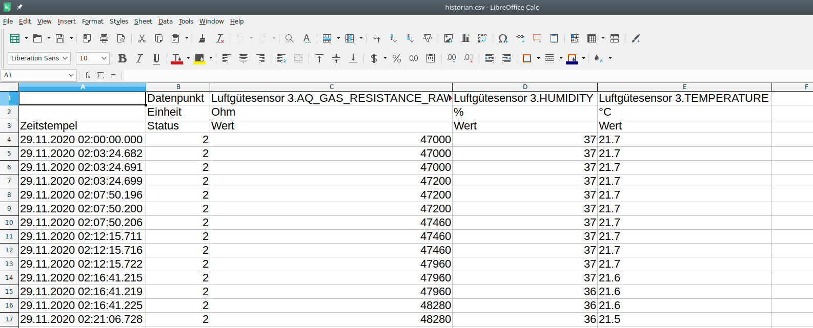

# A [Kalman filter](https://en.wikipedia.org/wiki/Kalman_filter) ist used for estimating the regression coefficents for compensating the dependecy of the BME680's gas resistance from the temperature and from the absolute humidity.

- Instead of an external '[Multiple Linear Regression](https://de.wikipedia.org/wiki/Lineare_Regression#Multiple_lineare_Regression)' (see also [wikiversity](https://en.m.wikiversity.org/wiki/Multiple_linear_regression)) used for the sensor [HB-UNI-Sensor1-AQ-BME680](https://github.com/FUEL4EP/HomeAutomation/tree/master/AsksinPP_developments/sketches/HB-UNI-Sensor1-AQ-BME680), this sensor [HB-UNI-Sensor1-AQ-BME680_KF](https://github.com/FUEL4EP/HomeAutomation/tree/master/AsksinPP_developments/sketches/HB-UNI-Sensor1-AQ-BME680_KF) is using a Kalman filter for calculating the regression coefficient online.
- A Kalman filter with a zero covariance matrix for the process noise is well known a the recursive minimum least-square error (LMMSE) filter for a linear system
// with some assumptions on auto- and cross-correlations of process and measurement noise and initial state.
- See also '[Optimum Linear Estimation](https://www.sciencedirect.com/topics/social-sciences/kalman-filter)'
- The below Python Jupyterlab Kalman filter 'kalman-filter-AQ.ipynb' is derived from Kalman Filter is derived from [Zaur Fataliyev's](https://github.com/zziz) Github [ zziz /
kalman-filter](https://github.com/zziz/kalman-filter) repository. Thanks to Zaur for this great repository. 
- The corresponding C++ implementation of the Kalman filter in '[sens_bme680_KF.h](../sensors/sens_bme680_KF.h)' is based on [Romain JL. FETICK's](https://github.com/rfetick) Github  [rfetick/Kalman](https://github.com/rfetick/Kalman) repository 'Implement Kalman filter for your Arduino projects'. Special thanks to Romain for this great repository.
- For executing an online linear regression, it is essential to set the system model's covariance matrix Q to a zero matrix. Furthermore, the measurement covariance matrix R should bet set to a very small value, e.g. 0.0001 or smaller.

## Required Python installations on your computer

- Please ensure that you have installed the following Phyton modules on your computer (e.g. by pip install):
	+ pandas
	+ numpy
	+ matplotlib
	+ sklearn
	+ statsmodels
	+ datetime
	+ jupyterlab

## For getting familiar with the implemented Kalman filter please execute the following commands

- bash ./setup.bsh
- bash ./jupyterlab.bsh

- Then run in JupyterLab
	+ kalman-filter-AQ.ipynb
	+ Multiple linear regression for BME680 gas readings of a single sensor.ipynb

- Compare the linear regression results at the end of the notebook
- The calculations can take several minutes depending on the size of historian.csv

## Steps for creating your own '[historian.csv](./historian.csv)'

- Before starting to collect data for a Kalman filter regression, it is necessary to calibrate the temperature and humididy measurements of the BME680 sensor. For that purpose, please track the BME680 sensor's temperature and humidity e.g. in the CCU Historian and compare them with 'golden' reference sensor's values. Extract the offsets between the reference temperature/humidiy and the BM680 temperature/humidity measurements, ideally during night when there are little disturbances and thus flat curves, and use them for setting the temperature and humidity offsets in the WebUI.** Please run the offset calibration in two separated sequential steps**:
	+ calibrate the BME680 temperature offset in a first step (first night)
	+ calibrate then the BME680 humidity offset in a second step (second night)
	- ** do not calibrate temperature and humidity together in a singular step since they depend on each other from physics point of view**

- Collect history data with your HB-UNI-Sensor1-AQ-BME680 and record them with CCU Historian.
	Take care to have as many as possible different air quality, temperature, and humidity conditions during the recording time:
	- put the sensor into your kitchen when you are cooking
	- put the sensor to other locations with strong smells
	- place strong smelling food e.g. like parmesan cheese close to the sensor 
- Collect history data for 2..4 weeks
- Output a history CSV file in the CCU Historian's Trend diagram (button 'CSV-Export' at the bottom) dumping the following data points (click in CCU Historian's 'Datenpunktliste' to create the Trend diagram):

	- HB-UNI-Sensor1-AQ-BME680's AQ_GAS_RESISTANCE_RAW
	- HB-UNI-Sensor1-AQ-BME680's TEMPERATURE
	- HB-UNI-Sensor1-AQ-BME680's MY_HUMIDITY  

- Ensure that your browser is downloading the CSV file to your ${HOME}/Downloads directory as 'historian.csv'. Check the correct time stamp of that file before continuing.  

- Execute the provided script '[get_new_history.bsh](./get_new_history.bsh)'. It fetches CCU Historian's CSV file from '${HOME}/Downloads' and does some pre-processing 

- If you read in the created CSV file into Microsoft Office EXCEL or Libreoffice Calc, it should look like:

 

 - For the CSV import into EXCEL or Libreoffice Calc, please select a column separator the semicolon ';'
 Please check that the decimal separator is a **','**, the thousands seperator should be a **'.'**. If you use a non German language setting on your computer, e.g. Austrian, you may need to adapt the thousands separator in the provided Jupyter notebooks 'kalman-filter-AQ.ipynb and 'Multiple linear regression for BME680 gas readings of a single sensor.ipynb' appropriately:
 
>  df0 = pd.read_csv("historian.csv", sep=';', thousands=".", decimal=",", skiprows = [0,1,2],dtype={'High': np.float64, 'Low': np.float64}, header = None, encoding= 'unicode_escape',  parse_dates=[0], date_parser=dateparse, names = [ 'Datum', 'Mode', 'raw_gas_resistance', 'relative_humidity', 'temperature'])
