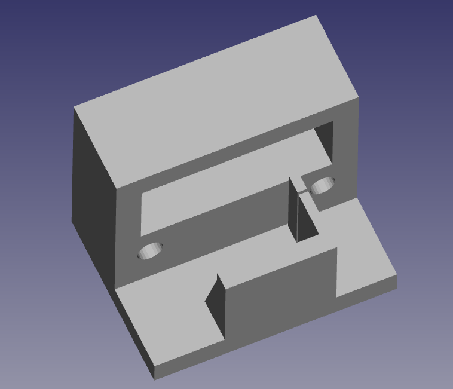
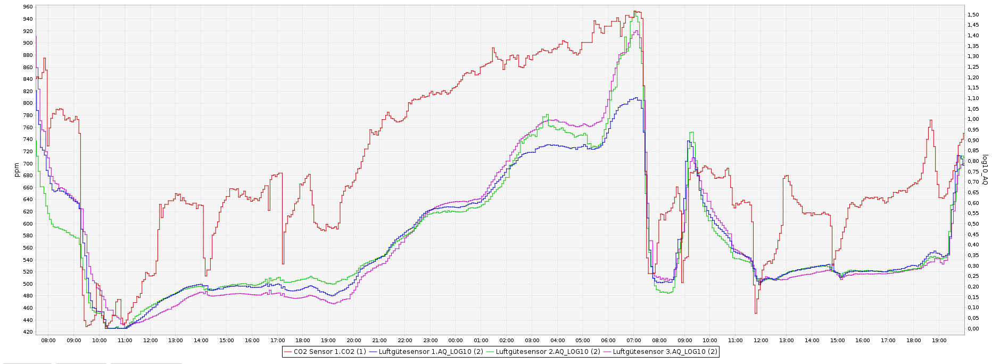
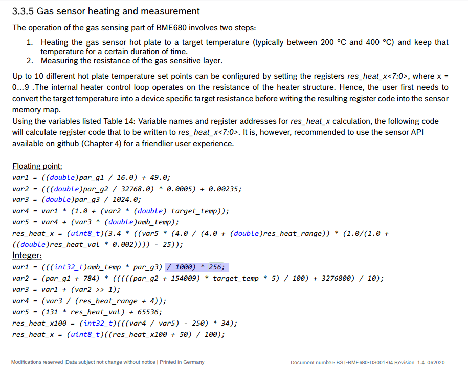
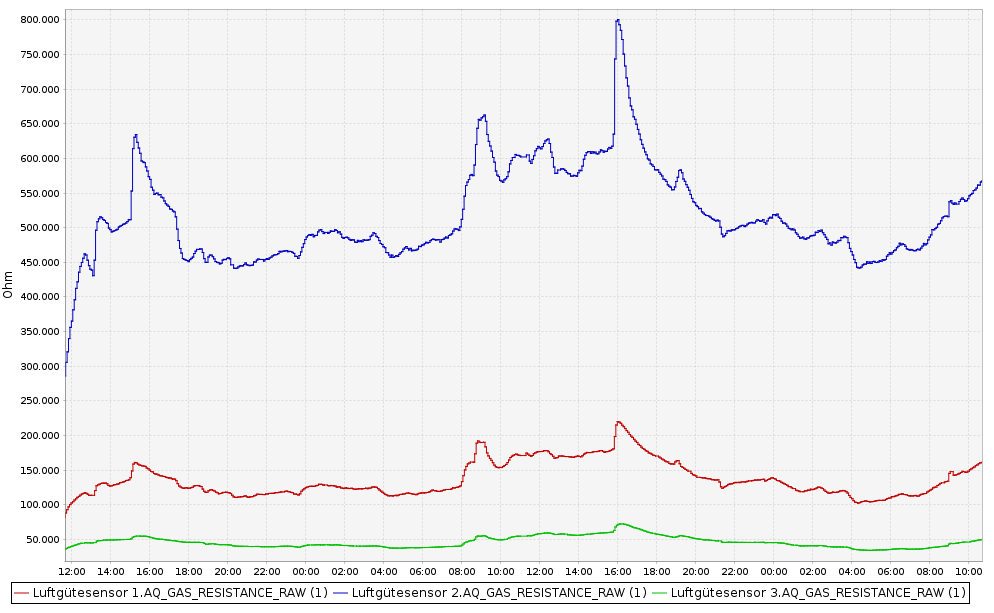

# **Dies ist noch eine Testversion in der Validierungsphase !!!**
 
 Zur Zeit laufen noch Validierungen an 3 aufgebauten Sensoren. Sobald die Validierung abgeschlossen sein wird, werden die Ergebnisse hier veröffentlicht. Bisher sehen die Zwischenergebnisse vielversprechend aus.
 
 
 
 Update 07. Februar 2021: Konvergenzkriterium für den Temperatur-Regressionskoeffizienten 'alpha' wurde angepasst.

 
# Universeller selbstkalibrierender Luftgütesensor auf der Basis von dem Bosch BME680 Sensor (HB-UNI-Sensor1-AQ-BME680_KF) mit vollautomatischer Kompensation der Abhängigkeiten von Temperatur und absoluter Luftfeuchte mit einem Kalman Filter
- abgeleitet von Jérômes ([jp112sdl](https://github.com/jp112sdl)) [HB-UNI-Sen-IAQ](https://github.com/jp112sdl/HB-UNI-Sen-IAQ)
- ein herzliches Dankeschön für die Basisarbeit geht an Jérôme (jp112sdl)
- ein herzliches Dankeschön an alle, die im Homematic Forum geholfen haben, meine Probleme zu lösen
- der Homematic Forum [Diskussionsstrang](https://homematic-forum.de/forum/viewtopic.php?t=49422)
- hilfreich ist auch die Diskussion zu den [rftypes XMLs](https://homematic-forum.de/forum/viewtopic.php?f=76&t=62578&sid=cf0f4cd99f7ee2bf070e9f39391ee652)
- **WICHTIG:** Das initiale Lernen des zur online Regression benutzten Kalman Filters braucht ca. 14 Tage. Details siehe unten. Die Empfehlung ist, den aufgebauten und programmierten Sensor einfach 14 Tage laufen zu lassen, ohne ihm viel Beachtung zu schenken. Das Anlernen kann beschleunigt werden, wenn der Sensor in dieser Zeit möglichst vielen Wechseln von Luftgüte, Temperatur und absoluter Luftfeuchte ausgesetzt wird. Am besten wird der Sensor in dieser Zeit in die Nähe eines zum Lüften vollständig geöffneten Fensters aufgestellt. Bitte 3x am Tag gründlich lüften (morgens, mittags, abends). Zur Beschleunigung und Verbesserung des Lernens kann Folgendes unterstützend  getan werden, am Besten mehrfach:
	+ den Sensor höherer Temperatur und geringerer Luftfeuchte aussetzen, z.B. durch Platzieren auf einem Ofen oder einem Heizkörper
	+ den Sensor hoher Luftfeuchte und geringer Temperatur aussetzen, z.B. durch Auflegen eines gut mit Wasser durchfeuchteten Papiertaschentuchs auf den Sensor. Die Verdampfung von Wasser bewirkt eine Temperaturverringerung!
- zur Verifizierung und besserem Verständnis des Kalman Filters wird ein Jupyter Notebook [Prove_of_Kalman_filter_with_synthesized_data.ipynb](./Kalman_Filter/Prove_of_Kalman_filter_with_synthesized_data.ipynb) zur Verfügung gestellt. Auf Github kann das Notebook direkt angesehen werden.
- ausschliesslich für DEBUG Zwecke gibt es eine DEBUG Version des Sensors [HB-UNI-Sensor1-AQ-BME680_KF_DEBUG](https://github.com/FUEL4EP/HomeAutomation/tree/master/AsksinPP_developments/sketches/HB-UNI-Sensor1-AQ-BME680_KF_DEBUG)

## Bitte immer die aktuellste Version von AsksinPP nutzen

- HB-UNI-Sensor1-AQ-BME680.ino kompiliert nur mit der aktuellsten **Master** Version von [AsksinPP](https://github.com/pa-pa/AskSinPP/tree/master)

## ACHTUNG: EEPROM Nutzung

-	die EEPROM Software zur regelmässigen Zwischenspeicherung von wichtigen Sensorparametern wurde überarbeitet. Sie verwendet jetzt eine Structure für alle relevanten Parameter und eine CRC32 Prüfsumme. Die Abspeicherung erfolgt einmal am Tag. 318 Bytes EEPROM-Speicher werden verwendet. Eine EEPROM Zelle des ATmega1284P kann laut [Datenblatt](https://ww1.microchip.com/downloads/en/DeviceDoc/ATmega164A_PA-324A_PA-644A_PA-1284_P_Data-Sheet-40002070B.pdf) 100000 mal gelöscht/beschrieben werden. Bei einem Schreibvorgang pro Tag reicht das für 273 Jahre! Das Schreiben eines Bytes in das EEPROM dauert ca. 1 Millisekunde, so dass das Schreiben der Structure ca. 300 Millisekunden dauert.

## ACHTUNG: Batteriewechsel

- bitte die Batterien **NUR** direkt nach dem kurzen Aufblinken der roten Signalisierungs-LED oder direkt nach der letzten Änderung für den Sensor im WebUI unter 'Startseite > Status und Bedienung > Gewerke' austauschen. Dann 'schläft' der ATmega1284P Arduino für ca. 235..238 Sekunden und es werden in dieser Zeit keine Daten in das EEPROM geschrieben. Die Gefahr einer Korrumpierung der EEPROM Daten durch den Batteriewechsel ist dadurch nicht mehr gegeben.

## ACHTUNG: Neuprogrammierung (Flashen)

- bitte eine Neuprogrammierung des Flash-Speichers **NUR** direkt nach dem kurzen Aufblinken der roten Signalisierungs-LED oder direkt nach der letzten Änderung für den Sensor im WebUI unter 'Startseite > Status und Bedienung > Gewerke' durchführen. Dann 'schläft' der ATmega1284P Arduino für ca. 235..238 Sekunden und es werden in dieser Zeit keine Daten in das EEPROM geschrieben. Die Gefahr einer Korrumpierung der EEPROM Daten durch den Programmiervorgang ist dadurch nicht mehr gegeben.
- zur Neuprogrammierung bitte UNBEDINGT die folgende Sequenz einhalten:
	+ ISP Programmer anschließen (Steckerleiste und USB Stecker)
	+ 1 Batterie entfernen
	+ 4 Minuten warten und im WebUI prüfen, dass die OPERATING VOLTAGE größer als 3.3V ist
	+ Neuprogrammieren
	+ die herausgenommene Batterie wieder einlegen
	+ den ISP Programmer entfernen
- diese Sequenz stellt sicher, dass ein korrekter Reset durchgeführt wird. Bedingung dafür ist, dass die OPERATING VOLTAGE größer als 3.3V ist.
- soll eine Neuprogrammierung ohne Reset und Neustart der Autokalibrierung durchgeführt werden, bitte die Batterien während des Programmiervorgangs eingelegt lassen.

	 
## Initiales Lernen des Kalman Filters

- das Kalman Filter zur Kompensation der Einflüsse von Temperatur und absoluter Luftfeuchte auf die gemessenen Gaswiderstände braucht zu Beginn eines Autokalibrierzyklus ca. 14 Tage um auf stabile Regressionskoeffizienten einzuschwingen. Solange sich die geschätzten Regressionskoeffizienten sich noch mehr als 15% innerhalb von 4 Stunden ändern, ist keine Konvergenz gegeben. Dies wird mit der Ausgabe des Werts 3.333 im Datenpunkt AQ_LOG10 gekennzeichnet. Der Datenpunkt AQ_LEVEL zeigt währen der Phase des Lernens (=Nichtkonvergenz) einen 'Nichtkonvergenzgrad' an, der sich zwischen 0% und 100% bewegt. Werte oberhalb von 15% kennzeichnen eine Nichtkonvergenz. Die absolute Änderung des Temperatur-Regressionskoeffizienten 'alpha' darf im Konvergenzfall maximal 1800 Ohm/K (#define REGRESSION_ABSOLUTE_ALPHA_CHANGE                1800) betragen. Das Lernen des Kalman Filters findet hauptsächlich bei Veränderungen der Temperatur und absoluten Luftfeuchte statt, also beim Lüften. Häufigeres und intensives Lüften kann den Lernprozess beschleunigen. Seltenes Lüften kann den Lernvorgang verlangsamen!
- zur Beschleunigung und Verbesserung des Lernens kann Folgendes unterstützend  getan werden, am Besten mehrfach:
	+ den Sensor höherer Temperatur und geringerer Luftfeuchte aussetzen, z.B. durch Platzieren auf einem Ofen oder einem Heizkörper
	+ den Sensor hoher Luftfeuchte und geringer Temperatur aussetzen, z.B. durch Auflegen eines gut mit Wasser durchfeuchteten Papiertaschentuchs auf den Sensor. Die Verdampfung von Wasser bewirkt eine Temperaturverringerung!

## Aufgebauter Sensor ohne Gehäusedeckel

## Neue Eigenschaften im Vergleich zum HB-UNI-Sen-IAQ Sensor

- die relative Luftfeuchtigkeit wird mit 0,1 % rLF Genauigkeit ausgegeben
- die Batteriespannung wird mit 10 mV Genauigkeit und jeden Zyklus ausgegeben 
- alle wichtigen Sensorparameter können interaktiv ohne Neuprogrammierung im WebUI der [RaspberryMatic](https://github.com/jens-maus/RaspberryMatic) / [CCU3](https://de.elv.com/smarIt-home-zentrale-ccu3-inklusive-aio-creator-neo-lizenz-ccu-plugin-151965?fs=2591490946) eingegeben werden:
	+ [Startseite > Einstellungen > Geräte > Geräte-/ Kanalparameter einstellen](Images/Setting_of_device_parameters_in_WebUI.png)
	+ Wegen eines Bugs in der eQ3 Software OCCU ['Fehler in ProofAndSetValue bei Gleitkommawerten #1058'](https://github.com/jens-maus/RaspberryMatic/issues/1058) funktioniert die Offseteinstellung im WebUI nur eingeschränkt: Es können nur ganzzahlig Offsets eingegeben werden. In der RaspberryMatic [3.55.10.20210213](https://github.com/jens-maus/RaspberryMatic/labels/%3Alabel%3A%20WebUI) ist der Bug noch nicht gefixt!
	+ Bitte beachten: Der LazyConfig Modus funktioniert NUR bei einem angelernten Sensor. Wird der Resettaster nach dem Anlernen gedrückt, funktioniert der LazyConfig Modus nicht mehr. Ein erneutes Anlernen ist dann notwendig, um den LazyConfig Mode wieder zum Funktionieren zu bringen.
	
- Ausgabe des Luftgütegrads AQ_LEVEL: normierter BME680 Gaswiderstand 0..100% (ohne Kompensation der Einflüsse von Temperatur und absoluter Luftfeuchte auf die gemessene Luftgüte)
- Ausgabe der logarithmischen Luftqualität AQ_LOG10: logarithmierte normierte und kompensierte Luftqualität 0.0..4.0 (mit Kompensation der Einflüsse von Temperatur und absoluter Luftfeuchte auf die gemessene Luftqualität)
	+ die logarithmischen Luftqualität AQ_LOG10 korreliert in der Regel gut mit dem CO2 Gehalt der Luft
	+ Formeln zur Berechnung von AQ_LOG10:

- Autokalibrierung für den Luftgütegrad und die logarithmische Luftqualität: Zur Kalibrierung muss der Sensor nur in Betrieb genommen werden. Es sollte nur regelmäßig für ca. 20..30 Minuten bei völlig geöffneten Fenstern quer gelüftet werden. Die Autokalibrierung ist adaptiv und wird im Laufe der Zeit immer besser. Der Adaptionsprozess kann mehrere Tage dauern. 24 Stunden nach dem Start einer Autokalibrierung wird die Autokalibrierung nochmals erneut gestartet, nachdem das Kalman Filter initial eingeschwungen ist. Während der ersten Tage nach Beginn einer Autokalibrierung kann es zu stärkere Schwankungen der ausgegebenen Luftgüte AQ_LOG10 geben, die aber schnell kleiner werden, wenn der Kalibriervorgang voranschreitet.
	
- Details zur Autokalibrierung sind [hier](./Autocalibration/README.md) auf Englisch nachzulesen.
	
- vollautomatische Kompensation der Einflüsse von Temperatur und absoluter Luftfeuchte auf die gemessene Luftgüte LOG10 durch ein in der Sensorsoftware integriertes Kalman Filter
	- Ein Kalman Filter mit einer Null-Kovarianzmatrix für das Prozessrauschen ist bekannt als ein rekursives Minimum Least-Square Error (LMMSE) Filter für ein lineares System unter bestimmten Annahmen für Auto- und Kreuzkorrelation des Prozess- und Messrauschens und dem initialen Zustand.
	- die absolute Luftfeuchte wird im Sensor auf der ATmega1284P MCU aus Temperatur und relativer Luftfeuchte [berechnet](https://www.kompf.de/weather/vent.html) 
- Tägliche Abspeicherung der Parameter der Autokalibrierung und des Kalman Filters.
	- Die letzten EEPROM Daten werden bei einem Batteriewechsel zurückgespeichert
	- Bei Betrieb mit ISP Programmer oder FTDI Debugger werden die EEPROM Daten bei einem Reset NICHT zurückgespeichert (Kriterium ist eine gemessene Betriebsspannung > 3.3V)
	 

## Schaltung

- basierend auf einer ATmega1284P MCU mit CC1101 Sendemodul, Eigenbau möglich
- eine mögliche und von mir empfohlene Hardwarebasis sieht so aus:
	+ Universalplatine für DIY-Bausätze von Alexander Reinert
		* Github [HB-UNI-SEN-BATT](https://github.com/alexreinert/PCB#hb-uni-sen-batt)
		* Bezugsquelle: [Smartkram WebShop](https://smartkram.de/produkt/universalplatine-fuer-diy-bausatze-von-alex-reinert/)
    + Sensorgehäuse
	    * 3D-Druck [HB-UNI-SEN-BATT snap Gehaeuse und Deckel](https://www.thingiverse.com/thing:3512767)	auf Thingiverse
	    * oder [fertiges Gehäuse](https://smartkram.de/produkt/sensorgehaeuse-passend-fuer-platine-von-alexander-reinert/) von Smartkram Webshop
	+ Bosch BME 680 Breakout Board (bitte keinen China Billigclone)
		* Bezugsquelle: Pimoroni [BME680 Breakout - Air Quality, Temperature, Pressure, Humidity Sensor](https://shop.pimoroni.com/products/bme680-breakout)
	+ Tindie [Pro Mini XL - v2 - ATmega 1284p](https://www.tindie.com/products/prominimicros/pro-mini-xl-v2-atmega-1284p/)
	+ Bauteile [HB-UNI-SEN-BATT](https://smartkram.de/produkt/bauteile-fuer-homematic-diy-projekt-thermometer-hydrometer/) von Smartkram Webshop
		* Der gelieferte Arduino Pro Mini wird durch Tindie Pro Mini XL - v2 - ATmega 1284p ersetzt
		* Das gelieferte BME280 Sensor Breakout wird durch das BME680 Breakout ersetzt
	+ Aufbau entsprechend siehe [Technikkram](https://technikkram.net/blog/2018/05/30/homematic-diy-projekt-thermometer-und-hydrometer-fertige-platine-im-eigenbau/), bitte geeignet abändern
	+ die I2C-Verbindungen zwischen HB-UNI-SEN-BATT PCB und BME680 Breakout mit flexiblem Flachbandkabel
	+ 2x 10 kOhm I2C Abschlusswiderstände auf HB-UNI-SEN-BATT PCB einlöten
	+ im Unterverzeichnis 3D_Druck ist eine 3D-Druck [STL Datei](./3D%20print%20files/BME680_protection.stl) für eine BME680 Halterung zu finden:
	
		* wird auf das HB-UNI-SEN-BATT PCB mit 2-Komponentenkleber aufgeklebt
		* eine Nase muss mit einer Flachfeile entfernt werden
		* eine Halterung ohne Nase wird auch bereitgestellt: [STL Datei](./3D%20print%20files/BME680_protection_without_nose.stl). Sie muss geeignet gedreht gedruckt werden, damit die Supportstrukturen nicht stören.  
		
## Verringerung des Ruhestroms

- auf dem Tindie Pro Mini XL - v2 - ATmega 1284p die markierte LED auslöten:

	

- Brown-Out_Detektor des ATmega1284P  (BOD) ausschalten, siehe Einstellungen Arduino IDE unten unter Punkt **Benötigter Sketch**
	       

## Das angemeldete Gerät im RaspberryMatic WebUI

## Das angemeldete Gerät in der CCU Historian Datenpunktliste

## AQ_LEVEL normierter Gaswiderstandsverlauf (Beispiel)

## AQ_LOG10 logarithmierte normierte Luftqualität

- zusätzlich zum AQ_LOG10 Luftqualitätsverlauf wird der CO2 Gehalt der Luft gemessen mit einem Sensirion SCD30 NDIR CO2 Sensor 

## Benötiger Sketch

[HB-UNI-Sensor1-AQ-BME680_KF](https://github.com/FUEL4EP/HomeAutomation/tree/master/AsksinPP_developments/sketches/HB-UNI-Sensor1-AQ-BME680_KF)

- bitte alle Unterverzeichnisse mit kopieren:

### Zur lokalen Installation des Github Releases auf Deinem Computer

- gehe bitte in Dein Zielinstallationsverzeichnis, wo Du mit dem HB-UNI-Sensor1-AQ-BME680_KF Sensor arbeiten möchtest

  - gebe dort 'git clone https://github.com/FUEL4EP/HomeAutomation.git' ein
	  + damit lädst Du mein [Sammelrepository](https://github.com/FUEL4EP/HomeAutomation) für alle meine auf Github freigegebenen HomeBrew Sensoren herunter.
  - dann findest Du ein neues Verzeichnis 'HomeAutomation' auf Deinem Rechner, das alle meine auf Github freigebenen Sensoren enthält, siehe [README.md](https://github.com/FUEL4EP/HomeAutomation/blob/master/README.md)
  	+ mache bitte regelmäßig ein Update mit 'git pull'
 -	enthalten ist auch das notwendige Addon '[ep-hb-devices-addon](https://github.com/FUEL4EP/HomeAutomation/releases/latest)'
 -	den HB-UNI-Sensor1-AQ-BME680_KF Sensor findest Du unter './HomeAutomation/tree/master/AsksinPP_developments/sketches/HB-UNI-Sensor1-AQ-BME680_KF'

- nach erfolgreicher Inbetriebnahme können die Debugausgaben im serial Monitor ausgeschaltet werden. Dazu bitte im Sketch HB-UNI-Sensor1-AQ-BME680_KF.ino auskommentieren:

> 	//#define NDEBUG   // disable all serial debug messages

- und in 'sensors/sens_bme680.h' kommentieren:

> 	#define DEEP_DEBUG // comment out if deep serial monitor debugging is not necessary

- zum Debuggen genau umgekehrt!

- als Taktfrequenz des ATmega1284P 8 MHz interner RC Oszillator einstellen (es gibt zur Zeit leider nur die 20 MHz Quarz Version bei Tindie)
- 
- der Sketch verwendet 55462 Bytes (42%) des Programmspeicherplatzes. Das Maximum sind 130048 Bytes. Globale Variablen verwenden 2303 Bytes (14%) des dynamischen Speichers, 14081 Bytes für lokale Variablen verbleiben. Das Maximum sind 16384 Bytes.

- [Fuses Calculator](http://eleccelerator.com/fusecalc/fusecalc.php); select ATmega1284P
- [avrdude script](avrdude/avrdude_m1284p_int_RC_8MHz.bsh) zum Setzen der Fuses für 8MHz interner RC Oszillator (Linux version)
	- wichtig ist dass dieser Skript **VOR** dem Flashen des Programmcodes ausgeführt wird.  Das EESAVE Konfigurationsbit des Atmega328P muss gesetzt sein (Preserve EEPROM memory through the Chip Erase cycle; [EESAVE=1])

- die Programmierung erfolgt mit einem ISP Programmer, z.B. Diamex ISP USB Programmer. Dazu dienen die Signale VCC, GND, MOSI, SCK, MISO,
RSET an der Steckerleiste unten rechts in der Basisplatine. Dort eine Steckerleiste einlöten.
- **WICHTIG:** Den ISP Programmer auf 3,3V einstellen!
- **Unbedingt** diese [Warnung](https://github.com/TomMajor/SmartHome/tree/master/Info/Warnung_Flashen_33_USBasp_Klones) beachten!
- Einstellungen Arduino IDE [Werkzeuge](Images/Arduino_IDE_Tools_8MHz_int_RC_osc.png)
- als zusätzliche Boardverwalter-URLs unter Arduino IDEs Voreinstellungen einstellen (falls noch nicht getan):

> https://mcudude.github.io/MightyCore/package_MCUdude_MightyCore_index.json

- Hochladen des kompilierten Sketchs im Arduino IDE mit: Sketch => Hochladen mit Programmer
- Debugging wird über den seriellen Monitor mit einem 'FTDI Adapter USB zu TTL Serial für
3,3V und 5V für Arduino' gemacht. Als Baudrate **38400 Baud** einstellen.

## Ausführungszeiten

- auf einem ATmega1284P mit 8 MHz interner Taktfrequenz und 3,3V Betriebsspannung betragen die Ausführungszeiten im Debugmode ca. 
	* des Kalman Filters:	ca. 190 msec
	* der Meßroutine:		ca. 2700 msec, davon wird ca. 1500 msec der BME680 geheizt
	
- damit ist die ATmega1284P ca. 1,1% der Zeit 'wach'.

- die Ausführungszeiten werden mit eingeschaltetem DEBUG und DEEP_DEBUG Mode im seriellen Monitor ausgegeben: 

	//#define NDEBUG   // disable all serial debug messages  
	  
	#define DEEP_DEBUG               // comment out if deep serial monitor debugging is not necessary

## Benötigte Libraries

+ [AskSinPP Library](https://github.com/pa-pa/AskSinPP) 
+ [EnableInterrupt](https://github.com/GreyGnome/EnableInterrupt) 
+ [Low-Power](https://github.com/rocketscream/Low-Power) 
+ [ClosedCube_BME680_Arduino](https://github.com/FUEL4EP/ClosedCube_BME680_Arduino/tree/implement_Bosch_datasheet_integer_formulas) (Update 05. Dez 2020, Bosch hat im Juni 2020 eine neue Version V1.4 des BME680 Datenblatts veröffentlicht)
+ [Optimized CRC32 library for Arduino](https://github.com/Erriez/ErriezCRC32)
+ [Kalman Filter Library](https://github.com/rfetick/Kalman)
+ [Basic Linear Algebra](https://github.com/tomstewart89/BasicLinearAlgebra)
+ [Streaming](https://github.com/janelia-arduino/Streaming)

## BME680 Data sheet

- Bosch hat im Juni 2020 eine [neue Version V1.4](https://www.bosch-sensortec.com/media/boschsensortec/downloads/datasheets/bst-bme680-ds001.pdf) des BME680 Datenblatts freigegeben
- Einige Integer-Berechnungsformeln wurden geändert und bedingen ein Update der [ClosedCube_BME680_Arduino Bibliothek](https://github.com/FUEL4EP/ClosedCube_BME680_Arduino/tree/implement_Bosch_datasheet_integer_formulas). Bitte die neueste Version von Github herunterladen!
- Geändert wurde die Berechnungsformel für 'res_heat_x':

- Die farblich markierten Formelteile wurden geändert

## Benötigtes Addon

[hb-ep-devices-addon](https://github.com/FUEL4EP/HomeAutomation/releases/latest)

- Bitte dieses Addon 'hb-ep-devices-addon.tgz' herunterladen und vor dem Anlernen des HB-UNI-Sensor1-AQ-BME680 Sensors auf der RaspberryMatic / CCU3 installieren (kein unzip vonnöten!)
- Minimal benötigte Version des Addons: 1.4

## Autokalibrierung und Kalman Filter

- eine detaillierte Beschreibung der Autokalibrierung ist im Unterverzeichnis 'Autocalibration' om [README.md](Autocalibration/README.md) zu finden. Der Sensor ist in der Regel autokalibrierend, d.h. es muss keine dedizierte Kalibrierung des Sensors mit 'guter' und 'schlechter' Luft gemacht werden. Wer dennoch eine Kalibrierung machen möchte, kann das, wie im [README.md](Autocalibration/README.md) beschrieben, tun.
- **WICHTIG:** Vor der Autokalibrierung bitte die Offsets genau in dieser Reihenfolge
	+ der Temperatur
	+ der relativen Luftfeuchte
	
- bestimmen und im WebUI setzten. Dabei zuerst das Einschwingen der korrigierten Temperatur abwarten, bevor die Luftfeuchte korrigiert wird. Zum Bestimmen der Offsets eine 24h Aufzeichnung mit dem CCU-Historian mit einer genauen Referenztemperatur / -luftfeuchte machen ('golden' TH-Sensor daneben stellen).
- Details zur Kalman Filterung sind im Unterverzeichnis [Kalman Filter](./Kalman_Filter) zu finden. Der Algorithmus ist dort in einem Jupyter Notebook in Python beschrieben. Im [README.md](./Kalman_Filter/README.md) sind weitere Erläuterungen auf Englisch zu finden.
- das Lernen und Einschwingen der Autokalibrierungs- und des Kalman Filters hat drei Phasen:
	+ Phase 1: Neustart der Autokalibrierung und des Kalibrierung von Grund auf, wenn
		* die eingelegten Batterien vorübergehend entfernt werden und der Sensorstart mit einer Versorgung durch einen ISP Programmiergerät oder durch den FTDI Debugger erfolgt (OPERATING_VOLTAGE >= 3.3V)
		* Flashen mit einem ISP Programmiergerät bei vorübergehend entfernten Batterien (OPERATING_VOLTAGE >= 3.3V)
		* solange die durch das Kalman Filter online berechneten linearen Regressionskoeffizienten zur Kompensation der Einflüsse von Temperatur und absoluter Luftfeuchte noch nicht ausreichend konvergieren, wird dieser Nichtkonvergenz-Status durch Ausgabe des Werts 3.333 auf dem Datenpunkt AQ_LOG10 angezeigt.
		* die oberen und unteren Referenzwerte AQ_GAS_RESISTANCE_MIN, AQ_GAS_RESISTANCE_MAX, AQ_COMP_GAS_RES_MIN und AQ_COMP_GAS_RES_MAX werden mit einem 'IIR Infinite Impulse Response'-Filter mit einer Abfall-/Anstiegsrate auf 10% in 4 Stunden angepasst, d.h. eine sehr starke Filterung (#define IIR_FILTER_COEFFICIENT_KF_UNSETTLED              0.0376494).
		* die Konvergenz kann während dessen am Datenpunkt AQ_LEVEL beobachtet werde. Dort wird dann der Konvergenzgrad 0%..100% ausgegeben. Bei 15% ist eine ausreichende Konvergenz zum Übergang in die Phase 2 erreicht.
	+ Phase 2: Das Kalman Filter ist ausreichend konvergiert. Der kompensierte logarithmische Luftgütewert wird als Datenpunkt AQ_LOG10 ausgegeben. Der lineare, nicht kompensierte Luftgütewert wird als Datenpunkt AQ_LEVEL ausgegeben. Für die ersten 48 Stunden nach dem Erreichen der ausreichenden Konvergenz des Kalman Filters werden die oberen und unteren Referenzwerte AQ_GAS_RESISTANCE_MIN, AQ_GAS_RESISTANCE_MAX, AQ_COMP_GAS_RES_MIN und AQ_COMP_GAS_RES_MAX werden mit einem 'IIR Infinite Impulse Response'-Filter mit einer Abfall-/Anstiegsrate auf 71% in 24 Stunden angepasst,  d.h. eine mittlere Filterung (#define IIR_FILTER_COEFFICIENT_KF_POST_SETTLED           0.0009509).
	+ Phase 3: Normalbetrieb, beginnt 48 Stunden nach dem letzten Erreichen  einer ausreichenden Konvergenz des Kalman Filters.  Die oberen und unteren Referenzwerte AQ_GAS_RESISTANCE_MIN, AQ_GAS_RESISTANCE_MAX, AQ_COMP_GAS_RES_MIN und AQ_COMP_GAS_RES_MAX werden mit einem 'IIR Infinite Impulse Response'-Filter mit einer Abfall-/Anstiegsrate auf 71% in 7 Tagen angepasst,  d.h. eine geringe Filterung (#define IIR_FILTER_COEFFICIENT_KF_SETTLED                0.0001359).

## Alterung des BME680 Sensors

-	der MOX Sensor Bosch BME680 altert über die Lebensdauer, am Anfang der Betriebszeit am stärksten
-	die ersten Wochen nach Inbetriebnahme sind die Messwerte unzuverlässig(er)
-	der Gaswiderstandswert nimmt im Laufe der Zeit zu
-	die Alterung sollte im CCU-Historian verfolgt werden
-	solange der mittlere Gaswiderstand einen sichtbaren Gradienten zu höheren Werten aufweist, sollte die Kalibrierung öfters wiederholt werden. Dazu den Gaswiderstand über einen Zeitraum von 1..2 Monaten als Trend-Diagram im CCU-Historian darstellen.
-	der Gaswiderstand des BME680 Sensors variiert stark: Werte von 10 kOhm bis 1 M Ohm sind OK. Hier beispielhaft der Verlauf des Gaswiderstandswerte meiner 3 BME680 Sensoren:

-	zur Zeit ist der maximale Gaswiderstand im Sketch auf 65365*20 Ohm = 1.3 MOhm beschränkt.
-	die Einschwingzeit von BME680 Sensoren variiert wie der Widerstandswert von Sensor zu Sensor. Bei mir reagiert der hochohmigste Sensor am schnellsten auf Veränderungen der Luftgüte.
-	sollte Dein Sensor höhere Widerstandswerte aufweisen, melde Dich bitte bei mir. Dann muss ein Softwareparameter geändert werden.

## Batteriewechsel

- Die Parameter der Autokalibrierung und die Variablen des Kalman Filters werden alle 24 Stunden in das EEPROM des ATmega1284P abgespeichert.
- Die letzten EEPROM Daten werden bei einem Batteriewechsel oder/und einem RESET als aktuelle Parameter bzw. Variablen zurückgespeichert. Bedingung dafür ist, dass die VCC Betriebsspannung <= 3.3V ist.
- Bei Betrieb mit ISP Programmer oder FTDI Debugger werden die EEPROM Daten bei einem Reset **NICHT** zurückgespeichert. Vor der Rückspeicherung wird geprüft, ob die Betriebsspannung kleiner als 3.3V ist. Bei einem Betrieb mit ISP Programmer oder FTDI Debugger ist die Betriebsspannung größer als 3.3V.
- Bei einer Neuprogrammierung mit einem ISP Programmer wird immer eine neue Autokalibrierung eingeleitet, da dann die Betriebsspannung größer als 3.3V ist.

## Vergleich des Bosch BME680 Sensors mit Sensoren anderer Hersteller
- Hier ist eine interessante [Publikation "Development of a Compact, IoT-Enabled Electronic
Nose for Breath Analysis"](https://www.mdpi.com/2079-9292/9/1/84/pdf) dazu zu finden.

## Erfahrungen zur Geruchsempfindlichkeit des BME680 Sensors

- Der BME680 Sensor ist **nicht** empfindlich für (nur wenn auffällig)
	+ Lösemittel des Pattex Klebers (Ethylacetat, Methycyclohexan)
	+ .. wird fortgesetzt, bitte informiert Eure Erfahrungen per PN and mich. Danke!
- Der BME680 Sensor ist empfindlich für (nur Auswahl)
	+ Isopropanol
	+ .. wird fortgesetzt, bitte informiert Eure Erfahrungen per PN and mich. Danke!

## Lizenz

**Creative Commons BY-NC-SA** 
Give Credit, NonCommercial, ShareAlike

 This work is licensed under a <a rel="license" href="http://creativecommons.org/licenses/by-nc-sa/4.0/">Creative Commons Attribution-NonCommercial-ShareAlike 4.0 International License</a>.

