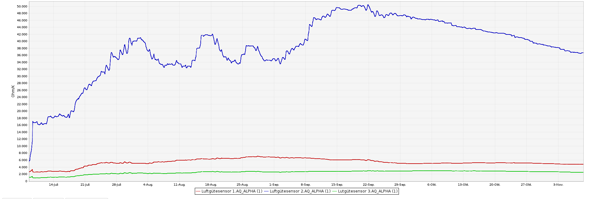
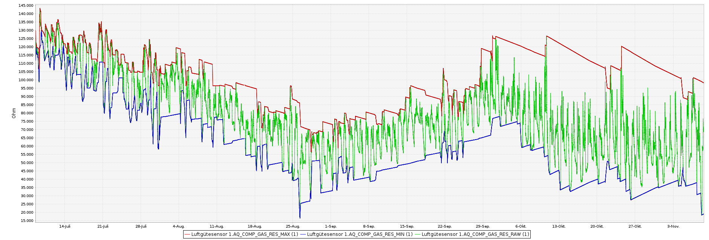
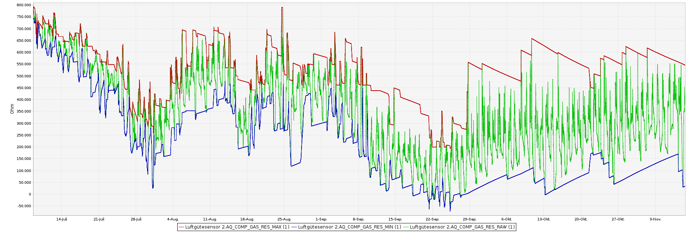
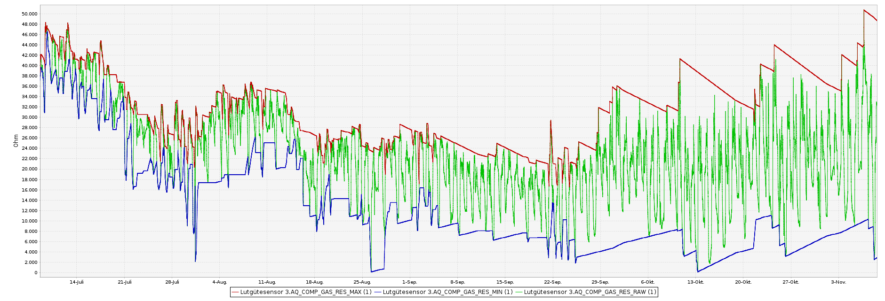
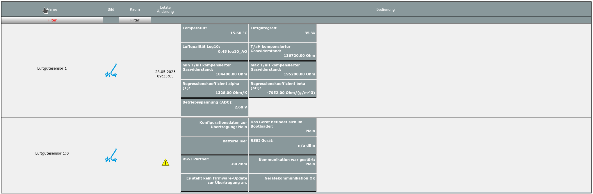
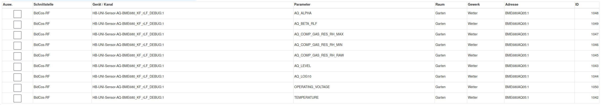
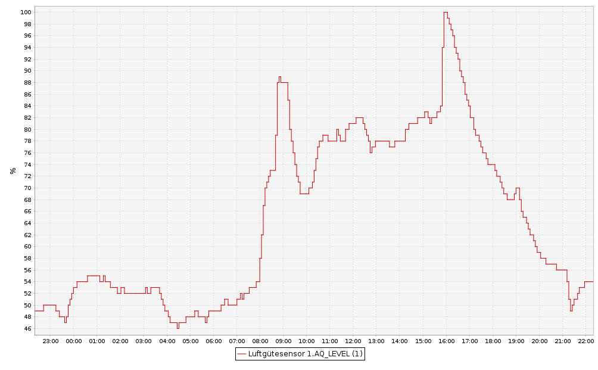

# HB-UNI-Sensor1-AQ-BME680_KF_DEBUG   
 

# Dieser Sensor HB-UNI-Sensor1-AQ-BME680_KF_DEBUG ist eine **DEBUG** Version und NICHT für den normalen Einsatz!
- dieser Sensor ist eine reine DEBUG Version von [HB-UNI-Sensor1-AQ-BME680_KF](https://github.com/FUEL4EP/HomeAutomation/tree/master/AsksinPP_developments/sketches/HB-UNI-Sensor1-AQ-BME680_KF)
- mit dieser DEBUG Version kann  das Einschwingen des benutzten Kalman Filters beobachtet werden.
- beobachtbar sind folgende Datenpunkte, z.B. im CCU Historian:
	+ TEMPERATURE
	+ AQ_LEVEL (linearer Luftgütegrad)
	+ AQ_LOG10 (logarithmischen Luftqualität, unkompensiert)
	+ AQ_COMP_GAS_RES_RAW  (kompensierter Gaswiderstands)
	+ AQ_COMP_GAS_RES_MIN  (untere Referenz für die Normalisierung des kompensierten Gaswiderstands)
	+ AQ_COMP_GAS_RES_MAX (obere Referenz für die Normalisierung des kompensierten Gaswiderstands)
	+ AQ_ALPHA (Regressionskoeffizient für die Temperatur)
	+ AQ_BETA (Regressionskoeffizient für die absolute Luftfeuchte)
- für AQ_COMP_GAS_RES_RAW, AQ_COMP_GAS_RES_MIN, AQ_COMP_GAS_RES_MAX, AQ_ALPHA, AQ_BETA können bei der Ausgabe der Datenpunkte Sättigungseffekte auftreten, wenn der unterstützte Wertebreich über- bzw. unterschritten wird. Dadurch werden Überlaufeffekte vermieden.
- alle anderen Datenpunkte sind nicht beobachtbar, da die maximale Payload einer Nachricht 17 Bytes beträgt.
- zur Verifizierung und besserem Verständnis des Kalman Filters wird ein Jupyter Notebook [Prove_of_Kalman_filter_with_synthesized_data.ipynb](./Kalman_Filter/Prove_of_Kalman_filter_with_synthesized_data.ipynb) zur Verfügung gestellt. Auf Github kann das Notebook direkt angesehen werden.
-	Die Debug-Version [HB-UNI-Sensor1-AQ-BME680_KF_DEBUG](https://github.com/FUEL4EP/HomeAutomation/tree/master/AsksinPP_developments/sketches/HB-UNI-Sensor1-AQ-BME680_KF_DEBUG) und die Normalversion [HB-UNI-Sensor1-AQ-BME680_KF](https://github.com/FUEL4EP/HomeAutomation/tree/master/AsksinPP_developments/sketches/HB-UNI-Sensor1-AQ-BME680_KF) nutzen diesselbe Struktur für die Abspeicherung und Restaurierung von EEPROM-Daten. Daher kann der Sensor zwischen diesen beiden Versionen umprogrammiert werden. Dabei bitte die Hinweise unten unter 'Neuprogrammierung (Flashen) mit Erhalt der EEPROM Parameter' beachten.
-	hier Histogramme über 4 Monate von 3 direkt nebeneinander platzierten baugleichen Sensoren
    +	Histogramme der mit dem Kalman Filter berechneten Online Regressionskoeffizienten alpha (Temperatur) und beta (absolute Luftfeuchte)
     	
    + Histogramme der kompensierten Gaswiderstände (grün) und des oberen (rot) bzw. unteren (blau) Referenzwerts für saubere bzw. schlechte Luft 
        +  Sensor 1:
           
        + Sensor 2:
          
        + Sensor 3:
          
- gut erkennbar ist, wie stark sich die Parameter auch nach Monaten noch ändern 

##  Aufbau und Programmierung, Hinweise

- siehe [HB-UNI-Sensor1-AQ-BME680_KF](https://github.com/FUEL4EP/HomeAutomation/tree/master/AsksinPP_developments/sketches/HB-UNI-Sensor1-AQ-BME680_KF)   

## Das angemeldete Gerät im RaspberryMatic WebUI

## Das angemeldete Gerät in der CCU Historian Datenpunktliste

## AQ_LEVEL normierter Gaswiderstandsverlauf (Beispiel)

## AQ_LOG10 logarithmierte normierte Luftqualität

- zusätzlich zum AQ_LOG10 Luftqualitätsverlauf wird der CO2 Gehalt der Luft gemessen mit einem Sensirion SCD30 NDIR CO2 Sensor 

## Benötiger Sketch

[HB-UNI-Sensor1-AQ-BME680_KF_DEBUG](https://github.com/FUEL4EP/HomeAutomation/tree/master/AsksinPP_developments/sketches/HB-UNI-Sensor1-AQ-BME680_KF_DEBUG)

- restliche Vorgehensweise siehe [HB-UNI-Sensor1-AQ-BME680_KF](https://github.com/FUEL4EP/HomeAutomation/tree/master/AsksinPP_developments/sketches/HB-UNI-Sensor1-AQ-BME680_KF), dort sinngemäß 'HB-UNI-Sensor1-AQ-BME680_KF' durch 'HB-UNI-Sensor1-AQ-BME680_KF_DEBUG' ersetzen

## Neuprogrammierung (Flashen) mit Erhalt der EEPROM Parameter

- um die bisher gespeicherten EEPROM Parameter bei einer Neuprogrammierung zu erhalten, bitte die folgende Änderungen im Quellcode machen:
	+ im Code [sens_bme680_KF_DEBUG.h](./sensors/sens_bme680_KF_DEBUG.h) in der Zeile 70 ändern
	
> #define MAX_BATTERY_VOLTAGE                              3320      // change to 6000 for debugging with FTDI Debugger, default: 3320

		* nach
 
> #define MAX_BATTERY_VOLTAGE                              6000      // change to 6000 for debugging with FTDI Debugger, default: 3320

+ im Code [sens_bme680_KF.h](../HB-UNI-Sensor1-AQ-BME680_KF/sensors/sens_bme680_KF.h) des Sensors [HB-UNI-Sensor1-AQ-BME680_KF](https://github.com/FUEL4EP/HomeAutomation/tree/master/AsksinPP_developments/sketches/HB-UNI-Sensor1-AQ-BME680_KF) in der Zeile 70 ändern
	
> #define MAX_BATTERY_VOLTAGE                              3320      // change to 6000 for debugging with FTDI Debugger, default: 3320

		* nach
 
> #define MAX_BATTERY_VOLTAGE                              6000      // change to 6000 for debugging with FTDI Debugger, default: 3320

- dadurch wird auch beim Flashen die Schwellspannung zum Löschen der EEPROM Parameter nicht überschritten und der Inhalt des EEPROM Speichers kann zurück gelesen werden

## Lizenz

**Creative Commons BY-NC-SA** 
Give Credit, NonCommercial, ShareAlike

 This work is licensed under a <a rel="license" href="http://creativecommons.org/licenses/by-nc-sa/4.0/">Creative Commons Attribution-NonCommercial-ShareAlike 4.0 International License</a>.
