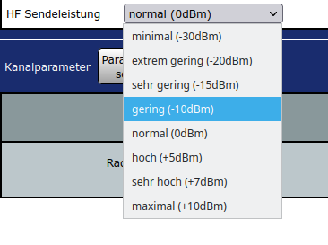
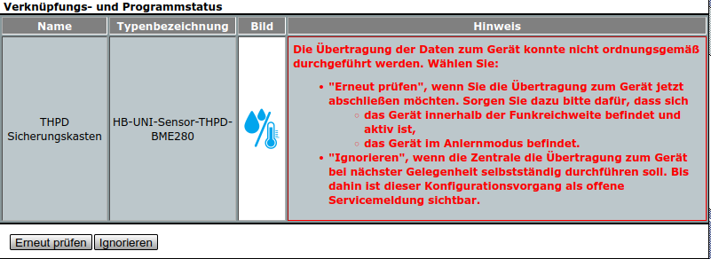
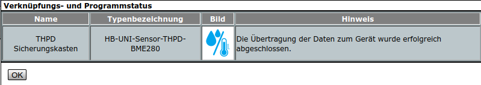

 ## Verringerung der Tx Sendeleistung des CC1101 Tranceiver Moduls
 
 
 - **WARNUNG**: Wenn Sensordatenpunkte sicherheitsrelevant sind, z.B. wenn ein wichtiger Aktor damit geschaltet wird, sollte die Tx Sendeleistung des CC1101 Transceiver immer auf den maximalen Wert +10dBm eingestellt bleiben. +10dBm ist der initiale Wert nach dem Programmieren des Sensors.  
 - **WARNUNG**: Das Reduzieren der Tx Sendeleistung geschieht in ausschließlich eigener Verantwortung des Nutzers.  
 - eine Reduktion des Tx Sendeleistung kann dann sinnvoll sein, wenn ein Sensor nahe an der Zentrale, z.B. auf derselben Etage, steht. Eine geringere Sendeleistung verlängert die Batterielaufzeit und verringert den Elektrosmog durch Hochfrequenzstrahlung, z.B. [hier](https://www.pc-magazin.de/ratgeber/strahlung-im-haus-wie-gefaehrlich-ist-das-vernetzte-haus-1504076.html).
 - der neue Geräteparameter 'HF Sendeleistung' wird ab der Addon Version [hb-ep-devices-addon](https://github.com/FUEL4EP/HomeAutomation/releases/latest) V1.10 unter 'Startseite > Einstellungen > Geräte > Geräte-/ Kanalparameter einstellen' unterstützt:
 

 -  im seriellen Monitor im Debug-Modus wird die aktuelle Tx Sendeleistung ausgegeben als
  > txPower: n
  >
  > n:= 7 => +10dBm   (10mW) 
  > n:= 6 => +7dBm 
  > n:= 5 => +5dBm 
  > n:= 4 => +0dBm    (1mW) 
  > n:= 3 => -10dBm 
  > n:= 2 => -15dBm 
  > n:= 1 => -20dBm 
  > n:= 0 => -30dBm
- nach der initialen Programmierung des Sensors ist die Tx Sendeleistung auf maximal +10dBm (txPower: 7) eingestellt.
- ein Werksreset, der durch ein > 6 Sekunden langes Drücken der Config-Taste ausgelöst wird, stellt die Tx Sendeleistung auf maximal +10dBm zurück. Dadurch wird allerdings auch die Adresse einer angelernten Zentrale vergessen, so dass ein erneutes Anlernen des Sensors an der Zentrale vonnöten ist. Der Sensor muss vor dem erneuten Anlernen **NICHT** aus der Zentrale gelöscht werden. Beim erneuten Anlernen erscheint der Sensor **NICHT** im Posteingangskorb. Wird das erneute Anlernen vergessen, funktioniert z.B. das 'Lazy Config' nicht mehr.

- folgendes Vorgehen wird zur Einstellung einer geringeren Sendeleistung empfohlen:
    + Sensor wird am späteren Aufstellungsort platziert.
    + bitte die bisherigen Geräte- und Kanalparameter notieren
    + die Ausgaben im seriellen Monitor verfolgen, auf TxPower achten (siehe oben)
    + die Sendeleistung wird nun schrittweise, bei der maximalen Sendeleistung von +10dBm beginnend, um jeweils eine Stufe reduziert.
    + nach dem Einstellen der geringeren Sendeleistung in der Zentrale unter 'Startseite > Einstellungen > Geräte > Geräte-/ Kanalparameter' dort auf 'Übernehmen' klicken. Es erscheint ein Verküpfungs- und Programmstatus Fenster (Sensorbezeichnungen können anders sein): 
      
     -  anschließend zur Übernahme der neuen Geräteparameter am Sensor sehr kurz  auf die Config-Taste drücken. 
    -  dann im 'Verküpfungs- und Programmstatus Fenster' auf 'Erneut prüfen' klicken.
    -  erfolgt nun die Bestätigung, dass die Übertragung der Daten zum Gerät erfolgreich abgeschlossen wurde,
    
    dann ist die eingestellte Sendeleistung noch ausreichend für eine Rückmeldung des Sensors an die Zentrale.
    - nun kann eine weitere Iteration mit der nächst kleineren Tx Sendeleistung gemacht werden
    - erfolgt keine Bestätigung mehr, dass die Übertragung der Daten zum Gerät erfolgreich abgeschlossen wurde, ist die eingestellte Tx Sendeleistung zu klein. Die dabei eingestellt Tx Sendeleistung bitte merken (siehe unten).
    - dann bitte am Sensor die Config-Taste für > 6 Sekunden für einen Werksreset drücken. Das stellt die Tx Sendeleistung wieder auf die maximale Sendeleistung von +10dBm.
    - nun abschließend als Tx Sendeleistung **zwei** Stufen über der Sendeleistung einstellen, bei der keine Bestätigung mehr erfolgte (1 Stufe für mehr Sicherheit für die Übertragung).
    - danach alle Geräteparameter auf der Zentralenseite 'Startseite > Einstellungen > Geräte > Geräte-/ Kanalparameter' nochmals neu eingeben. Der Werksreset setzt sie leider alle auf die im Sketch angegebenen Start-Werte zurück. Da die Übertragung von Geräteparametern von der Zentrale zum Sensor nur bei Änderungen erfolgt, bitte jeden Wert von List0 und List1 zuerst ein wenig verändern, die normale Prozedur zur Parametereingabe und -übernahme durchführen,  dann die originalen Werten wieder eingeben und wieder die normale Prozedur zur Parametereingabe und -übernahme durchführen. Sollten noch keine anderen Geräteparameter eingegeben worden sein, entfällt dieser Schritt.
    - als letzter Schritt muss  bei einem durchgeführten Werksreset (siehe oben) der Sensor nochmals neu angelernt werden. Der Sensor muss vor dem erneuten Anlernen **NICHT** aus der Zentrale gelöscht werden. Beim erneuten Anlernen erscheint der Sensor **NICHT** im Posteingangskorb. Wird das erneute Anlernen vergessen, funktioniert z.B. das 'Lazy Config' nicht mehr.

- das war's

 

