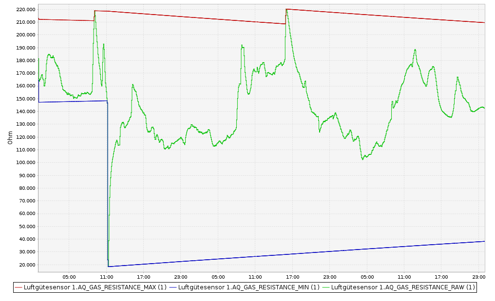

# Auto-calibration

An auto-calibration algorithm has been implemented in the code [sens_bme680_KF_rLF.h](../sensors/sens_bme680_KF_rLF.h).

- The following variables are of importance. The leading '_' of the C++ code representations are omitted due to limitations of the Markdown syntax.

> gas := measured gas resistance = AQ_GAS_RESISTANCE_RAW in CCU Historian 
> gas_upper_limit := upper gas resistance reference = AQ_GAS_RESISTANCE_MAX in CCU Historian 
> gas_lower_limit := measured gas resistance reference = AQ_GAS_RESISTANCE_MIN in CCU Historian 
> gas_upper_limit_min := minimum limit of gas_upper_limit 
> gas_lower_limit_max := maximum limit of gas_lower_limit 
> min_gas_resistance := minimum ever measured gas resistance since last reset 
> max_gas_resistance := maximum ever measured gas resistance since last reset 

### gas = AQ_GAS_RESISTANCE_RAW in CCU Historian

### gas_upper_limit = AQ_GAS_RESISTANCE_MAX in CCU Historian

- gas_upper_limit is basically the min peak (largest) value of the so far measured gas resistances
- As long as the currently measured gas resistance is lower than the gas_upper_limit,  gas_upper_limit is **decaying** every sampling cycle by a factor IIR_FILTER_COEFFICIENT

>  #define IIR_FILTER_COEFFICIENT 0.0001359 // 1.0 -0.9998641 ; Decay to 0.71 in about one week for a 4 min sampling period (in 2520 sampling periods)  
>  gas_upper_limit = gas_upper_limit - ( gas_upper_limit - gas_lower_limit) * IIR_FILTER_COEFFICIENT; 
- For getting a smoother behavior, the IIR filter coefficient is interpolated as follows:
>    void interpolate_iir_filter_coefficient(void) {double ratio = ee.non_convergence_factor / 100.0;
>       
>       if ( ratio <= REGRESSION_SETLLED_THRESHOLD_LOWER ) {
>         ee.iir_filter_coefficient            =  IIR_FILTER_COEFFICIENT_KF_SETTLED;             // kalman filter online regression is well settled
>       } else  {
>         if ( ratio >= REGRESSION_SETLLED_THRESHOLD_UPPER ) {
>           ee.iir_filter_coefficient          =  IIR_FILTER_COEFFICIENT_KF_UNSETTLED;           // kalman filter online regression is unsettled
>         } else
>         {                                                                                      // kalman filter is somehow settled: do linear interpolation
>            ee.iir_filter_coefficient         = (( ratio - REGRESSION_SETLLED_THRESHOLD_LOWER )/( REGRESSION_SETLLED_THRESHOLD_UPPER - REGRESSION_SETLLED_THRESHOLD_LOWER )) * ( IIR_FILTER_COEFFICIENT_KF_UNSETTLED - IIR_FILTER_COEFFICIENT_KF_SETTLED) + IIR_FILTER_COEFFICIENT_KF_SETTLED;             
>         }  
>       }  
>   }   

- However, the maximum decay is limited to gas_upper_limit_min

- This approach allows to allow a certain aging of the sensor, the upper gas resistance reference 'gas_upper_limit' will be dynamically adjusted.
- gas_upper_limit_min is also dynamically defined by the ever measured min and max gas resistances:

> gas_upper_limit_min = min_gas_resistance + (max_gas_resistance - min_gas_resistance) * **max_decay_factor_upper_limit** / 100;

- max_decay_factor_upper_limit is set as device parameter in the WebUI to typically 70 [%]. You can decrease it to e.g. 60 [%] if the aging of your BME680 got smaller. Ensure that max_decay_factor_upper_limit is bigger than max_increase_factor_lower_limit.

### gas_lower_limit = AQ_GAS_RESISTANCE_MIN in CCU Historian

- gas_lower_limit is basically the min peak value (smallest) of the so far measured gas resistances
- As long as the currently measured gas resistance is larger than the gas_lower_limit,  gas_lower_limit is **increasing** every sampling cycle by a factor IIR_FILTER_COEFFICIENT

>  #define IIR_FILTER_COEFFICIENT 0.0001359 // 1.0 -0.9998641 ; Increase to 1/0.71 in about one week for a 4 min sampling period (in 2520 sampling periods)  
>  gas_lower_limit_max = _min_gas_resistance + (max_gas_resistance - min_gas_resistance) * **max_increase_factor_lower_limit** / 100; 

- However, the maximum increase is limited to gas_lower_limit_max

- This approach allows to allow a certain aging of the sensor, the lower gas resistance reference 'gas_lower_limit' will be dynamically adjusted.
- gas_lower_limit_max is also dynamically defined by the ever measured min and max gas resistances:

> gas_lower_limit_max = _min_gas_resistance + (max_gas_resistance - min_gas_resistance) * max_increase_factor_upper_limit / 100;

- max_increase_factor_lower_limit is set as device parameter in the WebUI to typically 30 [%]. You can increase it to e.g. 40 [%] if the aging of your BME680 got smaller. Ensure that max_increase_factor_lower_limit is smaller than max_decay_factor_upper_limit.

### gas_score = AQ_LEVEL in CCU Historian

- gas_score is the normalized BME680 gas resistance:

gas_score = ((gas - gas_lower_limit)/(gas_upper_limit - gas_lower_limit)) * 100.0;

### Graphical view of the auto-calibration

- The below diagram shows the above described auto-calibration algorithms as waveforms collected in the CCU Historian.

### Auto-calibration of the residual of the multiple linear regression

Basically the same auto-calibration approach is implemented for the residual of the compensated residual compensation coefficients are calculated by a Kalman filter. For details, please refer to the comments in the code [sens_bme680_KF_rLF.h](../sensors/sens_bme680_KF_rLF.h).

- However, only the variable aq_state_scaled = Datapoint Parameter AQ_LOG10 in CCU Historian is observable from outside. The upper and lower limits are not observable from outside.

### Prerequisites and recommendations for the auto-calibration

#### Prerequisites

- Before starting the auto-calibration process, please adjust the temperature and humidity offsets in the WebUI device parameters. For that purpose, please put a 'golden' reference sensor next to the HB-UNI-Sensor1-AQ-BME680 sensor. Preferably do this over night when the temperature is quite stable without big disturbances:

- Here three HB-UNI-Sensor1-AQ-BME680 sensors' temperature measurements are shown together with the temperature measurement of a 'golden' sensor. 
- **After a device's power-on or reset**, a new auto-calibration cycle is started if the supply voltage is > 3.3V, .e. if you supply it with an ISP programmer of an FTDI debugger. A reset with battery supply (VCC < 3.3V) will read the previous auto-calibration parameters from the EEPROM.

- A solely battery change will restore the last saved auto-calibration parameters from EEPROM.
- To enable a meaningful auto-calibration, the gas_upper_limit and gas_lower_limit need to be set

	+ recommendation is to simple put the sensor into operation and to ensure that you ventilate  on a regular basis. The best way to ventilate is by opening doors and windows that are opposite each other, i.e. by cross-ventilation.
	+ a more sophisticated auto-calibration consists of the following steps 
		+ by exposing the sensor to fresh air for at least 30 minutes. This will set gas_upper_limit to a large value.
		+ by exposing the sensor to bad air for at least 30 minutes. The easiest way is to put some strong smelling cheese close to the BME680 sensor. This will set gas_lower_limit to a small value.
		+ in both cases, fresh and bad air exposure,please observe the transient effects in the CCU historian (similar to above diagram).
		+ please refrain in winter time to put the sensor to outside for the fresh air exposure. The big temperature and humidity differences to the inside conditions will otherwise overweight the humidity compensation.
	+ please do experiments and observe the results in the CCU Historian to get a better understanding about the capabilities, sensitivities, and limitations of the BME680 sensor.
	
	
#### Recommendations

- Ventilate your rooms on a regular basis. Open the windows completely for 10..15 minutes.
- All auto-calibration parameters will be reset if you reset the micro controller with a supply voltage > 3.3V, i.e. if you supply it with an ISP programmer of an FTDI debugger. A reset with battery supply (VCC < 3.3V) will read the previous auto-calibration parameters from the EEPROM:
	+ supply voltage >= 3.3V during battery change or flashing: start a new auto-calibration
	+ supply voltage < 3.3V during battery change or flashing: read previous auto-calibration parameters from the EEPROM, do not start a new auto-calibration
- You may speed-up and improve the settling of Kalman filter by:
	+ Expose the sensor to several cycles of
		* high humidity by putting a wet soft tissue soaked with water on top of the sensor for about 30 minutes
		* high temperature and low humidity by putting the sensor on a heater or oven for about 30 min (Tmax < 35 deg C)

 

