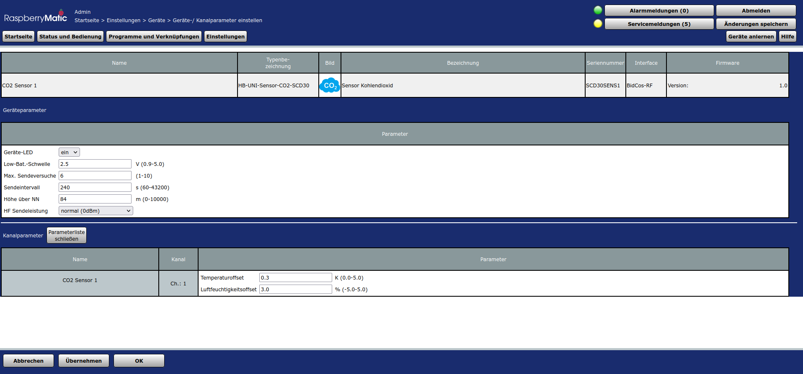
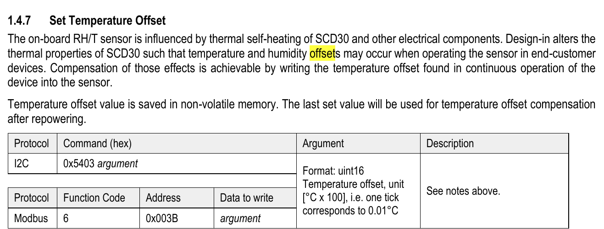

Dieses Werk ist lizenziert unter einer [Creative Commons Namensnennung - Nicht-kommerziell - Weitergabe unter gleichen Bedingungen 4.0 International Lizenz](http://creativecommons.org/licenses/by-nc-sa/4.0/).

## HB-UNI-Sensor1-CO2_SCD30

HB-UNI-Sensor1-CO2_SCD30 ist ein auf nichtdispersiver Infrarotsensormessung (NDIR) basierendes CO2 Messgerät mit einem Sensirion SCD30 CO2 und RH/T Sensor Modul.

Die CO2 Konzentration ist ein wichtiger Indikator für die Luftqualität in Innenräumen. Hier eine Übersicht auf die Auswirkungen von CO2 auf unsere Gesundheit:

[Auswirkung hoher CO2 Konzentrationen](https://www.cik-solutions.com/content/images/co2-konzentration.png)

Als Ausgangspunkt wird die Platine Alex Reinert und der Sketch  HB-UNI-SEN-BATT von Tom Major genommen und geeignet modifiziert.

Die unveränderten Originaldaten von HB-UNI-SEN-BAT sind verfügbar unter

[Original PCB HB-UNI-SEN-BAT](https://github.com/alexreinert/PCB/tree/master/HB-UNI-SEN-BATT)

[Original Sketch HB-UNI-Sensor1](https://github.com/TomMajor/SmartHome/tree/master/HB-UNI-Sensor1) 

### Bild des fertigen Sensors HB-UNI-Sensor1-CO2_SCD30

[Außenansicht HB-UNI-Sensor1-CO2_SCD30](Images/Aufbau/HB-UNI-Sensor1-CO2_SCD30_Außenansicht.png) 

### Hierarchischer Schaltplan in PDF und KiCAD Format

Die Schaltpläne enthalten als Textkommentare zusätzliche Aufbauhinweise.

[Hierarchische Schaltpläne HB-UNI-Sensor1-CO2_SCD30 3 Seiten](PCB/Files/HB-UNI-Sensor1-CO2_SCD30_schematics_3_pages.pdf)

[KiCAD Schaltpläne](PCB/Modification_of_Alexander_Reinerts_PCB/HB-UNI-Sensor1-CO2_SCD30/) 

### Stromversorgung des HB-UNI-Sensor1-CO2_SCD30 Sensors

Da die Infrarotdiode des Sensirion SCD30 Moduls immer angeschaltet sein muss (siehe Seite 4 des Dokuments 'Low Power Mode for SCD30' (Link unten)) und dabei 5mA Strom zieht, ist ein Batteriebetrieb des CO2 Sensors nicht sinnvoll bzw. möglich.

[Datasheet SCD30](https://www.sensirion.com/fileadmin/user_upload/customers/sensirion/Dokumente/9.5_CO2/Sensirion_CO2_Sensors_SCD30_Datasheet.pdf)

[SCD30 Interface Description](https://www.sensirion.com/fileadmin/user_upload/customers/sensirion/Dokumente/9.5_CO2/Sensirion_CO2_Sensors_SCD30_Interface_Description.pdf)

[Low Power Mode for SCD30](https://www.mouser.com/pdfdocs/CD_AN_SCD30_Low_Power_Mode_D2.pdf)

Ein wichtiges Entwicklungsziel war ein portabler CO2 Sensor, der nicht immer mit Netzspannung versorgt werden muss.
Daher kann der HB-UNI-Sensor1-CO2_SCD30 Sensor auf drei Arten mit Strom versorgt werden:

1. Akkubetrieb 2x 2400 mA AA NiMH Akkus und Step-Up Wandler auf 3.7V VCC Spannung. Damit kann der CO2 Sensor mehrere Tage ohne Netzspeisung betrieben werden.
2. Netzbetrieb mit 6V DC Eingang und Step-Down Wandler auf 3.8V VCC Spannung
3. Solarunterstützung und -ladung mit 70 mm x 70 mm 3V 100 mA Solarpanel und Step-Up Wandler auf max. 3.9V VCC Spannung  (3.7x .. 3.9V je nach Sonneneinstrahlung).

Diese drei möglichen Spannungsquellen sind durch Schottky Dioden voneinander abgetrennt und jeweils die Spannungsquelle mit der höchsten Spannung übernimmt die Stromversorgung.
Daher sind die nominalen Ausgangsspannungen auch gestaffelt. Bei dem Solarpanel gibt es je nach Sonneneinstrahlung entweder eine unterstützende Stromeinspeisung mit VCC von >3.7V oder eine Volleinspeisung mit VCC=3.9V.
  
Die zwei eingebauten NiMH Akkumulatoren können geladen werden mit

1. Einem eingebauten NiMH Lademodul bei eingesteckter 6V DC Netzspannungsversorgung
2. Mit einem Solarlader bei ausreichend hoher direkter Sonneneinstrahlung auf das eingebaute Solarpanel. Diffuses Sonnenlicht reicht dazu nicht aus. Im Winterhalbjahr ist die Sonneneinstrahlung leider meistens zu gering für eine Solarladung.

Exemplarische Spannungsverläufe der VCC und Akkumulatorenspannung sind unter

[Spannungsverläufe](Images/Histogramme)

zu finden. In den Verläufen über 7 Tage wurden die Akkumulatoren am 10. August mit dem Lademodul aufgeladen. Danach fand nur noch Nachladen mit dem Solarlader statt. Die wenige mV großen Spannungseinbrüche scheinen immer bei Übergängen zwischen verschiedenen Spannungsquellen stattzufinden. Sie beeinträchtigen die Funktion nicht. Die Regelkreise der Wandlermodule scheinen kurzfristig gegeneinander zu arbeiten. Der Beweis kann aber mangels einem digitalen Speicheroszilloskop nicht geführt werden.
Der starke Spannungseinbruch am 11. August ist auf ein kurzfristiges Herausnehmen der Akkumulatorenbatterien zurückzuführen. 

**Der HB-UNI-Sensor1-CO2_SCD30 Sensor kann auch nur mit Netzbetrieb versorgt werden.** Dadurch entfällt der Vorteil der beliebigen Aufstellung innerhalb eines Hauses bzw. Wohnung. Dafür wird die Hardware aber deutlich einfacher. Das Gehäuse kann dann kleiner werden. Die Software ist dafür vorbereitet. Die Hardware muss selbst geeignet angepasst werden. In einem Kapitel am Schluss werden dazu Hinweise gegeben, eine detaillierte Aufbaubeschreibung wird dazu allerdings nicht geliefert.

### Autokalibrierung des Sensirion SCD30 CO2 Sensors

Der bereitgestellte Sketch schaltet die Autokalibrierung des SCD30 CO2 Sensors ein. Siehe Details im Datenblatt:

**When  activated for the first time a period of minimum 7 days is needed so that the algorithm can find its initial parameter set for ASC. The sensor has to be exposed to fresh air for at least 1 hour every day.**

Das tägliche Querlüften z.B. am Morgen für mindestens 15..30 Minuten sollte dafür ausreichen (bitte während des Querlüftens CO2 Messwert prüfen und eigenen Erfahrungen sammeln, ein Kippen von Fenstern reicht in der Regel **nicht** aus!). Bis zur erfolgreichen Autokalibrierung können auch saturierte Messwerte von 380 ppm CO2 auftreten. Der CO2 Wert ist im Coronazeitalter auch ein guter Indikator, ob Aerosole ausreichend raus gelüftet werden.

Nach der Entnahme der Akkus ist in der Regel eine erneute Autokalibrierung vonnöten ! 

### Messintervall des SCD30 Sensors

Der bereitgestellte Sketch betreibt den SCD30 Sensor im 'Continuous Measurement Mode' mit einer CO2 Messung alle 60 Sekunden. Im SCD30 findet dann eine Filterung über mehrere Messwerte statt. Der Sketch liest dann alle 4 Minuten = 4 x 60 Sekunden einen CO2 Messwert aus.

[Beispielhistogramm eines gemessenen CO2 Konzentrationsverlaufs](Images/Histogramme/CO2 Histogram.png)

Das Histogramm zeigt den Effekt von Querlüftung am morgen kurz nach 7 Uhr. 

### WebUI Anzeige in Homematic / Raspberrymatic

Die WebUI Anzeige unter Gewerk Wetter:

[WebUI Anzeige](Images/WebUI/WebUI.png) 

### 3D Integration von Modulen

Neben der Basisplatine von Alexander Reinert HB-UNI-SEN-BATT sind zur Stromversorgung, Spannungsmessung und Akkuladung folgende fertige Module in 3D Integration auf die Basisplatine bzw das Gehäuseoberteil in 3D gedruckten Halterungen mit Zweikomponentenkleber eingeklebt:

1. NiMH Lademodul (Gehäuseoberteil)
2. Step-Up Wandler Solarlader (Gehäuseoberteil)
3. Step-Down Wandler bei Netzversorgung (Gehäuseoberteil)
4. Step-Up Wandler bei Akkubetrieb (Unterseite Basisplatine)
5. Spannungsmessmodule ADC ADS1115 (Unterseite Basisplatine)

Der SCD30 Sensor wird mit kleinen Schrauben auf die  Halterung geschraubt, die wiederum auf die Basisplatine HB-UNI-SEN-BATT aufgeklebt wird.
Das NiMH Lademodul wird auch mit kleinen Mikroschrauben in die Halterung eingeschraubt. Auf den Chip des NiMH Lademoduls wird ein kleiner Raspberry PI Kühlkörper aufgeklebt (max. 5 mm hoch).

**UPDATE 18.08.2020:** Für das Gehäuseoberteil wird nun eine STL und FreeCAD Datei unter Thingiverse zur Verfügung gestellt, die das Gehäuseoberteil und die Halterungen von NiMH Lademodul, Step-Up Wandler Solarlader und Step-Down Wandler bei Netzversorgung zusammenfasst, so dass sie gemeinsam als ein Teil gedruckt werden können und hier Klebungen entfallen.

Die Bilder in

[Bilder des Aufbaus](Images/Aufbau/)

veranschaulichen den Aufbau. **WICHTIG:** Die Basisplatine ist so auf den Gehäuseboden aufzuschrauben, dass der SCD30 Sensor auf der Seite der zwei Einrastnoppen des Gehäusebodens ist. Sonst reicht die Bauhöhe des Gehäuseoberteils nicht.

Für die Halterungen werden 3D Druck STL Dateien bei thingiverse.com zur Verfügung gestellt:

[3D Druck STL Dateien](https://www.thingiverse.com/thing:4557749)

[zusammengefasstes Gehäuseoberteil ohne Klebungen für die Halterungen](Images/Aufbau/HB-UNI-Sensor1-CO2_SCD30_Gehäuse_Oberteil.png)

Beim Aufkleben der Halterungen ist auf eine Trocknungszeit des Zweikompnenten Klebers (z.B. UHU plus endfest 2 Komponenten-Kleber) von mindesten 24 Stunden zu achten. Beim Aufkleben der SCD30 Halterung emfiehlt sich die Verwendung einer Halteklammer.

Gehäuseunter- und -oberteil sind mit einem 3-adrigen Arduino Common Sensor Kabel verbunden (die Buchse hab ich von einem Arduino-Sensor ausgelötet, da ich keine Bezugsquelle gefunden habe):

1. Schwarzer Leitungsdraht: GND (muss durch eine der beiden seitlichen Löcher der SCD30 Halterung durchgefädelt werden und dann vor dem Aufkleben der SCD30 Halterung auf einen der I2C Konnektoren der Basisplatine verlötet werden)
2. Roter Leitungsdraht: VCC (muss durch eine der beiden seitlichen Löcher der SCD30 Halterung durchgefädelt werden und dann vor dem Aufkleben der SCD30 Halterung auf einen der I2C Konnektoren der Basisplatine verlötet werden)
3. Gelber Leitungsdraht: Vaccumulator (wird durch eine Extrabohrung in der Basisplatine von unten auf die Basiplatine angelötet, siehe Bild des Gehäuseunterteils, siehe Bilder des Aufbaus)

Die Buchse ist in das Gehäuseoberteil eingeklebt. **WICHTIG:** Die 2 Leitungen (GND, VCC) des Arduino Common Sensorkabels müssen vor dem Aufkleben der SCD30 Halterung durch die seitlichen Löcher derselben durchgesteckt und auf einen der I2C Konnektoren der Basisplatine (VCC, GND) verlötet werden ! Siehe Bilder des Aufbaus. 

### Gehäuse

Außenmaße des Sensorgehäuses sind 86 mm x 86 mm x 45 mm.

Das Gehäuseunterteil ist gekauft beim Smartkram Onlineshop:

[Gehäuseunterteil](https://smartkram.de/produkt/sensorgehaeuse-passend-fuer-platine-von-alexander-reinert/)

**UPDATE 18.08.2020** Unter Thingiverse ist nun auch ein Gehäuseunterteil als STL Datei für einen 3D Druck zur Verfügung gestellt.

Um unten auf die Basisplatine Halterungen mit Modulen aufkleben zu können, sind 4 Abstandshülsen (STL beigefügt) aufgeklebt, um den Abstand Gehäuseboden zu Basisplatine zu vergrößern (siehe Bilder des Aufbaus).

Das Oberteil wird durch ein 45 mm hohes 3D gedrucktes Teil ersetzt, das mit FreeCAD entworfen wurde:

[Gehäuseoberteil FreeCAD Screenshot](Images/Aufbau/HB-UNI-Sensor1-CO2_SCD30_FreeCAD_Screenshot_Gehäuseoberteil.png)

In das Gehäuseoberteil werden mit Zweikomponentenkleber eingeklebt bzw. verschraubt:

1. Netzversorgungsbuchse DC 6V (verschraubt)
2. Mikrodruckschalter 6x6mm mit Rastung für das laden der NiMH Akkus (beim Einkleben mit Draht durch die benachbarten Löcher fixieren, Kleber erst nach Fixierung vorsichtig und dosiert anbringen, so dass die Rastfunktion des Schalters erhalten bleibt)
3. Rote LED für das Signalisieren der Ladung der NiMH Akkus (geklebt) 

In die Vertiefung auf der Oberseite des Gehäuseoberteils wird das 70mm x 70 mm Solarpanel eingeklebt. Die Anschlüsse werden durch die rechteckigen Löcher geführt. Der 3D Druck der Vertiefung ist ein wenig kniffelig, da mit Supportstrukturen gearbeitet werden muss. Auf Anfrage kann ich meine Einstellungen für ein AnyCube i3 Mega S 3D Drucker geben.

Das Gehäuse ist nicht wasserdicht und darf daher nicht unbeaufsichtigt draußen stehen!

### Modifikation der Basisplatine HB-UNI-SEN-BATT von Alexander Reinert

Die verwendete Basisplatine ist z.B. beim Smartkram Onlineshop käuflich erwerbbar:

[Bezugsquelle Basisplatine](https://smartkram.de/produkt/universalplatine-fuer-diy-bausatze-von-alex-reinert/)

**WICHTIG:** Für die Verwendung des Akku-Step-Up Wandlers muss **vor** dem Auflöten der Batteriehalterungen mit einer scharfen Klinge die VCC Leiterbahn der Basisplatine aufgetrennt werden:

[Auftrennung der VCC Leiterbahn auf der Basisplatine](Images/Aufbau/HB-UNI-SEN-BATT_PCB_with_cut.png)

Siehe schwarzer Strich oben rechts: **Hier Leiterbahn durchtrennen**. Damit sind die beiden Akkumulatoren von der VCC Versorgungsspannung getrennt.
Für die Durchführung der gelben Ladeleitung vom Akkulademodul ist ein geeignetes Loch ganz oben rechts zu bohren (siehe auch Aufbaubilder). 

### Einstellung der Spannungen der Step-Up und Step-Down Wandler

Die Spannungen der Step-Up und Step-Down Wandler müssen **unbedingt** im Leerlauf ohne angeschlossene andere Schaltkreise an den jeweiligen Potentiometern eingestellt werden. Sonst droht die Zerstörung der anderen Bauteile aufgrund von Überspannung! Die Wandler, die in das Gehäuseoberteil eingeklebt werden, müssen bei abgezogenem Arduino Common Sensor Stecker eingestellt werden (elektrische Trennung von Ober- und Unterteil des Gehäuses). Für die Feinjustage kann die Verbindung wieder hergestellt werden. Der Akku-Step-Up Wandler muss auch im Leerlauf ohne angeschlossene Last zuerst eingestellt werden, d.h. die Verbindung der Schottkydiode auf VCC wird erst **nach** der initialen Einstellung hergestellt.

Die initial einzustellenden Ausgangsspannungen sind:

1. Akku-Step-Up Wandler: 3.7V im Leerlauf nach der Schottkydiode am Ausgang (Spannungsabfall Schottky Diode ist ca. 0.3V)
2. Step-Down Wandler bei 6V DC Netzbetrieb: 3.8V im Leerlauf nach der Schottkydiode am Ausgang (Spannungsabfall Schottky Diode ist ca. 0.3V)
3. Solar-Step-Up Wandler: max. 3.9V bei direkter starker Sonneneinstrahlung auf das Solarpanel. Die Schottky Diode am Ausgang ist in den Wandler eingebaut:

[Solarwandler](https://www.matts-electronics.com/wp-content/uploads/2018/06/SX1308.pdf) 

### Benötigte Bauteile:

[Automatisch aus Schematics erzeugte BOM Liste im CSV Format](PCB/Modification_of_Alexander_Reinerts_PCB/HB-UNI-Sensor1-CO2_SCD30//HB-UNI-Sensor1-CO2_SCD30_BOM.csv)

Basisplatine HB-UNI-SEN-BATT von Alexander Reinert (gibt es beim Smarthome Onlineshop als Paket zu kaufen)

* HB-UNI-SEN-BATT Basisplatine von Alexander Reinert (Bezugsquelle siehe oben)
* Arduino Pro Mini 3.3V 8Mhz (The Simple)
  oder alternativ für mehr Speicherplatz: [Pro Mini XL - v2 - ATmega 1284p](https://www.tindie.com/products/prominimicros/pro-mini-xl-v2-atmega-1284p/)
* CC1101 Modulplatine 868MHz
* 1x LEDs 3mm Low Current (Pin 4)
* 1x 470Ohm Widerstände (Vorwiderstand für LED)
* Elko 10uF 1,5mm
* 2x Goobay Batteriehalter Mignon Print
* Mikroschalter 6*6mm
* Stiftleiste RM 2mm 1x8 Pin (Für CC1101)
* Stiftleiste RM 2,54MM (nach Bedarf)
* IRLU024N (optional für Verpolungsschutz)
* 100KOhm Widerstand (optional für Verpolungsschutz)
* 2x 10KOhm Widerstand (Pullup für I2C, nicht optional)
* 2x NiMH 2400mAh AA Akkumulatorbatterien (WICHTIG: Typ 'ready to use' für geringe Selbstentladung)  

restliche Bauteile und Module der Schematic Blätter 'Power Supply' und 'HB-UNI-SEN-BATT_mod':

* ~~1x Elko 470uF 10V~~
* 3x Schotty Diode 1N5819
* 1x LED rot 3mm
* 1x NiMH Lademodul "NiMH_Charger_NIMHCRTA_2S" 2S Version [Quelle z.B.](https://de.banggood.com/1A-NiMH-Rechargeable-Battery-Multipurpose-Charger-1_5V-3V-4_5V-CCCV-Charging-Module-with-Terminal-1_2V-2_4V-3_6V-Batteries-p-1624843.html)
* 1x Step-Down Wandler "Step_Down_LM2596" [Quelle z.B.](https://www.amazon.de/LAOMAO-Step-up-Converter-Raspberry-DIY-Projects-1-St%C3%BCck/dp/B00HV59922)
* 1x Step-Up Wandler "Step_Up_HW_668_SX1308" [Quelle z.B.](https://www.amazon.de/DC-DC-SX1308-Step-UP-Adjustable-Converter/dp/B07QFLC8YJ)
* 1x Step-Up Wandler "Step_Up_MT3608" [Quelle z.B.](https://www.amazon.de/AZDelivery-MT3608-Netzteil-Adapter-Arduino/dp/B079H3YD8V)
* 1x ADC Wandler Modul "16Bit_ADC_ADS1115" [Quelle z.B.](https://www.amazon.de/ADS1115-4-Kanal-Analog-Digital-Wandler-ADC-Modul-Raspberry/dp/B01N8ODF5C) (nicht das billigste Modul nehmen!)
* 1x Sensirion SCD30 CO2 Sensor "Sensirion_CO2_Sensor_SCD30" [Quelle z.B.](https://www.soselectronic.de/products/sensirion/scd30-5-290529)
* 1x PNP Transistor BC327
* 1x 270Ohm Widerstand
* 1x 100Ohm Widerstand
* 2x 10kOhm Widerstände
* 4x 47kOhm Widerstände 1% Genauigkeit
* 1x Solarpanel 3V 100mA 70mm x 70mm [Quelle z.B.](https://www.amazon.de/DealMux-St%C3%BCcke-Solarzelle-Spielzeug-Ladeger%C3%A4t/dp/B085NNXF5J)
* 1x Mikroschalter 6x6mm mit Rastung [Quelle z.B.](https://www.amazon.de/POPESQ%C2%AE-Schalter-Switch-Latching-Mikroschalter/dp/B00XA3RDQI)
* 1x DC Spannungsversorgungsbuchse 3.5mm*1.3 mm [Quelle z.B.](https://de.aliexpress.com/i/32729953104.html)
* 1x Universal Netzteil weiß 3V-12V, 1000mA [Quelle z.B.](https://www.amazon.de/conecto-Universal-Netzteil-Drehschalter-energiesparend-wei%C3%9F/dp/B075QGRPD7) (einstellen auf 6V, Polarität beachten!)
* 1x Kit Mikro-Kreuzschlitzschrauben 1000 Stück M1, M1.2, M1.4, M1.7 [Quelle z.B.](https://www.amazon.de/Phillips-Schrauben-Selbstschneidende-Elektronische-Holzschrauben/dp/B07S4FNB5N)
* 1x Arduino Common Sensor Cable-30cm [Quelle z.B.](https://www.emartee.com/product/41527/Arduino-Common-Sensor-Cable-30cm)

### Reduktion des Ladestroms des NiMH Lademoduls NiMH_Charger_NIMHCRTA_2S

Um ein Einfrieren des gesamten Sensors durch Spannungsstörungen bei Ladebeginn der NiMH Akkus zu vermeiden, muss der Ladestrom des Lademoduls "NiMH_Charger_NIMHCRTA_2S" von ca. 1 A auf 0.259 A verkleinert werden. Die Ladezeit der Akkus vergrößert sich dadurch auf ca. 12 Stunden. Dazu wird der SMD Widerstand R5 (siehe Bild, rot markiert) auf der Modulplatine von original 1.24 kOhm auf 4.7 kOhm vergrößert. Es kann auch statt des SMD Widerstands ein Metallfilmwiderstand eingelötet werden. Der positive Nebeneffekt des geringeren Ladestroms ist eine geringere Wärmeentwicklung des Lademoduls. 

[Änderung von R5 Widerstands des Lademoduls NiMH_Charger_NIMHCRTA_2S](Images/Aufbau/CN3085_NIMHCRTA_charge_current.png) 

Der Ladestrom beträgt laut

[Datenblatt des Lade IC CN3085 des Lademoduls NiMH_Charger_NIMHCRTA_2S](https://datasheetspdf.com/pdf-file/1257631/CONSONANCE/CN3085/1)

Icharge = 1218V／R5 [A]

### Programmierung des Arduino Pro Mini

Die Programmierung erfolgt mit einem ISP Programmer, z.B. Diamex ISP USB Programmer. Dazu dienen die Signale VCC, GND, MOSI, SCK, MISO, RSET an der Steckerleiste unten rechts der Basisplatine.
Einstellung: Board: Arduino Pro Mini; Prozessor: ATmega328P 3.3V, 8MHZ. Hochladen im Arduino IDE mit: Sketch => Hochladen mit Programmer
- **WICHTIG:** Den ISP Programmer auf 3,3V einstellen!
- **Unbedingt** diese [Warnung](https://github.com/TomMajor/SmartHome/tree/master/Info/Warnung_Flashen_33_USBasp_Klones) beachten!
Debugging wird über den seriellen Monitor mit einem FTDI Adapter USB zu TTL Serial für 3,3V und 5V für Arduino gemacht.
**WICHTIG:**  Vor dem Programmieren mit einem ISP Programmer oder Anschliessen eines FTDI Adapter USB zu TTL Serial für 3,3V und 5V für Arduino sind die Akkus aus den Halterungen zu entnehmen. Sonst entsteht ein hoher Strom Akku => Step-Up Wandler => 3.5 Versorgung ISP Programmer / FTDI Adapter. Sonst sind die Akkus sehr schnell tiefentladen !!!!

Ausgangspunkt für den Sketch war die Vorarbeit von Tom Major:

[Original Sketch HB-UNI-Sensor1](https://github.com/TomMajor/SmartHome/tree/master/HB-UNI-Sensor1) 

Die daraus abgeleiteten Modifikationen und Ergänzungen sind:

[Top-Level Sketch HB-UNI-Sensor1-CO2_SCD30.ino](HB-UNI-Sensor1-CO2_SCD30.ino)     <= Diesen Sketch im Arduino IDE laden und mit dem Programmer hochladen 
[SCD30 Include File Sens_SCD30.h](Sensors/Sens_SCD30.h) 
[projektspezifische my_Sensors_SCD30.h Datei](Sensors/my_Sensors_SCD30.h) mit 'class Carbondioxide' Definition  

#### Zur lokalen Installation des Github Releases auf Deinem Computer

- gehe bitte in Dein Zielinstallationsverzeichnis, wo Du mit dem HB-UNI-Sensor1-CO2_SCD30 Sensor arbeiten möchtest

  - gebe dort 'git clone https://github.com/FUEL4EP/HomeAutomation.git' ein
	  + damit lädst Du mein [Sammelrepository](https://github.com/FUEL4EP/HomeAutomation) für alle meine auf Github freigegebenen HomeBrew Sensoren herunter.
  - dann findest Du ein neues Verzeichnis 'HomeAutomation' auf Deinem Rechner, das alle meine auf Github freigebenen Sensoren enthält, siehe [README.md](https://github.com/FUEL4EP/HomeAutomation/blob/master/README.md)
  	+ mache bitte regelmäßig ein Update mit 'git pull'
 -	enthalten ist auch das notwendige Addon '[ep-hb-devices-addon](https://github.com/FUEL4EP/HomeAutomation/releases/latest)'
 -	den HB-UNI-Sensor1-CO2_SCD30 Sensor findest Du unter './HomeAutomation/tree/master/AsksinPP_developments/sketches/HB-UNI-Sensor1-CO2_SCD30'

**Update 08.12.2020:** Bitte im CCU3/RaspberryMatic WebUI sind unter 'Startseite > Einstellungen > Geräte > Geräte-/ Kanalparameter einstellen' die folgenden Parameter einstellen:

**WICHTIG** Der einzugebende Temperaturoffset darf nur positiv sein, da die Firmware des SCD30 Sensors nur positive Werte (unint16 im nächsten Bild) zulässt. Ein positiver Temperaturoffset im WebUI bewirkt eine Verringerung der gemessenen Temperatur! Genau umgekehrt als 'normal':

**WICHTIG:** Während des Aufladens der Akkumulatorbatterien sind die gemessene Temperatur und Luftfeuchtigkeit durch die Wärmeentwicklung des Ladereglers verfälscht.

Spezifisch angepasst werden müssen in **HB-UNI-Sensor1-CO2_SCD30.ino**:

Für die Kalibrierung der ADS1115 Spannungsteiler (VCC und Vaccumulator Spannungsmessung) werden die Spannungsteilerverhältnisse ADC0_FACTOR und ADC1_FACTOR aufgrund von Messungen mit einem exakten Voltmeter feinjustiert:

const float ADC0_FACTOR = 2 * 0.0625 * 3.509 / 3.486 ; // 2 is the uncorrected volate divider ratio; 0.0625 is the ADS115 ADC resolution for the selected gain of TWO
                                                          // 3.509 / 3.486 is the voltage divider correction factor for ADCO0 based on a multimeter comparison
const float ADC1_FACTOR = 2 * 0.0625 * 2.582 / 2.560 * 0.9958; // 2 is the uncorrected volate divider ratio; 0.0625 is the ADS115 ADC resolution for the selected gain of TWO

Dazu wird der Sketch 'singleended.ino' von Adafruit (https://github.com/adafruit/Adafruit_ADS1X15) genommen, die Gain auf 2 gesetzt, und dann die gewandelten Spannungswerte in seriellen Monitor ausgelesen.
Im obigen Beispiel ADC0_FACTOR ist 3.509 die mit dem Voltmeter gemessene VCC Spannung, 3.486 ist die ohne Korrektur vom ADC gewandelte Spannung.

### Verringerung des Ruhestroms: [siehe auch Referenz von TomMajor](https://github.com/TomMajor/SmartHome/tree/master/Info/Ruhestrom)

- Auf dem Arduino Pro Mini sollte der LDO Spannungsregler (die Stelle ist im Bild mit 1 markiert) sowie die Power-LED (2) entfernt werden, um den Ruhestrom wesentlich zu verringern.  
- Weiterhin kann die zweite LED am Arduino Pin 13 (SCK) entfernt werden (3). Deren Einfluß auf den Ruhestrom ist kleiner als bei LDO und Power-LED, trotzdem kann es sich auf lange Sicht lohnen da diese bei jeder CC1101 Kommunikation für kurze Zeit aktiv ist, besonders im BurstDetector Mode.

	

- Brown-Out_Detektor (BOD) des ATmega328P  ausschalten, dafür die Fuses setzen:

	- [Fuses Calculator](http://eleccelerator.com/fusecalc/fusecalc.php); select ATmega328P

	- [avrdude script](avrdude/avrdude_328P.bsh) (LINUX version)
		- wichtig ist dass dieser Skript **VOR** dem Flashen des Programmcodes ausgeführt wird.  Das EESAVE Konfigurationsbit des Atmega328P muss gesetzt sein (Preserve EEPROM memory through the Chip Erase cycle; [EESAVE=1])

### Benötigte Arduino Libraries:

\#include <EnableInterrupt.h> 
\#include <AskSinPP.h> 
\#include <LowPower.h> 
\#include <MultiChannelDevice.h> 
\#include <Register.h> 
\#include "Sensors/tmBattery.h"   (https://github.com/TomMajor/SmartHome/blob/master/HB-UNI-Sensor1/Arduino/Sensors/tmBattery.h) 
\#include <Wire.h> 
\#include "SparkFun_SCD30_Arduino_Library.h" (https://github.com/sparkfun/SparkFun_SCD30_Arduino_Library) 
\#include <Adafruit_ADS1015.h> (https://github.com/adafruit/Adafruit_ADS1X15)

### Speicherbedarf des Sketches:

**Update 08.12.2020:** Der Sketch verwendet 27416 Bytes (89%) des Programmspeicherplatzes. Das Maximum sind 30720 Bytes.
Globale Variablen verwenden 1596 Bytes (77%) des dynamischen Speichers, 452 Bytes für lokale Variablen verbleiben. Das Maximum sind 2048 Bytes.
Wenig Arbeitsspeicher verfügbar, es können Stabilitätsprobleme auftreten.
Falls Stabilitätsprobleme auftreten, bitte die Debugoption ausschalten:

> //#define NDEBUG   // uncomment in case of stability issues

### Benötigtes Addon auf CCUx/RaspberryMatic:

**Update 08.12.2020:** **Vor** dem Anlernen des HB-UNI-Sensor1-CO2_SCD30 Sensors ist das Addon [ep-hb-devices-addon](https://github.com/FUEL4EP/HomeAutomation/releases/latest) auf der CCUx/RaspberryMatic zu installieren. Dazu die 'hb-ep-devices-addon.tgz' von dort bitte herunterladen und als Zusatzsoftware in der CCU3/RaspberryMatic installieren. Die 'tgz'-Datei muss nicht unzipped werden!

### Hinweise zum reinen Netzbetrieb des HB-UNI-Sensor1-CO2_SCD30 Sensors

Für reinen Netzbetrieb des HB-UNI-Sensor1-CO2_SCD30 Sensors sind an der Software folgende Anpassungen vorzunehmen:

#### Auskommentieren von 'defines':

In 'HB-UNI-Sensor1-CO2_SCD30.ino':

<pre><code>
//#define ADS1115
//#define SOLAR_CHARGE  
</code></pre>

#### Codeänderungen

Bitte ändere in 	'HB-UNI-Sensor1-CO2_SCD30.ino'

<pre><code>
const struct DeviceInfo PROGMEM devinfo = {
    cDEVICE_ID,        // Device ID                 defined in ./Cfg/Device_SCD30.h
    cDEVICE_SERIAL,    // Device Serial             defined in ./Cfg/Device_SCD30.h
    { 0xf6, 0x01 },    // Device Model              needs to fit to Addon XML hb-uni-sensor-CO2-SCD30.xml line 6:
                       //                           parameter index="10.0" size="2.0" const_value="0xF601"
    0x10,              // Firmware Version
    as::DeviceType::THSensor,    // Device Type
    { 0x01, 0x01 }               // Info Bytes
};
</code></pre>

ab nach

<pre><code>
const struct DeviceInfo PROGMEM devinfo = {
    cDEVICE_ID,        // Device ID                 defined in ./Cfg/Device_SCD30.h
    cDEVICE_SERIAL,    // Device Serial             defined in ./Cfg/Device_SCD30.h
    { 0xf6, 0x05 },    // Device Model              needs to fit to Addon XML hb-uni-sensor-CO2-SCD30.xml line 6:
                       //                           parameter index="10.0" size="2.0" const_value="0xF605"
    0x10,              // Firmware Version
    as::DeviceType::THSensor,    // Device Type
    { 0x01, 0x01 }               // Info Bytes
};
</code></pre>

'0x05' wählt eine modifizierte rftypes XML mit weniger Ausgabedatenpunkten aus.

Bitte ändere in 	'Cfg/Device_SCD30.h'

<pre><code>
//---------------------------------------------------------
// Definition von Device ID und Device Serial
// Bei mehreren Geräten des gleichen Typs (HB-UNI-Sensor1) muss Device ID und Device Serial unterschiedlich sein!
 #define cDEVICE_ID      { 0xF6, 0x01, 0x01 }       //change second 0x01 to your sensor's numeration index
 #define cDEVICE_SERIAL  "SCD30SENS1"               //change 'SENS' to your name's abbreviation
                     //   1234567890   IMPORTANT: exact 10 characters are required! 
</code></pre>

ab nach

<pre><code>
//---------------------------------------------------------
// Definition von Device ID und Device Serial
// Bei mehreren Geräten des gleichen Typs (HB-UNI-Sensor1) muss Device ID und Device Serial unterschiedlich sein!
 #define cDEVICE_ID      { 0xF6, 0x05, 0x01 }       //change 0x01 to your sensor's numeration index
 #define cDEVICE_SERIAL  "SCD30SENS1"               //change 'SENS' to your name's abbreviation
                     //   1234567890   IMPORTANT: exact 10 characters are required! 
</code></pre>

Für reinen Netzbetrieb des HB-UNI-Sensor1-CO2_SCD30 Sensors sind an der Hardware folgende Anpassungen vorzunehmen:

- Weglassen der folgenden Module / Bauteile

	* Akkumulatoren
	* 3x Schotty Diode 1N5819
	* 1x LED rot 3mm
	* 1x NiMH Lademodul "NiMH_Charger_NIMHCRTA_2S" 2S Version
	* 1x Step-Down Wandler "Step_Down_LM2596"
	* 1x Step-Up Wandler "Step_Up_HW_668_SX1308" 
	* 1x Step-Up Wandler "Step_Up_MT3608" 
	* 1x ADC Wandler Modul "16Bit_ADC_ADS1115"
	* 1x PNP Transistor BC327
	* 1x 270Ohm Widerstand
	* 1x 100Ohm Widerstand
	* 2x 10kOhm Widerstände
	* 4x 47kOhm Widerstände 1% Genauigkeit
	* 1x Solarpanel 3V 100mA 70mm x 70mm 
	* 1x Mikroschalter 6x6mm mit Rastung 
	* 1x DC Spannungsversorgungsbuchse 3.5mm*1.3 mm 
	* 1x Universal Netzteil weiß 3V-12V, 1000mA 
	* 1x Arduino Common Sensor Cable-30cm 
	
- Hinzufügen der folgenden Module / Bauteile (nur Vorschlag, keine Ausarbeitung)

	* USB Buchse
	* geeigneter Step-Down Konverter 5V (USB) nach 3.5V
	
- Es solle möglich sein, ein [Standardgehäuse](https://smartkram.de/produkt/sensorgehaeuse-passend-fuer-platine-von-alexander-reinert/) zu verwenden. Der Step-Down Konverter kann z.B. mit einer 3D-Druckhalterung auf die Platine anstelle des nicht mehr benötigten Batteriehalters geklebt werden.
	
### Wichtige Hinweise, unbedingt beachten !!

*  Vor dem Programmieren mit einem ISP Programmer oder Anschliessen eines FTDI Adapter USB zu TTL Serial für 3,3V und 5V für Arduino sind die Akkus aus den Halterungen zu entnehmen. Sonst entsteht ein hoher Strom Akku => Step-Up Wandler => 3.5 Versorgung ISP Programmer / FTDI Adapter. Sonst sind die Akkus sehr schnell tief entladen !!!!
* Für die Verwendung des Akku-Step-Up Wandlers muss **vor** dem Auflöten der Batteriehalterungen mit einer scharfen Klinge die VCC Leiterbahn der Basisplatine aufgetrennt werden.
* Die Spannungen der Step-Up und Step-Down Wandler müssen **unbedingt** im Leerlauf ohne angeschlossene andere Schaltkreise an den jeweiligen Potentiometern eingestellt werden. Sonst droht die Zerstörung der anderen Bauteile aufgrund von Überspannung! Die Wandler, die in das Gehäuseoberteil eingeklebt werden, müssen bei abgezogenem Arduino Common Sensor Stecker eingestellt werden (elektrische Trennung von Ober- und Unterteil des Gehäuses). Für die Feinjustage kann die Verbindung wieder hergestellt werden. Der Akku-Step-Up Wandler muss auch im Leerlauf ohne angeschlossene Last zuerst eingestellt werden, d.h. die Verbindung der Schottkydiode auf VCC wird erst **nach** der initialen Einstellung hergestellt.
* Die korrekte Polarität der DC Spannungsversorgungsbuchse muss vor dem Anschluss von Wandlern oder Lademodulen geprüft werden. Das vorgeschlagene Netzteil erlaubt beide Polaritäten durch Umstecken des Adapters. 
* Der Ladestrom des NiMH Lademoduls NIMHCRTA 2S muss durch Ändern des Widerstands R5 von 1.24kOhm auf 4.7kOhm verkleinert werden. Reduzierter Ladestrom ist ungefähr 0.259A.

