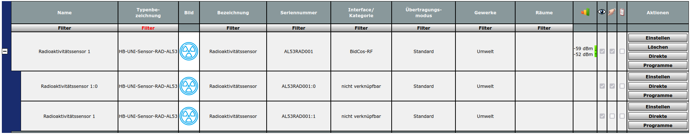
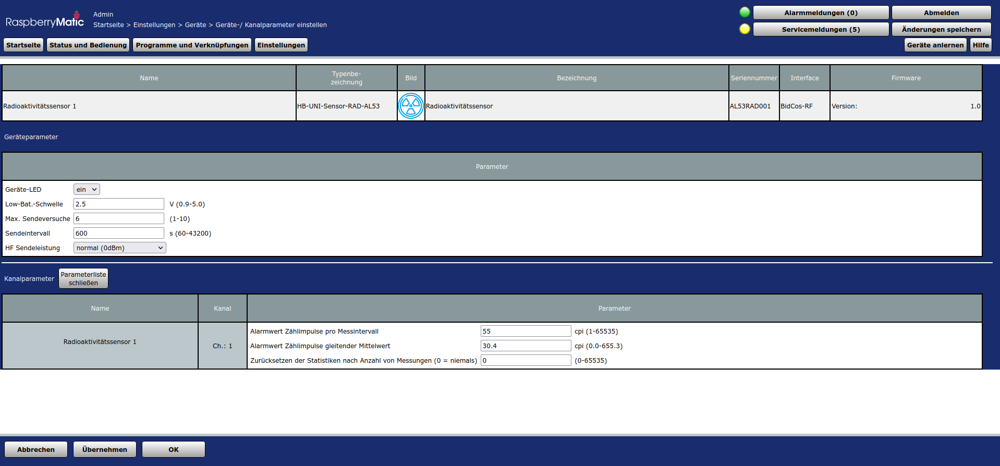

# HB-UNI-Sensor1-RAD-AL53  

# Under construction

## Coming soon, first prototype is now running well
- here first snapshot of software status
- documentation is missing, will be provided later on

## AsksinPP DIY Homematic sensor for alpha, beta, and gamma radiation
- Picture of current prototype 
- Picture 1 of WebUI 
- Picture 2 of WebUI 
- Picture 3 of WebUI 
- Based on
    - universal AsksinPP PCB for DIY-kits from Alexander Reinert [HB-UNI-SEN-BATT](https://github.com/alexreinert/PCB#hb-uni-sen-batt)
	- [Teviso AL53](https://www.teviso.com/file/pdf/al53-data-specification.pdf) radiation sensor
    	+ IMPORTANT: amplitude of output pulse is Vsupply, a voltage divider is needed to interface to the counter ABLIC S-35770
	- I2C counter [ABLIC S-35770](https://www.ablic.com/en/doc/datasheet/counter_ic/S35770_I_E.pdf)
	    + an Arduino library is [here](https://github.com/FUEL4EP/HomeAutomation/tree/master/AsksinPP_developments/libraries/ABLIC_S35770)
	- [Tindie Pro Mini XL - v2](https://www.tindie.com/products/prominimicros/pro-mini-xl-v2-atmega-1284p/)
	    + an ATMega328P Pro Mini will NOT work
	- ADS1115 ADC, e.g. from Amazon
	- supply by 2x NiMH accumulator batteries 2700 mAH (currently use of external charger)
	- MT3608 boost converter, e.g. from Amazon, for creating supply voltage of AL53 sensor, max 15V!!
	- [TPS61221 boost converter](https://www.tindie.com/products/closedcube/tps61221-low-input-from-07v-boost-33v-breakout/) for 3.3V supply of ATMega1284P (Tindie Pro Mini XL - v2)
	- Ultra low power
	- [AsksinPP](https://github.com/pa-pa/AskSinPP)
	- uses a [fork](https://github.com/FUEL4EP/HomeAutomation/tree/master/AsksinPP_developments/libraries/avr_stl) of Giampaolo Mancini (manchoz) [avr_stl](https://github.com/manchoz/avr_stl.git) implementation of a C++ standard library packaged as an Arduino library. The library is based on the library from Mike Matera.
	- addon [hb-ep-devices-addon](https://github.com/FUEL4EP/HomeAutomation/tree/master/AsksinPP_developments/addons/hb-ep-devices-addon) >= version 1.8
    	+ install and uninstall scripts were automatically created by [AsksinPP_addon_files_generator](https://github.com/FUEL4EP/HomeAutomation/tree/master/AsksinPP_developments/addons/hb-ep-devices-addon/CCU_RM/AsksinPP_addon_files_generator)
	- e-paper display will be added later on
	- NiMH charger will be added later on
	- radiation event counter is sampled every 10 minutes
	- typical radiation event rate is ~5 counts per 10 minutes, ~30 events per hour
	- cycling ring buffer of depth 1008 for calculating the moving average of radiation events, i.e. averaging over 1 week = 10 minutes * 1008
	- please post questions [here](https://homematic-forum.de/forum/viewforum.php?f=76). Please use as topic 'HB-UNI-Sensor1-RAD-AL53 Radioaktivitätssensor'
	