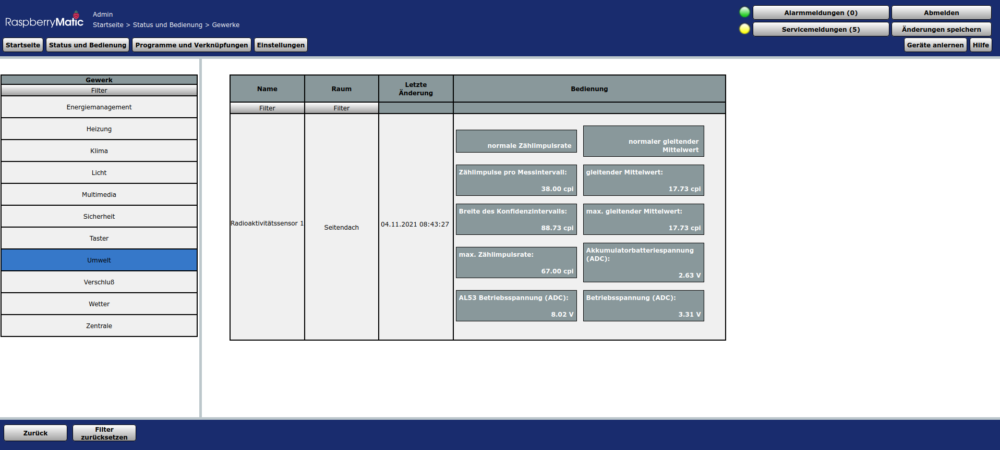
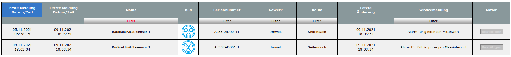

# HB-UNI-Sensor1-RAD-AL53 [](https://creativecommons.org/licenses/by-nc-sa/4.0/) [](https://hits.seeyoufarm.com)

**AsksinPP Homematic DIY Sensor für alpha, beta- und gamma-Strahlung** basierend auf dem [Teviso AL53 Sensor](https://www.teviso.com/file/pdf/al53-data-specification.pdf)


## Inhaltsverzeichnis
  - [Inhaltsverzeichnis](#inhaltsverzeichnis)
  - [Neuerungen](#neuerungen)
  - [Einsteiger](#einsteiger)
  - [Hinweise](#hinweise)
  - [Wichtige Hinweise, unbedingt beachten!](#wichtige-hinweise-unbedingt-beachten)
  - [Eigenschaften](#eigenschaften)
  - [Bilder](#bilder)
  - [Experimente](#experimente)
  - [Schaltplan](#schaltplan)
  - [Platine](#platine)
  - [Gehäuse](#gehäuse)
  - [Aufbau](#aufbau)
  - [Software Installation](#software-installation)
  - [Konfiguration](#konfiguration)
  - [Kompilation, Hochladen und erste Inbetriebnahme](#kompilation-hochladen-und-erste-inbetriebnahme)
  - [Kalibrierung](#kalibrierung)
  - [Anmelden an der Zentrale](#anmelden-an-der-zentrale)
  - [Verringerung der Tx Sendeleistung](#verringerung-der-tx-sendeleistung)
  - [Zurücksetzen der statistischen Zähler](#zurücksetzen-der-statistischen-zähler)
  - [Diverse Infos und Links (unsortiert)](#diverse-infos-und-links-unsortiert)
  - [Akkulebensdauer](#akkulebensdauer)
  - [Unterstützung, Fragen und Antworten](#unterstützung-fragen-und-antworten)
  - [Disclaimer](#disclaimer)
  - [Lizenz](#lizenz)

## Neuerungen
- dies ist eine initiale Freigabe, ein erster Prototyp von HB-UNI-Sensor1-RAD-AL53 ist voll funktionsfähig und läuft seit mehreren Wochen
- ein e-Paper und ein NiMH-Lademodul fehlen in dieser initialen Freigabe noch
- Rückmeldungen, Fragen und Hinweise zur Verbesserung der Dokumentation sind [im Homematic Forum](https://homematic-forum.de/forum/viewtopic.php?f=76&t=60293&hilit=AL53) willkommen oder auch als private Nachricht an [FUEL4EP](https://homematic-forum.de/forum/ucp.php?i=pm&mode=compose&u=20685) im Homematic Forum.
- die Dokumentation ist noch im Aufbau, Hinweise auf Fehler oder Unvollständigkeiten sind als private Nachricht willkommen 

## Einsteiger

- wer noch nicht mit Homematic DIY AsksinPP vertraut ist, sollte zuerst die folgenden Grundlagen lesen
	+	[AsksinPP Grundlagen](https://asksinpp.de/Grundlagen/)
- bitte alle Kapitel vor dem Fragestellen im Homematic Forum durchlesen

##  Hinweise
- geplante Erweiterungen
    + e-Paper Anzeige mit [1.54 inch e-Paper Module von Waveshare](https://www.waveshare.com/wiki/1.54inch_e-Paper_Module) mit SPI-Schnittstelle 
    + Akkulademodul mit 5V USB Ladebuche
    + 3D Druck Gehäuse
    + eventuell weiteren Signaleingang für externen Geigerzähler, z.B. [Taschen-Geiger-Strahlungssensor - Typ 5](https://www.robotshop.com/de/de/taschen-geiger-strahlungssensor-typ-5.html) oder [Stuttgarter Geigerle](http://www.opengeiger.de/BauanleitungV1_1.pdf)
- Mitwirkende sind willkommen, Interesse bitte per PN bei [FUEL4EP](https://homematic-forum.de/forum/ucp.php?i=pm&mode=compose&u=20685) melden
  
    
## Wichtige Hinweise, unbedingt beachten!
- beim Umgang mit radioaktiven Stoffen sind die zutreffenden gesetzlichen Sicherheitsvorkehrungen zu beachten, ohne Anspruch auf Vollständigkeit ist [hier](https://www.buzer.de/StrlSchV.htm) eine Übersicht zu finden. Für die Beachtung aller Sicherheitsvorschriften ist der Nutzer selbst verantwortlich!
- beim Aufbau bitte unbedingt die Ausgangsspannung des MT3608 Aufwärtswandlers auf 8,0V einstellen **bevor** der Teviso AL53 Sensor angeschlossen wird
- das Aluminiumfenster des Teviso AL53 Sensors absolut nicht berühren!
- den Teviso AL53 Sensor mit dem bereitgestellten [3D Druckgehäuse](3D_print_files/AL53_case.stl) schützen:

- dazu zuerst in die Vertiefung des 3D Druckgehäuses ein zurechtgeschnittenes Rechteck eines [Bewehrungsnetzes](https://www.amazon.de/Bewehrungsnetz-V4A-Edelstahl-300-Kunststoffschweissen/dp/B00UVS7GM6) mit Zweikomponentenkleber einkleben.
- dann den Teviso AL53 Sensor vorsichtig ohne Verkantung in das 3D Druckgehäuse eindrücken
- nun die überstehenden 'Nasen' des Teviso AL53 Sensors vorsichtig und mit wenig Erschütterungen mit einer Modellbaufeile abfeilen.
- als Letztes dann zur EMV Abschirmung das 3D Druckgehäuse und den eingedrückten Teviso AL53 Sensor von außen mit [selbstklebender Kupferfolie](https://www.amazon.de/Kupferfolie-Selbstklebend-Abschirmband-beidseitig-Abschirmung/dp/B076Q7NJ6G) bekleben, das Sensorfenster dabei freilassen, siehe Bild oben. Darauf achten, dass die Anschlüsse des Teviso AL53 Sensors nicht kurzgeschlossen werden.
- die drei Lötfahnen des Teviso AL53 vorsichtig mit einem Seitenschneider kürzen, so dass das Sensorgehäuse zwischen die Batteriehalterungen der [Basisplatine HB-UNI-SEN-BATT](https://github.com/alexreinert/PCB/tree/master/HB-UNI-SEN-BATT) von Alexander Reinert passt.
- direkt an die Versorgungsanschlüsse einen keramischen Kondensator 4,7uF und einen Elektrolytkondensator 22uF (>10V) anlöten:


- da die EMV Kupferfolie elektrisch leitfähig ist, bitte zuerst **vorübergehend** die I2C Platinenanschlüsse unter dem Sensorgehäuse mit einem Klebefilm isolieren. Sonst besteht Kurzschlussgefahr! Der Klebefilm ist im obigen Bild erkennbar.
- **erst nach erfolgreicher Inbetriebnahme** und Test des gesamten Geräts wird mit Zweikomponentenkleber der 3D gedruckte [Abstandshalter](./3D_print_files/AL53_case_distance-BodyPad.stl)  zwischen das 3D Druckgehäuse und die Platine geklebt. 
- **Beim Programmieren mit einem ISP Programmer oder beim Debuggen über den seriellen Monitor mit einem FTDI Debugger dürfen die Akkumulatoren nur kurz (wenige Minuten zum Funktionstest des AL53) eingelegt bleiben, sonst werden sie tiefentladen, da der Aufwärtswandler gegen die Betriebsspannung des ISP Programmers oder/und des FTDI Debuggers arbeitet.**


## Eigenschaften
- basierend auf dem [Teviso AL53 Sensor](https://www.teviso.com/file/pdf/al53-data-specification.pdf) Sensor
- misst alpha-, beta- und gamma-Strahlung
- die Absorptionscharakteristik für gamma-Strahlung ist ähnlich der PIN-Diode [X100-7 THD von First Sensor](https://www.first-sensor.com/cms/upload/datasheets/X100-7_THD_5000040.pdf) und auf gamma Energien von < ca. 10keV beschränkt.
- geringer Energieverbrauch: nur ca 0,83 mA im Messbetrieb
- Versorgung mit zwei aufladbaren 2700mAh NiMH Akkumulatorzellen: Laufzeit > 2 Monate mit einer Akkuladung
- die Ausgangspulse des AL53 Sensors werden mit einem [ABLIC S-35770 24-Bit Zählerbausstein](https://www.ablic.com/en/doc/datasheet/counter_ic/S35770_I_E.pdf) gezählt und per I2C alle 10 Minuten ausgelesen.
- die typische Zählrate bedingt durch die natürliche Hintergrundstrahlung beträgt ca. ~5 Ereignisse in 10 Minuten (Einheit: cpi = counts per interval, interval := 10 Minuten) oder ~30 Ereignisse in einer Stunde. **Daher ist der Sensor nicht für die schnelle Erfassung von Radioaktivität oder einer schnellen Änderung der Radioaktivität geeignet.**
- ein gleitender Mittelwert wird mit einem zyklischen Ringpuffer der Tiefe 1008 aus den ausgelesenen Zählerständen gebildet, d.h. die gleitende Mittelwertbildung wird über den Zeitraum der letzten 1008 * 10 Minuten = 7 Tage durchgeführt. Es wird jeweils  das älteste Zählergebnis verworfen, wenn ein neues Zählergebnis eingelesen wird. Das Füllen des Ringpuffers dauert 7 Tage. Währenddessen steigt der gleitende Mittelwert 'semi' linear an.
- es wird die Breite des 95% Vertrauensintervalls für die Zählrate (cpi) online berechnet und im WebUI ausgegeben.
    + das Konfidenzintervall des gleitenden Mittelwerts lässt sich daraus mathematisch ableiten, siehe [hier](./Images/confidence_interval.png)
- als Mikrokontrollerplatine wird der auf einem ATMega1284P basierende Arduino [Tindie Pro Mini XL - v2](https://www.tindie.com/products/prominimicros/pro-mini-xl-v2-atmega-1284p/) verwandt. WICHTIG: Ein Arduino Pro Mini mit einem ATmega328P passt wegen zu geringem Speicherplatz nicht!
- zwei Alarmsignale werden direkt vom AsksinPP Sensor zur als binäre Datenpunkte Verfügung gestellt:
    + der Datenpunkt HB_ALARM_COUNTS_PER_MEASUREMENT_INTERVAL signalisiert, wenn die aktuelle Anzahl von Zählimpulsen den als Geräteparameter eingestellten Schwellwert 'Alarmwert Zählimpulse pro Messintervall' überschreitet
    + der Datenpunkt HB_ALARM_MOVING_AVERAGE signalisiert, wenn der aktuelle gleitende Mittelwert von Zählimpulsen den als Geräteparameter eingestellten Schwellwert 'Alarmwert Zählimpulse gleitender Mittelwert' überschreitet
    + eine Überschreitung der Grenzwerte löst in der Zentrale einen Alarm aus
- die interne statistische Datenbasis, die z.B. für die Bildung des gleitenden Mittelwerts benutzt wird, kann periodisch per Kanalparameter zurückgesetzt werden (nach 1..65535 Messintervalle) oder für immer laufen (Eingabe 0: für immer)

## Bilder

-    WebUI in der RasperryMatic: Startseite > Status und Bedienung > Gewerke



-  das Gerät im Gerätemanager: Startseite > Einstellungen > Geräte


- mögliche Parameter zum Einstellen: Startseite > Einstellungen > Geräte > Geräte-/ Kanalparameter einstellen


- Datenpunkte des HB-UNI-Sensor1-RAD-AL53 Sensors (in dem CCU Historian)


- Beispiel eines Histogramms der Zählrate per Messintervall (im CCU Historian)


- Beispiel eines Histogramms des gleitenden Mittelwerts (im CCU Historian)

    - Hochlauframpe des gleitenden Mittelwerts in den ersten 7 Tagen
    - der gleitende Mittelwert pendelt sich hier nach 7 Tagen auf ca. 4.1 cpi ein 
    


- Beispiel eines Histogramms des gleitenden Mittelwerts (im CCU Historian). Die Varianz des gleitenden Mittelwerts ist deutlich reduziert, siehe [hier](./Images/confidence_interval.png). 


- Beispiel einer Messung einer radioaktiven Probe: Gartendünger  in 70mmx30mmx40mm [Plastikquader mit Aluminiumfolie als Abdeckung](./Images/box_with_fertilizer.png) ab 20:55 Uhr direkt vor den Sensor gelegt, siehe auch [Kaliumisotope](https://www.internetchemie.info/chemische-elemente/kalium-isotope.php), [Radon-Exhalationsmessungen an Düngemitteln](http://www.opengeiger.de/RadonDuenger/RadonDuenger.html), [Giftiges Uran im Gartendünger](https://www.youtube.com/watch?v=AQva8Ez1Tp4). Die gemessene Radioaktivität ist ca. um einen Faktor 3 (!!) höher als die normale Hintergrundstrahlung.
- Der Messbehälter für 3D-Druck ist hier: [Behälter](./3D_print_files/Measurement_cell_bottom.stl) und [Deckel](./3D_print_files/Measurement_cell_top.stl). Die Öffnung mit einer dünnen Haushaltsaluminiumfolie verschließen.


- hier das Hochlaufen des gleitenden Mittelwerts über eine Woche auf den ca. 3x erhöhten Wert:


- Auslösen von einem Alarm bei Überschreitung eines im WebUI setzbaren Grenzwerts für die Zählimpulse pro Messintervall. Gesetzt war ein Grenzwert von 55 cpi:


- und die zugehörige Alarm Statusmeldung(en):



- Auslösen von einem Alarm bei Überschreitung eines im WebUI setzbaren Grenzwerts für den gleitenden Mittelwert. Gesetzt war ein Grenzwert von 23.7 cpi. Gemessen wurde eine Kaliumchloridsalz-Probe:


- und die zugehörige Alarm Statusmeldung:


## Experimente

- Ergebnisse werden nach und nach [hier](./measurement_examples) abgelegt
- Messung von Kaliumchlorid in Lebensmittelqualität (E508), das aufgrund seines natürlichen K-40 Gehalts ein Beta-Strahler ist
- Radonmessung mit dem Dünger ist geplant:
    - [Uran im Boden und im Wasser ? – Testen Sie Ihr Düngemittel !](http://www.opengeiger.de/DuengerRadonTest.pdf)

## Schaltplan

- KiCAD [Schaltplan](./PCB/schematics/HB-UNI-Sensor1-RAD-AL53.pdf) oder KiCAD [Datenbasis](./PCB/KiCAD/HB-UNI-Sensor1-RAD-AL53/)

## Platine

- universale AsksinPP PCB für DIY-Sensoren von Alexander Reinert [HB-UNI-SEN-BATT](https://github.com/alexreinert/PCB#hb-uni-sen-batt)
    +    zu kaufen z.B. beim [Smartkramshop](https://smartkram.de/shop/produkte/bauteile-zentralen/diy-bausaetze/luftfeuchtigkeit-temperatur-bausaetze/universalplatine-fuer-diy-bausatze-von-alex-reinert/) 
    +    oder im Homematic Forum nachfragen, ob jemand eine Platine verkauft.
    +    oder selbst bei [JLCPCB](https://github.com/Asselhead/Bestellanleitung-JLCPCB-SMT-Service) bestellen. Andere Hinweise dazu sind [hier](https://asksinpp.de/Platinen/#der-pw).
-    die folgenden Änderungen sind notwendig:


- oder auch alternativ [HB-UNI-SEN-BATT_FUEL4EP](../../PCBs/HB-UNI-SEN-BATT_FUEL4EP) oder [HB-UNI-SEN-BATT_ATMega1284P_E07-868MS10_FUEL4EP](https://github.com/FUEL4EP/HomeAutomation/tree/master/AsksinPP_developments/PCBs/HB-UNI-SEN-BATT_ATMega1284P_E07-868MS10_FUEL4EP) (siehe auch Hinweise dort). Der manuelle Bestückungsaufwand für HB-UNI-SEN-BATT_ATMega1284P_E07-868MS10_FUEL4EP ist nur noch minimal. Alle SMD-Bauteile sind von JLCPCB vorbestückt, nur noch THT-Bauteile müssen händisch eingelötet werden.


## Gehäuse

- ein passendes 3D Druckgehäuse muss noch entworfen werden (in Planung). Basis wird das [Gehäuse HB-UNI-SEN-BATT snap in V2 von wpatrick](https://www.thingiverse.com/thing:3540481) sein. Die Grundplatte bleibt. Das Oberteil wird mit größerer Bauhöhe neu erstellt.  Auf die Grundplatte werden die  [Abstandhalter](./3D_print_files/Spacer_sleeve.stl) geklebt, so dass die Module auf die Unterseite der Platine geklebt werden können.
- Ein passendes Unterteil für 3D-Druck ist [hier](./3D_print_files/Case_bottom_with_10mm_spacers). 


## Aufbau
- die KiCAD BOM Liste ist [hier](./PCB/KiCAD/HB-UNI-Sensor1-RAD-AL53/HB-UNI-Sensor1-RAD-AL53_BOM.html) (HTML Format)
- Bild des Prototypen
    
- Bild des Prototypen mit AL53 Kupferschirmung
    
- die folgende Module werden benötigt:
	- Teviso [AL53 Sensor](https://www.teviso.com/file/pdf/al53-data-specification.pdf), Bezugsquelle: Teviso [sales@teviso.com](https://www.teviso.com/en/contact.htm)
        *    WICHTIG: Der Ausgangspegel des OUT Signals vom Teviso AL53 Sensor beträgt 8,0V ( = Betriebsspannung AL53). Daher ist ein Spannungsteiler (R19, R13, D1, D2 siehe [Schaltplan](./PCB/schematics/HB-UNI-Sensor1-RAD-AL53.pdf) oder KiCAD [Datenbasis](./PCB/KiCAD/HB-UNI-Sensor1-RAD-AL53/))
        * typischer Ausgangspuls des AL53 Sensors @ 8,0V Betriebsspannung siehe Bildschirmabzug eines Speicheroszilloskops 
        * die Pulsbreite beträgt nur ca. 150 .. 200 us, aufgrund der normalen Hintergrundstrahlung werden im Mittel nur ca. 0,5 Pulse zufällig pro Minute (!!) erzeugt
    
   	- 16 bit [ADS1115](https://www.ti.com/lit/ds/symlink/ads1115.pdf) AD-Wandlermodul, schmale Bauform, Bezugsquelle z.B. [Amazon](https://www.amazon.de/dp/B01N8ODF5C) oder [Paradisetronic](https://paradisetronic.com/en/add-on-boards/ads1115-4-channel-16-bit-analog-to-digital-converter-adc-module-i2c)
   	- I2C Zählerbaustein [ABLIC S-35770](https://www.ablic.com/en/doc/datasheet/counter_ic/S35770_I_E.pdf), Bezugsquelle z.B. [Mouser](https://www.mouser.de/ProductDetail/ABLIC/S-35770E01I-K8T2U?qs=vLWxofP3U2yvSXNQEw14rA%3D%3D), [Digikey](https://www.digikey.de/product-detail/de/ablic-u-s-a-inc/S-35770E01I-K8T2U/1662-3409-1-ND/9974503)
        + der IC ABLIC S-35770 wird auf einen [SMD to DIP8 Adapter PCB Board Convertor ](https://www.amazon.de/SOIC8-Adapter-Board-Convertor-Double/dp/B00JK8EYTG) aufgelötet.
        + eine Arduino Bibliothek für den ABLIC S-35770 ist [hier](https://github.com/FUEL4EP/HomeAutomation/tree/master/AsksinPP_developments/libraries/ABLIC_S35770), 
   	- [Tindie Pro Mini XL - v2](https://www.tindie.com/products/prominimicros/pro-mini-xl-v2-atmega-1284p/), Bezugsquelle: [Tindie](https://www.tindie.com/products/prominimicros/pro-mini-xl-v2-atmega-1284p/)
   	- CC1101 868 MHz Wireless Funk Modul Transciever, Bezugsquelle z.B. [Makershop](https://www.makershop.de/module/funk/cc1101-868-mhz/)
   	- [MT3608](https://www.olimex.com/Products/Breadboarding/BB-PWR-3608/resources/MT3608.pdf) Aufwärtswandler, Bezugsquelle z.B. [Amazon](https://www.amazon.com/-/de/dp/B07TLJR2S9)
        +    für die Erzeugung der Betriebsspannung des AL53 Sensors: 8,0V, bitte keine höhere Spannung einstellen, sonst erzeugt der AL53 Sensor Doppel- oder Mehrfachpulse 
     - [TPS61221 Aufwärtswandler](https://www.tindie.com/products/closedcube/tps61221-low-input-from-07v-boost-33v-breakout/), Bezugsquelle [Tindie]((https://www.tindie.com/products/closedcube/tps61221-low-input-from-07v-boost-33v-breakout/))
  - für die Erzeugung der Betriebsspannung von 3,3V für den ATMega1284P (Tindie Pro Mini XL - v2)
          	- Lochrasterplatine 14,5 mm x 14,5 mm zum Aufbau von
  - Betriebsspannungsfilters AL53: R15, R16, C2
    + Begrenzer Ausgangssignal AL53: R13, R19, D1, D2, D4
  - zwei NiMH Akkumlatorbatterien 2700 mA
       + zur Zeit wird noch ein externes Ladegerät benötigt, das später durch ein in das Gehäuseoberteil eingeklebtes NiMH Lademodul ersetzt wird
  
- vor den Lötarbeiten werden die [Modifikation der Basisplatine PCB HB-UNI-SEN-BATT](./PCB/HB-UNI-SEN-BATT/Modifications_HB-UNI-SEN-BATT.png) durchgeführt

- der Lötaufbau erfolgt zuerst weitgehend entsprechend der [Beschreibung von Smartkramshop](https://technikkram.net/blog/2018/05/30/homematic-diy-projekt-thermometer-und-hydrometer-fertige-platine-im-eigenbau/) mit folgenden Änderungen:
	+ 	statt des Arduino Pro Mini wird ein  [Tindie Pro Mini XL - v2](https://www.tindie.com/products/prominimicros/pro-mini-xl-v2-atmega-1284p/), Bezugsquelle: [Tindie](https://www.tindie.com/products/prominimicros/pro-mini-xl-v2-atmega-1284p/) verbaut
	+	der BME280 Sensor wird weggelassen
	+	die I2C Pullup-Widerstände R4 und R5 werden eingelötet
	+	es wird empfohlen, den CC1101 Tranceiver und den Tindie Pro Mini XL - v2 auf Stecksockeln anzubringen, 2 mm Buchsenleisten und Stiftleisten gibt es z.B. Bei Conrad Electronics
	+	R14 wird auf der PCB Oberseite an den Lötpins A0 und A1 eingelötet
	+	für den ISP Programmer wird die 6-polige Steckerleiste J10 eingelötet
	+	wer auf die Verpolungsschutz verzichten kann (will), kann die Lötbrücke J8 anbringen (dann Q1 und R3 weglassen)
- nun vor der Ruhestrommessung auf dem Tindie Pro Mini XL - v2 - ATmega 1284p die markierte LED auslöten:


	
- nach diesem Lötaufbau und dem Auslöten der LED sollte zuerst mal eine [Ruhestrommessung mit Sleeeptest_ATMega184P.ino](./Sleeeptest_ATMega184P/Sleeeptest_ATMega184P.ino) durchgeführt werden. Anleitung ist oben im Quelltext als Kommentar oder [hier](https://github.com/TomMajor/SmartHome/tree/master/Info/Ruhestrom). Der gemessene Ruhestrom in der Schlafphase des Mikrokontrollers sollte weniger als 10uA betragen. 

- nach der erfolgreichen Ruhestrommessung und vor dem Aufspielen des eigentlichen Sketches HB-UNI-Sensor1-RAD-AL53 **UNBEDINGT** einen [Frequenztest ATMega1284P](FreqTest_1284P/FreqTest_1284P.ino) durchführen. Viele CC1101 Module lassen sich ohne diesen Frequenztest nicht anlernen! Eine Beschreibung des Frequenztests ist [hier](https://asksinpp.de/Grundlagen/FAQ/Fehlerhafte_CC1101.html#ermittlung-der-cc1101-frequenz) zu finden.

 - der IC ABLIC S-35770 und der Reset-Pullup-Widerstand R18 wird auf einen [SMD to DIP8 Adapter PCB Board Convertor ](https://www.amazon.de/SOIC8-Adapter-Board-Convertor-Double/dp/B00JK8EYTG) mit Flußmittel aufgelötet:

  

- nach der erfolgreichen Ruhestrommessung werden für die Module werden auf die Rückseite der [modifizierten Platine](PCB/HB-UNI-SEN-BATT/Modifications_HB-UNI-SEN-BATT.png) (siehe oben) die folgenden Halterungen mit Zweikomponentenkleber verklebt:

-    Position der aufzuklebenden Modulhalterungen auf der Rückseite der Basisplatine
- STL Dateien für 3D Druck Halterungen:
     + [MT3608 Halterung](./3D_print_files/MT3608_step-up.stl) 
     + [TPS61221 Halterung](./3D_print_files/Step-Up_3.3V_TPS61221.stl) 
     + [Lochrasterplatinenhalterung](./3D_print_files/Breadboard_for_AL53_Supply_RC_Filter.stl)
     + [ADS1115 Halterung](./3D_print_files/ADS1115.stl)
     + [S35770 Halterung](./3D_print_files/S35770_case.stl)
 - Zweikomponentenklebers nur dünn auf der Unterseite auftragen
 - auf 24 Stunden Trockenzeit des Zweikomponentenklebers achten
 - bitte darauf achten, dass die Module noch einsetzt werden können
 - die Module nach dem Einsetzen nur mit ganz wenig Zweikomponentenkleber punktförmig einkleben, so dass später im Reparaturfall ein Chance besteht, sie wieder zerstörungsfrei herauszulösen
- auf 24 Stunden Trockenzeit des Zweikomponentenklebers achten
 - bitte darauf achten, dass die Module noch einsetzt werden können
 - nun in 'Freileitungsverdrahtung' mit isolierter farbig kodierten Flachbandkabellitze die restlichen Verdrahtungen entsprechend dem Schaltplan verlöten. Dabei die Schaltung unbedingt schrittweise aufbauen, dabei Modul per Modul testen, z.B. zuerst die Aufwärtswandler ohne Last, oder das AL53 RC Filter. Vor dem Einlegen der geladenen Akkus alle Verbindungen nochmals mit einem Messgerät durchmessen auf eventuelle nicht beabsichtigte Kurzschlüsse prüfen.
 - beim Aufbau bitte unbedingt die Ausgangsspannung des MT3608 Aufwärtswandlers auf 8,0V einstellen **bevor** der Teviso AL53 Sensor angeschlossen wird

- auf die Grundplatte des Gehäuses werden die  [Abstandhalter](./3D_print_files/Spacer_sleeve.stl) geklebt, so dass die Module auf die Unterseite der Platine passen und dorthin geklebt werden können.

- die modifizierte Basisplatine mit aufgeklebten Modulen nach dem erfolgreichen Systemtest auf die  Grundplatte des Gehäuses aufschrauben.


## Software Installation

- zuerst vorab ein paar Pfaddefinitionen für die spätere Verwendung:
    + der Arduino IDE Sketchbook-Speicherort wird im Arduino IDE definiert unter
        * Datei => Voreinstellungen
        * siehe dort der Eintrag für 'Sketchbook-Speicherort'
    * der Bibliothekspfad ist dann '\<Sketchbook-Speicherort>/libraries'
    + da das hier benötigte [Homeautomation Github Repository](https://github.com/FUEL4EP/HomeAutomation) alle veröffentlichten AsksinPP-Geräte und -Bibliotheken von FUEL4EP in einem Sammelrepository zusammenfasst, wird ein angepasster Installationsvorgang vorgeschlagen (Experten können das auch anders machen):
    + lege ein Verzeichnis '\<Sketchbook-Speicherort>/collective_repositories' an, falls es noch nicht existiert
    + dieses Verzeichnis für Github-Sammeldepots wird hier mit<br/> \<Sammeldepotpfad> := '\<Sketchbook-Speicherort>/collective_repositories'<br/> abgekürzt
- Installation des Github-Sammeldepots ['FUEL4EP Homeautomation'](https://github.com/FUEL4EP/HomeAutomation):
    * dazu bitte von [Github](https://github.com/FUEL4EP/HomeAutomation) das gesamte Repository in das lokale Verzeichnis für Github-Sammeldepots \<Sammeldepotpfad> installieren
        * entweder auf der Kommandozeile mit 'git clone https://github.com/FUEL4EP/HomeAutomation.git'
        * oder durch Herunterladen des 'Download ZIP' von Github Depot [Homeautomation Github Repository](https://github.com/FUEL4EP/HomeAutomation) und Auspacken der ZIP Datei in das Verzeichnis für Github-Sammeldepots \<Sammeldepotpfad>
        * bitte regelmäßig prüfen, ob Updates auf Github verfügbar sind
- Installation von Bibliotheken
    * bitte alle unten aufgeführten benötigten Bibliotheken in das Arduino IDE Bibliotheksverzeichnis \<Bibliothekspfad> installieren, falls noch nicht vorhanden
        +  entweder mit 'git clone \<repository Github URL>' auf der Kommandozeile oder
        +  durch Herunterladen des 'Download ZIP' von Github und Auspacken in das Bibliotheksverzeichnis 
        +  bitte beachten, das alle Bibliotheken eineindeutig sein müssen, d.h. bitte darauf achten, dass nicht für ein 'include <library.h>' mehrere Bibliotheken installiert sind, die diese Include-Referenz bedienen. Gegebenenfalls die nicht benötigten, mehrfachen Bibliotheken in ein Verzeichnis auslagern, das nicht im Bibliothekspfad \<Bibliothekspfad> des Arduino IDEs ist.
        +  bitte regelmäßig prüfen, ob Updates auf Github verfügbar sind
    -  benötigte Bibliotheken:
        + [AskSinPP Library (Master Version!)](https://github.com/pa-pa/AskSinPP)
        + [EnableInterrupt](https://github.com/GreyGnome/EnableInterrupt)
        + [Low-Power](https://github.com/rocketscream/Low-Power)
        + [Adafruit_ADS1X15](https://github.com/adafruit/Adafruit_ADS1X15)
        + [Adafruit Bus IO Library](https://github.com/adafruit/Adafruit_BusIO)
        + **ABLIC_S35770**: Bitte das **gesamte** Verzeichnis '\<Sammeldepotpfad>/HomeAutomation/AsksinPP_developments/libraries/**ABLIC_S35770**/' nach '\<Bibliothekspfad>/' kopieren
        + **avr_stl**: bitte das **gesamte** Verzeichnis '\<Sammeldepotpfad>/HomeAutomation/AsksinPP_developments/libraries/**avr_stl**/' nach '\<Bibliothekspfad>/' kopieren
            * dies ist eine modifizierte **ArduinoSTL**-Bibliothek von Giampaolo Mancini (manchoz), siehe [README.md](../../libraries/avr_stl/README.md)
            * bitte sicherstellen, dass im Bibliothekspfad keine andere ArduinoSTL-Bibliothek installiert ist (siehe oben)
- benötigtes Addon: [hb-ep-devices-addon](https://github.com/FUEL4EP/HomeAutomation/releases/latest) Version >= 1.11
    + dieses Addon auf die CCU3 / RaspberryMatic Zentrale als Zusatzsoftware über 'Startseite > Einstellungen > Systemsteuerung Zusatzsoftware' installieren. Bitte unbedingt die Installationsanweisung beachten (vorher alte Version von hb-ep-devices-addon deinstallieren)
    + die Addon install and uninstall Skripte wurden automatisch mit dem Generator [AsksinPP_addon_files_generator](https://github.com/FUEL4EP/HomeAutomation/tree/master/AsksinPP_developments/addons/hb-ep-devices-addon/CCU_RM/AsksinPP_addon_files_generator) erzeugt.
- für die Unterstützung des benutzten ATMega1284P des [Tindie Pro Mini XL - v2](https://www.tindie.com/products/prominimicros/pro-mini-xl-v2-atmega-1284p/) im Arduino IDE ist folgende Anleitung abzuarbeiten:
    + [How to use the Pro Mini XL or Atmega 1284p with the Arduino IDE
    ](https://prominimicros.com/how-to-use-the-pro-mini-xl-or-atmega-1284p-with-the-arduino-ide/)

## Konfiguration

- nachdem alle oben beschriebenen Punkte der Software Installation erfolgreich abgearbeitet worden sind, sind noch einige Punkte zur Konfiguration durchzuführen, bevor der Sketch [HB-UNI-Sensor1-RAD-AL53.ino](HB-UNI-Sensor1-RAD-AL53.ino) kompiliert wird:
- bitte in [Device_AL53.h](./Cfg/Device_AL53.h) die Definition von Device ID und Device Serial entsprechend Kommentar im untenstehenden Code-Fragment ändern, falls gewünscht:
   ```
	//---------------------------------------------------------
	// Definition von Device ID und Device Serial
	// Bei mehreren Geräten des gleichen Typs (HB-UNI-Sensor1) muss Device ID und Device Serial unterschiedlich sein!
	#define cDEVICE_ID      { 0xF6, 0x08, 0x01 }       //change second 0x01 to your sensor's numeration index
	#define cDEVICE_SERIAL  "AL53RAD001"               //change 'AL53RAD001' to your sensor name's abbreviation
	                    //   1234567890                IMPORTANT: exact 10 characters are required!
   ```
- die Anpassung der Spannungsteilerfaktoren der ADC-Konverter kann zu einem späteren Zeitpunkt erfolgen (siehe unten). Die initialen Ausgaben für die gemessenen Spannungen sind dann noch nicht genau.
## Kompilation, Hochladen und erste Inbetriebnahme
- das #define NDEBUG im Sketch [HB-UNI-Sensor1-RAD-AL53.ino](HB-UNI-Sensor1-RAD-AL53.ino) zuerst noch auskommentiert lassen:
    ```
    //#define NDEBUG
    ```
    
- nach der erfolgreichen initialen  Inbetriebnahme, Anlernen und vollständigem Test sollten die Kommentarzeichen entfernt werden:

    ```
    #define NDEBUG
    ```

- für das Programmierern und Setzen der Fuses des ATmega1284P wird ein ISP Programmer empfohlen. Eine Anleitung ist [hier](https://asksinpp.de/Grundlagen/04-isp.html) zu finden. Dabei bitte unbedingt den ISP Programmer auf 3,3V einstellen!

- Setzten der richtigen Fuses mit dem [avrdude script](./avrdude/avrdude_m1284p_ext_20MHz.bsh) (LINUX version) oder mit [AVRDUDESS](https://blog.zakkemble.net/avrdudess-a-gui-for-avrdude/) (Windows Version): Fuse Setting: Low Byte:0xF7  High Byte:0xD4  Extended Byte:0xFF. Dafür bitte einen ISP Programmer verwenden, siehe [hier](https://asksinpp.de/Grundlagen/04-isp.html). Ich persönlich nutze diesen [ISP Programmer](https://www.amazon.de/Diamex-Programmer-XMEGA-ATMEGA-ATtiny/dp/B0064LLRB0).

- erforderliche Einstellungen im Arduino IDE unter 'Werkzeuge':
>    + Board: "ATmega1284"
>    + Clock: "External 20MHz"
>    + BOD: "BOD disabled"
>    + EEPROM: "EEPROM retained"
>    + Compiler LTO: "LTO disabled"
>    + Variant "1284P"
>    + Pinout: "Standard pinout"
>    + Bootloader: "Yes(UART0)"
- nun kann die Kompilation des Sketchs [HB-UNI-Sensor1-RAD-AL53.ino](HB-UNI-Sensor1-RAD-AL53.ino) im Arduino IDE gestartet werden: Sketch=>Überprüfen/Kompilieren
- die erfolgreiche Kompilation sollte am Ende des Konsole-Fensters diese [Sketchgöße](./documentation/code_size.txt) ausgeben.
- die Empfehlung ist, den kompilierten Sketch mittels eines ISP-Programmers z.B. [Diamex ISP USB Programmer für All AVR, XMEGA, ATMEL, ATMEGA, ATtiny](https://www.amazon.de/Diamex-Programmer-XMEGA-ATMEGA-ATtiny/dp/B0064LLRB0), der an die 6-polige ISP-Schnittstelle J10 unten rechts auf der Basisplatine angeschlossen wird, hochzuladen.
    + **WICHTIG**: vor dem Anschliessen den ISP Programmer auf 3,3V Ausgangsspannung einstellen (siehe Anleitung des Programmers) !!
    + Hochladen im Arduino IDE mit: Sketch=>Hochladen mit Programmer
- das Debugging wird wie üblich über den seriellen Monitor mit einem 'FTDI Adapter USB zu TTL Serial für 3,3V und 5V für Arduino' gemacht. Als Baudrate **38400 Baud** einstellen.
    * bei korrektem Aufbau und korrekter Softwareinstallation ist die Ausgabe im seriellen Monitor [hier](./documentation/serial_monitor_output.txt)
    * bei der Initialisierung werden am Pin PC3 des ATMega1284P 16384 Testpulse erzeugt und vom ABLIC S-35770 Zähler gezählt. Bei falschem Aufbau erfolgt eine Fehlermeldung im seriellen Monitor:
        * ERROR: Test read count is wrong!!! Please check your hardware!


## Kalibrierung

- die folgenden Kalibrierwerte können im Code eingestellt werden:

  + Kalibrierung des Messintervalls

    + Das Messintervall wird im Debug Modus auf 10 Minuten = 600 Sekunden eingestellt, d.h. Ziel ist es, dass exakt alle 600 Sekunden eine neue Messwertausgabe erfolgt

    + dazu wird der SYSCLOCK_FACTOR in [HB-UNI-Sensor1-RAD-AL53.ino](./HB-UNI-Sensor1-RAD-AL53.ino) geeignet eingestellt 
      ```
      #define SYSCLOCK_FACTOR    0.89    // adjust to get sampling data every 600 seconds
      ```
  + Kalibrierung des Tiefentladungsschutzes der NiMH Batterien:
  	* der interne ADC des ATmega1284P misst die Akkumulatorspannung. Der Sensepin ist A0, der Activationpin ist A1, siehe auch Schaltplan.
  	* zuerst in [Device_AL53.h](./Cfg/Device_AL53.h) die initiale Definition belassen, wie sie ist
         ```
         #define BAT_SENSOR tmBatteryResDiv<A0, A1, 3000>
         ```
  	* dann mit einem genauen Messgerät die Akkumulatorspannung *Vakku_mess* messen und im seriellen Monitor die Ausgabe für 'accumulator voltage(MCU ADC) (x1000.0)' *Vakku_SerMon* ablesen. Den neuen Skalierungsfaktor *ratio_ADCmcu* als **ganze** Zahl mit einem Taschenrechner bestimmen als
         ```
         ratio_ADCmcu = 3000 * Vakku_mess/Vakku_SerMon (ganze Zahl ohne Nachkommastellen)
         ```
  	* dann die Definition in [Device_AL53.h](./Cfg/Device_AL53.h) abändern auf
         ```
         #define BAT_SENSOR tmBatteryResDiv<A0, A1, ratio_ADCmcu>
         ```
    
  + Kalibrierung der WebUI AL53 Betriebsspannung (ADC):
  	* der externe ADS1115 ADC misst die AL53 Betriebsspannung (ADC) am Ausgang des Aufwärtswandlers MT3608
  	
    * zuerst in [Sens_ADS1115_AL53.h](./Sensors/Sens_ADS1115_AL53.h) die initiale Definition von ADC0_FACTOR belassen, wie sie ist
       ```
       const float       ADC0_FACTOR = 2220.0 / 220.0 * 0.0625 * 8.000 / 8.000 ;`
       ```
    * dann mit einem genauen Messgerät die AL53 Betriebsspannung (ADC) *VAL53_mess* am Ausgang des Aufwärtswandlers MT3608 messen und im WebUI der Zentrale die Ausgabe für die AL53 Betriebsspannung (ADC) *VAL53_WebUI* ablesen. Den neuen Skalierungsfaktor *ADC0_FACTOR* ändern nach 
    
  	   ```
       const float       ADC0_FACTOR = 2220.0 / 220.0 * 0.0625 * VAL53_mess / VAL53_WebUI ;
       ```
    
    * dabei *VAL53_mess* und *VAL53_WebUI* als Dezimalzahl (float) eintragen.
    
  + Kalibrierung der WebUI VCC Betriebsspannung des ATmega1284P Mikrokontrollers:
    
  	* der externe ADS1115 ADC misst VCC Betriebsspannung des ATmega1284P Mikrokontrollers am Ausgang des Aufwärtswandlers TPS61221 
    * zuerst in [Sens_ADS1115_AL53.h](./Sensors/Sens_ADS1115_AL53.h) die initiale Definition von ADC1_FACTOR belassen, wie sie ist
    
      ```
      const float       ADC1_FACTOR = 2220.0 / 220.0 * 0.0625 * 3.300 / 3.300 ;  
      ```
    
    * dann mit einem genauen Messgerät die VCC Betriebsspannung VVCC_mess des ATmega1284P Mikrokontrollers am Ausgang des Aufwärtswandlers TPS61221  messen und im WebUI der Zentrale die Ausgabe für die Betriebsspannung VVCC_WebUI ablesen. Den neuen Skalierungsfaktor ADC1_FACTOR ändern nach
    
  	  ```
  	  const float       ADC1_FACTOR = 2220.0 / 220.0 * 0.0625 * VVCC_mess / VVCC_WebUI ;
  	  ```
  	
  	* dabei *VVCC_mess* und *VVCC_WebUI* als Dezimalzahl (float) eintragen
  + Kalibrierung der Akkumulatorspannung:
  	* der externe ADS1115 ADC misst die Akkumulatorspannung
  	* zuerst in [Sens_ADS1115_AL53.h](./Sensors/Sens_ADS1115_AL53.h) die initiale Definition von ADC2_FACTOR belassen, wie sie ist 
        ```
        const float       ADC2_FACTOR = 2220.0 / 220.0 * 0.0625 * 2.600 / 2.600 ;
        ```
    * dann mit einem genauen Messgerät die Akkumulatorspannung *Vakku_mess* messen und im WebUI der Zentrale die Ausgabe für die Akkumulatorspannung *Vakku_WebUI* ablesen. Den neuen Skalierungsfaktor *ADC2_FACTOR* als 
        ```
        const float       ADC2_FACTOR = 2220.0 / 220.0 * 0.0625 * Vakku_mess / Vakku_WebUI ;
        ```
    * dabei *Vakku_mess* und *Vakku_WebUI* als Dezimalzahl (float) eintragen.


## Anmelden an der Zentrale
- diese [Anleitung](https://asksinpp.de/Grundlagen/03_ccu.html) befolgen
- der Anlernknopf ist der ConfigButton SW1 auf der Basisplatine
- vor den Anlernen sicherstellen, dass das Addon [hb-ep-devices-addon](https://github.com/FUEL4EP/HomeAutomation/releases/latest) Version >= 1.11 auf der Zentrale installiert ist
- falls sich der Sensor nicht anlernen lässt, einen [Frequenztest ATMega1284P](FreqTest_1284P/FreqTest_1284P.ino) durchführen. Viele CC1101 Module lassen sich ohne diesen Frequenztest nicht anlernen! Eine Beschreibung des Frequenztests ist [hier](https://asksinpp.de/Grundlagen/FAQ/Fehlerhafte_CC1101.html#ermittlung-der-cc1101-frequenz) zu finden.

## Verringerung der Tx Sendeleistung

- nur Experten wird empfohlen, die Tx Sendeleistung zu verringern. Die Beschreibung ist [hier](./Reduction_of_Tx_RF_power/README.md).

## Zurücksetzen der statistischen Zähler

- Alle Sensor internen statistischen Zähler können zurückgesetzt werden
    + entweder durch Drücken des RESET-Knopfs des ATMega1284Ps
    + oder im WebUI:
    
    

    + Eingabe von 0: Die statistischen Zähler laufen immer und werden nicht zurückgesetzt
    + Eingabe 1..65535: Die statistischen Zähler werden nach der eingegebenen Anzahl von Messintervallen (Standard: 10min) periodisch zurückgesetzt

## Diverse Infos und Links (unsortiert)

- [Strahlenschutz und Dosimetrie](https://www.hzdr.de/FWR/DOCS/Archiv/RC_2009_02.pdf)
- [Teviso AL53 @ Opengeiger](http://www.opengeiger.de/TevisoModul.pdf)
- [Kostengünstige  Gamma-Spektroskopie  mit  einer  PIN-Diode  und  aufgesetztem 
Szintillationskristall](http://www.opengeiger.de/PinDiodenGSpec.pdf)
- [Beta, Gamma Detektor mit BPW 34 Photodioden, optimierte Schaltung](https://www.mikrocontroller.net/topic/344882)
- [Multi Sensor Data Acquisition System Design for Monitoring the Radiation Dose Based on Wireless Sensor Network](https://www.ripublication.com/irph/ijert19/ijertv12n6_19.pdf)
- [PocketGeigerType5_ARDUINO Schaltplan](https://radiation-watch.sakuraweb.com/share/type5_circuit_diagram.pdf)
- [PocketGeigerType5_ARDUINO Gehäuse](https://radiation-watch.sakuraweb.com/share/type2345_plastic_case.pdf)
- [Scintillation Crystals](https://physicsopenlab.org/2017/08/10/scintillator-crystals/)
- [DIY Alpha Spectrometer](https://physicsopenlab.org/2016/10/28/diy-alpha-spectrometry/)
- [Alpha Detector with BPX61 Photodiode](https://physicsopenlab.org/2020/06/15/alpha-detector-with-bpx61-photodiode/)
- [KVANT Radiation Detector](https://physicsopenlab.org/2020/05/16/kvant-radiation-detector/)
- [Si-PIN Photodiode β Detector](https://physicsopenlab.org/2017/04/28/si-pin-photodiode-%CE%B2-detector/)
- [Build and Test of A Gamma Radiation Detector ](https://ttu-ir.tdl.org/bitstream/handle/2346/58537/RODRIGUEZ-THESIS-2014.pdf)
- [Konfidenzintervall](https://de.wikipedia.org/wiki/Konfidenzintervall)
- [Mean and Variance of Sample Mean](https://online.stat.psu.edu/stat414/lesson/24/24.4)
- [Uran im Boden und im Wasser ? – Testen Sie Ihr Düngemittel !](http://www.opengeiger.de/DuengerRadonTest.pdf)
- [Uran in Boden und Wasser vom Bundesumweltamt](https://www.umweltbundesamt.de/sites/default/files/medien/461/publikationen/4336.pdf)
- [RADIOACTIVITY IN CHEMICAL FERTILIZERS](https://inis.iaea.org/collection/NCLCollectionStore/_Public/44/128/44128586.pdf)
- [Use of Fertilizers in Agriculture: Individual Effective Dose Estimate](https://mdpi-res.com/d_attachment/environments/environments-07-00007/article_deploy/environments-07-00007-v2.pdf)
- [Fertilizer-Derived Uranium and itsThreat to Human Health](https://pubs.acs.org/doi/pdf/10.1021/es4002357)
- [Nachweis von Uran in Düngemitteln mit dem Stuttgarter Geigerle](http://www.opengeiger.de/UranNachweisDuengerGeigerle.pdf)
- [Ein Beitrag zur Gefährdungsabschätzung der Kontamination der Nahrungskette durch Uran aus phosphorhaltigen Düngemitteln, Lebensmittel- und Futtermittelzusatzstoffen](https://publikationsserver.tu-braunschweig.de/servlets/MCRFileNodeServlet/dbbs_derivate_00046859/Diss_Windmann_Heike.pdf
)
- [Strahlenbelastung durch natürliche Radionuklide in der Nahrung](https://www.bfs.de/DE/themen/ion/umwelt/lebensmittel/dosisbeitrag-ernaehrung/dosisbeitrag-ernaehrung.html)
- [Radon-Handbuch Deutschland vom BfS](https://www.bfs.de/SharedDocs/Downloads/BfS/DE/broschueren/ion/radon-handbuch.pdf?__blob=publicationFile&v=9)
- [Geoportal des Bundesamts für Strahlenschutz](https://www.imis.bfs.de/geoportal/)
- [DORIS - Digitales Online Repositorium und Informations-System des Bundesamts für Strahlenschutz: Auflistung der Inhalte](https://doris.bfs.de/jspui/handle/urn:nbn:de:0221-2015060312762/browse?type=title&sort_by=2&order=DESC)
- [Umweltradioaktivität und Strahlenbelastung Jahresbericht 2018](https://doris.bfs.de/jspui/bitstream/urn:nbn:de:0221-2021011124821/1/JB2018_2020.pdf)
- [Radium-Nachweis in radioaktiven Proben durch Messung der Halbwertszeit des exhalierten Radons](http://www.opengeiger.de/RadiumNachweis.pdf)
- [Kaliumchlorid - Prüfstrahler  selber basteln](http:/www.chetan.homepage.t-online.de/sonstig/KCL_PR1.HTM)
- [Kalibrierung des „Stuttgarter Geigerle“ PIN-Dioden Zählers](http://www.opengeiger.de/Kalibrierung.pdf)
- [Natürliche Radioaktivität in Lebensmitteln und Gebrauchsgegenständen](https://www4.unifr.ch/sfsn/pdf/voelklegebrauchsgegenstaende-SSP.pdf)

## Akkulebensdauer

- der Sensor läuft mit einer Akkuladung ca. 2 Monate (das ist noch zu validieren)
- die Kapazität von NiMH Akkus lässt nach 50..100 Ladezyklen nach
- diese [Grafik](https://www.pocketnavigation.de/wp-content/uploads/2015/02/ansmann_2850_zyklen_verglei-550x308.jpg) zeigt die Entladekurve eines NiMH Akkus über der Anzahl von Entladezyklen
- hier ein interessanter Artikel zu [NiMH-Akkus Zyklen und Lebenserwartung](https://www.pocketnavigation.de/2015/03/mignon-aa-akkus-test-vergleich/5/)

## Unterstützung, Fragen und Antworten
- bitte Fragen, Erfahrungen und Anregungen [im Homematic Forum](https://homematic-forum.de/forum/viewtopic.php?f=76&t=60293&hilit=AL53) stellen bzw. eintragen.

## Disclaimer

-   Die Nutzung der hier veröffentlichten Inhalte erfolgt vollständig auf eigenes Risiko und ohne jede Gewähr.

## Lizenz 

**Creative Commons BY-NC-SA**<br>
Give Credit, NonCommercial, ShareAlike

<a rel="license" href="http://creativecommons.org/licenses/by-nc-sa/4.0/"></a><br />This work is licensed under a <a rel="license" href="http://creativecommons.org/licenses/by-nc-sa/4.0/">Creative Commons Attribution-NonCommercial-ShareAlike 4.0 International License</a>.


-EOF
	

