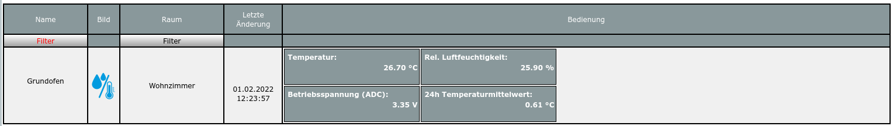

# HB-UNI-Sensor1-TH-SHT75  

# Genauer Temperatur- und Luftfeuchtesensor auf der Basis von dem Sensirion SHT75 Sensor (HB-UNI-Sensor1-TH-SHT75)

- abgeleitet von Toms ([TomMajor](https://github.com/TomMajor)) [HB-UNI-Sensor1](https://github.com/TomMajor/SmartHome/tree/master/HB-UNI-Sensor1)
- ein herzliches Dankeschön für die Basisarbeit geht an Tom (TomMajor)
- ein herzliches Dankeschön an alle, die im Homematic Forum geholfen haben, meine Probleme zu lösen
- hilfreich ist auch die Diskussion zu den [rftypes XMLs](https://homematic-forum.de/forum/viewtopic.php?f=76&t=62578&sid=cf0f4cd99f7ee2bf070e9f39391ee652)

Der Sensirion SHT75 ist ein ein wenig betagter Temperatur- und Luftfeuchtesensor mit hoher Genauigkeit: **SHT7x reached end-of-life. Last order date: 31.12.2018 / Last delivery date: 31.12.2019 SHT7x is replaced by SHT85. For more information, please contact info@sensirion.com.**

Das Datenblatt des SHT75 Sensors ist [hier](https://www.sensirion.com/fileadmin/user_upload/customers/sensirion/Dokumente/2_Humidity_Sensors/Datasheets/Sensirion_Humidity_Sensors_SHT7x_Datasheet.pdf) zu finden.

Die Genauigkeit der Temperaturmessung des SHT75 Sensors ist typisch +-0.3 Grad Celsius.
Die Genauigkeit der Luftfeuchtemessung des SHT75 Sensors ist typisch +-1.8% rH.

**Es gibt von Sensirion inzwischen das Nachfolgemodell SHT85.** Der Übergang von SHT75 auf SHT85 ist [hier](https://media.digikey.com/pdf/Data%20Sheets/Sensirion%20PDFs/HT_AN_SHT85_Transitioning_SHT7x_to_SHT85_V0.9_D1.pdf) beschrieben. Der SHT85 Sensor nutzt einen I2C Bus und ist daher **NICHT** Software kompatibelzu SHT75!. 
Inzwischen gibt es auch dafür einen Sketch [HB-UNI-Sensor1-THPD-SHT85](https://github.com/FUEL4EP/HomeAutomation/tree/master/AsksinPP_developments/sketches/HB-UNI-Sensor1-THPD-SHT85)

## Neue Eigenschaften im Vergleich zum HB-UNI-Sensor1 Sensor

- die relative Luftfeuchtigkeit wird mit 0,1 % rLF Genauigkeit ausgegeben
- die Batteriespannung wird mit 10 mV Genauigkeit und jeden Zyklus ausgegeben 
- alle wichtigen Sensorparameter können interaktiv ohne Neuprogrammierung im WebUI der [RaspberryMatic](https://github.com/jens-maus/RaspberryMatic) / [CCU3](https://de.elv.com/smart-home-zentrale-ccu3-inklusive-aio-creator-neo-lizenz-ccu-plugin-151965?fs=2591490946) eingegeben werden:
	+ [Startseite > Einstellungen > Geräte > Geräte-/ Kanalparameter einstellen](Images/Setting_of_device_parameters_in_WebUI.png)
	+ Wegen eines Bugs in der eQ3 Software OCCU ['Fehler in ProofAndSetValue bei Gleitkommawerten #1058'](https://github.com/jens-maus/RaspberryMatic/issues/1058) funktioniert die Offseteinstellung im WebUI nur eingeschränkt: Es können nur ganzzahlige Offsets eingegeben werden. In den RaspberryMatic Versionen [3.55.10.20210213 und 3.57.4.20210320](https://github.com/jens-maus/RaspberryMatic/labels/%3Alabel%3A%20WebUI) ist der Bug noch nicht gefixt! Beim mir half der Workaround von Baxxy [hier](https://homematic-forum.de/forum/viewtopic.php?p=652376#p652376). CCU3 Nutzer sollten auf die neueste Firmware 3.55.10 upgraden, 3.55.5 scheint hier einen Bug zu haben.

	

## Schaltung

- basierend auf einer ATmega328P MCU mit CC1101 Sendemodul, Eigenbau möglich
- eine mögliche und von mir empfohlene Hardwarebasis sieht so aus:
	+ Universalplatine für DIY-Bausätze von Alexander Reinert
		* Github [HB-UNI-SEN-BATT](https://github.com/alexreinert/PCB#hb-uni-sen-batt)
		* Bezugsquelle: [Smartkram WebShop](https://smartkram.de/produkt/universalplatine-fuer-diy-bausatze-von-alex-reinert/)
    + Sensorgehäuse
	    * 3D-Druck [HB-UNI-SEN-BATT snap Gehaeuse und Deckel](https://www.thingiverse.com/thing:3512767)	auf Thingiverse
	    * oder [fertiges Gehäuse](https://smartkram.de/produkt/sensorgehaeuse-passend-fuer-platine-von-alexander-reinert/) von Smartkram Webshop
	+ Sensirion SHT75 Sensor
		* Bezugsquelle: [Conrad](https://www.conrad.de/de/p/temperatursensoren-sht-75-humidity-temperature-sensor-1-8-rh-0-3-c-sbus-sil4-503493.html)
	+ Bauteile [HB-UNI-SEN-BATT](https://smartkram.de/produkt/bauteile-fuer-homematic-diy-projekt-thermometer-hydrometer/) von Smartkram Webshop
		* Das gelieferte BME280 Sensor Breakout wird durch den SHT75 Sensor ersetzt
	+ Aufbau entsprechend siehe [Technikkram](https://technikkram.net/blog/2018/05/30/homematic-diy-projekt-thermometer-und-hydrometer-fertige-platine-im-eigenbau/), bitte geeignet abändern
	+ die Verbindungen zwischen HB-UNI-SEN-BATT PCB und SHT75 mit flexiblem Flachbandkabel ausführen
	+ Schnittstelle des SHT75 Sensors zur MCU isst kein I2C. Details sind im [Datenblatt](https://www.sensirion.com/fileadmin/user_upload/customers/sensirion/Dokumente/2_Humidity_Sensors/Datasheets/Sensirion_Humidity_Sensors_SHT7x_Datasheet.pdf) in dem Kapitel 2, Seite 4 zu finden. Notwendige Verbindungen sind:
		* PCB SCL <-> SHT75 Pin 1
		* PCB SDA <-> SHT75 Pin 4
		* PCB VCC <-> SHT75 Pin 2
		* PCB GND <-> SHT75 Pin 3
	+ 1x 10 kOhm Abschlusswiderstand für SDA auf HB-UNI-SEN-BATT PCB einlöten
		
## Verringerung des Ruhestroms: [siehe auch Referenz von TomMajor](https://github.com/TomMajor/SmartHome/tree/master/Info/Ruhestrom)

- Auf dem Arduino Pro Mini sollte der LDO Spannungsregler (die Stelle ist im Bild mit 1 markiert) sowie die Power-LED (2) entfernt werden, um den Ruhestrom wesentlich zu verringern.  
- Weiterhin kann die zweite LED am Arduino Pin 13 (SCK) entfernt werden (3). Deren Einfluß auf den Ruhestrom ist kleiner als bei LDO und Power-LED, trotzdem kann es sich auf lange Sicht lohnen da diese bei jeder CC1101 Kommunikation für kurze Zeit aktiv ist, besonders im BurstDetector Mode.

	

- Brown-Out_Detektor des ATmega328P  (BOD) ausschalten, siehe Einstellungen Arduino IDE unten unter Punkt **Benötigter Sketch**
	       

## Das angemeldete Gerät im RaspberryMatic WebUI

## Vor dem Aufspielen von Software

- Bitte macht Euch zuerst mit den Grundlagen von AsksinPP [hier](https://asksinpp.de/Grundlagen/) vertraut.

## Bitte immer die aktuellste Version von AsksinPP nutzen

- [AsksinPP Master](https://github.com/pa-pa/AskSinPP/tree/master)

## Bitte genau diese Abfolge beim Einspielen von Software beachten:

- Details sind gegebenenfalls weiter unten zu finden

1. Bitte zuerst nochmals vergewissern, dass der verbaute Arduino Pro Mini ein 3,3V/8MHz Typ ist.
2. Das benötigte Addon [hb-ep-devices-addon](https://github.com/FUEL4EP/HomeAutomation/releases/latest) auf Eure CCU3/RaspberryMatic installieren.
3. Für das Programmierern und Setzen der Fuses des ATmega328P ist ein ISP Programmer empfohlen. Eine Anleitung ist [hier](https://asksinpp.de/Grundlagen/04-isp.html) zu finden. Dabei bitte unbedingt den ISP Programmer auf 3,3V einstellen!
4. Setzten der richtigen Fuses mit dem [avrdude script](avrdude/avrdude_328P.bsh) (LINUX version) oder mit [AVRDUDESS](https://blog.zakkemble.net/avrdudess-a-gui-for-avrdude/) (Windows Version): Fuse Setting: Low Byte:0xFF  High Byte:0xD2  Extended Byte:0xFF. Dafür bitte einen ISP Programmer verwenden, siehe [hier](https://asksinpp.de/Grundlagen/04-isp.html). Ich persönlich nutze diesen [ISP Programmer](https://www.amazon.de/Diamex-Programmer-XMEGA-ATMEGA-ATtiny/dp/B0064LLRB0).
5. Dann den [Frequenztest](https://asksinpp.de/Grundlagen/FAQ/Fehlerhafte_CC1101.html#ermittlung-der-cc1101-frequenz) durchführen. Dazu den [FreqTest.ino Sketch](https://github.com/pa-pa/AskSinPP/blob/master/examples/FreqTest/FreqTest.ino) ausführen und dabei auf ein erfolgreiches Beenden achten.
6. Gegebenenfalls die Parameter cDEVICE_und cDEVICE_in [Device_SHT75.h](Device_SHT75.h) ändern. Jeder Sensor muss ein eineindeutiges cDEVICE_und cDEVICE haben!
7. Die aktuelle Version des [HB-UNI-Sensor1-TH-SHT75](https://github.com/FUEL4EP/HomeAutomation/tree/master/AsksinPP_developments/sketches/HB-UNI-Sensor1-TH-SHT75) Sketches herunterladen, siehe unten.
8. Die benötigten Libraries installieren, siehe unten unter 'Benötigte Libraries'.
9. Dann den Sketch [HB-UNI-Sensor1-TH-SHT75.ino](https://github.com/FUEL4EP/HomeAutomation/tree/master/AsksinPP_developments/sketches/HB-UNI-Sensor1-TH-SHT75/HB-UNI-Sensor1-TH-SHT75.ino) kompilieren und mit dem ISP Programmer auf den Arduino Pro Mini hochladen.
10. Den neuen Sensor in der CCU/RaspBerryMatic anlernen.
11. Den neuen Sensor in der CCU3/RaspberryMatic dem Gewerk 'Wetter' zuordnen.

## Benötiger Sketch

[HB-UNI-Sensor1_SHT75](https://github.com/FUEL4EP/HomeAutomation/tree/master/AsksinPP_developments/sketches/HB-UNI-Sensor1-TH-SHT75)

- bitte alle Unterverzeichnisse mit kopieren:

### Zur lokalen Installation des Github Releases auf Deinem Computer

- gehe bitte in Dein Zielinstallationsverzeichnis, wo Du mit dem HB-UNI-Sensor1-TH-SHT75 Sensor arbeiten möchtest

  - gebe dort 'git clone https://github.com/FUEL4EP/HomeAutomation.git' ein
	  + damit lädst Du mein [Sammelrepository](https://github.com/FUEL4EP/HomeAutomation) für alle meine auf Github freigegebenen HomeBrew Sensoren herunter.
  - dann findest Du ein neues Verzeichnis 'HomeAutomation' auf Deinem Rechner, das alle meine auf Github freigebenen Sensoren enthält, siehe [README.md](https://github.com/FUEL4EP/HomeAutomation/blob/master/README.md)
  	+ mache bitte regelmäßig ein Update mit 'git pull'
 -	enthalten ist auch das notwendige Addon '[ep-hb-devices-addon](https://github.com/FUEL4EP/HomeAutomation/releases/latest)'
 -	den HB-UNI-Sensor1-TH-SHT75 Sensor findest Du unter './HomeAutomation/tree/master/AsksinPP_developments/sketches/HB-UNI-Sensor1-TH-SHT75'

- nach erfolgreicher Inbetriebnahme können die Debugausgaben im serial Monitor ausgeschaltet werden. Dazu bitte im Sketch HB-UNI-Sensor1-TH-SHT75.ino auskommentieren:

> // !! NDEBUG sollte aktiviert werden wenn die Sensorentwicklung und die Tests abgeschlossen sind und das Gerät in den 'Produktionsmodus' geht. 
> // Insbesondere die RAM-Einsparungen sind wichtig für die Stabilität / dynamische Speicherzuweisungen etc. 
> // Dies beseitigt dann auch die mögliche Arduino-Warnung 'Low memory available, stability problems may occur'. 
> // 
> //#define NDEBUG

- als Taktfrequenz des ATmega328P 8 MHz @ 3.3V externer Quarz einstellen
- Der Sketch verwendet 24616 Bytes (80%) des Programmspeicherplatzes. Das Maximum sind 30720 Bytes. Globale Variablen verwenden 1081 Bytes (52%) des dynamischen Speichers, 967 Bytes für lokale Variablen verbleiben. Das Maximum sind 2048 Bytes.

- [Fuses Calculator](http://eleccelerator.com/fusecalc/fusecalc.php); select ATmega328P

- [avrdude script](avrdude/avrdude_328P.bsh) (LINUX version)
	- wichtig ist dass dieser Skript **VOR** den Flashen des Programmcodes ausgeführt wird.  Das EESAVE Konfigurationsbit des Atmega328P muss gesetzt sein (Preserve EEPROM memory through the Chip Erase cycle; [EESAVE=1])

- Die Programmierung erfolgt mit einem ISP Programmer, z.B. Diamex ISP USB Programmer. Dazu dienen die Signale VCC, GND, MOSI, SCK, MISO,
RSET an der Steckerleiste unten rechts in der Basisplatine. Dort eine Steckerleiste einlöten.
- ISP Programmer auf 3,3V einstellen!
- Einstellungen Arduino IDE: 8MHz, 3.3V
- Hochladen des kompilierten Sketchs im Arduino IDE mit: Sketch => Hochladen mit Programmer
- Debugging wird über den seriellen Monitor mit einem FTDI Adapter USB zu TTL Serial für
3,3V und 5V für Arduino gemacht. Als Baudrate des seriellen Monitors bitte **57600** Baud einstellen.

## Benötigte Libraries

+ [AskSinPP Library](https://github.com/pa-pa/AskSinPP) 
+ [EnableInterrupt](https://github.com/GreyGnome/EnableInterrupt) 
+ [Low-Power](https://github.com/rocketscream/Low-Power) 
+ [spease Sensirion](https://github.com/spease/Sensirion)

## Benötigtes Addon

[hb-ep-devices-addon](https://github.com/FUEL4EP/HomeAutomation/releases/latest)

- bitte dieses Addon 'hb-ep-devices-addon.tgz 'vor dem Anlernen des HB-UNI-Sensor1-TH-SHT75 Sensors auf der RaspberryMatic / CCU3 installieren (kein unzip vonnöten!)

## Lizenz

**Creative Commons BY-NC-SA** 
Give Credit, NonCommercial, ShareAlike

 This work is licensed under a <a rel="license" href="http://creativecommons.org/licenses/by-nc-sa/4.0/">Creative Commons Attribution-NonCommercial-ShareAlike 4.0 International License</a>.
