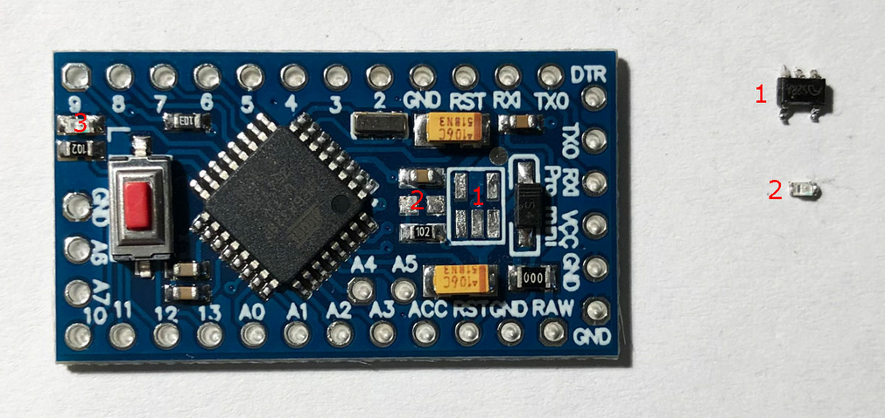

# Temperatur-, Luftfeuchte und Luftdrucksensor auf der Basis von dem Bosch BME280 Sensor (HB-UNI-Sensor1-THPD-BME280) mit Ausgabe von Taupunkttemperatur, absoluter Luftfeuchte und Batteriespannung

- abgeleitet von Toms ([TomMajor](https://github.com/TomMajor)) [HB-UNI-Sensor1](https://github.com/TomMajor/SmartHome/tree/master/HB-UNI-Sensor1)
- ein herzliches Dankeschön für die Basisarbeit geht an Tom (TomMajor)
- ein herzliches Dankeschön an alle, die im Homematic Forum geholfen haben, meine Probleme zu lösen
- hilfreich ist auch die Diskussion zu den [rftypes XMLs](https://homematic-forum.de/forum/viewtopic.php?f=76&t=62578&sid=cf0f4cd99f7ee2bf070e9f39391ee652)

Das Datenblatt des BME280 Sensors ist [hier](https://www.bosch-sensortec.com/media/boschsensortec/downloads/datasheets/bst-bme280-ds002.pdf) zu finden.

## Neue Eigenschaften im Vergleich zum [HB-UNI-Sensor1](https://github.com/TomMajor/SmartHome/tree/master/HB-UNI-Sensor1) Sensor

- die relative Luftfeuchtigkeit wird mit 0.1 % rLF Genauigkeit ausgegeben
- der Luftdruck wird mit 0.1 hPa Genauigkeit ausgegeben
- die Taupunkttemperatur wird mit 0.1 K Genauigkeit ausgegeben
- die absolute Luftfeuchte wird mit 0.01 g/m³ Genauigkeit ausgegeben
- die Batteriespannung wird mit 10 mV Genauigkeit und jeden Zyklus ausgegeben 
- alle wichtigen Sensorparameter können interaktiv ohne Neuprogrammierung im WebUI der [RaspberryMatic](https://github.com/jens-maus/RaspberryMatic) / [CCU3](https://de.elv.com/smart-home-zentrale-ccu3-inklusive-aio-creator-neo-lizenz-ccu-plugin-151965?fs=2591490946) eingegeben werden:
	+ [Startseite > Einstellungen > Geräte > Geräte-/ Kanalparameter einstellen](Images/Setting_of_device_parameters_in_WebUI.png)
	+ Alle drei Offsetwerte (T, rLF, P) müssen für die Eingabe mit dem Faktor 10 multipliziert werden.
	+ Bitte beachten: Der LazyConfig Modus funktioniert NUR bei einem angelernten Sensor. Wird der Resettaster nach dem Anlernen gedrückt oder die Batterien gewechselt, funktioniert der LazyConfig Modus nicht mehr. Ein erneutes Anlernen ist dann notwendig, um den LazyConfig Mode wieder zum Funktionieren zu bringen.
	

## Taupunkttemperatur und absolute Luftfeuchtigkeit

- Die angezeigte Taupunkttemperatur kann zur Bewertung der Gefährdung einer Schimmelbildung in einem Raum verwendet werden: Der kälteste Punkt eines Raums (in der Regel die untere oder oberere Ecke einer Außenwand) sollte eine mit einem Infrarotthermometer gemessene Temperatur haben, die mindestens 2..4 Grad Celsius über der angezeigten Taupunkttemperatur liegt.
- Die angezeigte absolute Luftfeuchtigkeit kann dazu verwendet werden zu entscheiden, ob das Öffnen der Fenster eine Entfeuchtung eines Raums bewirkt: Wenn die absolute Luftfeuchte außen um mindestens 1 g/m³ kleiner ist als im Innenraum, dann wird beim Lüften der Raum entfeuchtet. 

## Kalibrierung von Temperatur, relativer Luftfeuchtigkeit   

- Um eine Offsetkalibrierung der Temperatur- und relativen Luftfeuchtemessung des BME2980 Sensors durchzuführen, zeichne diese beiden Messgrößen z.B. im CCU Historian und vergleiche sie mit den entsprechenden Messwerten eines 'goldenen' Referenzsensors. Extrahiere die Differenzen zwischen den Referenzmesswerten des 'goldenen' Referenzsensors und den entsprechenden des BME280 Sensors, am Besten in einer Messreihe über Nacht mit geringen Messwertschwankungen und daher flachen Messverläufen. Gebe die Differenzen in das [WebUI Startseite > Einstellungen > Geräte > Geräte-/ Kanalparameter einstellen](Images/Setting_of_device_parameters_in_WebUI.png) ein.

- Bitte führe die Offsetkalibrierung in zwei getrennten Schritten durch:
	+ Kalibriere die BME280 Temperatur in einem ersten Schritt (erste Nacht)
	+ Kalibriere die BME280 relative Luftfeuchtigkeit in einem zweiten Schritt (zweite Nacht)
	+ Kalibriere die BME280 Temperatur and relative Luftfeuchtigkeit NICHT gemeinsam in einem Schritt, da diese beiden Größen physikalisch voneinander abhängen
	
## Schaltung

- basierend auf einer ATmega328P MCU mit CC1101 Sendemodul, Eigenbau möglich
- eine mögliche und von mir empfohlene Hardwarebasis sieht so aus:
	+ Universalplatine für DIY-Bausätze von Alexander Reinert
		* Github [HB-UNI-SEN-BATT](https://github.com/alexreinert/PCB#hb-uni-sen-batt)
		* Bezugsquelle: [Smartkram WebShop](https://smartkram.de/produkt/universalplatine-fuer-diy-bausatze-von-alex-reinert/)
    + Sensorgehäuse
	    * 3D-Druck [HB-UNI-SEN-BATT snap Gehaeuse und Deckel](https://www.thingiverse.com/thing:3512767)	auf Thingiverse
	    * oder [fertiges Gehäuse](https://smartkram.de/produkt/sensorgehaeuse-passend-fuer-platine-von-alexander-reinert/) von Smartkram Webshop
	+ Bauteile [HB-UNI-SEN-BATT](https://smartkram.de/produkt/bauteile-fuer-homematic-diy-projekt-thermometer-hydrometer/) von Smartkram Webshop
	+ Aufbau entsprechend siehe [Technikkram](https://technikkram.net/blog/2018/05/30/homematic-diy-projekt-thermometer-und-hydrometer-fertige-platine-im-eigenbau/)
	+ 2x 10 kOhm I2C Abschlusswiderstände für SCL und SDA auf HB-UNI-SEN-BATT PCB einlöten
		
## Verringerung des Ruhestroms: [siehe auch Referenz von TomMajor](https://github.com/TomMajor/SmartHome/tree/master/Info/Ruhestrom)

- Auf dem Arduino Pro Mini sollte der LDO Spannungsregler (die Stelle ist im Bild mit 1 markiert) sowie die Power-LED (2) entfernt werden, um den Ruhestrom wesentlich zu verringern.  
- Weiterhin kann die zweite LED am Arduino Pin 13 (SCK) entfernt werden (3). Deren Einfluß auf den Ruhestrom ist kleiner als bei LDO und Power-LED, trotzdem kann es sich auf lange Sicht lohnen da diese bei jeder CC1101 Kommunikation für kurze Zeit aktiv ist, besonders im BurstDetector Mode.

	

- Brown-Out_Detektor des ATmega328P  (BOD) ausschalten, siehe Einstellungen Arduino IDE unten unter Punkt **Benötigter Sketch**
	       

## Das angemeldete Gerät im RaspberryMatic WebUI

 

## Benötiger Sketch

[HB-UNI-Sensor1-THPD-BME280](https://github.com/FUEL4EP/HomeAutomation/tree/master/AsksinPP_developments/sketches/HB-UNI-Sensor1-THPD-BME280)

- bitte alle Unterverzeichnisse mit kopieren
- nach erfolgreicher Inbetriebnahme können die Debugausgaben im serial Monitor ausgeschaltet werden. Dazu bitte im Sketch HB-UNI-Sensor1-THPD-BME280.ino auskommentieren:

> // !! NDEBUG sollte aktiviert werden wenn die Sensorentwicklung und die Tests abgeschlossen sind und das Gerät in den 'Produktionsmodus' geht. 
> // Insbesondere die RAM-Einsparungen sind wichtig für die Stabilität / dynamische Speicherzuweisungen etc. 
> // Dies beseitigt dann auch die mögliche Arduino-Warnung 'Low memory available, stability problems may occur'. 
> // 
> //#define NDEBUG

- als Taktfrequenz des ATmega328P 8 MHz @ 3.3V externer Quarz einstellen
- Der Sketch verwendet 30200 Bytes (98%) des Programmspeicherplatzes. Das Maximum sind 30720 Bytes. Globale Variablen verwenden 1172 Bytes (57%) des dynamischen Speichers, 876 Bytes für lokale Variablen verbleiben. Das Maximum sind 2048 Bytes.

- [Fuses Calculator](http://eleccelerator.com/fusecalc/fusecalc.php); select ATmega328P

- [avrdude script](avrdude/avrdude_328P.bsh) (LINUX version)

- Die Programmierung erfolgt mit einem ISP Programmer, z.B. Diamex ISP USB Programmer. Dazu dienen die Signale VCC, GND, MOSI, SCK, MISO,
RSET an der Steckerleiste unten rechts in der Basisplatine. Dort eine Steckerleiste einlöten.
- ISP Programmer auf 3.3V einstellen!
- Einstellungen Arduino IDE: 8MHz, 3.3V
- Hochladen des kompilierten Sketchs im Arduino IDE mit: Sketch => Hochladen mit Programmer
- Debugging wird über den seriellen Monitor mit einem FTDI Adapter USB zu TTL Serial für
3,3V und 5V für Arduino gemacht. Als Baudrate des seriellen Monitors bitte **57600** Baud einstellen.

## Benötigte Libraries

+ [AskSinPP Library](https://github.com/pa-pa/AskSinPP) 
+ [EnableInterrupt](https://github.com/GreyGnome/EnableInterrupt) 
+ [Low-Power](https://github.com/rocketscream/Low-Power) 
+ [finitespace/BME280](https://github.com/finitespace/BME280)

## Benötigtes Addon

[hb-ep-devices-addon](https://github.com/FUEL4EP/HomeAutomation/releases/latest)

- bitte dieses Addon 'hb-ep-devices-addon.tgz 'vor dem Anlernen des HB-UNI-Sensor1-THPD-BME280 Sensors auf der RaspberryMatic / CCU3 installieren (kein unzip vonnöten!)

## Lizenz

**Creative Commons BY-NC-SA** 
Give Credit, NonCommercial, ShareAlike

 This work is licensed under a <a rel="license" href="http://creativecommons.org/licenses/by-nc-sa/4.0/">Creative Commons Attribution-NonCommercial-ShareAlike 4.0 International License</a>.
