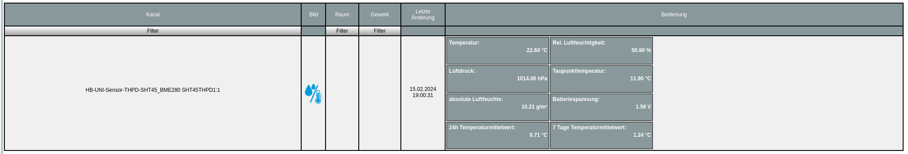

# HB-UNI-Sensor1-THPD-SHT45_BME280 [](https://creativecommons.org/licenses/by-nc-sa/4.0/) [](https://hits.seeyoufarm.com) <a href='https://ko-fi.com/FUEL4EP' target='_blank'></a>
<br/>


# Hoch genauer und sehr schneller (±1.0% RH / ±0.1°C) Temperatur-, Luftfeuchte und Luftdrucksensor auf der Basis von den [Sensirion SHT45](https://sensirion.com/media/documents/33FD6951/6555C40E/Sensirion_Datasheet_SHT4x.pdf) und [Bosch BME280 Sensoren](https://www.bosch-sensortec.com/media/boschsensortec/downloads/datasheets/bst-bme280-ds002.pdf) (HB-UNI-Sensor1-THPD-SHT45_BME280) mit Ausgabe von Taupunkttemperatur, absoluter Luftfeuchte, 24 Stunden und 7 Tagestemperaturmittelwerten und Batteriespannung und WebUI Offseteinstellung

- abgeleitet von Toms ([TomMajor](https://github.com/TomMajor)) [HB-UNI-Sensor1](https://github.com/TomMajor/SmartHome/tree/master/HB-UNI-Sensor1)
- ein herzliches Dankeschön für die Basisarbeit geht an Tom (TomMajor)
- ein herzliches Dankeschön an alle, die im Homematic Forum geholfen haben, meine Probleme zu lösen
- Der hoch genaue und schnelle Sensirion SHT45 Sensor wird für die Temperatur- und Luftfeuchtemessung verwendet.
- Der Bosch BME280 Sensor wird für die Messung des Luftdrucks verwendet.
- Das Datenblatt des SHT45 Sensors ist [hier](https://sensirion.com/media/documents/33FD6951/6555C40E/Sensirion_Datasheet_SHT4x.pdf) zu finden.
- Das Datenblatt des BME280 Sensors ist [hier](https://www.bosch-sensortec.com/media/boschsensortec/downloads/datasheets/bst-bme280-ds002.pdf) zu finden.

- Der Diskussionsstrang im Homematic Forum dazu ist bald [hier](tbd) zu finden. Bitte dort auch Fragen stellen.	


## Neue Eigenschaften im Vergleich zum [HB-UNI-Sensor1](https://github.com/TomMajor/SmartHome/tree/master/HB-UNI-Sensor1) Sensor

- die relative Luftfeuchtigkeit wird mit 0.1 % rLF Genauigkeit ausgegeben
- der Luftdruck wird mit 0.1 hPa Genauigkeit ausgegeben
- die Taupunkttemperatur wird mit 0.1 K Genauigkeit ausgegeben
- die absolute Luftfeuchte wird mit 0.01 g/m³ Genauigkeit ausgegeben
- die Batteriespannung wird mit 10 mV Genauigkeit und jeden Zyklus ausgegeben 
- alle wichtigen Sensorparameter können interaktiv ohne Neuprogrammierung im WebUI der [RaspberryMatic](https://github.com/jens-maus/RaspberryMatic) / [CCU3](https://de.elv.com/smart-home-zentrale-ccu3-inklusive-aio-creator-neo-lizenz-ccu-plugin-151965?fs=2591490946) eingegeben werden:
	+ [Startseite > Einstellungen > Geräte > Geräte-/ Kanalparameter einstellen](Images/SHT45_Setting_of_device_parameters_in_WebUI.png)
	+ Alle drei Offsetwerte (T, rLF, P) müssen für die Eingabe mit dem Faktor 10 multipliziert werden.
- für die gemessene Temperatur können die gleitenden Mittelwerte über die [Zeiträume 24 Stunden](./Images/24h_moving_average_histogram.png) und [7 Tage (hier mit Startrampe zu Beginn der Aufzeichnung)](./Images/7days_moving_average_histogram_with_ramp_up.png) berechnet werden. Hier ein Beispiel (noch mit der 0,1 Grad Kelvin Auflösung):
	
    + ein ATMega1284P wird benötigt, da das RAM eines ATMega328P nicht für die Speicherung der Temperaturwerte über eine Woche ausreicht
    + eine Kalibrierung des SYSCLOCK_FACTOR ist erforderlich, siehe unten unter Kalibrierung, so dass neue Temperaturmessungen exakt im Abstand von 240 Sekunden erfolgen. Ohne diese Kalibrierung sind die gleitenden Mittelwerte verfälscht!
    + die gemessenen Temperaturwerte werden in Ringpuffern der Größe 360 (24 Stunden Ringpuffer) bzw. 2520 (7 Tage Ringpuffer) als int16_t Typ abgespeichert
    + die gleitenden Mittelwerte brauchen mindesten 24 Stunden bzw. 7 Tage zum 'Einschwingen' bis alle Speicherwerte der Ringpuffer mindestens einmal mit Messwerten befüllt wurden
    + bei einem Batteriewechsel oder einem Reset werden die historischen gleitenden Mittelwerte nicht gesichert, da sie nach maximal 7 Tagen vollständig neu berechnet sind


## Taupunkttemperatur und absolute Luftfeuchtigkeit

- Die angezeigte Taupunkttemperatur kann zur Bewertung der Gefährdung einer Schimmelbildung in einem Raum verwendet werden: Der kälteste Punkt eines Raums (in der Regel die untere oder oberere Ecke einer Außenwand) sollte eine mit einem Infrarotthermometer gemessene Temperatur haben, die mindestens 3..4 Grad Celsius über der angezeigten Taupunkttemperatur liegt. Ein Online-Luftfeuchterechner ist z.B. [hier](http://www.thestorff.de/luftfeuchte-rechner.php) zu finden.
- Die angezeigte absolute Luftfeuchtigkeit kann dazu verwendet werden zu entscheiden, ob das Öffnen der Fenster eine Entfeuchtung eines Raums bewirkt: Wenn die absolute Luftfeuchte außen um mindestens 1 g/m³ kleiner ist als im Innenraum, dann wird beim Lüften der Raum entfeuchtet. 


## Kalibrierung von Temperatur, relativer Luftfeuchtigkeit   

- Um eine Offsetkalibrierung der Temperatur- und relativen Luftfeuchtemessung des SHT45 Sensors durchzuführen, zeichne diese beiden Messgrößen z.B. im CCU Historian und vergleiche sie mit den entsprechenden Messwerten eines 'goldenen' Referenzsensors. Extrahiere die Differenzen zwischen den Referenzmesswerten des 'goldenen' Referenzsensors und den entsprechenden des SHT45 Sensors, am Besten in einer Messreihe über Nacht mit geringen Messwertschwankungen und daher flachen Messverläufen. Gebe die Differenzen in das [WebUI Startseite > Einstellungen > Geräte > Geräte-/ Kanalparameter einstellen](Images/Setting_of_device_parameters_in_WebUI.png) ein.

- Bitte führe die Offsetkalibrierung in zwei getrennten Schritten durch:
	+ Kalibriere die SHT45 Temperatur in einem ersten Schritt (erste Nacht)
	+ Kalibriere die SHT45 relative Luftfeuchtigkeit in einem zweiten Schritt (zweite Nacht)
	+ Kalibriere die SHT45 Temperatur and relative Luftfeuchtigkeit NICHT gemeinsam in einem Schritt, da diese beiden Größen physikalisch voneinander abhängen
	
## Schaltung

- tbd

	
## Frequenztest des CC1101 RF Moduls

- tbd
- Eine Beschreibung des Frequenztests ist [hier](https://asksinpp.de/Grundlagen/FAQ/Fehlerhafte_CC1101.html#ermittlung-der-cc1101-frequenz) zu finden.
	       

## Das angemeldete Gerät im RaspberryMatic WebUI

- ohne gleitende Mittelwerte (alte RM Version):



- mit gleitenden Mittelwerten (unmittelbar nach Reset):


## Vor dem Aufspielen von Software

- Bitte macht Euch zuerst mit den Grundlagen von AsksinPP [hier](https://asksinpp.de/Grundlagen/) vertraut.

## Bitte immer die aktuellste Version von AsksinPP nutzen

-  [AsksinPP Master](https://github.com/pa-pa/AskSinPP/tree/master)

## Bitte genau diese Abfolge beim Einspielen von Software beachten:

- Details sind gegebenenfalls weiter unten zu finden

tbd
 

## Benötiger Sketch

[HB-UNI-Sensor1-THPD-SHT45_BME280](https://github.com/FUEL4EP/HomeAutomation/tree/master/AsksinPP_developments/sketches/HB-UNI-Sensor1-THPD-SHT45_BME280)

- bitte alle Unterverzeichnisse mit kopieren:

### Zur lokalen Installation des Github Releases auf Deinem Computer

- gehe bitte in Dein Zielinstallationsverzeichnis, wo Du mit dem HB-UNI-Sensor1-THPD-SHT45_BME280 Sensor arbeiten möchtest

  - gebe dort 'git clone https://github.com/FUEL4EP/HomeAutomation.git' ein
	  + damit lädst Du mein [Sammelrepository](https://github.com/FUEL4EP/HomeAutomation) für alle meine auf Github freigegebenen HomeBrew Sensoren herunter.
  - dann findest Du ein neues Verzeichnis 'HomeAutomation' auf Deinem Rechner, das alle meine auf Github freigebenen Sensoren enthält, siehe [README.md](https://github.com/FUEL4EP/HomeAutomation/blob/master/README.md)
  	+ mache bitte regelmäßig ein Update mit 'git pull'
 -	enthalten ist auch das notwendige Addon '[ep-hb-devices-addon](https://github.com/FUEL4EP/HomeAutomation/releases/latest)'
 -	den HB-UNI-Sensor1-THPD-SHT45_BME280 Sensor findest Du unter './HomeAutomation/tree/master/AsksinPP_developments/sketches/HB-UNI-Sensor1-THPD-SHT45_BME280'

- nach erfolgreicher Inbetriebnahme können die Debugausgaben im serial Monitor ausgeschaltet werden. Dazu bitte im Sketch HB-UNI-Sensor1-THPD-SHT45_BME280.ino auskommentieren:

- tbd


## Benötigte Libraries

+ [AskSinPP Library](https://github.com/pa-pa/AskSinPP)</br>
+ [EnableInterrupt](https://github.com/GreyGnome/EnableInterrupt)</br>
+ [Low-Power](https://github.com/rocketscream/Low-Power)</br>
+ tbd


## Benötigtes Addon

[hb-ep-devices-addon](https://github.com/FUEL4EP/HomeAutomation/releases/latest)

- die minimal benötigte Version ist die Version 1.16.

- bitte dieses Addon 'hb-ep-devices-addon.tgz 'vor dem Anlernen des HB-UNI-Sensor1-THPD-SHT45_BME280 Sensors auf der RaspberryMatic / CCU3 installieren (kein unzip vonnöten!)

## Kalibrierung

- die folgenden Kalibrierwerte können im Code eingestellt werden:

  + Kalibrierung des Messintervalls

    + Das Messintervall wird im Debug Modus auf 4 Minuten = 240 Sekunden eingestellt, d.h. Ziel ist es, dass exakt alle 240 Sekunden eine neue Messwertausgabe erfolgt

    + dazu wird der SYSCLOCK_FACTOR in [HB-UNI-Sensor1-THPD-SHT45_BME280.ino](./HB-UNI-Sensor1-THPD-SHT45_BME280.ino) geeignet eingestellt 
      ```
      #define SYSCLOCK_FACTOR    0.924    // adjust to get sampling data every 240 seconds (4 minutes)
      ```

## Verringerung der Tx Sendeleistung

- nur Experten wird empfohlen, die Tx Sendeleistung zu verringern. Die Beschreibung ist [hier](./Reduction_of_Tx_RF_power/README.md).

## Betriebsdauer mit einem neuen Batteriesatz

- tbd

## Lizenz

**Creative Commons BY-NC-SA**<br>
Give Credit, NonCommercial, ShareAlike

<a rel="license" href="http://creativecommons.org/licenses/by-nc-sa/4.0/"></a><br />This work is licensed under a <a rel="license" href="http://creativecommons.org/licenses/by-nc-sa/4.0/">Creative Commons Attribution-NonCommercial-ShareAlike 4.0 International License</a>.
