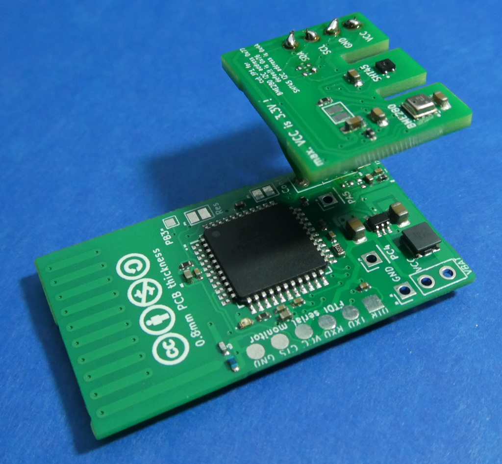
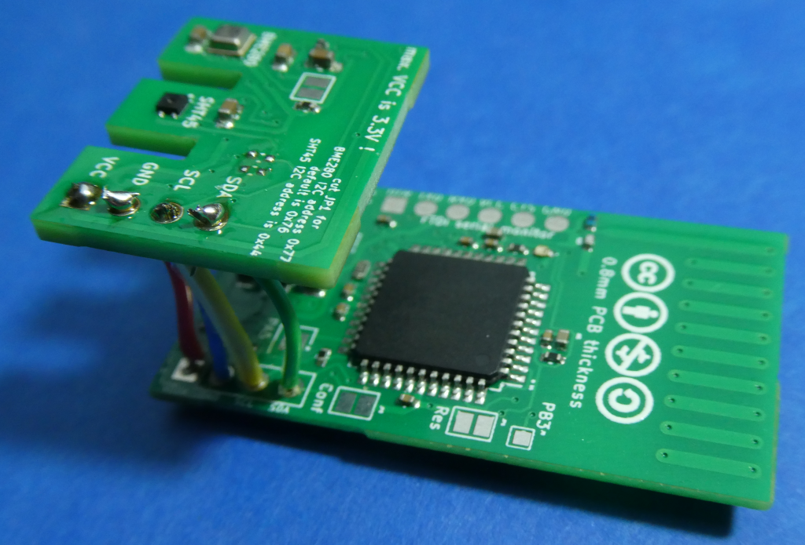
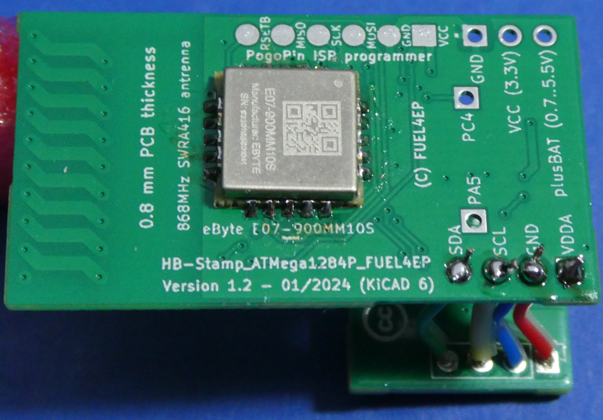
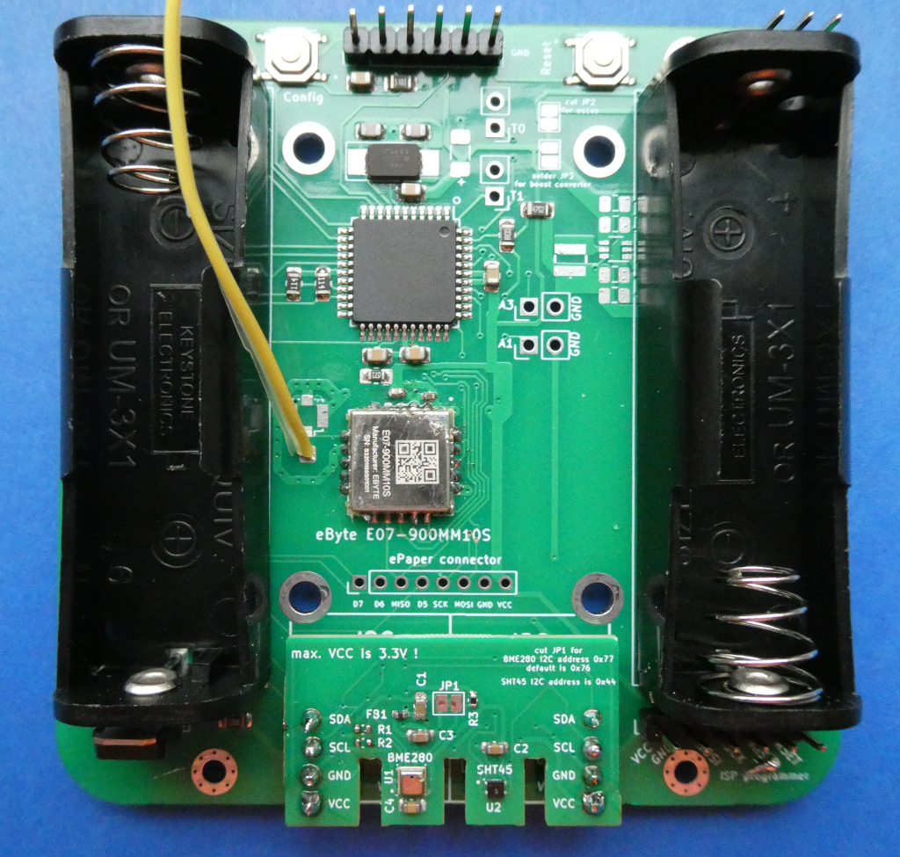
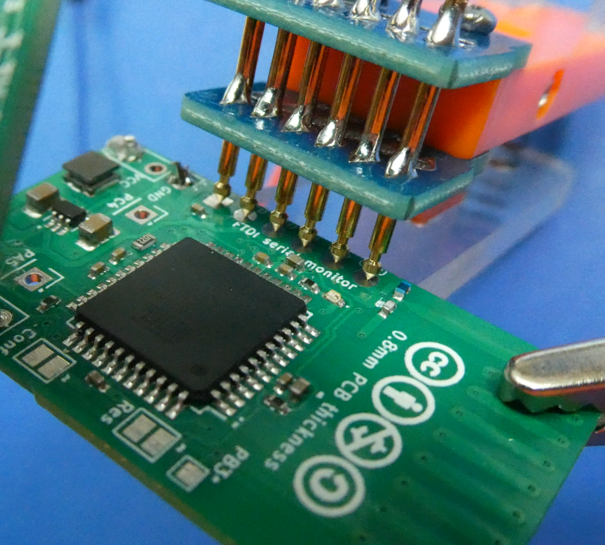
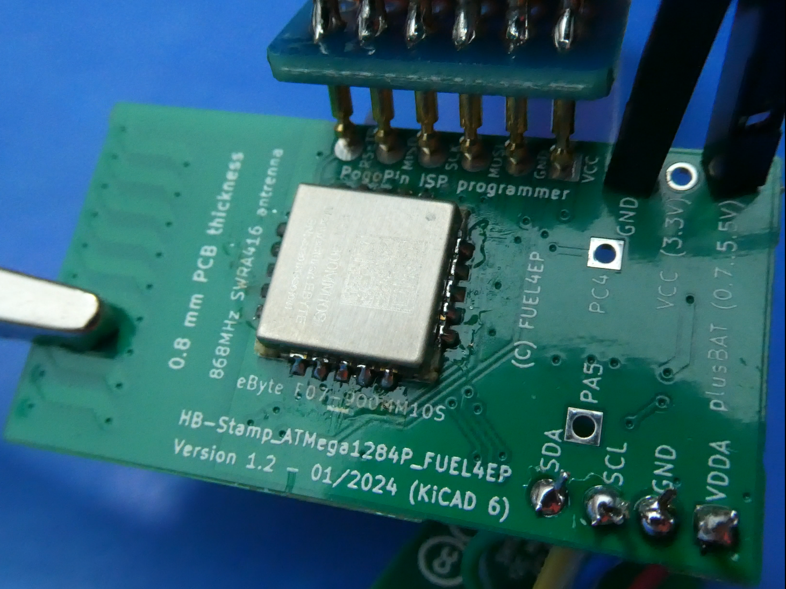
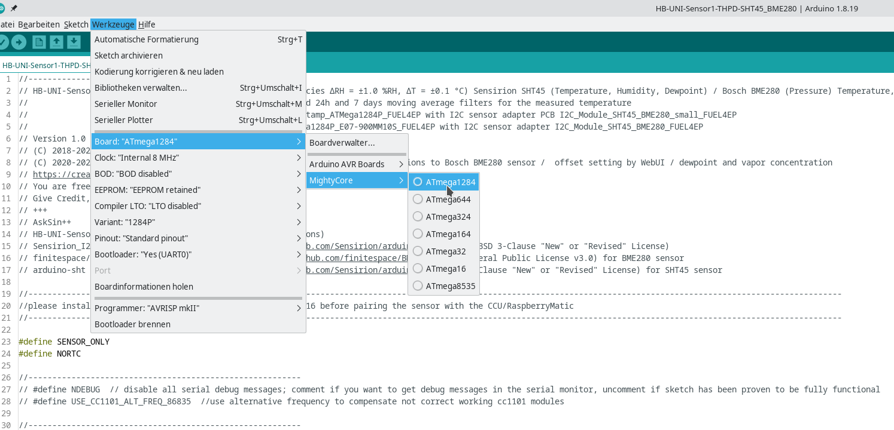
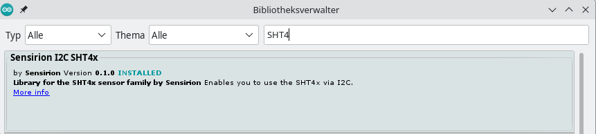

# HB-UNI-Sensor1-THPD-SHT45_BME280 [](https://creativecommons.org/licenses/by-nc-sa/4.0/) [](https://hits.seeyoufarm.com) <a href='https://ko-fi.com/FUEL4EP' target='_blank'></a>
<br/>


# Hoch genauer und schneller (±1.0% RH / ±0.1°C) Temperatur-, Luftfeuchte und Luftdrucksensor auf der Basis von den [Sensirion SHT45](https://sensirion.com/media/documents/33FD6951/6555C40E/Sensirion_Datasheet_SHT4x.pdf) und [Bosch BME280](https://www.bosch-sensortec.com/media/boschsensortec/downloads/datasheets/bst-bme280-ds002.pdf) Sensoren (HB-UNI-Sensor1-THPD-SHT45_BME280) mit Ausgabe von Temperatur, relativer Luftfeuchte, Taupunkttemperatur, absoluter Luftfeuchte, Luftdruck, 24 Stunden und 7 Tagestemperaturmittelwerten und Batteriespannung mit WebUI Offseteinstellung

- abgeleitet von Toms ([TomMajor](https://github.com/TomMajor)) [HB-UNI-Sensor1](https://github.com/TomMajor/SmartHome/tree/master/HB-UNI-Sensor1)
- ein herzliches Dankeschön für die Basisarbeit geht an Tom (TomMajor)
- ein herzliches Dankeschön an alle, die im Homematic Forum geholfen haben, meine Probleme zu lösen
- der hoch genaue und schnelle Sensirion SHT45 Sensor wird für die Temperatur- und Luftfeuchtemessung verwendet.
- der Bosch BME280 Sensor wird für die Messung des Luftdrucks verwendet.
- das Datenblatt des SHT45 Sensors ist [hier](https://sensirion.com/media/documents/33FD6951/6555C40E/Sensirion_Datasheet_SHT4x.pdf) zu finden.
- das Datenblatt des BME280 Sensors ist [hier](https://www.bosch-sensortec.com/media/boschsensortec/downloads/datasheets/bst-bme280-ds002.pdf) zu finden.

- Der Diskussionsstrang im Homematic Forum dazu ist [hier](https://homematic-forum.de/forum/viewtopic.php?f=76&t=81761&sid=7dd42180aec9f722a752fc04f8171dad) zu finden. Bitte dort auch Fragen stellen.	


## Neue Eigenschaften im Vergleich zum [HB-UNI-Sensor1](https://github.com/TomMajor/SmartHome/tree/master/HB-UNI-Sensor1) Sensor

- basierend auf Präzisionssensor SHT45 von Sensirion (±1.0% RH / ±0.1°C)
- die relative Luftfeuchtigkeit wird mit 0.1 % rLF Genauigkeit ausgegeben
- der Luftdruck wird mit 0.1 hPa Genauigkeit ausgegeben
- die Taupunkttemperatur wird mit 0.1 K Genauigkeit ausgegeben
- die absolute Luftfeuchte wird mit 0.01 g/m³ Genauigkeit ausgegeben
- die Batteriespannung wird mit 10 mV Genauigkeit und jeden Zyklus ausgegeben 
- alle wichtigen Sensorparameter können interaktiv ohne Neuprogrammierung im WebUI der [RaspberryMatic](https://github.com/jens-maus/RaspberryMatic) / [CCU3](https://de.elv.com/smart-home-zentrale-ccu3-inklusive-aio-creator-neo-lizenz-ccu-plugin-151965?fs=2591490946) eingegeben werden:
	+ [Startseite > Einstellungen > Geräte > Geräte-/ Kanalparameter einstellen](Images/Setting_of_device_parameters_in_WebUI.png)
	+ die drei Offsetwerte (T, rLF, P) müssen für die Eingabe mit dem Faktor 10 multipliziert werden. Empfehlung ist die Offsets des SHT45 bei Null zu belassen, da der Sensor SHT45 hoch genau ist.
- für die gemessene Temperatur werden die gleitenden Mittelwerte über die [Zeiträume 24 Stunden](./Images/24h_moving_average_histogram.png) und [7 Tage (hier mit Startrampe zu Beginn der Aufzeichnung)](./Images/24h_and_7days_moving_average_histogram_with_ramp_up.png) berechnet auf dem Sensor berechnet.
    + ein ATMega1284P wird benötigt, da das RAM eines ATMega328P nicht für die Speicherung der Temperaturwerte über eine Woche ausreicht
    + eine Kalibrierung des SYSCLOCK_FACTOR ist erforderlich, siehe unten unter Kalibrierung, so dass neue Temperaturmessungen exakt im Abstand von 240 Sekunden erfolgen. Ohne diese Kalibrierung sind die gleitenden Mittelwerte verfälscht!
    + die gemessenen Temperaturwerte werden in Ringpuffern der Größe 360 (24 Stunden Ringpuffer) bzw. 2520 (7 Tage Ringpuffer) als int16_t Typ abgespeichert
    + die gleitenden Mittelwerte brauchen mindesten 24 Stunden bzw. 7 Tage zum 'Einschwingen' bis alle Speicherwerte der Ringpuffer mindestens einmal mit Messwerten befüllt wurden
    + bei einem Batteriewechsel oder einem Reset werden die historischen gleitenden Mittelwerte nicht gesichert, da sie nach maximal 7 Tagen vollständig neu berechnet sind


## Taupunkttemperatur und absolute Luftfeuchtigkeit

- Die angezeigte Taupunkttemperatur kann zur Bewertung der Gefährdung einer Schimmelbildung in einem Raum verwendet werden: Der kälteste Punkt eines Raums (in der Regel die untere oder oberere Ecke einer Außenwand) sollte eine mit einem Infrarotthermometer gemessene Temperatur haben, die mindestens 4..6 Grad Celsius über der angezeigten Taupunkttemperatur liegt. Ein Online-Luftfeuchterechner ist z.B. [hier](http://www.thestorff.de/luftfeuchte-rechner.php) zu finden.
- Die angezeigte absolute Luftfeuchtigkeit kann dazu verwendet werden zu entscheiden, ob das Öffnen der Fenster eine Entfeuchtung eines Raums bewirkt: Wenn die absolute Luftfeuchte außen um mindestens 1 g/m³ kleiner ist als im Innenraum, dann wird beim Lüften der Raum entfeuchtet. 


## Kalibrierung von Temperatur, relativer Luftfeuchtigkeit   

- Um eine Offsetkalibrierung der Temperatur- und relativen Luftfeuchtemessung des SHT45 Sensors durchzuführen, zeichne diese beiden Messgrößen z.B. im CCU Historian und vergleiche sie mit den entsprechenden Messwerten eines 'goldenen' Referenzsensors. Extrahiere die Differenzen zwischen den Referenzmesswerten des 'goldenen' Referenzsensors und den entsprechenden des SHT45 Sensors, am Besten in einer Messreihe über Nacht mit geringen Messwertschwankungen und daher flachen Messverläufen. Gebe die Differenzen in das [WebUI Startseite > Einstellungen > Geräte > Geräte-/ Kanalparameter einstellen](Images/Setting_of_device_parameters_in_WebUI.png) ein.

- Bitte führe die Offsetkalibrierung in zwei getrennten Schritten durch:
	+ Kalibriere die SHT45 Temperatur in einem ersten Schritt (erste Nacht)
	+ Kalibriere die SHT45 relative Luftfeuchtigkeit in einem zweiten Schritt (zweite Nacht)
	+ Kalibriere die SHT45 Temperatur und relative Luftfeuchtigkeit NICHT gemeinsam in einem Schritt, da diese beiden Größen physikalisch voneinander abhängen
	
## Schaltung

- meine Empfehlung ist es die dedizierte Platinen [HB_Stamp_ATMega1284P_FUEL4EP](https://github.com/FUEL4EP/HomeAutomation/tree/master/AsksinPP_developments/PCBs/HB_Stamp_ATMega1284P_FUEL4EP) und die I2C-Erweiterungsplatine [I2C_Module_SHT45_BME280_small_FUEL4EP](https://github.com/FUEL4EP/HomeAutomation/tree/master/AsksinPP_developments/PCBs/I2C_Module_SHT45_BME280_small_FUEL4EP) mit der für den Sensor zu nehmen:
 
	- fast alle Bauteile können bei JLCPCB bestückt werden. Von Hand sind nur noch ein/anzuzulöten:
	+ die Spannungsversorgung an die GND und plusBAT Anschlüsse
	+ das Funkmodul eByte E07 900MM10S (aus Kostengründen)

	
- hier gezeigt werden die Platinenversionen HB_Stamp_ATMega1284P_FUEL4EP V1.2 und I2C_Module_SHT45_BME280_small_FUEL4EP V1.1, die noch falsche I2C-Pullup-Widerstände hatten und die ausgelötet werden mussten.
- diese Fehler sind in den aktuellen Versionen auf Github behoben
- zusätzlich wurde die I2C_Module_SHT45_BME280_small_FUEL4EP weiter verkleinert, um auch bei Montage mit einer Stiftleiste einen Pogo-Pin-Adapter aufsetzen zu können.
- die Platine HB_Stamp_ATMega1284P_FUEL4EP kann am plusBat-Anschluss mit einer separaten AA-Alkaline-Batterie oder einem AA-NiMH Akkumulator versorgt werden. Auch 2/3-AA NiMH -Akkumulatoren mit einer Kapazität von 750mAh sind möglich, um eine möglichst kleine Bauform zu erreichen. Aus Platzgründen wird kein externer Oszillator, sondern nur der interne 8 MHz-RC-Oszillator des ATMega1284P verwendet.
- alternativ können auch andere ATMega1284P basierte Platinen von [hier](https://github.com/FUEL4EP/HomeAutomation/tree/master/AsksinPP_developments/PCBs/) benutzt werden, z.B.
	+ [HB-UNI-SEN-BATT_ATMega1284P_E07-900MM10S_FUEL4EP](https://github.com/FUEL4EP/HomeAutomation/tree/master/AsksinPP_developments/PCBs/HB-UNI-SEN-BATT_E07-900MM10S_FUEL4EP)

	- dafür gibt es die etwas größere I2C-Erweiterungsplatine [I2C_Module_SHT45_BME280_FUEL4EP](https://github.com/FUEL4EP/HomeAutomation/tree/master/AsksinPP_developments/PCBs/I2C_Module_SHT45_BME280_FUEL4EP)

## Vor dem Aufspielen von Software

- bitte macht Euch zuerst mit den Grundlagen von AsksinPP [hier](https://asksinpp.de/Grundlagen/) vertraut.


## Bitte immer die aktuellste Version von AsksinPP nutzen

-  [AsksinPP Master](https://github.com/pa-pa/AskSinPP/tree/master)

### Anschluss eines FTDI Debuggers und/oder ISP-Programmiergeräts

- Anschluss über 6-Pin 2,54 mm Pogo-Pin-Adapter. Die Anschlüsse für das ISP-Programmiergerät und den FTDI-Debugger sind an derselben Stelle auf gegenüberliegenden Platinenseiten ohne Durchkontaktierungen angebracht. Bitte **IMMER** vor Anschluss die Beschriftung der Platine beachten und vor dem Anlegen eines Pogo-Pin-Adapters querprüfen!
- den ISP-Programmierer auf 3,3V Programmierspannung einstellen.
- zuerst immer die Fuses mit avrdude setzen!
- Bild des Pogo-Pin_Adapters für den FTDI Debugger:

- Bild des Pogo-Pin_Adapters für den Diamex ISP Programmieradapter:

- gegebenenfalls muss die untere Acrylanpressplatte des Pogo-Pin_Adapters z.B. mit einem Dremel verkleinert werden, damit sie an HB_STAMP_ATMEGA1284P_FUEL4EP angebracht werden kann:


## Setzen der Fuses des ATMega1284P Mikrokontrollers

- **nie die Fuses auf einen externen Quarzoszillator / Resonator umschalten!**
- ein passender avrdude Skript zum Lesen und korrekten Setzen der Fuses ist [hier](./avrdude) 

## Frequenztest des CC1101 RF Moduls

- bei Inbetriebnahme den Frequenztestsketch [FreqTest_1284P.ino](./FreqTest_1284P/FreqTest_1284P.ino) verwenden.
- vor dem Frequenztest müssen die Fuses des ATMega1284P gesetzt werden. Bitte dazu den Skript [avrdude_m1284p_int_RC_8MHz.bsh](./avrdude/avrdude_m1284p_int_RC_8MHz.bsh) verwenden (Linux Version).
- eine Beschreibung des Frequenztests ist [hier](https://asksinpp.de/Grundlagen/FAQ/Fehlerhafte_CC1101.html#ermittlung-der-cc1101-frequenz) zu finden.


## Bei Inbetriebnahme bitte genau diese Abfolge beim Einspielen von Software beachten:

- diese Anleitung gilt für die Platine [HB_Stamp_ATMega1284P_FUEL4EP](https://github.com/FUEL4EP/HomeAutomation/tree/master/AsksinPP_developments/PCBs/HB_Stamp_ATMega1284P_FUEL4EP) und die I2C-Erweiterungsplatine [I2C_Module_SHT45_BME280_small_FUEL4EP](https://github.com/FUEL4EP/HomeAutomation/tree/master/AsksinPP_developments/PCBs/I2C_Module_SHT45_BME280_small_FUEL4EP)
- das Auflöten des Funkmoduls muss vor Inbetriebnahme erfolgt sein
- die I2C-Erweiterungsplatine [I2C_Module_SHT45_BME280_small_FUEL4EP](https://github.com/FUEL4EP/HomeAutomation/tree/master/AsksinPP_developments/PCBs/I2C_Module_SHT45_BME280_small_FUEL4EP) mit einer Stiftleiste oder Flachbandkabel mit der Basisplatine [HB_Stamp_ATMega1284P_FUEL4EP](https://github.com/FUEL4EP/HomeAutomation/tree/master/AsksinPP_developments/PCBs/HB_Stamp_ATMega1284P_FUEL4EP) verbinden.  
- die notwendigen Bibliotheken, siehe unten, lokal aufspielen
- notwendige Einstellungen in der Arduino IDE sind:
 
- die Fuses des ATMega1284P setzten: Bitte dazu den Skript [avrdude_m1284p_int_RC_8MHz.bsh](./avrdude/avrdude_m1284p_int_RC_8MHz.bsh) verwenden (Linux Version). Die Protokolldatei dazu ist [hier](./avrdude/avrdude_m1284p_int_RC_8MHz.log).
	+ **nur** falls eine Basisplatine mit externem Quarz verwendet wird, kann auch der Skript [avrdude_m1284p_ext_20MHz.bsh](./avrdude/avrdude_m1284p_ext_20MHz.bsh) verwendet werden
- den Frequenztestskript [FreqTest_1284P.ino](./FreqTest_1284P/FreqTest_1284P.ino) programnmieren und ausführen. Die Ausgaben des seriellen Monitors (38400 Baud einstellen) sollte [so](./FreqTest_1284P/FreqTest_1284P_serial_monitor.log) aussehen
- den Sensorsketch [HB-UNI-Sensor1-THPD-SHT45_BME280.ino](./HB-UNI-Sensor1-THPD-SHT45_BME280.ino) aufspielen. Die Ausgaben des seriellen Monitors (38400 Baud einstellen) sollte [so](./Log_files_as_reference/serial_monitor.log) aussehen
 

## Benötiger Sketch

[HB-UNI-Sensor1-THPD-SHT45_BME280](https://github.com/FUEL4EP/HomeAutomation/tree/master/AsksinPP_developments/sketches/HB-UNI-Sensor1-THPD-SHT45_BME280)
- bitte immer die aktuelle Version von Github verwenden

- bitte alle Unterverzeichnisse mit kopieren:

### Zur lokalen Installation des Github Releases auf Deinem Computer

- gehe bitte in Dein Zielinstallationsverzeichnis, wo Du mit dem HB-UNI-Sensor1-THPD-SHT45_BME280 Sensor arbeiten möchtest

  - gebe dort 'git clone https://github.com/FUEL4EP/HomeAutomation.git' ein
	  + damit lädst Du mein [Sammelrepository](https://github.com/FUEL4EP/HomeAutomation) für alle meine auf Github freigegebenen HomeBrew Sensoren herunter.
  - dann findest Du ein neues Verzeichnis 'HomeAutomation' auf Deinem Rechner, das alle meine auf Github freigebenen Sensoren enthält, siehe [README.md](https://github.com/FUEL4EP/HomeAutomation/blob/master/README.md)
  	+ mache bitte regelmäßig ein Update mit 'git pull'
 -	enthalten ist auch das notwendige Addon '[ep-hb-devices-addon](https://github.com/FUEL4EP/HomeAutomation/releases/latest)'
 -	den HB-UNI-Sensor1-THPD-SHT45_BME280 Sensor findest Du unter './HomeAutomation/tree/master/AsksinPP_developments/sketches/HB-UNI-Sensor1-THPD-SHT45_BME280'

- nach erfolgreicher Inbetriebnahme können die Debugausgaben im serial Monitor ausgeschaltet werden. Dazu bitte im Sketch HB-UNI-Sensor1-THPD-SHT45_BME280.ino auskommentieren:

> // #define NDEBUG  // disable all serial debug messages; comment if you want to get debug messages in the serial monitor, uncomment if sketch has been proven to be fully functional

- nach erfolgreicher Inbetriebnahme kann der Schutz vor Tiefentladung aktiviert werden. Dazu bitte im Sketch HB-UNI-Sensor1-THPD-SHT45_BME280.ino auskommentieren:

>//#define DEEP_DISCHARGE_PROTECTION_ENABLED    // IMPORTANT: Comment during FTDI debugging otherwise the sensor will sleep forever if supplied by FTDI debugger w/o an inserted battery
                                               // IMPORTANT: Uncomment only for operational mode w/o FTDI debugger!!!


- als Taktfrequenz des [ATmega 1284p](https://www.tindie.com/products/prominimicros/pro-mini-xl-v2-atmega-1284p/) 'Internal 8 MHz' einstellen
- der Sketch verwendet 42498 Bytes (32%) des Programmspeicherplatzes. Das Maximum sind 130048 Bytes.
Globale Variablen verwenden 8109 Bytes (49%) des dynamischen Speichers, 8275 Bytes für lokale Variablen verbleiben. Das Maximum sind 16384 Bytes.
- [Fuses Calculator](http://eleccelerator.com/fusecalc/fusecalc.php); select ATmega1284P
- [avrdude script](avrdude/avrdude_m1284p_int_RC_8MHz.bsh) zum Setzen der Fuses für 8MHz interner RC Oszillator (Linux version)
	- wichtig ist dass dieser Skript **VOR** dem Flashen des Programmcodes ausgeführt wird.  Das EESAVE Konfigurationsbit des ATmega1284P muss gesetzt sein (Preserve EEPROM memory through the Chip Erase cycle; [EESAVE=1])


## Benötigte Libraries

+ [AskSinPP Library](https://github.com/pa-pa/AskSinPP)</br>
+ [EnableInterrupt](https://github.com/GreyGnome/EnableInterrupt)</br>
+ [Low-Power](https://github.com/rocketscream/Low-Power)</br>
+ [Sensirion_I2C_SHT4x](https://github.com/Sensirion/arduino-i2c-sht4x)
	* diese Bibliothek kann auch mit der Bibliotheksverwaltung der Arduino IDE installiert werden:

* [finitespace/BME280](https://github.com/finitespace/BME280)


## Benötigtes Addon

[hb-ep-devices-addon](https://github.com/FUEL4EP/HomeAutomation/releases/latest)

- die minimal benötigte Version ist die Version 1.16.

- bitte dieses Addon 'hb-ep-devices-addon.tgz 'vor dem Anlernen des HB-UNI-Sensor1-THPD-SHT45_BME280 Sensors auf der RaspberryMatic / CCU3 installieren (kein unzip vonnöten!)

## Kalibrierung

- die folgenden Kalibrierwerte können im Code eingestellt werden:

  + Kalibrierung des Messintervalls

    + Das Messintervall wird im Debug Modus auf 4 Minuten = 240 Sekunden eingestellt, d.h. Ziel ist es, dass exakt alle 240 Sekunden eine neue Messwertausgabe erfolgt

    + dazu wird der SYSCLOCK_FACTOR in [HB-UNI-Sensor1-THPD-SHT45_BME280.ino](./HB-UNI-Sensor1-THPD-SHT45_BME280.ino) geeignet eingestellt 
      ```
      ##define SYSCLOCK_FACTOR    0.91762   // adjust to get sampling data every 240 seconds
      ```


### Passendes Gehäuse

- muss noch erstellt werden, wird dann hier nachgereicht.


## Verringerung der Tx Sendeleistung

- nur Experten wird empfohlen, die Tx Sendeleistung zu verringern. Die Beschreibung ist [hier](./Reduction_of_Tx_RF_power/README.md).

## Betriebsdauer mit einem neuen Batteriesatz

- noch nicht verfügbar, meine Schätzung ist ca. 6 Monate mit einem 2/3 AA-Mignon-NiMH Akkumulator mit 750mA Kapazität. Diese passt von der Größe zur Platine 'HB_Stamp_ATMega1284P_FUEL4EP'.
- da der Batteriehalter nicht in die Platine integriert ist, sind auch andere Batteriegrößen möglich, z.B. eine AAA-Batterie oder eine AA-Batterie

## Lizenz

**Creative Commons BY-NC-SA**<br>
Give Credit, NonCommercial, ShareAlike

<a rel="license" href="http://creativecommons.org/licenses/by-nc-sa/4.0/"></a><br />This work is licensed under a <a rel="license" href="http://creativecommons.org/licenses/by-nc-sa/4.0/">Creative Commons Attribution-NonCommercial-ShareAlike 4.0 International License</a>.
