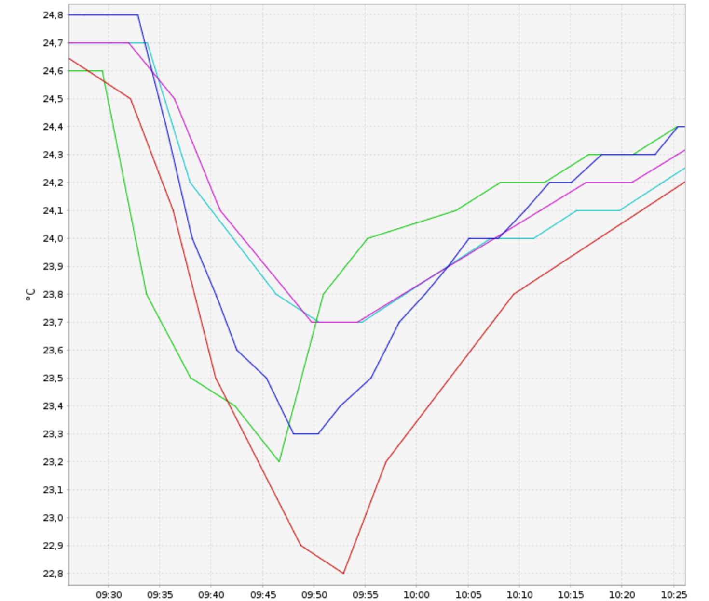
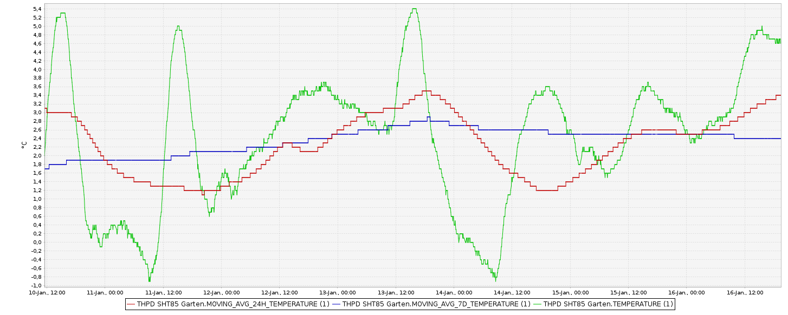
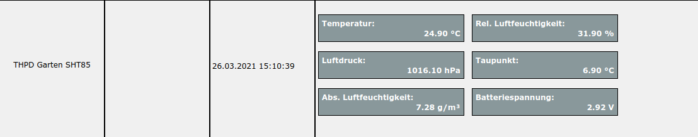

# HB-UNI-Sensor1-THPD-SHT85 [](https://creativecommons.org/licenses/by-nc-sa/4.0/) [](https://hits.seeyoufarm.com)
<br/>


# Hoch genauer und sehr schneller Temperatur-, Luftfeuchte und Luftdrucksensor auf der Basis von den [Sensirion SHT85](https://www.sensirion.com/fileadmin/user_upload/customers/sensirion/Dokumente/2_Humidity_Sensors/Datasheets/Sensirion_Humidity_Sensors_SHT85_Datasheet.pdf) und [Bosch BME280 Sensoren](https://www.bosch-sensortec.com/media/boschsensortec/downloads/datasheets/bst-bme280-ds002.pdf) (HB-UNI-Sensor1-THPD-SHT85) mit Ausgabe von Taupunkttemperatur, absoluter Luftfeuchte, 24 Stunden und 7 Tagestemperaturmittelwerten und Batteriespannung und WebUI Offseteinstellung

- abgeleitet von Toms ([TomMajor](https://github.com/TomMajor)) [HB-UNI-Sensor1](https://github.com/TomMajor/SmartHome/tree/master/HB-UNI-Sensor1)
- ein herzliches Dankeschön für die Basisarbeit geht an Tom (TomMajor)
- ein herzliches Dankeschön an alle, die im Homematic Forum geholfen haben, meine Probleme zu lösen
- hilfreich ist auch die Diskussion zu den [rftypes XMLs](https://homematic-forum.de/forum/viewtopic.php?f=76&t=62578&sid=cf0f4cd99f7ee2bf070e9f39391ee652)
- Der hoch genaue und schnelle Sensirion SHT85 Sensor wird für die Temperatur- und Luftfeuchtemessung verwendet.
- Der Bosch BME280 Sensor wird für die Messung des Luftdrucks verwendet.
- Das Datenblatt des SHT85 Sensors ist [hier](https://www.sensirion.com/fileadmin/user_upload/customers/sensirion/Dokumente/2_Humidity_Sensors/Datasheets/Sensirion_Humidity_Sensors_SHT85_Datasheet.pdf) zu finden.
- Das Datenblatt des BME280 Sensors ist [hier](https://www.bosch-sensortec.com/media/boschsensortec/downloads/datasheets/bst-bme280-ds002.pdf) zu finden.

- Der Diskussionsstrang im Homematic Forum dazu ist bald [hier](tbd) zu finden. Bitte dort auch Fragen stellen.

## Update auf Firmware 1.1 verfügbar

- die neue Firmwareversion 1.1 unterstützt die Berechnung von gleitenden Mittelwerten der gemessenen Temperatur über 24 Stunden und 7 Tage. **Die neue Auflösung der gleitenden Mittelwerte beträgt 0,01 Grad Kelvin** (vorher 0,1 Grad Kelvin).
- vor dem Aufspielen der neuen Firmware
    + das Addon [hb-ep-devices-addon](https://github.com/FUEL4EP/HomeAutomation/releases/latest) mit der Version >= 1.13 als Zusatzsoftware in der Zentrale installieren (siehe README.md des Addons)
    + falls der Sensor in einer früheren Firmwareversion schon an der Zentrale angelernt war, bitte den Sensor zuerst in der Zentrale komplett ablernen und dann mit der neu geflashten Firmware wieder anlernen
- der 24h 7 Tage gleitende Mittelwert braucht 24 Stunden / 7 Tage zum Einschwingen. Nach einem Reset starten die gleitenden Mittelwerte bei Null.

## Vergleich der Temperaturtransiente des HB-UNI-Sensor1-THPD-SHT85 Sensor mit dem [HB-UNI-Sensor1-THPD-BME280](https://github.com/FUEL4EP/HomeAutomation/tree/master/AsksinPP_developments/sketches/HB-UNI-Sensor1-THPD-BME280) 

- grüne Linie: HB-UNI-Sensor1-THPD-SHT85
- blaue Linie: [HM-WDS40-TH-I-2](https://de.elv.com/homematic-funk-innensensor-ith-hm-wds40-th-i-2-fuer-smart-home-hausautomation-132095) (original HomeMatic von EQ-3)
- rote, violette und türkise Linie: [HB-UNI-Sensor1-THPD-BME280](https://github.com/FUEL4EP/HomeAutomation/tree/master/AsksinPP_developments/sketches/HB-UNI-Sensor1-THPD-BME280)
- alle 5 Sensoren stehen direkt nebeneinander, die Homebrew Sensoren ohne Gehäusedecke
- Temperaturtransiente ist durch Lüften bedingt

	


## Neue Eigenschaften im Vergleich zum [HB-UNI-Sensor1](https://github.com/TomMajor/SmartHome/tree/master/HB-UNI-Sensor1) Sensor

- die relative Luftfeuchtigkeit wird mit 0.1 % rLF Genauigkeit ausgegeben
- der Luftdruck wird mit 0.1 hPa Genauigkeit ausgegeben
- die Taupunkttemperatur wird mit 0.1 K Genauigkeit ausgegeben
- die absolute Luftfeuchte wird mit 0.01 g/m³ Genauigkeit ausgegeben
- die Batteriespannung wird mit 10 mV Genauigkeit und jeden Zyklus ausgegeben 
- alle wichtigen Sensorparameter können interaktiv ohne Neuprogrammierung im WebUI der [RaspberryMatic](https://github.com/jens-maus/RaspberryMatic) / [CCU3](https://de.elv.com/smart-home-zentrale-ccu3-inklusive-aio-creator-neo-lizenz-ccu-plugin-151965?fs=2591490946) eingegeben werden:
	+ [Startseite > Einstellungen > Geräte > Geräte-/ Kanalparameter einstellen](Images/SHT85_Setting_of_device_parameters_in_WebUI.png)
	+ Alle drei Offsetwerte (T, rLF, P) müssen für die Eingabe mit dem Faktor 10 multipliziert werden.
- **NEU**: für die gemessene Temperatur können die gleitenden Mittelwerte über die [Zeiträume 24 Stunden](./Images/24h_moving_average_histogram.png) und [7 Tage (hier mit Startrampe zu Beginn der Aufzeichnung)](./Images/7days_moving_average_histogram_with_ramp_up.png) berechnet werden. Hier ein Beispiel (noch mit der 0,1 Grad Kelvin Auflösung):
	
    + programmierbare Option, die einen ATMega1284P benötigt, da das RAM eines ATMega328P nicht für die Speicherung der Temperaturwerte über eine Woche ausreicht
    + diese Option wird mit '#define CALCULATE_MOVING_AVERAGES' aktiviert
    + diese Option erfordert die Kalibrierung des SYSCLOCK_FACTOR, siehe unten unter Kalibrierung, so dass neue Temperaturmessungen exakt im Abstand von 240 Sekunden erfolgen. Ohne diese Kalibrierung sind die gleitenden Mittelwerte verfälscht!
    + die gemessenen Temperaturwerte werden in Ringpuffern der Größe 360 (24 Stunden Ringpuffer) bzw. 2520 (7 Tage Ringpuffer) als int16_t Typ abgespeichert
    + die gleitenden Mittelwerte brauchen mindesten 24 Stunden bzw. 7 Tage zum 'Einschwingen' bis alle Speicherwerte der Ringpuffer mindestens einmal mit Messwerten befüllt wurden
    + bei einem Batteriewechsel oder einem Reset werden die historischen gleitenden Mittelwerte nicht gesichert, da sie nach maximal 7 Tagen vollständig neu berechnet sind

## Neue Eigenschaften im Vergleich zum [HB-UNI-Sensor1-THPD-BME280](https://github.com/FUEL4EP/HomeAutomation/tree/master/AsksinPP_developments/sketches/HB-UNI-Sensor1-THPD-BME280) Sensor

- **Zusätzlich** zum BOSCH BME280 Sensor wird für die hoch genaue und schnelle Messung der Temperatur und der relativen Luftfeuchte der Sensirion SHT85 verwendet. Der SHT85 Sensor ist aufgrund seiner kleinen Bauform thermisch viel geringer an die Basisplatine angeschlossen und reagiert daher viel schneller auf Änderungen der Temperatur oder der Luftfeuchte.
- Da der Flashspeicher eines ATmega328P für den HB-UNI-Sensor1-THPD-SHT85 Sensor nicht ausreicht, wird hier ein Tindie [Pro Mini XL - v2 - ATmega 1284p](https://www.tindie.com/products/prominimicros/pro-mini-xl-v2-atmega-1284p/) oder die Platine [HB-UNI-SEN-BATT_ATMega1284P_E07-868MS10_FUEL4EP](https://github.com/FUEL4EP/HomeAutomation/tree/master/AsksinPP_developments/PCBs/HB-UNI-SEN-BATT_ATMega1284P_E07-868MS10_FUEL4EP) verwendet.
- **Hinweis:** Wer auf das Debuggen mit den seriellen Monitor und die gleitenden Mittelwerte verzichten kann, kann den HB-UNI-Sensor1-THPD-SHT85 Sketch mit '#define NDEBUG' für einen ATmega328P / Arduino Pro Mini (3,3V/8MHz) kompilieren. Das '#define  M1284P' ist dann auszukommentieren. Der HB-UNI-Sensor1-THPD-SHT85 Sketch passt dann in den Flash Speicher des ATmega328P. Damit können z.B. HB-UNI-Sensor1-THPD-BME280 Sensoren nach dem  Auflöten eines zusätzlichen SHT85 Sensors zu einem HB-UNI-Sensor1-THPD-SHT85 umgeflasht werden.

## Taupunkttemperatur und absolute Luftfeuchtigkeit

- Die angezeigte Taupunkttemperatur kann zur Bewertung der Gefährdung einer Schimmelbildung in einem Raum verwendet werden: Der kälteste Punkt eines Raums (in der Regel die untere oder oberere Ecke einer Außenwand) sollte eine mit einem Infrarotthermometer gemessene Temperatur haben, die mindestens 3..4 Grad Celsius über der angezeigten Taupunkttemperatur liegt. Ein Online-Luftfeuchterechner ist z.B. [hier](http://www.thestorff.de/luftfeuchte-rechner.php) zu finden.
- Die angezeigte absolute Luftfeuchtigkeit kann dazu verwendet werden zu entscheiden, ob das Öffnen der Fenster eine Entfeuchtung eines Raums bewirkt: Wenn die absolute Luftfeuchte außen um mindestens 1 g/m³ kleiner ist als im Innenraum, dann wird beim Lüften der Raum entfeuchtet. 


## Kalibrierung von Temperatur, relativer Luftfeuchtigkeit   

- Um eine Offsetkalibrierung der Temperatur- und relativen Luftfeuchtemessung des SHT85 Sensors durchzuführen, zeichne diese beiden Messgrößen z.B. im CCU Historian und vergleiche sie mit den entsprechenden Messwerten eines 'goldenen' Referenzsensors. Extrahiere die Differenzen zwischen den Referenzmesswerten des 'goldenen' Referenzsensors und den entsprechenden des SHT85 Sensors, am Besten in einer Messreihe über Nacht mit geringen Messwertschwankungen und daher flachen Messverläufen. Gebe die Differenzen in das [WebUI Startseite > Einstellungen > Geräte > Geräte-/ Kanalparameter einstellen](Images/Setting_of_device_parameters_in_WebUI.png) ein.

- Bitte führe die Offsetkalibrierung in zwei getrennten Schritten durch:
	+ Kalibriere die SHT85 Temperatur in einem ersten Schritt (erste Nacht)
	+ Kalibriere die SHT85 relative Luftfeuchtigkeit in einem zweiten Schritt (zweite Nacht)
	+ Kalibriere die SHT85 Temperatur and relative Luftfeuchtigkeit NICHT gemeinsam in einem Schritt, da diese beiden Größen physikalisch voneinander abhängen
	
## Schaltung

- basierend auf einem Tindie [Pro Mini XL - v2 - ATmega 1284p](https://www.tindie.com/products/prominimicros/pro-mini-xl-v2-atmega-1284p/) mit CC1101 Sendemodul, Eigenbau mit einem ATmega 1284p möglich
- eine mögliche und von mir empfohlene Hardwarebasis sieht so aus:
    - Platine [HB-UNI-SEN-BATT_ATMega1284P_E07-868MS10_FUEL4EP](https://github.com/FUEL4EP/HomeAutomation/tree/master/AsksinPP_developments/PCBs/HB-UNI-SEN-BATT_ATMega1284P_E07-868MS10_FUEL4EP) mit einem Ebyte E07 868MS10 Funkmodul (rote Platine), das ein wenig teurer als das noname grüne CC1101 Funkmodul ist, aber weniger Ärger macht, und JLCPCB SMD-Bestückung
	  + der Abstandsfehler für einen Batteriehalter in [HB-UNI-SEN-BATT](https://github.com/alexreinert/PCB#hb-uni-sen-batt) ist korrigiert
	  + als Batteriehalter wird der Keystone 2460 verwendet, ein Goobay 1xAA Batteeriehalter passt auch
	  + Bestellung direkt bei JLCPCB oder per PN bei bei [FUEL4EP](https://homematic-forum.de/forum/ucp.php?i=pm&mode=compose&u=20685) anfragen
  * oder alternativ die Platine [HB-UNI-SEN-BATT_FUEL4EP](https://github.com/FUEL4EP/HomeAutomation/tree/master/AsksinPP_developments/PCBs/HB-UNI-SEN-BATT_FUEL4EP)
    + der Abstandsfehler für einen Batteriehalter in [HB-UNI-SEN-BATT](https://github.com/alexreinert/PCB#hb-uni-sen-batt) ist korrigiert
	  + als Batteriehalter wird der Keystone 2460 verwendet, ein Goobay 1xAA Batteeriehalter passt auch
	  + Bestellung direkt bei JLCPCB oder per PN bei bei [FUEL4EP](https://homematic-forum.de/forum/ucp.php?i=pm&mode=compose&u=20685) anfragen
  * oder alternativ die Platine [HB-UNI-SEN-BATT_E07-868MS10_FUEL4EP](https://github.com/FUEL4EP/HomeAutomation/tree/master/AsksinPP_developments/PCBs/HB-UNI-SEN-BATT_E07-868MS10_FUEL4EP) mit einem Ebyte E07 868MS10 Funkmodul (rote Platine), das ein wenig teurer als das noname grüne CC1101 Funkmodul ist, aber weniger Ärger macht
	  + der Abstandsfehler für einen Batteriehalter in [HB-UNI-SEN-BATT](https://github.com/alexreinert/PCB#hb-uni-sen-batt) ist korrigiert
	  + als Batteriehalter wird der Keystone 2460 verwendet, ein Goobay 1xAA Batteeriehalter passt auch
	  + Bestellung direkt bei JLCPCB oder per PN bei bei [FUEL4EP](https://homematic-forum.de/forum/ucp.php?i=pm&mode=compose&u=20685) anfragen 
  + oder alternativ die Universalplatine für DIY-Bausätze von Alexander Reinert
      * Github [HB-UNI-SEN-BATT](https://github.com/alexreinert/PCB#hb-uni-sen-batt)
		* Bezugsquelle: [Smartkram WebShop](https://smartkram.de/produkt/universalplatine-fuer-diy-bausatze-von-alex-reinert/)
   + Sensorgehäuse
	    * 3D-Druck [HB-UNI-SEN-BATT snap Gehaeuse und Deckel](https://www.thingiverse.com/thing:3512767)	auf Thingiverse
	    * oder [fertiges Gehäuse](https://smartkram.de/produkt/sensorgehaeuse-passend-fuer-platine-von-alexander-reinert/) von Smartkram Webshop
	+ Bauteile (ohne SMD Bestückung), Batteriehalter, Arduino, Sensoren bitte gegebenenfalls separat bestellen
	    * Reichelt [Bestellliste](https://www.reichelt.de/my/1882914)
	    * oder Smartkram Webshop [HB-UNI-SEN-BATT](https://smartkram.de/produkt/bauteile-fuer-homematic-diy-projekt-thermometer-hydrometer/) (mit Arduino, BME280 und Batteriehalter)
	        * dort den Arduino Pro Mini durch einen Tindie [Pro Mini XL - v2 - ATmega 1284p](https://www.tindie.com/products/prominimicros/pro-mini-xl-v2-atmega-1284p/) ersetzen
	+ Aufbau entsprechend siehe [Technikkram](https://technikkram.net/blog/2018/05/30/homematic-diy-projekt-thermometer-und-hydrometer-fertige-platine-im-eigenbau/)
	+ 2x 10 kOhm I2C Abschlusswiderstände für SCL und SDA auf HB-UNI-SEN-BATT PCB einlöten
	+ zusätzlich den SHT85 Sensor als I2C Sensor einlöten: VDD<=>VDD, GND<=>VSS, SCL<=>SCL, SDA<=>SDA mit **möglichst dünnen isolierten** Drähten von der Basisplatine zum Sensor verbinden, damit die thermische Kopplung gering ist und der Sensor dadurch schneller wird. Eine mögliche Bezugsquelle für den SHT85 Sensor ist [hier](https://www.soselectronic.com/products/sensirion/sht-85-1-305843). Bitte unbedingt den richtigen Anschluss von VSS und VDD des SHT85 Sensors prüfen. Eine Vertauschung zerstört den Sensor!
	
## Frequenztest des CC1101 RF Moduls

- Bitte vor dem Aufspielen des eigentlichen Sketches des HB-UNI-Sensor1-THPD-SHT85 Sensors UNBEDINGT einen [Frequenztest ATMega1284P](FreqTest_1284P/FreqTest_1284P.ino) durchführen. Viele CC1101 Module lassen sich ohne diesen Frequenztest nicht anlernen!
- Eine Beschreibung des Frequenztests ist [hier](https://asksinpp.de/Grundlagen/FAQ/Fehlerhafte_CC1101.html#ermittlung-der-cc1101-frequenz) zu finden.

## Verringerung des Ruhestroms

- auf dem Tindie Pro Mini XL - v2 - ATmega 1284p die markierte LED auslöten:

	

- Brown-Out_Detektor des ATmega1284P  (BOD) ausschalten, siehe Einstellungen Arduino IDE unten unter Punkt **Benötigter Sketch**

- Nach dem Aufbau und **vor** dem Einlöten der Sensoren den Ruhestrom mit [SleepTest_1284P](./SleepTest_1284P/SleepTest_1284P.ino) durchführen. Der gemessene Ruhestrom sollte < 10 uA betragen.
	       

## Das angemeldete Gerät im RaspberryMatic WebUI

- ohne gleitende Mittelwerte (alte RM Version):



- mit gleitenden Mittelwerten (unmittelbar nach Reset):


## Vor dem Aufspielen von Software

- Bitte macht Euch zuerst mit den Grundlagen von AsksinPP [hier](https://asksinpp.de/Grundlagen/) vertraut.

## Bitte immer die aktuellste Version von AsksinPP nutzen

-  [AsksinPP Master](https://github.com/pa-pa/AskSinPP/tree/master)

## Bitte genau diese Abfolge beim Einspielen von Software beachten:

- Details sind gegebenenfalls weiter unten zu finden

1. Bitte zuerst nochmals vergewissern, dass ein Tindie [Pro Mini XL - v2 - ATmega 1284p](https://www.tindie.com/products/prominimicros/pro-mini-xl-v2-atmega-1284p/) oder die Platine [HB-UNI-SEN-BATT_ATMega1284P_E07-868MS10_FUEL4EP](https://github.com/FUEL4EP/HomeAutomation/tree/master/AsksinPP_developments/PCBs/HB-UNI-SEN-BATT_ATMega1284P_E07-868MS10_FUEL4EP) verbaut wurde.
2. Das benötigte Addon [hb-ep-devices-addon](https://github.com/FUEL4EP/HomeAutomation/releases/latest) auf Eure CCU3/RaspberryMatic installieren. Die minimal benötigte Version ist die Version 1.12
3. Für das Programmierern und Setzen der Fuses des ATmega1284p ist ein ISP Programmer empfohlen. Eine Anleitung ist [hier](https://asksinpp.de/Grundlagen/04-isp.html) zu finden. Dabei bitte unbedingt den ISP Programmer auf 3,3V einstellen!
4. Setzten der richtigen Fuses mit [avrdude script](avrdude/avrdude_m1284p_int_RC_8MHz.bsh) (LINUX version) oder mit [AVRDUDESS](https://blog.zakkemble.net/avrdudess-a-gui-for-avrdude/) (Windows Version): Fuse Setting: Low Byte:0xE2  High Byte:0xD4  Extended Byte:0xFF. Dafür bitte einen ISP Programmer verwenden, siehe [hier](https://asksinpp.de/Grundlagen/04-isp.html). Ich persönlich nutze diesen [ISP Programmer](https://www.amazon.de/Diamex-Programmer-XMEGA-ATMEGA-ATtiny/dp/B0064LLRB0).
5. Den Config-Taster ganz lange drücken (ca. 6..8 Sekunden) bis die rote LED erlischt und im seriellen Monitor 'RESET' ausgegeben wird. Damit wird ein 'Werksreset' durchgeführt und das EEPROM gelöscht. Damit gehen auch alle im EEPROM gespeicherten Einstellungen verloren.  Die ermittelte Frequenzeinstellung des Frequenztests bleibt aber erhalten. 
6. Dann den [Frequenztest](https://asksinpp.de/Grundlagen/FAQ/Fehlerhafte_CC1101.html#ermittlung-der-cc1101-frequenz) durchführen. Dazu den [Frequenztest ATMega1284P](FreqTest_1284P/FreqTest_1284P.ino) ausführen und dabei auf ein erfolgreiches Beenden achten.
7. Gegebenenfalls die Parameter cDEVICE_und cDEVICE_in [Device_SHT85_BME280.h](Cfg/Device_SHT85_BME280.h) ändern. Jeder Sensor muss ein eineindeutiges cDEVICE_und cDEVICE haben!
8. Die aktuelle Version des [HB-UNI-Sensor1-THPD-SHT85](https://github.com/FUEL4EP/HomeAutomation/tree/master/AsksinPP_developments/sketches/HB-UNI-Sensor1-THPD-SHT85) Sketches herunterladen, siehe unten.
9. Die benötigten Libraries installieren, siehe unten unter 'Benötigte Libraries'.
10. Dann den Sketch [HB-UNI-Sensor1-THPD-SHT85.ino](https://github.com/FUEL4EP/HomeAutomation/tree/master/AsksinPP_developments/sketches/HB-UNI-Sensor1-THPD-SHT85/HB-UNI-Sensor1-THPD-SHT85.ino) kompilieren und mit dem ISP Programmer auf den Tindie [Pro Mini XL - v2 - ATmega 1284p](https://www.tindie.com/products/prominimicros/pro-mini-xl-v2-atmega-1284p/) hochladen. Details siehe unten.
11. Den neuen Sensor in der CCU/RaspBerryMatic anlernen.
12. Den neuen Sensor in der CCU3/RaspberryMatic dem Gewerk 'Wetter' zuordnen.
13. Wenn eine Aktualisierung der Sensorfirmware mit der Option '#define CALCULATE_MOVING_AVERAGES' zur Berechnung von gleitenden Mittelwerten gemacht wurde, bitte zuerst die letzte Addon Version [hb-ep-devices-addon](https://github.com/FUEL4EP/HomeAutomation/releases/latest) auf die CCU3/RaspberryMatic als Zusatzsoftware aufspielen, dann den Sensor HB-UNI-Sensor1-THPD-SHT85 zuerst komplett von der Zentrale CCU3/Raspberrymatic ablernen und löschen, danach den Sensor HB-UNI-Sensor1-THPD-SHT85 wieder erneut an der Zentrale CCU3/Raspberrymatic anlernen.
 

## Benötiger Sketch

[HB-UNI-Sensor1-THPD-SHT85](https://github.com/FUEL4EP/HomeAutomation/tree/master/AsksinPP_developments/sketches/HB-UNI-Sensor1-THPD-SHT85)

- bitte alle Unterverzeichnisse mit kopieren:

### Zur lokalen Installation des Github Releases auf Deinem Computer

- gehe bitte in Dein Zielinstallationsverzeichnis, wo Du mit dem HB-UNI-Sensor1-THPD-SHT85 Sensor arbeiten möchtest

  - gebe dort 'git clone https://github.com/FUEL4EP/HomeAutomation.git' ein
	  + damit lädst Du mein [Sammelrepository](https://github.com/FUEL4EP/HomeAutomation) für alle meine auf Github freigegebenen HomeBrew Sensoren herunter.
  - dann findest Du ein neues Verzeichnis 'HomeAutomation' auf Deinem Rechner, das alle meine auf Github freigebenen Sensoren enthält, siehe [README.md](https://github.com/FUEL4EP/HomeAutomation/blob/master/README.md)
  	+ mache bitte regelmäßig ein Update mit 'git pull'
 -	enthalten ist auch das notwendige Addon '[ep-hb-devices-addon](https://github.com/FUEL4EP/HomeAutomation/releases/latest)'
 -	den HB-UNI-Sensor1-THPD-SHT85 Sensor findest Du unter './HomeAutomation/tree/master/AsksinPP_developments/sketches/HB-UNI-Sensor1-THPD-SHT85'

- nach erfolgreicher Inbetriebnahme können die Debugausgaben im serial Monitor ausgeschaltet werden. Dazu bitte im Sketch HB-UNI-Sensor1-THPD-SHT85.ino auskommentieren:

> // !! NDEBUG sollte aktiviert werden wenn die Sensorentwicklung und die Tests abgeschlossen sind und das Gerät in den 'Produktionsmodus' geht.<br/>
> // Insbesondere die RAM-Einsparungen sind wichtig für die Stabilität / dynamische Speicherzuweisungen etc.<br/>
> // Dies beseitigt dann auch die mögliche Arduino-Warnung 'Low memory available, stability problems may occur'.<br/>
> //<br/>
> //#define NDEBUG

- als Taktfrequenz des Tindie [Pro Mini XL - v2 - ATmega 1284p](https://www.tindie.com/products/prominimicros/pro-mini-xl-v2-atmega-1284p/) 'Internal 8 HHz' einstellen
- die Berechnung von gleitenden Mittelwerten wird in [HB-UNI-Sensor1-THPD-SHT85.ino](./HB-UNI-Sensor1-THPD-SHT85.ino) mit
    + '#define CALCULATE_MOVING_AVERAGES' aktiviert
    + durch Auskommentieren mit '// #define CALCULATE_MOVING_AVERAGES' deaktiviert
- ohne Berechnung von gleitenden Mittelwerten benötigt der Sketch 34206 Bytes (26%) des Programmspeicherplatzes. Das Maximum sind 130048 Bytes. Globale Variablen verwenden 1299 Bytes (7%) des dynamischen Speichers, 15085 Bytes für lokale Variablen verbleiben. Das Maximum sind 16384 Bytes.
- mit Berechnung von gleitenden Mittelwerten benötigt der Sketch 39824 Bytes (30%) des Programmspeicherplatzes. Das Maximum sind 130048 Bytes.
Globale Variablen verwenden 7332 Bytes (44%) des dynamischen Speichers, 9052 Bytes für lokale Variablen verbleiben. Das Maximum sind 16384 Bytes.

- [Fuses Calculator](http://eleccelerator.com/fusecalc/fusecalc.php); select ATmega1284P
- [avrdude script](avrdude/avrdude_m1284p_int_RC_8MHz.bsh) zum Setzen der Fuses für 8MHz interner RC Oszillator (Linux version)
	- wichtig ist dass dieser Skript **VOR** dem Flashen des Programmcodes ausgeführt wird.  Das EESAVE Konfigurationsbit des ATmega1284P muss gesetzt sein (Preserve EEPROM memory through the Chip Erase cycle; [EESAVE=1])


- Die Programmierung erfolgt mit einem ISP Programmer, z.B. Diamex ISP USB Programmer. Dazu dienen die Signale VCC, GND, MOSI, SCK, MISO,
RSET an der Steckerleiste unten rechts in der Basisplatine. Dort eine Steckerleiste einlöten.
- **WICHTIG:** Den ISP Programmer auf 3,3V einstellen!
- **Unbedingt** diese [Warnung](https://github.com/TomMajor/SmartHome/tree/master/Info/Warnung_Flashen_33_USBasp_Klones) beachten!
- Einstellungen Arduino IDE [Werkzeuge](Images/Arduino_IDE_Tools_8MHz_int_RC_osc.png) und auch [hier](https://prominimicros.com/how-to-use-the-pro-mini-xl-or-atmega-1284p-with-the-arduino-ide/)
- als zusätzliche Boardverwalter-URLs unter Arduino IDEs Voreinstellungen einstellen (falls noch nicht getan):

> https://mcudude.github.io/MightyCore/package_MCUdude_MightyCore_index.json

- Hochladen des kompilierten Sketchs im Arduino IDE mit: Sketch => Hochladen mit Programmer
- Debugging wird über den seriellen Monitor mit einem 'FTDI Adapter USB zu TTL Serial für
3,3V und 5V für Arduino' gemacht. Als Baudrate **38400 Baud** einstellen.
- **WICHTIG:** Wenn der Resetknopf (nicht die Config-Taste!) des Tindie [Pro Mini XL - v2 - ATmega 1284p](https://www.tindie.com/products/prominimicros/pro-mini-xl-v2-atmega-1284p/) gedrückt wurde, muss der Sensor danach neu an der Zentrale angelernt werden. Beim Reset wird die Adresse der Zentrale (CCU3/RaspberryMatic) im EEPROM des ATmega1284P gelöscht. Damit funktioniert LazyConfig nicht mehr. War der Sensor schon an der Zentrale angemeldet, erscheint der Sensor nicht mehr im Posteingangskorb, bekommt aber dennoch die Adresse der Zentrale mitgeteilt.


## Benötigte Libraries

+ [AskSinPP Library](https://github.com/pa-pa/AskSinPP)</br>
+ [EnableInterrupt](https://github.com/GreyGnome/EnableInterrupt)</br>
+ [Low-Power](https://github.com/rocketscream/Low-Power)</br>
+ [finitespace/SHT85](https://github.com/finitespace/BME280)
+ [arduino-sht](https://github.com/Sensirion/arduino-sht)

- **WICHTIG:** Es darf nur die [finitespace SHT85](https://github.com/finitespace/BME280) Bibliothek im Suchpfad der Arduino IDE sein! Gegebenenfalls müssen andere BME280 Bibliotheken temporär anders wohin verschoben werden.


## Benötigtes Addon

[hb-ep-devices-addon](https://github.com/FUEL4EP/HomeAutomation/releases/latest)

- die minimal benötigte Version ist die Version 1.13.

- bitte dieses Addon 'hb-ep-devices-addon.tgz 'vor dem Anlernen des HB-UNI-Sensor1-THPD-SHT85 Sensors auf der RaspberryMatic / CCU3 installieren (kein unzip vonnöten!)

## Kalibrierung

- die folgenden Kalibrierwerte können im Code eingestellt werden:

  + Kalibrierung des Messintervalls

    + Das Messintervall wird im Debug Modus auf 4 Minuten = 240 Sekunden eingestellt, d.h. Ziel ist es, dass exakt alle 240 Sekunden eine neue Messwertausgabe erfolgt

    + dazu wird der SYSCLOCK_FACTOR in [HB-UNI-Sensor1-THPD-SHT85.ino](./HB-UNI-Sensor1-THPD-SHT85.ino) geeignet eingestellt 
      ```
      #define SYSCLOCK_FACTOR    0.924    // adjust to get sampling data every 240 seconds (4 minutes)
      ```

## Verringerung der Tx Sendeleistung

- nur Experten wird empfohlen, die Tx Sendeleistung zu verringern. Die Beschreibung ist [hier](./Reduction_of_Tx_RF_power/README.md).

## Betriebsdauer mit einem neuen Batteriesatz

- die Betriebsdauer mit einem neuen Satz an Batterien beträgt > 6 Monate (noch nicht vollständig evaluiert). Der Spannungsabfall der Batteriespannung über einen Zeitraum von 6+ Monaten ist [hier](Images/battery_voltage_drop_over_6+_months.png) gezeigt. Nach 6+ Monaten beträgt die gemessene Batteriespannung noch immer 3,10 Volt. Die Spannungsspitze Anfang Februar im Histogramm ist auf einen Programmiervorgang zurückzuführen, der die Alkaline-Batterien auflädt (ja, man kann Alkaline Batterien auch aufladen).

## Lizenz

**Creative Commons BY-NC-SA**<br>
Give Credit, NonCommercial, ShareAlike

<a rel="license" href="http://creativecommons.org/licenses/by-nc-sa/4.0/"></a><br />This work is licensed under a <a rel="license" href="http://creativecommons.org/licenses/by-nc-sa/4.0/">Creative Commons Attribution-NonCommercial-ShareAlike 4.0 International License</a>.
