# HB-UNI-Sensor1-THP_MA-AHT20_BMP280: Temperatur, Luftfeuchte und Luftdrucksensor für langfristige Klimaerfassung zur Beobachtung des Klimawandels[](https://creativecommons.org/licenses/by-nc-sa/4.0/) 
<br/>


# Eigenschaften

## Ausgabe der aktuellen Messwerte von

- Temperatur (Auflösung 0,1 Grad Celsius)
- relativen Luftfeuchte (Auflösung 0.1 % relative Luftfeuchte)
- Luftdruck (Auflösung 0,1 hPascal)
- Messintervall: 4 Minuten (Abgleich siehe unten)

## Ausgabe der gleitenden Temperaturmittelwerte über
 
- die letzten 24 Stunden
- die letzte Woche (7 Tage)
- den letzten Monat (31 Tage)
- das letzte Jahr (365 Tage)

- die Auflösung der gleitenden Mittelwerte beträgt 0,01 Grad Celsius.

- Diagramm der gemessenen Außentemperatur und der gleitenden Mittelwerte in den ersten 31 Tagen nach Inbetriebnahme:

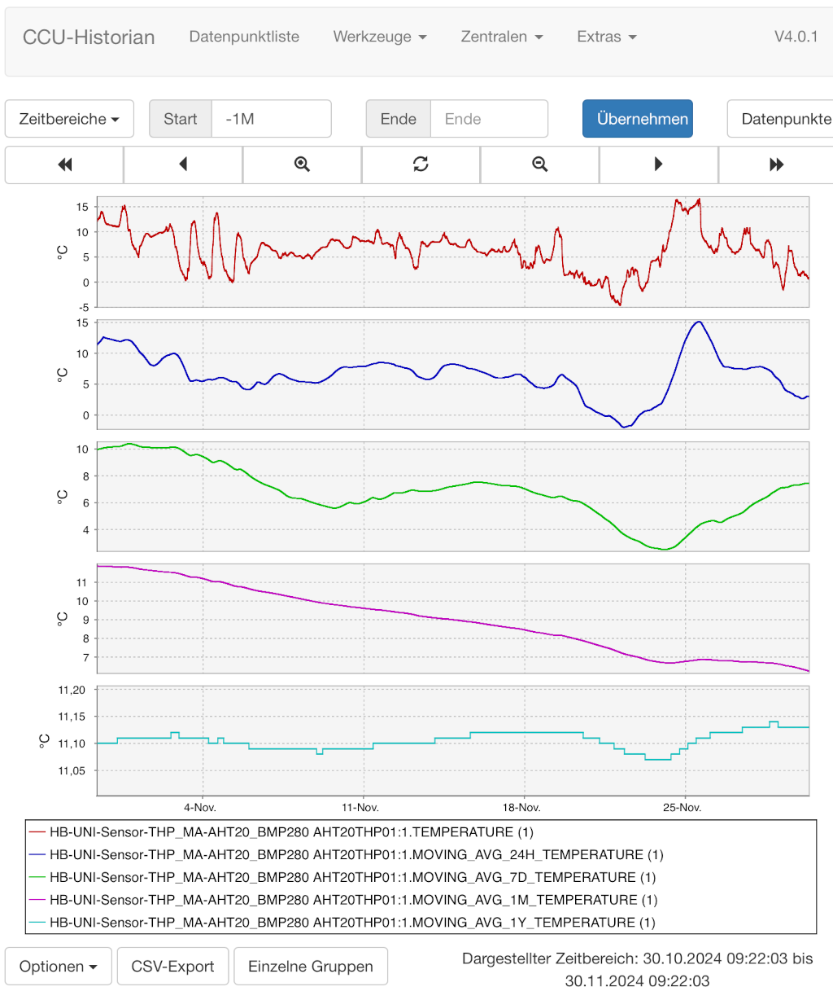

- die Ringpuffer für die Berechnung der gleitenden Mittelwerte wurde bei der Programmierung mit interpolierten historischen Werten des vergangenen Jahres vorbelegt, so dass die Mittelwerte bereits einen guten Startwert haben.

## lokale gleitende Mittelwertbildung

- nichtflüchtige ferromagnetische Speicher FRAM zur lokalen Messwertspeicherung
	+ Abspeicherung der Temperaturmesswerte in 2x 2MBit FRAM in Ringpuffern
- Datenerhalt bei Batteriewechsel
- Vorbelegung der Ringpuffer bei Kaltstart mit interpolierten Temperaturwerten aus den historischen Monatsmittelwerten des vergangenen Jahres, z.B. [von Frankfurt](https://www.wetterkontor.de/de/wetter/deutschland/monatswerte-station.asp?id=10637)
	- Referenzzeitpunkt: Kompilationszeitpunkt des Sketches

## Sensoren:

- [Aosong AHT20](https://files.seeedstudio.com/wiki/Grove-AHT20_I2C_Industrial_Grade_Temperature_and_Humidity_Sensor/AHT20-datasheet-2020-4-16.pdf) (Fehlertoleranz der Messung: ±0.3°C, ±2% RH)
- [Bosch BME280](https://www.bosch-sensortec.com/media/boschsensortec/downloads/datasheets/bst-bme280-ds002.pdf)

- eine mögliche Kalibrierung des AHT20 Sensors ist unten beschrieben 

## weitere Eigenschaften

- Ausgabe der Batteriespannung
- WebUI Offseteinstellung
- geringe Stromaufnahme von ca. 12 uA Stromaufnahme im Sleep-Mode


## WebUI


## Konfigurieren der Geräte- und Kanalparameter


## Posteingang nach erfolgreichem Anlernen


## benötigte Hardware

- [HB-UNI-SEN-BATT_ATMega1284P_E07-868MS10_FRAM_FUEL4EP](https://github.com/FUEL4EP/HomeAutomation/tree/master/AsksinPP_developments/PCBs/HB-UNI-SEN-BATT_ATMega1284P_E07-868MS10_FRAM_FUEL4EP)


## benötiger Sketch

[HB-UNI-Sensor1-THP_MA-AHT20_BMP280](https://github.com/FUEL4EP/HomeAutomation/tree/master/AsksinPP_developments/sketches/HB-UNI-Sensor1-THP_MA-AHT20_BMP280)

- bitte alle Unterverzeichnisse mit kopieren:

### zur lokalen Installation des Github Releases auf Deinem Computer

- gehe bitte in Dein Zielinstallationsverzeichnis, wo Du mit dem HB-UNI-Sensor1-THP_MA-AHT20_BMP280 Sensor arbeiten möchtest

  - gebe dort 'git clone https://github.com/FUEL4EP/HomeAutomation.git' ein
	  + damit lädst Du mein [Sammelrepository](https://github.com/FUEL4EP/HomeAutomation) für alle meine auf Github freigegebenen HomeBrew Sensoren herunter.
  - dann findest Du ein neues Verzeichnis 'HomeAutomation' auf Deinem Rechner, das alle meine auf Github freigebenen Sensoren enthält, siehe [README.md](https://github.com/FUEL4EP/HomeAutomation/blob/master/README.md)
  	+ mache bitte regelmäßig ein Update mit 'git pull'
 -	enthalten ist auch das notwendige Addon '[ep-hb-devices-addon](https://github.com/FUEL4EP/HomeAutomation/releases/latest)'
 -	den HB-UNI-Sensor1-THP_MA-AHT20_BMP280 Sensor findest Du unter './HomeAutomation/tree/master/AsksinPP_developments/sketches/HB-UNI-Sensor1-THP_MA-AHT20_BMP280'
 
- alternativ kann vom Github [Sammelrepository](https://github.com/FUEL4EP/HomeAutomation) die ZIP-Datei HomeAutomation-master.zip heruntergeladen und auf dem lokalen Rechner ausgepackt werden. Bitte dann regelmäßig auf Github nach Updates schauen.

- nach erfolgreicher Inbetriebnahme können die Debugausgaben im serial Monitor ausgeschaltet werden. Dazu bitte im Sketch HB-UNI-Sensor1-THP_MA-AHT20_BMP280.ino auskommentieren:

> //-------------------------------------------------------------  
// !! NDEBUG sollte aktiviert werden wenn die Sensorentwicklung und die Tests abgeschlossen sind und das Gerät in den 'Produktionsmodus' geht.    
//  
// #define NDEBUG                     // uncomment if bring up tests have been succeessfully finished  
//-------------------------------------------------------------

- als Taktfrequenz des ATmega1284P 8 MHz @ 3.3V externer Quarz einstellen

- zur Programmierung des ATMega1284P wird ein Diamex Prog-S2 Programmiergerät empfohlen. Eine [Anleitung](../../HowTos/ISP Programmer/Diamex Prog-S2/) für Linux ist hier zu finden.

- [Fuses Calculator](http://eleccelerator.com/fusecalc/fusecalc.php); wähle  ATmega1284P aus

- [avrdude Skript für Diamex Prog-S2 Programmiergerät](avrdude/Diamex_Prog_S2/avrdude_m1284p_ext_8MHz_Diamex_Prog_S2.bsh) (LINUX version)
	- wichtig ist dass dieser Skript **VOR** dem Flashen des Programmcodes ausgeführt wird.  Das EESAVE Konfigurationsbit des Atmega328P muss gesetzt sein (Preserve EEPROM memory through the Chip Erase cycle; [EESAVE=1])

- die Programmierung erfolgt mit einem ISP Programmer, z.B. Diamex Prog-S2 Programmiergerät. Dazu dienen die Signale VCC, GND, MOSI, SCK, MISO,
RSET an der Steckerleiste unten rechts in der Basisplatine. Dort eine Steckerleiste einlöten.
- ISP Programmer auf 3.3V einstellen!
- Einstellungen Arduino IDE: 8MHz, 3.3V
- Hochladen des kompilierten Sketchs im Arduino IDE mit: Sketch => Hochladen mit Programmer
- Debugging wird über den seriellen Monitor mit einem FTDI Adapter USB zu TTL Serial für
3,3V für Arduino gemacht. Als Baudrate des seriellen Monitors bitte **38400** Baud einstellen.
- **WICHTIG:** Wenn der Config-Taster des Sensors (unbeabsichtigt) länger als 6..8 Sekunden gedrückt wurde, muss der Sensor danach neu an der Zentrale angelernt werden. Beim Reset wird die Adresse der Zentrale (CCU3/RaspberryMatic) im EEPROM des ATMega1284P gelöscht. Damit funktioniert LazyConfig nicht mehr. Zum erneuten Anlernen, zuerst den Sensor in der CCU3/RaspberryMatic ablernen und dann normal wieder anlernen. Die Offseteinstellungen müssen dann im WebUI erneut vorgenommen werden!

## Vorbelegen der Ringpuffer in den nichtflüchtigen FRAM Speichern

- für jeden der vier gleitenden Temperaturmittelwerte (1D, 7D, 31D, 365D) wird in den nichtflüchtigen FRAM Speichern ein geeignet großer Ringpuffer angelegt, so dass alle 4 Minuten ein neuer Temperaturmesswert abgespeichert werden kann.
- **bei einem Werksreset, der durch ein > 6 Sekunden langes Drücken des Config-Tasters ausgelöst wird,** werden die 4 Ringpuffer geeignet vorbelegt. Das dauert mehrere Minuten, während denen die rote LED der Platine blinkt. Bitte unterbrecht das Vorbelegen nicht!
- die Vorbelegung kann mit
	+ a) einem festen, wählbaren Temperaturmittelwert oder
	+ b) [interpolierten historischen Mittelwerten](Sensors/Historical_weather_statistics.h) erfolgen (=Vorauswahl)
- die Auswahl erfolgt im WebUI:
	
- in der Bibliothek [Historical_weather_statistics.h](Sensors/Historical_weather_statistics.h) können die historischen Mittelwerte in der Tabelle yValues an den Standort des Sensors angepasst werden, z.B. für Frankfurt (Main): https://www.wetterkontor.de/de/wetter/deutschland/monatswerte-station.asp?id=10637
 

## Frequenztest des CC1101 RF Moduls

- bitte vor dem Aufspielen des eigentlichen Sketches HB-UNI-Sensor1-THP_MA-AHT20_BMP280 UNBEDINGT einen [FreqTest_1284P](FreqTest_1284P/FreqTest_1284P.ino) durchführen.
- eine Beschreibung des Frequenztests ist [hier](https://asksinpp.de/Grundlagen/FAQ/Fehlerhafte_CC1101.html#ermittlung-der-cc1101-frequenz) zu finden.

## Messung des Ruhestroms

- ein angepasster Sketch zur Messung des Ruhestroms der Schaltung [HB-UNI-SEN-BATT_ATMega1284P_E07-868MS10_FRAM_FUEL4EP](https://github.com/FUEL4EP/HomeAutomation/tree/master/AsksinPP_developments/PCBs/HB-UNI-SEN-BATT_ATMega1284P_E07-868MS10_FRAM_FUEL4EP) ist [hier](SleepTest_1284P_FRAM/SleepTest_1284P_FRAM.ino) zu finden. Dieser Sketch nutzt den Power-Down Mode der FRAMs. Im Sleep-Mode beträgt der Ruhestrom ca. 12 uA.

## erste Messaufzeichnungen nach Boot


- in diesem Diagramm wurde am 19. Juni 2024 um ca. 9:10 Uhr (Peak in der Temperaturkurve durch Hereinholen des Sensors von draußen  in  das Haus) ein Batteriewechsel ohne Datenverlust durchgeführt, d.h. ein Warmstart.

- Aufzeichnungen der Außentemperatur und der berechneten gleitenden Temperaturmittelwerten in den ersten 31 Tagen nach dem initialen Boot. Als Vorbelegung der Ringpuffer wurden [gemittelte Werte für Deutschland genommen](https://de.statista.com/statistik/daten/studie/5564/umfrage/monatliche-durchschnittstemperatur-in-deutschland/)
- 


## Kalibrierung des Messintervalls von 4 Minuten

- die folgenden Kalibrierwerte können im Code eingestellt werden:

  + Kalibrierung des Messintervalls

    + das Messintervall wird im Debug Modus auf 4 Minuten = 240 Sekunden eingestellt, d.h. Ziel ist es, dass exakt alle 240 Sekunden eine neue Messwertausgabe erfolgt

    + dazu wird der SYSCLOCK_FACTOR in [HB-UNI-Sensor1-THP_MA-AHT20_BMP280.ino.ino](./HB-UNI-Sensor1-THP_MA-AHT20_BMP280.ino) geeignet eingestellt 
      ```
      #define SYSCLOCK_FACTOR    0.94458948129    // adjust to get sampling data exactly every 240 seconds, during sleepmode the accurate crystal oscillator is stopped for power reasons and the less accurate internal RC oscillator is activated!

## aktueller Status

- **Freigabe**
- die Funktionen des Sensors wurden erfolgreich validiert
- Validierung ist abgeschlossen
	+ Temperatur, Luftfeuchte und Luftdruckmessung
	+ Vorbelegung der Ringpuffer im FRAM mit historischen Temperaturwerten
	+ Mittelwertbildung
	+ Kaltstart bei Werksreset (Config-Taste > 6 Sekunden drücken)
	+ Warmstart bei Batteriewechsel ohne Datenverlust
	+ Gehäuse gedruckt und getestet, erste Messungen bei Sonneneinstrahlung zeigen gute Ergebnisse. Die modifizierte TFA Schutzhülle misst mit dem HB-UNI-Sensor1-THP_MA-AHT20_BMP280 Sensor bei Sonneneinstrahlung geringere Temperaturen als die Original-EQ3-HM-WDS100-C6-O-2 Wetterstation. Beide sind am selben Mast angebracht, siehe Bild. Die EQ3 Wetterstation ist in ca. 3 Metern Höhe, die modifizierte TFA Schutzhülle in ca. 2 Metern Höhe angebracht:
	


- Vergleich der gemessenen Außentemperaturen an einem wolkigen Tag:

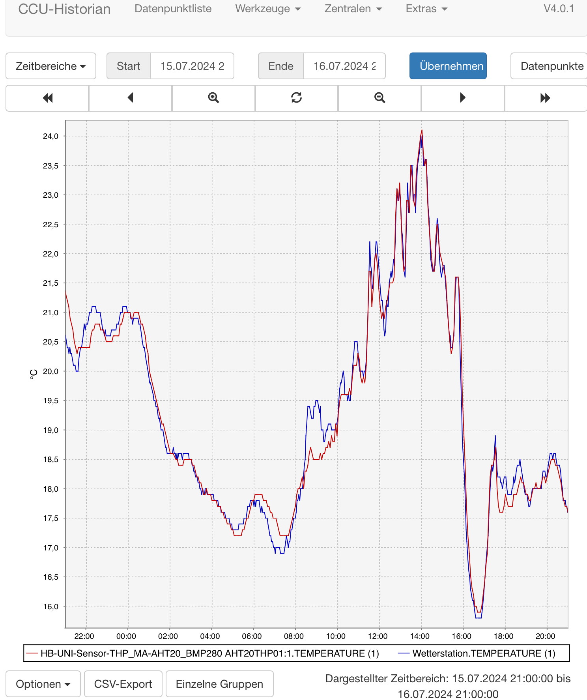

- Vergleich der gemessenen Außentemperaturen an einem sonnigen Tag:
	
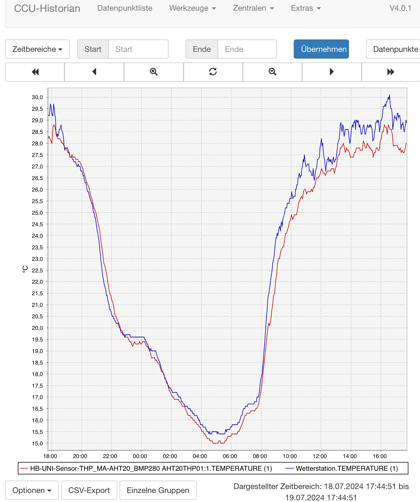


## benötigtes Addon

[hb-ep-devices-addon](https://github.com/FUEL4EP/HomeAutomation/releases/latest)

- die minimal benötigte Version ist die **Version 1.17**.

- bitte dieses Addon 'hb-ep-devices-addon.tgz' vor dem Anlernen des HB-UNI-Sensor1-THP_MA-AHT20_BMP280 Sensors auf der RaspberryMatic / CCU3 installieren (kein unzip vonnöten!)

## benötigte Bibliotheken

- AskSin++                  2016 papa (Creative Commons)
- Adafruit BMP280           2020 Adafruit https://github.com/adafruit/Adafruit_BMP280_Library (no license mentioned)
- finitespace/BME280        2016 finitespace https://github.com/finitespace/BME280  (GNU General Public License v3.0) for EnvironmentCalculations
- AHT20                     2020 dvarrel https://github.com/dvarrel/AHT20 (Creative Commons Zero v1.0 Universal)
- Adafruit_FRAM_SPI         2024 https://github.com/adafruit/Adafruit_FRAM_SPI (BSD License) >= commit 928281f of 18th Jul 2024
- Time                      2012 PaulStoffregen https://github.com/PaulStoffregen (no license mentioned)


## Speicherbedarf auf einem ATMega1284P (mit Debug)

- der Sketch verwendet 58710 Bytes (44%) des Programmspeicherplatzes. Das Maximum sind 130560 Bytes.
Globale Variablen verwenden 3116 Bytes (15%) des dynamischen Speichers, 13768 Bytes für lokale Variablen verbleiben. Das Maximum sind 16384 Bytes.

## Batteriewechsel

- ein Batteriewechsel soll immer unmittelbar nach dem Übertragen eines neuen Messwertsatzes an die Zentrale erfolgen. Am besten beobachtet man dazu den Zeitstempel des letzten Messwertsatzes in der WebUI:

	

	Nach dem Umspringen des Zeitstempels bleiben fast 4 Minuten Zeit, um die alten Batterien zu entnehmen und durch neue zu ersetzen. Die Daten der FRAMs bleiben dabei erhalten. Der Wechsel der Batterien sollte innerhalb dieser 4 Minuten abgeschlossen ein.
- bei einem Batteriewechsel entsprechend dieser Anleitung bleiben die in den nichtflüchtigen FRAM-Speichern gespeicherten Messwerte erhalten, es erfolgt keine erneute Vorbelegung. 
- die Entladekurve der 2x AA-Batterien in den ersten 3 Monaten ist:

	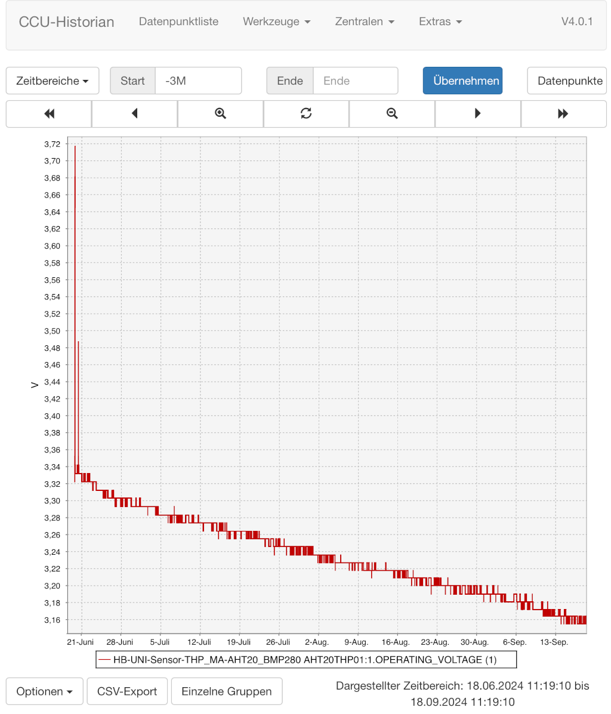
- ein 2x AA-Batteriesatz hält voraussichtlich > 9 Monate
	
## Kalibrierung von Temperatur, relativer Luftfeuchtigkeit

- um eine Offsetkalibrierung der Temperatur- und relativen Luftfeuchtemessung des AHT20 Sensors durchzuführen, zeichne diese beiden Messgrößen z.B. im CCU Historian und vergleiche sie mit den entsprechenden Messwerten eines 'goldenen' Referenzsensors. Extrahiere die Differenzen zwischen den Referenzmesswerten des 'goldenen' Referenzsensors und den entsprechenden des AHT20 Sensors, am Besten in einer Messreihe über Nacht mit geringen Messwertschwankungen und daher flachen Messverläufen. Gebe die Differenzen in das [WebUI Startseite > Einstellungen > Geräte > Geräte-/ Kanalparameter einstellen](Images/setting_of_device_parameters_in_WebUI.png) ein.
- bitte führe die Offsetkalibrierung in zwei getrennten Schritten durch:
	+ kalibriere die AHT20 Temperatur in einem ersten Schritt (erste Nacht)
	+ kalibriere die AHT20 relative Luftfeuchtigkeit in einem zweiten Schritt (zweite Nacht)
	+ kalibriere die AHT Temperatur und relative Luftfeuchtigkeit NICHT gemeinsam in einem Schritt, da diese beiden Größen physikalisch voneinander abhängen

## Gehäuse

- die Empfehlung ist ein Einbau in eine [TFA Schutzhülle mit Solar-Lüfter für Thermo-/Hygrosensoren, Innenmaße (Ø x H): 80 x 170 mm ](https://de.elv.com/tfa-schutzhuelle-mit-solar-luefter-fuer-thermo-hygrosensoren-innenmasse-oe-x-h-80-x-170-mm-253915)
	- solarbetriebener Lüfter

	

	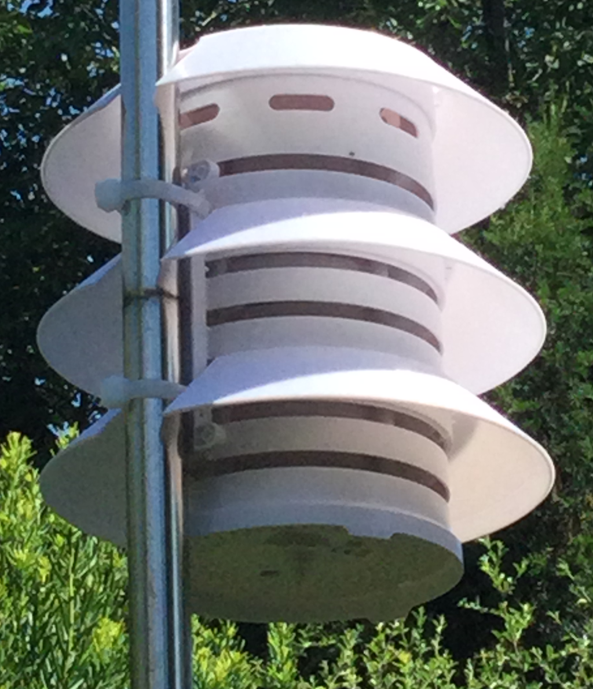
	
	


- drei 3D gedruckte, oben offene 'Sonnenhüte' zur zusätzlichen Abschattung bei direkter Sonneneinstrahlung machen die Temperaturüberhöhung bei Sonneneinstrahlung geringer. Die STL- und FreeCAD-Dateien sind [hier](./3D_Printer/solar_radiation_shield).

- Bild des oberen 'Sonnenhuts':
	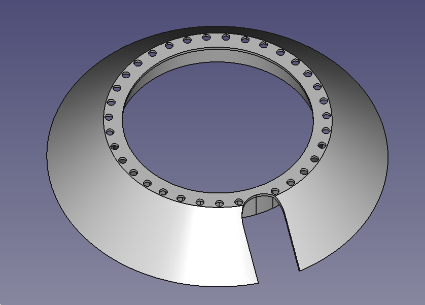
- Bild des verbesserten oberen 'Sonnenhuts' mit kleinerem Ausschnitt und zusätzlichem Rand:
	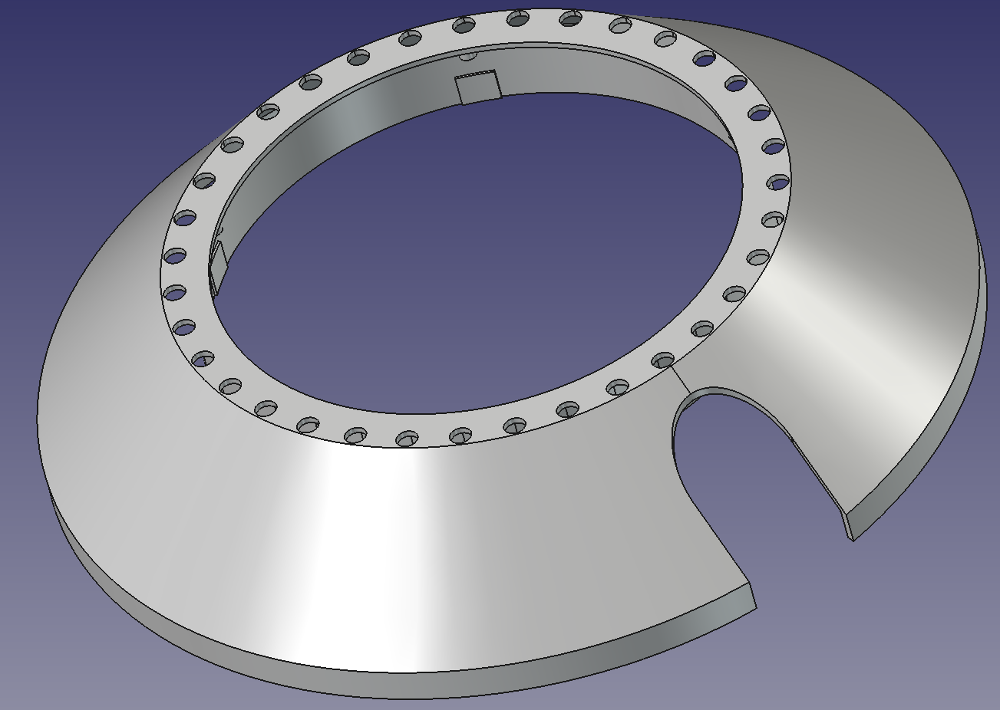
- Bild eines der unteren 'Sonnenhüte':
	
	

- die unteren 'Sonnenhüte' können entweder
	+ von oben durch vorsichtiges Auseinanderbiegen eingeschoben werden
	+ oder von unten nach Aufschrauben und Zerlegen des TFA Gehäuses mit Einbringen der unteren 'Sonnenhüte' beim Wiederzusammenbau erfolgen.
	
- die 'Sonnenhüte' können mit einem UV resistenten, silber matten Sprühlack beschichtet werden.
	
- ein zweiteiliges Innengehäuse dient zur Aufnahme der Sensorplatine [HB-UNI-SEN-BATT_ATMega1284P_E07-868MS10_FRAM_FUEL4EP](https://github.com/FUEL4EP/HomeAutomation/tree/master/AsksinPP_developments/PCBs/HB-UNI-SEN-BATT_ATMega1284P_E07-868MS10_FRAM_FUEL4EP)
 
	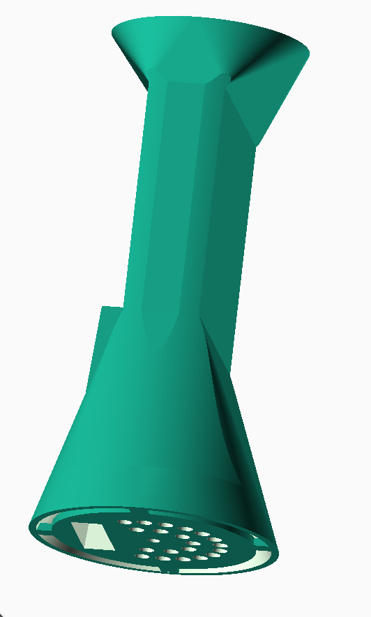
	
- Cura 4.3.1 3D-Druck des Innengehäuses mit Stützstrukturen:

	
	
- der untere Teil wird auf die TFA Bodenplatte aufgesetzt und mit einer M3 Schraube in der Mitte verschraubt.

- die Sensorplatine wird in die Führungsschienen des unteren Teils von oben eingeschoben:

	
	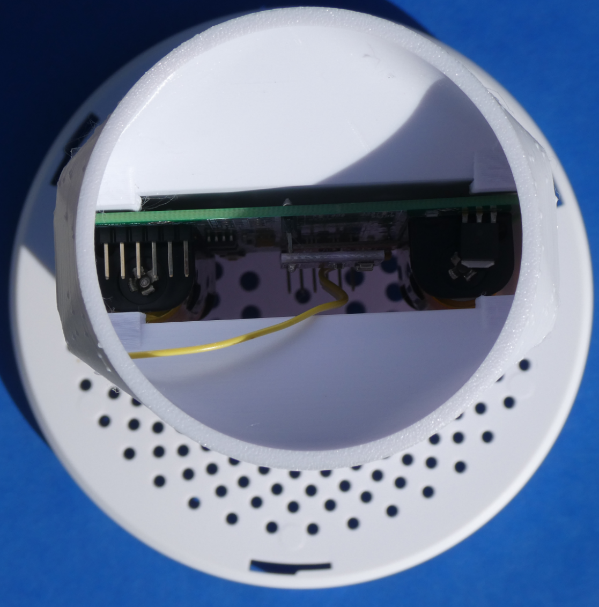
	
- in das TFA Unterteil werden mit Hilfe der 3D-gedruckten Bohrschablone zusätzliche Lüftungslöcher gebohrt, um kühle Luft von unten ansaugen zu können:


	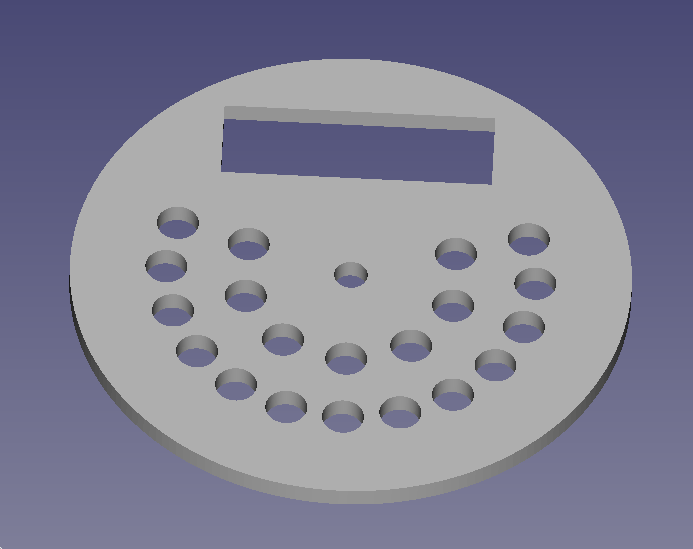
	
- nach dem Einsetzen der Sensorplatine in das Unterteil wird das Oberteil auf das Unterteil aufgesteckt und mit Klebestreifen fixiert:

	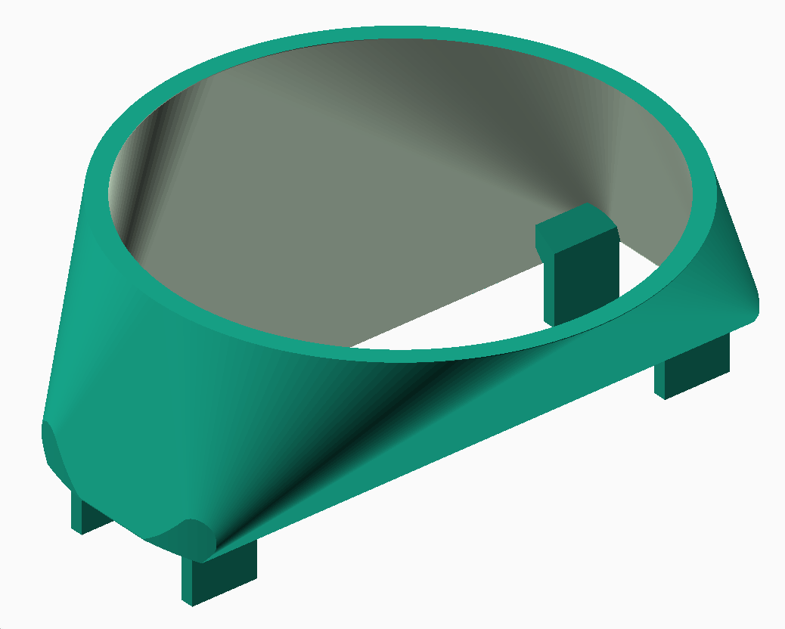
	
- danach erfolgt das vorsichtige Einbringen in das TFA Gehäuse

- es gibt einen inneren und einen äußeren Luftkanal. In beiden Luftkanälen saugt der Lüfter getrennt Luft von unten bzw. unten und außen an, so dass eine thermische Entkopplung erfolgt. Bei Sonneneinstrahlung bekommt der Messsensor  nur die von unten angesaugte kühlere Umgebungsluft.

- **WICHTIGER HINWEIS 1**: Bei meinem Exemplar lief im Lieferzustand der eingebaute Lüfter **falsch** herum. Dies führte bei Sonneneinstrahlung zu einer hohen Temperaturüberhöhung (ca. 2..4K). Nach einem Umlöten der Lüfteranschlüsse an die Solarzelle war die Temperaturüberhöhung gegenüber einer Referenzmessung deutlich besser (ca. 0,4..0,8 K). Dieser Verdrahtungsfehler wurde an TFA Dostmann berichtet und inzwischen bestätigt. Er soll verbessert werden.

- **WICHTIGER HINWEIS 2**: Um eine partielle Beschattung der Solarzellen zu vermeiden, sollte die TFA Schutzhülle mit Solar-Lüfter entweder ganz an der Spitze eines Rohrs angebracht werden oder aber weiter unten so am Rohr angebracht werden, dass der Schatten des Rohrs im Tagesverlauf nicht auf die Solarzellen fällt. Am besten beobachtet man den Verlauf des Rohrschattenwurfs während eines ganzen Tages. Im Sommerhalbjahr, wenn die Sonne hoch im Norden steht, sollte die Schutzhülle auf die südliche Seite des Rohrs  gedreht werden. Ein Schattenwurf auf die Solarzellen ließe sonst den Solarlüfter anhalten, was zu einer scheinbaren Temperaturüberhöhung führen würde.

## Literatur

- [Grundlagen der Temperaturmesstechnik](https://www.meteorologyshop.eu/meteo-blog/grundlagen-der-temperaturmesstechnik)


## Lizenz

**Creative Commons BY-NC-SA**<br>
Give Credit, NonCommercial, ShareAlike

<a rel="license" href="http://creativecommons.org/licenses/by-nc-sa/4.0/"></a><br />This work is licensed under a <a rel="license" href="http://creativecommons.org/licenses/by-nc-sa/4.0/">Creative Commons Attribution-NonCommercial-ShareAlike 4.0 International License</a>.
